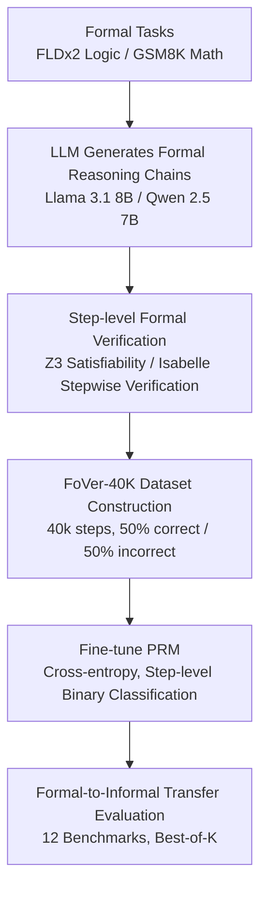

# Efficient PRM Training Data Synthesis via Formal Verification

**Conference**: ACL 2026 Findings  
**arXiv**: [2505.15960](https://arxiv.org/abs/2505.15960)  
**Code**: [GitHub](https://github.com/psunlpgroup/FoVer)  
**Area**: LLM Reasoning  
**Keywords**: PRM, Formal Verification, Step-level Labels, Z3, Isabelle

## TL;DR

This paper proposes FoVer, a framework that leverages formal verification tools (Z3 and Isabelle) to automatically annotate step-level correctness labels for formal reasoning chains. By generating the FoVer-40K training set and fine-tuning a PRM, the study demonstrates formal-to-informal transferability and cross-task generalization across 12 reasoning benchmarks.

## Background & Motivation

**Background**: Process Reward Models (PRMs) improve LLM reasoning by providing step-level process supervision, becoming a crucial direction for enhancing reasoning performance. PRMs are typically fine-tuned to perform binary classification on the correctness of individual reasoning steps.

**Limitations of Prior Work**: (1) Manual step-level annotation is extremely expensive and suffers from low inter-annotator agreement (Zheng et al. 2025 discarded 30% of annotated data); (2) Monte Carlo roll-outs (Math-Shepherd) require multiple LLM calls per step, resulting in high computational costs and noisy labels—estimating intermediate step correctness based on final answer frequency is inherently imprecise; (3) Perturbation-based methods introduce unnatural human-made errors; (4) Annotating with stronger LLMs is essentially capacity distillation.

**Key Challenge**: PRMs require accurate step-level labels, but existing methods are either expensive (manual), imprecise (Monte Carlo), or unnatural (perturbation). Can a method be found that is both efficient and precise?

**Goal**: To leverage formal verification tools for efficient and precise step-level annotation in formal reasoning tasks, and to verify whether PRMs trained on formal tasks can transfer to informal natural language reasoning.

**Key Insight**: Every step in formal reasoning tasks (e.g., logical reasoning, theorem proving) can be precisely validated using formal verification tools (e.g., the Z3 SAT solver or the Isabelle theorem prover), providing a zero-cost source of perfect labels.

**Core Idea**: Formal verification tools transform step-level annotation from "approximate estimation" into "precise determination." The reasoning capabilities a PRM acquires from formal tasks can transfer to informal tasks, achieving formal-to-informal transfer and cross-task generalization.

## Method

### Overall Architecture

A two-stage framework: Stage 1 involves the LLM generating formal reasoning steps (guided by few-shot formatting), followed by using formal verification tools to annotate the correctness of each step. Stage 2 involves fine-tuning the LLM with the annotated data for step-level binary classification (outputting "correct" or "incorrect") to obtain FoVer-PRM, which is then evaluated on informal natural language reasoning benchmarks.

### Key Designs

**1. Step-level Formal Verification: Transforming correctness from "approximate estimation" to "deterministic determination"**  
The training bottleneck for PRMs is step-level labels. Manual labels are costly, Monte Carlo methods are noisy, and perturbation methods are unnatural. FoVer's key insight is that in formal reasoning, every step can be precisely verified. It utilizes solvers as "zero-cost perfect annotators." For logical reasoning (FLDx2), each step is a logical entailment; verification is performed by checking the satisfiability of its negation—unsatisfiability implies the step is correct. For example, to verify $(A \to B) \land A \to B$, it is converted to $(\neg A \lor B) \land A \land \neg B$ and passed to the Z3 solver. For math, Isabelle verifies each proof step. These tools provide deterministically correct labels without noise or subjectivity.

**2. FoVer-40K Dataset Construction: Trading formal task verifiability for large-scale precise labels**  
FoVer utilizes FLDx2 (formal logic, multi-step first-order logic) and GSM8K math problems. Llama 3.1 8B and Qwen 2.5 7B generate reasoning chains, which are then annotated stepwise by Z3 and Isabelle. The resulting dataset contains 40,000 steps with a balanced 50/50 distribution of correct and incorrect labels. Selecting FLDx2 ensures high diversity in reasoning patterns, while GSM8K provides math reasoning depth. Both allow for precise verification, maximizing both diversity and label reliability.

**3. Formal-to-Informal Transfer Evaluation: Verifying if formally trained PRMs generalize to natural language**  
To ensure the PRM's utility, formal-to-informal transfer must be directly tested. FoVer evaluates the PRM on 12 benchmarks, categorized into two groups: 6 informal variants of the training tasks (LogicNLI, AQuA-RAT, AIME, etc.) for near-transfer, and 6 significantly different tasks (HANS NLI, MMLU, BBH) for cross-task generalization. Evaluation follows the standard Best-of-K protocol. This design proves that step-level verification capability is task-agnostic and universal.

### Loss & Training

The model uses a cross-entropy classification loss, fine-tuning the LLM to output "correct" or "incorrect" for each reasoning step. Base models include Llama 3.1 8B and Qwen 2.5 7B.

## Key Experimental Results

### Main Results

**Best-of-7 Reasoning Performance (12 Benchmarks, 5 Categories)**

| PRM | Logic | Math | NLI | MMLU | BBH | Average |
|-----|------|------|-----|------|-----|------|
| Llama 3.1 8B (Baseline) | 48.9 | Baseline | Baseline | Baseline | Baseline | Baseline |
| **FoVer-Llama3.1-8B** | **50.6** | Gain | Gain | Gain | Gain | **Above Baseline** |
| Qwen 2.5 7B (Baseline) | Baseline | Baseline | Baseline | Baseline | Baseline | Baseline |
| **FoVer-Qwen2.5-7B** | Gain | Gain | Gain | Gain | Gain | **Above Baseline** |

### Ablation Study

**Comparison with existing PRM training methods**

| Method | Annotation Cost | Label Quality | Average Performance |
|------|---------|---------|---------|
| Manual Annotation | Extremely High | High (Inconsistency issues) | High |
| Monte Carlo Roll-outs | High (Multiple LLM calls) | Medium (Noise) | Medium-High |
| Perturbation Method | Medium | Low (Unnatural) | Medium |
| **FoVer** | **Extremely Low (Automated)** | **Perfect (Deterministic)** | **Competitive** |

### Key Findings

- FoVer-PRM outperforms un-tuned baseline PRMs across all 5 task categories—formal training data effectively improves natural language reasoning.
- Significant gains in NLI and BBH demonstrate strong cross-task generalization, even though these tasks differ significantly from formal logic and math.
- FoVer provides deterministic labels compared to noisy Monte Carlo roll-outs; even with a smaller dataset (40K steps), high-quality labels yield competitive performance.
- Formal-to-informal transfer is the core discovery—step-level verification ability appears to have task-agnostic universality.

## Highlights & Insights

- Utilizing formal verification tools as "perfect annotators" is an elegant approach that reduces annotation costs to near zero.
- The success of formal-to-informal transfer challenges the assumption that PRMs must be trained on in-distribution data.
- The modular design of the FoVer framework allows for scalability to more formal tasks by swapping verification tools.

## Limitations & Future Work

- FoVer-40K is limited to formal logic and GSM8K-level math, without covering more complex formal reasoning.
- Step-level formal verification requires LLMs to generate reasoning chains in specific tool-compatible formats; non-compliant generations are discarded.
- The potential of combining FoVer with Monte Carlo roll-outs remains unexplored.
- The theoretical explanation for transfer capabilities is still insufficient—it is unclear why training on formal logic specifically improves tasks like BBH.

## Related Work & Insights

- **vs Math-Shepherd**: While Math-Shepherd uses Monte Carlo for estimation, FoVer uses formal verification for deterministic labels—yielding higher quality but within a narrower applicable scope.
- **vs PRM800K (Lightman 2024)**: PRM800K relies on manual annotation, whereas FoVer is fully automated and provides more precise labels.
- **vs Strong LLM Distillation**: Unlike methods that use GPT-4 as an annotator (distillation), FoVer does not rely on a more powerful model.

## Rating

- Novelty: ⭐⭐⭐⭐⭐ Using formal verification for step-level PRM annotation is a novel concept with significant findings in transferability.
- Experimental Thoroughness: ⭐⭐⭐⭐ Comprehensive evaluation across 12 benchmarks, though data scale remains relatively small.
- Writing Quality: ⭐⭐⭐⭐⭐ Problem definition is clear, and examples of formal verification are intuitive.
- Value: ⭐⭐⭐⭐⭐ Provides an efficient and precise data generation solution for PRM training.

<!-- RELATED:START -->

## Related Papers

- [\[ICML 2026\] An Information-Theoretic Criterion for Efficient Data Synthesis](../../ICML2026/llm_reasoning/an_information-theoretic_criterion_for_efficient_data_synthesis.md)
- [\[ACL 2026\] MathAgent: Adversarial Evolution of Constraint Graphs for Mathematical Reasoning Data Synthesis](mathagent_adversarial_evolution_of_constraint_graphs_for_mathematical_reasoning_.md)
- [\[ACL 2026\] Self-Reinforcing Controllable Synthesis of Rare Relational Data via Bayesian Calibration](self-reinforcing_controllable_synthesis_of_rare_relational_data_via_bayesian_cal.md)
- [\[ICLR 2026\] Understanding the Role of Training Data in Test-Time Scaling](../../ICLR2026/llm_reasoning/understanding_the_role_of_training_data_in_test-time_scaling.md)
- [\[ACL 2025\] Safe: Enhancing Mathematical Reasoning in Large Language Models via Retrospective Step-aware Formal Verification](../../ACL2025/llm_reasoning/safe_math_reasoning.md)

<!-- RELATED:END -->
