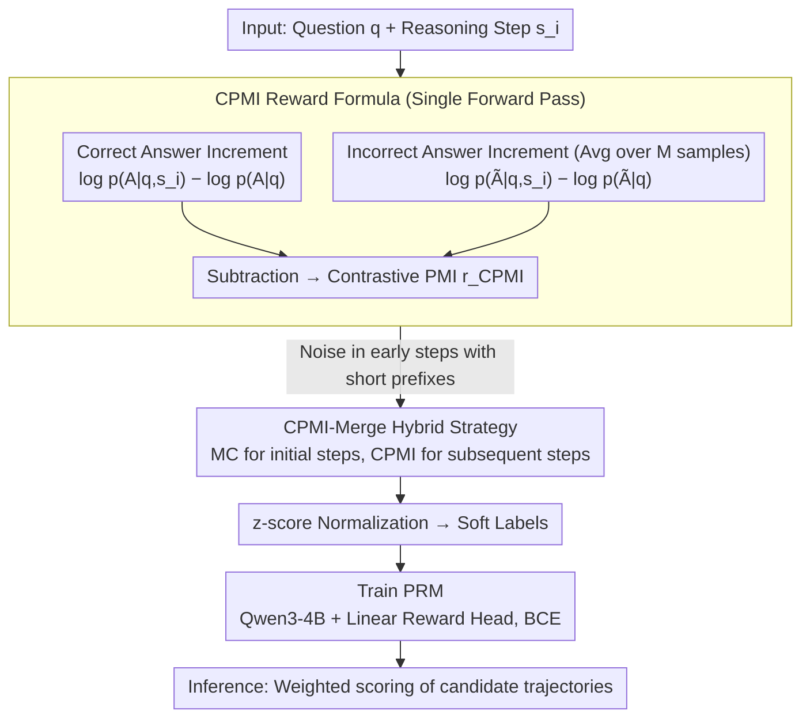

# Efficient Process Reward Modeling via Contrastive Mutual Information

**Conference**: ACL 2026  
**arXiv**: [2604.10660](https://arxiv.org/abs/2604.10660)  
**Code**: [GitHub](https://github.com/nakyungLee20/CPMI)  
**Area**: LLM Reasoning  
**Keywords**: Process Reward Model, Step-level supervision, Mutual Information, Contrastive Learning, Mathematical Reasoning

## TL;DR
This paper proposes CPMI (Contrastive Pointwise Mutual Information), an efficient automated step-level reward annotation method. It estimates step contributions by contrasting the changes in conditional probabilities of correct and incorrect answers given a reasoning step. Compared to Monte Carlo estimation, it reduces construction time by 84% and token generation by 98%, while achieving higher accuracy on process-level evaluations and mathematical reasoning benchmarks.

## Background & Motivation

**Background**: Process Reward Models (PRMs) verify Chain-of-Thought (CoT) trajectories by evaluating the correctness of intermediate reasoning steps, which is more reliable than Outcome Reward Models (ORMs) that only evaluate final answers. However, training PRMs requires step-level labeled data—traditionally sourced from human annotators or high-performance LLM labeling.

**Limitations of Prior Work**: (1) The cost of manual step-level reward annotation is extremely high and time-consuming; (2) Automated methods like Monte Carlo (MC) estimation require extensive LLM rollouts to obtain low-variance reward signals, leading to massive computational overhead (sampling dozens of trajectories per step to estimate accuracy); (3) MC estimation is particularly unstable for early steps in a reasoning chain due to shorter prefixes and higher downstream variance.

**Key Challenge**: There is a significant gap between the acquisition cost of step-level supervisory signals and the training requirements of PRMs—obtaining high-quality labels is prohibitively expensive.

**Goal**: To design a method that estimates step-level rewards with only a single forward pass, eliminating the dependency on multiple MC rollouts.

**Key Insight**: Understanding the relationship between MC estimation ($\lambda \to 1$, long-term return) and the proposed method ($\lambda \to 0$, single-step bootstrapping) from the perspective of $TD(\lambda)$. Assuming a pre-trained LLM already encodes sufficient mathematical knowledge, the step contribution can be inferred by observing the change in the model's probability for the correct answer after incorporating a specific step.

**Core Idea**: Step Reward = (log probability increment of the correct answer) - (log probability increment of the incorrect answer), i.e., Contrastive Pointwise Mutual Information.

## Method

### Overall Architecture
For each reasoning step: (1) Calculate the log probability difference for the model outputting the correct answer with vs. without that step; (2) Perform the same calculation for incorrect answers; (3) The difference between these two values constitutes the CPMI reward. Normalized CPMI is then used as a soft label to train the PRM. During inference, the PRM scores candidate trajectories to select the optimal one.

### Key Designs

**1. CPMI Reward Formula: Replacing dozens of MC rollouts with a single forward pass probability increment**

The bottleneck of MC estimation is cost—sampling dozens of full trajectories per step to reduce variance is expensive, and early steps are particularly unstable due to short prefixes and high downstream variation. CPMI takes a different perspective: since pre-trained LLMs already encode sufficient knowledge, the change in answer probability after adding a step is a signal of that step's contribution. It defines the step-level reward as:

$$r_{\text{CPMI}}^i = [\log p_\theta(A|q,s_i) - \log p_\theta(A|q)] - \frac{1}{M}\sum_{m=1}^M [\log p_\theta(\tilde{A}|q,s_i) - \log p_\theta(\tilde{A}|q)]$$

The first term quantifies how much the step boosts the log probability of the correct answer $A$. The second term (averaged over $M$ incorrect answers $\tilde A$) quantifies how much it suppresses incorrect answers. The subtraction yields "Contrastive Pointwise Mutual Information." The subtraction is critical: pure PMI lacks discriminative power as a step might increase the probability of all answers generally. By introducing contrast against incorrect answers, high scores are only given to steps that simultaneously promote the correct answer and suppress incorrect ones, significantly improving signal resolution. This estimation requires only a few forward passes without generating new tokens, which is why it reduces construction time by 84% and tokens by 98%.

**2. Theoretical Connection CPMI ≈ Jeffreys Divergence: Providing a symmetry guarantee**

The authors demonstrate that under the "single correct answer" assumption in mathematical reasoning, CPMI can be interpreted as an approximation of the Jeffreys Divergence (symmetric KL) between the two conditional answer distributions (with vs. without the step). This elevates CPMI from a heuristic to a theoretically grounded metric. The symmetry of Jeffreys Divergence corresponds to the dual-penalty in the formula: it rewards steps that increase the correct answer's probability and those that decrease incorrect answers' probabilities. Consequently, CPMI naturally favors critical steps that cause significant and symmetric shifts in the answer distribution.

**3. CPMI-Merge Hybrid Strategy: Compensating CPMI instability in early reasoning steps with MC**

CPMI is locally bootstrapped; shorter prefixes and less context mean the probability increments for early steps (especially step 1) are noisier. CPMI-Merge combines the strengths of both: it uses MC estimation for initial steps to provide global information and switches to CPMI for subsequent steps to obtain dense, low-cost feedback. Viewed through the $TD(\lambda)$ framework, MC corresponds to $\lambda \to 1$ (accurate but expensive long-term returns), while CPMI corresponds to $\lambda \to 0$ (efficient but noisy single-step bootstrapping). Merge finds the equilibrium, utilizing a minimal number of MC calls to regain early stability while maintaining most efficiency gains.

### Training & Inference
Qwen3-4B-Base is used as the PRM backbone with two additional linear reward heads. The model is trained using BCE loss with z-score normalized CPMI rewards as soft labels. During inference, candidate trajectories are selected based on a weighted scoring mechanism from the PRM.

## Key Experimental Results

### Main Results (Efficiency + Quality)

| Reward Type | AUC | PB | PRMB | MATH | Time (Ratio) | Token (Ratio) |
| :--- | :--- | :--- | :--- | :--- | :--- | :--- |
| MC | 0.759 | 27.7 | 38.8 | 45.4 | 1.00 | 1.00 |
| PAV | 0.757 | 36.6 | 49.6 | 47.2 | 1.17 | 2.38 |
| **CPMI** | **0.765** | 34.6 | **58.8** | 48.2 | **0.16 (↓84%)** | **0.02 (↓98%)** |
| **CPMI_Merge** | **0.766** | **36.8** | **60.7** | **49.4** | 0.30 (↓70%) | 0.18 (↓82%) |

### Ablation Study

| Configuration | Description |
| :--- | :--- |
| No Contrast (PMI only) | AUC drops, lack of discriminative power |
| No Prompt Averaging | Increased reward variance |
| Various M (Incorrect samples) | M=4 provides the optimal balance |
| CPMI-Merge (step 1) | More stable than pure CPMI |

### Key Findings
- **CPMI reduces construction time by 84% and token generation by 98%** while achieving higher quality (AUC 0.765 vs MC 0.759).
- **Significant improvement on the process-level benchmark PRMB (58.8 vs 38.8)**, indicating that CPMI-generated signals are more effective for process-level verification.
- **Contrastive signal is critical**: Removing the contrastive term (using only PMI) results in significantly worse performance.
- **CPMI-Merge further enhances stability**: It eliminates noise in early steps while retaining most efficiency advantages.
- **RelEff (Relative Efficiency ratio)** reaches 6-10x, showing CPMI is far superior to MC in the quality-cost trade-off.

## Highlights & Insights
- **Unified understanding of MC and CPMI via $TD(\lambda)$** is an elegant theoretical contribution—MC = $\lambda \to 1$ (full return), CPMI = $\lambda \to 0$ (bootstrapping), applying classic RL frameworks to PRM training.
- **98% token reduction** means CPMI makes the construction of large-scale PRM datasets practically feasible—moving from "days on a GPU cluster" to "hours on a single machine."
- **Theoretical guarantee for CPMI rewards** (Jeffreys Divergence approximation) ensures it is not merely a heuristic but a principled metric.

## Limitations & Future Work
- CPMI relies on the quality of the pre-trained LLM's internal probability distribution; if the model's math knowledge is insufficient, probability estimates may be unreliable.
- Validated only on mathematical reasoning; effectiveness on code generation or logical reasoning tasks remains to be confirmed.
- The construction strategy for hard negative samples (M=4 + heuristic perturbations) could be more systematic.
- Early-step instability requires CPMI-Merge, which increases design complexity.
- The assumption of a single correct answer may not hold for all tasks.

## Related Work & Insights
- **vs MC Estimation (Math-Shepherd)**: MC requires sampling dozens of full trajectories per step; CPMI requires only a single forward pass.
- **vs PAV (Setlur et al.)**: PAV still depends on MC rollouts, whereas CPMI eliminates the rollout requirement entirely.
- **vs Contrastive Decoding (Li et al.)**: While Contrastive Decoding manipulates logits during inference, CPMI uses contrastive signals during training data construction; the objectives differ, but the underlying philosophy is similar.

## Rating
- **Novelty**: ⭐⭐⭐⭐⭐ Elegant CPMI formula and profound theoretical connection to $TD(\lambda)$.
- **Experimental Thoroughness**: ⭐⭐⭐⭐⭐ Comprehensive efficiency and quality comparisons with solid theoretical validation.
- **Writing Quality**: ⭐⭐⭐⭐⭐ Clear theoretical derivations and rigorous experimental design.
- **Value**: ⭐⭐⭐⭐⭐ 98% token reduction enables large-scale PRM training, impacting the field of reasoning enhancement.

<!-- RELATED:START -->

## Related Papers

- [\[ACL 2026\] C2: Scalable Rubric-Augmented Reward Modeling from Binary Preferences](c2_scalable_rubric-augmented_reward_modeling_from_binary_preferences.md)
- [\[ACL 2026\] Process Reward Models Meet Planning: Generating Precise and Scalable Datasets for Step-Level Rewards](process_reward_models_meet_planning_generating_precise_and_scalable_datasets_for.md)
- [\[ACL 2025\] Dynamic and Generalizable Process Reward Modeling (DG-PRM)](../../ACL2025/llm_reasoning/dgprm_dynamic_process_reward.md)
- [\[ACL 2026\] HISR: Hindsight Information Modulated Segmental Process Rewards for Multi-turn Agentic Reinforcement Learning](hisr_hindsight_information_modulated_segmental_process_rewards_for_multi-turn_ag.md)
- [\[ICML 2026\] GRPO is Secretly a Process Reward Model](../../ICML2026/llm_reasoning/grpo_is_secretly_a_process_reward_model.md)

<!-- RELATED:END -->
