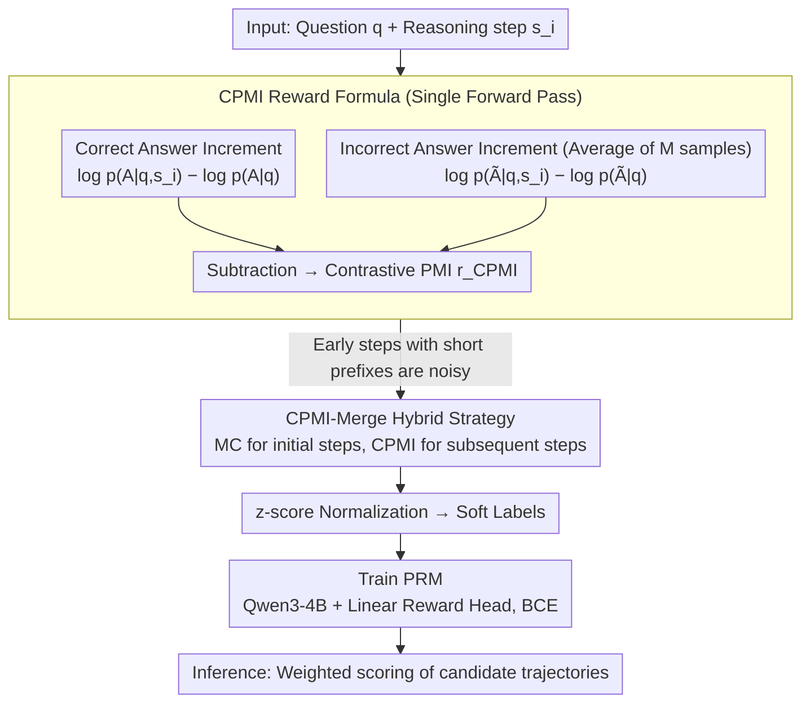

# Efficient Process Reward Modeling via Contrastive Mutual Information

**Conference**: ACL 2024  
**arXiv**: [2604.10660](https://arxiv.org/abs/2604.10660)  
**Code**: [GitHub](https://github.com/nakyungLee20/CPMI)  
**Area**: LLM Reasoning  
**Keywords**: Process Reward Model, Step-level Supervision, Mutual Information, Contrastive Learning, Mathematical Reasoning

## TL;DR
This paper proposes CPMI (Contrastive Pointwise Mutual Information), an efficient automated step-level reward annotation method. It estimates the step-level contribution by contrasting the change in conditional probabilities of correct and incorrect answers. Compared to Monte Carlo estimation, CPMI reduces construction time by 84% and token generation by 98%, while achieving higher accuracy on process-level evaluation and mathematical reasoning benchmarks.

## Background & Motivation

**Background**: Process Reward Models (PRMs) verify Chain-of-Thought (CoT) trajectories by evaluating the correctness of intermediate reasoning steps, proving more reliable than Outcome Reward Models (ORMs) that only evaluate final answers. However, training PRMs requires step-level annotated data—traditionally sourced from humans or high-performance LLMs.

**Limitations of Prior Work**: (1) Manual step-level annotation is extremely costly and time-consuming. (2) Automated methods like Monte Carlo (MC) estimation require massive LLM rollouts to obtain low-variance reward signals, leading to high computational overhead—sampling dozens of trajectories per step is needed to estimate accuracy. (3) MC estimates are particularly unstable in the early steps of a reasoning chain (due to shorter prefixes and high follow-up variance).

**Key Challenge**: A significant gap exists between the cost of acquiring step-level supervision signals and the data requirements for training PRMs—large-scale high-quality annotations are needed but are extremely expensive to obtain.

**Goal**: To design a method that estimates step-level rewards using only a single forward pass, eliminating reliance on extensive MC rollouts.

**Key Insight**: Understanding the relationship between MC estimation ($\lambda \to 1$, long-term return) and the proposed method ($\lambda \to 0$, single-step bootstrapping) through the lens of TD($\lambda$). It is hypothesized that pre-trained LLMs already encode sufficient mathematical knowledge, allowing the inference of a step's contribution by observing the change in probability of the correct answer upon adding that step.

**Core Idea**: Step-level reward = (Log probability increment of the correct answer after adding the step) - (Log probability increment of the incorrect answer after adding the step), termed as Contrastive Pointwise Mutual Information.

## Method

### Overall Architecture
For each reasoning step: (1) Calculate the log probability difference for the model to output the correct answer with and without the step. (2) Simultaneously calculate the difference for incorrect answers. (3) The difference between these two values defines the CPMI reward. Normalized CPMI is then used as soft labels to train the PRM. During inference, the PRM scores candidate trajectories to select the optimal one.

### Key Designs

**1. CPMI Reward Formula: Replacing dozens of MC rollouts with a single forward pass increment**

The pain point of MC estimation is its cost—sampling dozens of full trajectories per step to reduce variance, especially since early steps have shorter prefixes and higher subsequent variance, making estimates unstable. CPMI offers a different perspective: since pre-trained LLMs already encode sufficient mathematical knowledge, the change in answer probability upon adding a step serves as a signal for that step's contribution. The step-level reward is defined as:

$$r_{\text{CPMI}}^i = [\log p_\theta(A|q,s_i) - \log p_\theta(A|q)] - \frac{1}{M}\sum_{m=1}^M [\log p_\theta(\tilde{A}|q,s_i) - \log p_\theta(\tilde{A}|q)]$$

The first term quantifies how much the step increases the log probability of the correct answer $A$, while the second term (averaged over $M$ incorrect answers $\tilde A$) quantifies how much it suppresses incorrect answers. The subtraction defines the "Contrastive Pointwise Mutual Information." The key lies in the subtraction: pure PMI lacks discriminative power, as a step might increase all answer probabilities generally; with contrastive signals, only steps that simultaneously "increase correct and decrease incorrect" probabilities receive high scores. This estimation requires only a few forward passes without generating new tokens, reducing construction time by 84% and token usage by 98%.

**2. Theoretical Connection between CPMI and Jeffreys Divergence: Symmetry guarantees**

The reliability of this contrastive formula is supported by the proof that, under the "single correct answer" assumption in mathematical reasoning, CPMI approximates the Jeffreys Divergence (symmetric KL) between condition distributions with and without the step. This elevates CPMI from a heuristic to a theoretically grounded measure. The symmetry of Jeffreys Divergence corresponds to the dual penalties in the formula—rewarding steps that increase correct answer probability and steps that decrease incorrect answer probability. CPMI naturally favors key steps that cause large, symmetric shifts in the answer distribution.

**3. CPMI-Merge Hybrid Strategy: Compensating CPMI instability at the start of reasoning chains**

CPMI is locally bootstrapped; hence, steps with shorter prefixes (especially step 1) suffer from noisier probability increments. CPMI-Merge combines the strengths of both: it uses MC estimation for initial steps to provide global information and switches to CPMI for subsequent steps for dense, inexpensive feedback. Within the TD($\lambda$) framework, MC corresponds to $\lambda \to 1$ (accurate but expensive global returns), while CPMI corresponds to $\lambda \to 0$ (efficient but noisy local bootstrapping). CPMI-Merge balances these by using minimal MC calls to regain early stability while maintaining efficiency.

### Loss & Training
Qwen3-4B-Base is used as the PRM backbone with a two-layer linear reward head. Training utilizes BCE loss, where CPMI rewards are used as soft labels after z-score normalization. During inference, PRM weighted scoring is applied to candidate trajectories.

## Key Experimental Results

### Main Results (Efficiency + Quality)

| Reward Type | AUC | PB | PRMB | MATH | Time (Ratio) | Token (Ratio) |
| :--- | :--- | :--- | :--- | :--- | :--- | :--- |
| MC | 0.759 | 27.7 | 38.8 | 45.4 | 1.00 | 1.00 |
| PAV | 0.757 | 36.6 | 49.6 | 47.2 | 1.17 | 2.38 |
| **CPMI (Ours)** | **0.765** | 34.6 | **58.8** | 48.2 | **0.16 (↓84%)** | **0.02 (↓98%)** |
| **CPMI_Merge (Ours)** | **0.766** | **36.8** | **60.7** | **49.4** | 0.30 (↓70%) | 0.18 (↓82%) |

### Ablation Study

| Configuration | Description |
| :--- | :--- |
| No Contrast (PMI only) | AUC drops; lack of discriminative power |
| No Prompt Averaging | Increased reward variance |
| Varying M (Incorrect Samples) | M=4 provides the optimal balance |
| CPMI-Merge (step 1) | More stable than pure CPMI |

### Key Findings
- **CPMI reduces construction time by 84% and token generation by 98%** while achieving higher quality (AUC 0.765 vs MC 0.759).
- **Significant improvement over MC on the process-level benchmark PRMB (58.8 vs 38.8)**, indicating that CPMI step-level signals are more effective for process-level verification.
- **Contrastive signals are critical**: Removing the contrastive term (using only PMI) leads to a significant performance drop.
- **CPMI-Merge further enhances stability**: It eliminates noise in early steps while retaining most efficiency gains.
- **RelEff (Relative Efficiency Ratio)** is 6-10x higher, showing CPMI significantly outperforms MC in the quality-cost trade-off.

## Highlights & Insights
- **Unifying MC and CPMI via TD-λ** is an elegant theoretical contribution—MC = λ→1 (full return), CPMI = λ→0 (bootstrapping), applying classic RL frameworks to PRM training.
- **98% Token Reduction** makes large-scale PRM dataset construction practical—transforming "days on a GPU cluster" into "hours on a single machine."
- **Theoretical guarantees for CPMI rewards** (Jeffreys divergence approximation) ensure it is more than just a heuristic method.

## Limitations & Future Work
- CPMI relies on the quality of the pre-trained LLM's internal probability distribution; if the model lacks mathematical knowledge, estimates may be unreliable.
- Validation is limited to mathematical reasoning; effectiveness in other tasks like code generation or logical reasoning remains to be confirmed.
- Construction strategies for hard negative samples (M=4 + heuristic perturbations) could be more systematic.
- CPMI's instability in the early stages of reasoning chains requires CPMI-Merge, increasing design complexity.
- The assumption of a single correct answer may not hold for all tasks.

## Related Work & Insights
- **vs MC Estimation (Math-Shepherd)**: MC requires dozens of full rollouts per step; CPMI requires only one forward pass.
- **vs PAV (Setlur et al.)**: PAV still relies on MC rollouts, whereas CPMI eliminates the need for rollouts entirely.
- **vs Contrastive Decoding (Li et al.)**: Contrastive decoding manipulates logits during inference; CPMI uses contrastive signals during training data construction. Though different in application, they share a similar philosophy.

## Rating
- Novelty: ⭐⭐⭐⭐⭐ Elegant CPMI formula with deep TD-λ theoretical links.
- Experimental Thoroughness: ⭐⭐⭐⭐⭐ Comprehensive efficiency and quality comparisons; theory and experiments validate each other.
- Writing Quality: ⭐⭐⭐⭐⭐ Clear theoretical derivations and rigorous experimental design.
- Value: ⭐⭐⭐⭐⭐ 98% token reduction enables large-scale PRM training, impacting the field of reasoning enhancement significantly.

<!-- RELATED:START -->

## Related Papers

- [\[ICLR 2026\] Linking Process to Outcome: Conditional Reward Modeling for LLM Reasoning](../../ICLR2026/llm_reasoning/linking_process_to_outcome_conditional_reward_modeling_for_llm_reasoning.md)
- [\[ACL 2025\] Dynamic and Generalizable Process Reward Modeling (DG-PRM)](../../ACL2025/llm_reasoning/dgprm_dynamic_process_reward.md)
- [\[ICLR 2026\] OR-PRM: A Process Reward Model for Algorithmic Problem in Operations Research](../../ICLR2026/llm_reasoning/or-prm_a_process_reward_model_for_algorithmic_problem_in_operations_research.md)
- [\[ICML 2026\] GRPO is Secretly a Process Reward Model](../../ICML2026/llm_reasoning/grpo_is_secretly_a_process_reward_model.md)
- [\[ACL 2026\] C2: Scalable Rubric-Augmented Reward Modeling from Binary Preferences](c2_scalable_rubric-augmented_reward_modeling_from_binary_preferences.md)

<!-- RELATED:END -->
