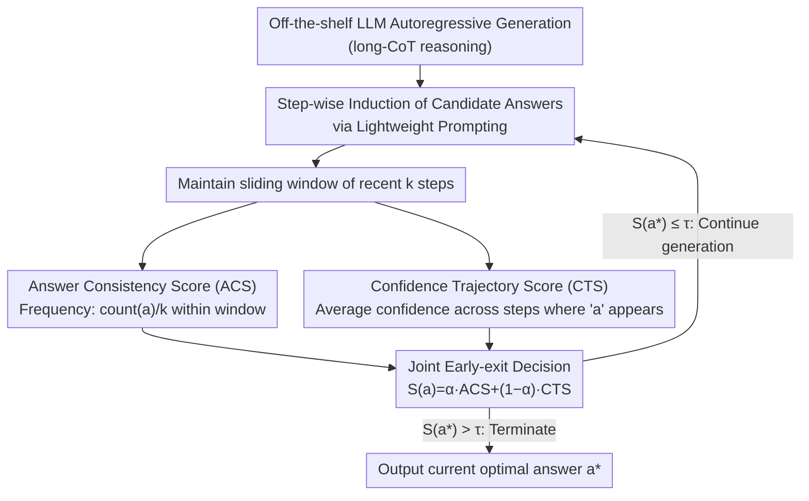

# Efficient Test-Time Scaling via Temporal Reasoning Aggregation

**Conference**: ACL 2026 Findings  
**arXiv**: [2604.17304](https://arxiv.org/abs/2604.17304)  
**Code**: [https://github.com/qianfantianyuzhouzhou/TRACE](https://github.com/qianfantianyuzhouzhou/TRACE)  
**Area**: LLM Inference Efficiency  
**Keywords**: Test-time Scaling, Early Exit, Reasoning Convergence, Multi-step Aggregation, Overthinking

## TL;DR

The TRACE framework is proposed to determine whether reasoning has converged by aggregating two complementary signals—multi-step answer consistency and confidence trajectories—within a sliding window. This enables training-free dynamic early exiting, reducing token usage by 25-30% while maintaining accuracy within a 1-2% margin.

## Background & Motivation

**Background**: Test-time scaling enhances LLM reasoning performance by increasing computation during inference (e.g., extending the chain-of-thought or searching multiple paths). However, this leads to significant unnecessary token generation, as models frequently continue reasoning after they have already reached the correct answer (the "overthinking" phenomenon).

**Limitations of Prior Work**: Existing dynamic early-exit methods primarily rely on single-step confidence signals to decide when to terminate reasoning. Research suggests that single-step confidence is unreliable in multi-step reasoning, as it reflects the certainty of an individual step rather than cross-step stability. For example, a model might assign high confidence to an incorrect intermediate step, leading to premature termination.

**Key Challenge**: Premature termination leads to incorrect outputs, while delayed termination wastes resources. Single-step confidence cannot distinguish between "true reasoning convergence" and "transient high-confidence erroneous steps." Reasoning convergence is inherently a temporal phenomenon that requires stability signals across multiple steps.

**Goal**: To design an early-exit strategy based on multi-step evidence aggregation, providing more reliable judgments of reasoning convergence than single-step confidence.

**Key Insight**: Inspired by self-consistency—if multiple reasoning paths yield the same answer, the answer is more likely to be correct. This logic is generalized from multiple independent samplings to multiple sequential steps within a single inference.

**Core Idea**: Two complementary signals are tracked within a sliding window: (1) Answer Consistency—whether the predicted answer remains consistent over several steps; (2) Confidence Trajectory—whether confidence evolves stably over time. These are combined to judge whether reasoning has truly converged.

## Method

### Overall Architecture

TRACE addresses the overthinking issue in long-CoT reasoning where the model continues generating after reaching the correct answer. During autoregressive generation, it maintains a sliding window covering the $k$ most recent steps. At each generation step, a lightweight auxiliary prompt induces a candidate final answer from the current context. Simultaneously, the "Answer Consistency Score (ACS)" and "Confidence Trajectory Score (CTS)" are calculated within the window and weighted into a unified stability score. Once this score exceeds a threshold $\tau$, generation is immediately terminated, and the current optimal answer is output. This process requires no modification to model weights and no training, making it applicable to any off-the-shelf LLM.

### Key Designs

**1. Answer Consistency Score (ACS): Replacing single-step confidence with multi-step recurrence**

Single-step confidence is flawed because it only reflects the model's certainty about the current step, which can be misled by a confidently incorrect intermediate step. ACS shifts the perspective: at each step, a candidate answer is induced from the current reasoning context, and the frequency of an answer $a$ within the window is tracked: $\text{ACS}(a)=\text{count}(a)/k$. When reasoning truly converges, the correct answer reappears stably across consecutive steps, increasing the ACS. Transient high-confidence errors are typically dismissed by subsequent steps because they fail to produce a consistent answer, resulting in low ACS. This effectively adapts the "multi-path voting" of self-consistency to "multi-step stability."

**2. Confidence Trajectory Score (CTS): Assessing sustained vs. incidental confidence**

Consistency alone is insufficient; an answer might be consistent because the model is repeating a hesitant guess. CTS quantifies the certainty of each step using normalized entropy $\tilde{H}$ as $c = 1 - \frac{1}{n}\sum_j \tilde{H}(p_j)$, then averages the confidence over the steps where candidate answer $a$ appears: $\text{CTS}(a) = \frac{1}{\text{count}(a)}\sum_{t \in \mathcal{T}(a)} c_t$. This distinguishes "sustained high confidence" (a convergence signal) from "sporadic high confidence" (noise). CTS only reaches high values when an answer not only recurs but is consistently generated with high certainty.

**3. Joint Early-exit Decision: Complementing consistency with certainty**

The signals are fused into a unified stability score $S(a) = \alpha \cdot \text{ACS}(a) + (1-\alpha) \cdot \text{CTS}(a)$. The candidate $a^\star$ with the highest score is selected; if $S(a^\star) > \tau$, generation terminates and $a^\star$ is output. $\alpha$ adjusts the relative weight of the two signals. Joint decision-making is necessary because single signals have blind spots: high ACS with low CTS implies "stable but uncertain," while high CTS with low ACS implies "confident but shifting." Only when both are high is reasoning considered consistent and certain enough to stop safely. Ablation studies show "ACS + CTS" outperforms either signal alone.

### Loss & Training

TRACE is a training-free inference-time method applied directly to off-the-shelf models. It was evaluated on Qwen3-8B and DeepSeek-R1-Distill-Llama-8B using benchmarks: OlympiadBench, MATH500, AIME24, AMC23, and AIME25. Hyperparameters $\alpha$ and threshold $\tau$ were tuned via a validation set.

## Key Experimental Results

### Main Results

| Method | Avg. Accuracy | Avg. Token Consumption | Description |
|------|----------|----------------|------|
| Vanilla (Full Inference) | Baseline | 100% | Complete generation |
| Single-step Confidence | -11% | ~60% | Significant drop due to premature exits |
| TRACE | -1~2% | 70-75% | Optimal tradeoff |

### Ablation Study

| Signal Combination | Performance | Description |
|---------|------|------|
| ACS only | Moderate | Consistent answers but potentially low confidence |
| CTS only | Moderate | High confidence but potentially inconsistent answers |
| ACS + CTS | Optimal | Complementary joint judgment |

### Key Findings

- Single-step confidence early-exiting achieves only 0.44 accuracy on difficult benchmarks (vs. 0.55 for full inference), confirming the unreliability of single-step signals.
- TRACE reduces token usage by 25-30% with only a 1-2% accuracy drop, significantly outperforming existing dynamic reasoning methods.
- Compared to the strongest early-exit baselines, TRACE improves avg. accuracy by 2-4 points under similar or lower token budgets.
- The choice of sliding window size $k$ impacts sensitivity—too small leads to signal instability, while too large causes detection delay.

## Highlights & Insights

- **Paradigm shift from "single-step judgment" to "multi-step aggregation" is compelling**: Cases in Figure 1 clearly demonstrate how single-step high confidence misleads early exits, whereas TRACE avoids such errors by observing multi-step consistency.
- **Clever design of answer induction**: Inducing candidate answers via lightweight prompts at each step allows real-time monitoring of the "intermediate state of reasoning" without interrupting the flow.
- **Strong utility of training-free plug-and-play**: It directly reduces inference costs without requiring model modifications or additional training.

## Limitations & Future Work

- Answer induction at every step requires extra forward passes, introducing some overhead.
- Applicability to non-mathematical reasoning tasks (e.g., code generation, natural language inference) has not been fully verified.
- Threshold $\tau$ and window size $k$ require tuning on a validation set; different datasets may require different configurations.
- When reasoning truly requires a long chain (rather than overthinking), TRACE may misidentify the state as converged.

## Related Work & Insights

- **vs. Single-step Confidence Early-exit**: Single-step signals are systematically unreliable in multi-step reasoning. TRACE provides more stable convergence signals through temporal aggregation.
- **vs. RL Methods (e.g., Length Penalty Training)**: RL methods require additional training and are sensitive to reward design. TRACE is training-free and more flexible for direct application.

## Rating

- Novelty: ⭐⭐⭐⭐ The multi-step aggregation approach is natural and logical; the ACS+CTS design is clever though not technically complex.
- Experimental Thoroughness: ⭐⭐⭐⭐⭐ 5 math benchmarks, 2 models, multiple baselines, and detailed ablations make it very comprehensive.
- Writing Quality: ⭐⭐⭐⭐ Motivation is clearly established through experiments, and the method description is concise.

<!-- RELATED:START -->

## Related Papers

- [\[ICLR 2026\] Plan and Budget: Effective and Efficient Test-Time Scaling on Reasoning LLMs](../../ICLR2026/llm_reasoning/plan_and_budget_effective_and_efficient_test-time_scaling_on_reasoning_large_lan.md)
- [\[ACL 2026\] ReProbe: Efficient Test-Time Scaling of Multi-Step Reasoning by Probing Internal States of Large Language Models](reprobe_efficient_test-time_scaling_of_multi-step_reasoning_by_probing_internal_.md)
- [\[ICLR 2026\] Efficient Test-Time Scaling for Small Vision-Language Models](../../ICLR2026/llm_reasoning/efficient_test-time_scaling_for_small_vision-language_models.md)
- [\[ACL 2026\] Parallel Test-Time Scaling for Latent Reasoning Models](parallel_test-time_scaling_for_latent_reasoning_models.md)
- [\[ICLR 2026\] Understanding the Role of Training Data in Test-Time Scaling](../../ICLR2026/llm_reasoning/understanding_the_role_of_training_data_in_test-time_scaling.md)

<!-- RELATED:END -->
