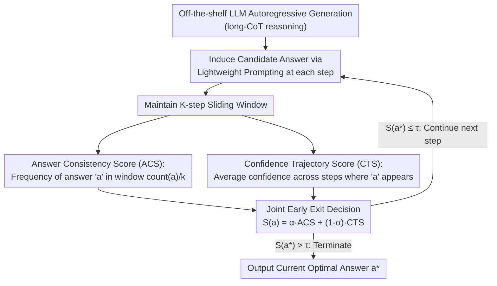

# Efficient Test-Time Scaling via Temporal Reasoning Aggregation

**Conference**: ACL 2026 Findings  
**arXiv**: [2604.17304](https://arxiv.org/abs/2604.17304)  
**Code**: [https://github.com/qianfantianyuzhouzhou/TRACE](https://github.com/qianfantianyuzhouzhou/TRACE)  
**Area**: LLM Inference Efficiency  
**Keywords**: Test-time scaling, early exit strategy, inference convergence, multi-step aggregation, overthinking

## TL;DR

The TRACE framework is proposed to judge inference convergence by aggregating two complementary signals—multi-step answer consistency and confidence trajectory—within a sliding window. This enables training-free dynamic early exit, reducing token usage by 25-30% while maintaining accuracy within a 1-2% margin.

## Background & Motivation

**Background**: Test-time scaling enhances LLM reasoning performance by increasing inference computation (e.g., extending Chain-of-Thought or searching multiple paths). However, this leads to significant redundant token generation, where models continue reasoning even after reaching the correct answer (the "overthinking" phenomenon).

**Limitations of Prior Work**: Existing dynamic early exit methods primarily rely on single-step confidence signals to decide termination. Research indicates that single-step confidence is unreliable in multi-step reasoning, as it reflects local certainty rather than cross-step stability. For instance, a model might assign high confidence to an incorrect intermediate step, leading to premature termination.

**Key Challenge**: Premature termination results in incorrect outputs, while late termination wastes resources. Single-step confidence cannot distinguish between "true inference convergence" and "brief high-confidence erroneous steps." Inference convergence is essentially a temporal phenomenon requiring stability signals across multiple steps.

**Goal**: Design an early exit strategy based on multi-step evidence aggregation to provide more reliable reasoning convergence judgments than single-step confidence.

**Key Insight**: Inspired by self-consistency methods—where identical answers across multiple paths indicate higher correctness—this approach generalizes the concept from multi-path sampling to multi-step progression within a single inference run.

**Core Idea**: Simultaneously track two complementary signals in a sliding window: (1) Answer Consistency, assessing if the predicted answer remains stable across steps; (2) Confidence Trajectory, assessing if confidence evolves stably over time. Their combination determines if reasoning has truly converged.

## Method

### Overall Architecture

TRACE addresses the "overthinking" problem in long-CoT reasoning where models continue generating tokens after the correct answer is reached. During autoregressive generation, it maintains a sliding window covering the most recent $k$ steps. For each step, a lightweight auxiliary prompt induces a candidate final answer from the current context. The system then calculates the "Answer Consistency Score (ACS)" and "Confidence Trajectory Score (CTS)" within the window, combining them into a unified stability score. Once the score exceeds a threshold $\tau$, generation is immediately terminated, and the optimal answer is output. This process requires no training or weight modification and can be applied to any off-the-shelf LLM.

### Key Designs

**1. Answer Consistency Score (ACS): Replacing Single-step Confidence with Frequency**

Single-step confidence only reflects the model's certainty at a specific point, which can be deceived by "confident hallucinations." ACS induces a candidate answer at every step and calculates the frequency of occurrence for answer $a$ within the window: $\text{ACS}(a)=\text{count}(a)/k$. When reasoning converges, the correct answer appears consistently, increasing the ACS. Transient high-confidence errors are typically dismissed by subsequent steps, failing to achieve high consistency.

**2. Confidence Trajectory Score (CTS): Distinguishing Sustained vs. Accidental Certainty**

Consistency alone is insufficient; a model might repeatedly guess a wrong answer with low confidence. CTS quantifies certainty using normalized entropy $\tilde{H}$ per step: $c = 1 - \frac{1}{n}\sum_j \tilde{H}(p_j)$, then averages this over the steps where answer $a$ appeared: $\text{CTS}(a) = \frac{1}{\text{count}(a)}\sum_{t \in \mathcal{T}(a)} c_t$. This distinguishes "sustained high confidence" (convergence) from "sporadic high confidence" (noise).

**3. Joint Early Exit Decision: Complementary Signals**

The final stability score is $S(a) = \alpha \cdot \text{ACS}(a) + (1-\alpha) \cdot \text{CTS}(a)$. The candidate $a^\star$ with the highest score is selected. If $S(a^\star) > \tau$, reasoning terminates. The hyperparameter $\alpha$ balances the two signals. This joint approach covers blind spots: high ACS with low CTS implies an unstable model, while high CTS with low ACS implies changing answers. Only when both are high is reasoning deemed truly consistent and certain.

### Loss & Training

TRACE is a training-free inference-time method. Evaluated on Qwen3-8B and DeepSeek-R1-Distill-Llama-8B across benchmarks including OlympiadBench, MATH500, AIME24, AMC23, and AIME25. The hyperparameter $\alpha$ and threshold $\tau$ are tuned on a validation set.

## Key Experimental Results

### Main Results

| Method | Avg. Accuracy | Avg. Token Consumption | Description |
| :--- | :--- | :--- | :--- |
| Vanilla (Full Reasoning) | Baseline | 100% | Complete generation |
| Single-step Confidence Exit | -11% | ~60% | Significant drop due to premature exit |
| TRACE | -1~2% | 70-75% | Optimal Pareto trade-off |

### Ablation Study

| Signal Combination | Performance | Description |
| :--- | :--- | :--- |
| ACS Only | Moderate | High consistency but potentially low confidence |
| CTS Only | Moderate | High confidence but potentially inconsistent |
| ACS + CTS | Optimal | Complementary joint judgment |

### Key Findings

- Single-step confidence early exit achieved only 0.44 accuracy on difficult benchmarks (vs. 0.55 for full reasoning), confirming the unreliability of local signals.
- TRACE reduces token usage by 25-30% with only a 1-2% accuracy drop, significantly outperforming existing dynamic reasoning methods.
- Compared to the strongest early exit baselines, TRACE improves average accuracy by 2-4 points at similar or lower token budgets.
- Sliding window size $k$ affects sensitivity—too small leads to unstable signals, while too large causes detection delay.

## Highlights & Insights

- **Paradigm shift from single-step to multi-step aggregation**: Qualitative cases demonstrate how single-step confidence misleads early exit, whereas TRACE avoids misjudgment by observing temporal stability.
- **Clever answer induction**: Using lightweight prompts to induce candidate answers without interrupting the reasoning chain allows real-time monitoring of internal states.
- **Plug-and-play practicality**: No training or model modification is required, making it highly effective for lowering inference costs in production.

## Limitations & Future Work

- Answer induction at every step requires an additional forward pass, introducing some overhead.
- Applicability to non-mathematical reasoning tasks (e.g., code generation, NLI) has not been fully verified.
- The threshold $\tau$ and window size $k$ require tuning on validation sets and may vary across datasets.
- TRACE might misjudge convergence when a reasoning task genuinely requires a long chain rather than suffering from overthinking.

## Related Work & Insights

- **vs. Single-step Confidence Early Exit**: Local signals are systematically unreliable in multi-step reasoning. TRACE provides stable convergence signals via temporal aggregation.
- **vs. RL Methods (e.g., Length Penalty Training)**: RL approaches require extra training and are sensitive to reward design. TRACE is more flexible as a training-free application.

## Rating

- Novelty: ⭐⭐⭐⭐ Multi-step aggregation is a natural and sound approach; the ACS+CTS design is clever yet technically accessible.
- Experimental Thoroughness: ⭐⭐⭐⭐⭐ Comprehensive evaluation across 5 math benchmarks, 2 models, and multiple baselines.
- Writing Quality: ⭐⭐⭐⭐ Motivation is clearly established through data; method descriptions are concise.

<!-- RELATED:START -->

## Related Papers

- [\[ICLR 2026\] Optimal Aggregation of LLM and PRM Signals for Efficient Test-Time Scaling](../../ICLR2026/llm_reasoning/optimal_aggregation_of_llm_and_prm_signals_for_efficient_test-time_scaling.md)
- [\[ICLR 2026\] Plan and Budget: Effective and Efficient Test-Time Scaling on Reasoning LLMs](../../ICLR2026/llm_reasoning/plan_and_budget_effective_and_efficient_test-time_scaling_on_reasoning_large_lan.md)
- [\[ACL 2026\] Parallel Test-Time Scaling for Latent Reasoning Models](parallel_test-time_scaling_for_latent_reasoning_models.md)
- [\[ICLR 2026\] CaTS: Calibrated Test-Time Scaling for Efficient LLM Reasoning](../../ICLR2026/llm_reasoning/cats_calibrated_test-time_scaling_for_efficient_llm_reasoning.md)
- [\[ICLR 2026\] Efficient Test-Time Scaling for Small Vision-Language Models](../../ICLR2026/llm_reasoning/efficient_test-time_scaling_for_small_vision-language_models.md)

<!-- RELATED:END -->
