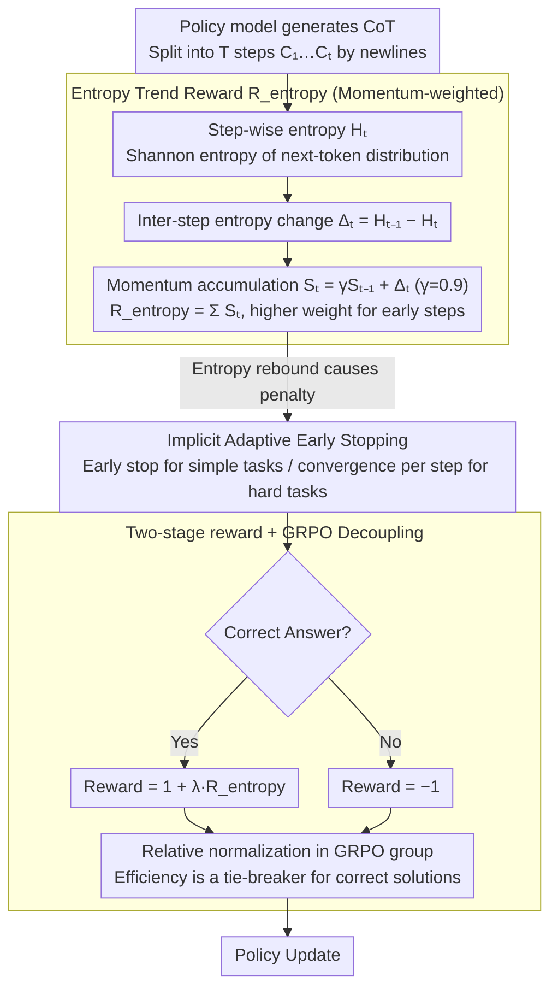

# ETR: Entropy Trend Reward for Efficient Chain-of-Thought Reasoning

**Conference**: ACL 2026  
**arXiv**: [2604.05355](https://arxiv.org/abs/2604.05355)  
**Code**: https://github.com/Xuan1030/ETR  
**Area**: LLM Reasoning / RL / CoT Compression / GRPO  
**Keywords**: Chain-of-Thought Efficiency, Entropy Trend Reward, GRPO, Momentum, Adaptive Early Stopping

## TL;DR
The authors propose ETR (Entropy Trend Reward): a momentum-weighted step-wise entropy reduction integrated as a reward shaping term into GRPO. It constrains LLM CoT to converge under a "global entropy reduction" objective, compressing average CoT length by 35–65% at the same accuracy level. On DeepSeek-R1-Distill-7B, it yields a +9.9% accuracy gain while reducing tokens by 67%.

## Background & Motivation

**Background**: Long-CoT reasoning (R1 / o1 / Qwen3) is the current SOTA paradigm for LLM reasoning. However, "overthinking" causes models to generate tens of thousands of tokens even for simple problems, leading to linear increases in inference latency and high deployment costs. Existing efficiency improvements follow three routes: (1) training-free prompting/early stopping (DEER / NoThink / CGRS); (2) variable-length SFT (TokenSkip / Liu et al.); and (3) RL reward design (LCPO / O1-Pruner / PEAR).

**Limitations of Prior Work**: Length-penalty rewards are content-blind—tokens of the same length may contribute vastly different amounts of information. Entropy-based methods (PEAR / Li 2025 / Agarwal 2025) examine model uncertainty but focus on "global entropy suppression." This implicitly assumes that "CoT should maintain low uncertainty at all times," contradicting the natural human reasoning process of "divergent exploration → convergent determination." Forceful suppression eliminates self-reflection alongside redundancy.

**Key Challenge**: High-entropy moments are often where self-reflection occurs (marked by words like "wait / but / hmm"). Global entropy suppression kills useful reflection and redundant divergence simultaneously, damaging accuracy; conversely, failing to suppress entropy results in uncontrolled length.

**Goal**: (1) Identify a trajectory-level signal truly reflecting "reasoning convergence"; (2) apply this signal as a shaping reward in GRPO rather than a hard constraint; (3) enable the model to naturally produce short responses for simple tasks and long responses for difficult tasks without manual length rules.

**Key Insight**: The authors conducted a key experiment on MATH500, calculating the Spearman $\rho$ between the step index and step entropy of each CoT. They found that more negative $\rho$ (entropy significantly decreasing over time) correlates with shorter length, while positive $\rho$ correlates with longer length. This links "reasoning efficiency" to the "directionality of the entropy trajectory."

**Core Idea**: Reward the "global entropy reduction trend" rather than "instantaneous low entropy." This allows for local reflections and small fluctuations while requiring that overall uncertainty monotonically decreases along the CoT, enabling the model to naturally learn instance-adaptive early stopping behaviors.

## Method

### Overall Architecture
ETR does not modify the GRPO optimization algorithm or add hard length constraints; it only rewrites the reward. The final reward is defined in two stages:
$$R(q,o)=\begin{cases}-1,&\text{if incorrect}\\ 1+\lambda R_{\text{entropy}}(o),&\text{if correct}\end{cases}$$
where $R_{\text{entropy}}(o)$ is the shaping term based on trajectory entropy. Since GRPO performs relative normalization of advantages within a group for the same problem, the ETR signal only acts as a tie-breaker between correct solutions to favor efficiency, ensuring accuracy is not compromised.

### Key Designs

**1. Momentum-based Entropy Trend Reward: Rewarding the "direction of entropy reduction" for the entire CoT**  
Existing entropy-based methods strive for "global entropy suppression," assuming CoT should always have low uncertainty, which erases self-reflection ("wait / but / hmm") at high-entropy points. ETR instead rewards the trend: the CoT is split into steps $\{C_1,\dots,C_T\}$ via "\n\n". For each step, the Shannon entropy of the next-token distribution $H_t=H(p_\theta(\cdot\mid C_{1:t}))$ is calculated. The entropy change $\Delta_t=H_{t-1}-H_t$ is used to track momentum $S_t=\gamma S_{t-1}+\Delta_t$ ($S_1=0$, $\gamma=0.9$). The final $R_{\text{entropy}}(o)=\sum_{t=2}^{T}S_t=\sum_t \alpha_t\Delta_t$, where the weight $\alpha_t=\frac{1-\gamma^{T-t+1}}{1-\gamma}$ strictly decreases with $t$. This decreasing weight is crucial: a naive "total entropy reduction" $R_{\text{naive}}=H_1-H_T$ would telescope to only depend on the start and end, failing to distinguish between "smooth reduction" and "oscillation with the same start/end." Momentum provides a gradient signal to every step and encodes "early convergence" directly into the reward through heavier early-step weighting.

**2. Implicit instance-adaptive early stopping: Naturally short for simple tasks, long for hard tasks without length limits**  
Explicit budgets (LCPO / O1-Pruner) require pre-defined length limits that ignore problem difficulty. ETR naturally achieves adaptivity: because $R_{\text{entropy}}=\sum_t S_t$ accumulates momentum, an extra step only yields a benefit if $S_{t+1}>0$ (i.e., $\Delta_{t+1}$ continues to decrease). Once entropy starts to rebound ($\Delta_t<0$), the model is penalized repeatedly, automatically suppressing oscillatory self-reflection loops. Consequently, for simple problems, entropy collapses quickly, leading to early stopping; for complex problems, the model takes more steps to disambiguate, but each step is required to contribute to entropy reduction. The fundamental difference from global entropy minimization (PEAR / Li 2025) is that ETR allows "temporary increases for long-term decreases," aligning with the human reasoning rhythm of "testing a hypothesis and backtracking if wrong."

**3. Two-stage reward decoupled with GRPO: Correctness first, efficiency second**  
If entropy reward is added directly to the global reward, the model might sacrifice correctness for brevity (as shown in the ablation where "No $R_{\text{corr}}$" reduced length to 1.2k but dropped AMC23 accuracy from 80 to 65). ETR splits the reward into two stages—incorrect answers always receive $-1$, and correct answers receive $1+\lambda R_{\text{entropy}}$. Using GRPO's intra-group relative normalization $\hat{A}_i=(r_i-\bar{r})/\sigma_r$, the ETR signal only differentiates between multiple correct solutions for the same problem. This makes "correctness a hard constraint and efficiency a tie-breaker," cleanly layering the two objectives.

### Loss & Training
The standard PPO-clipped objective with intra-group advantage normalization in GRPO is used, with KL coefficient $\beta$. Reward is as defined above; $\lambda$ controls entropy shaping intensity; $\gamma=0.9$ is the momentum. Training data consist of 7,000 problems (difficulties 5–10) from DeepMath-103K. Training is performed using LoRA + the VeRL framework on 8×H100 GPUs, with batch size 32, lr $1\times10^{-5}$, max length 16384, and 5 rollouts per question.

## Key Experimental Results

### Main Results
Evaluation results across AMC23 / AIME24 / MATH500 / GPQA-Diamond (greedy pass@1):

| Model | Method | Overall Acc ↑ | Overall Len ↓ | AES ↑ |
|------|-----|--------------|--------------|------|
| DeepSeek-R1-Distill-7B | Original | 58.1 | 8.5k | 0.00 |
| DeepSeek-R1-Distill-7B | DEER | 60.9 | 6.2k | 0.51 |
| DeepSeek-R1-Distill-7B | NoThink | 59.5 | 4.0k | 0.65 |
| DeepSeek-R1-Distill-7B | LCPO | 58.6 | 3.8k | 0.60 |
| DeepSeek-R1-Distill-7B | O1-Pruner | 66.9 | 4.8k | 1.18 |
| DeepSeek-R1-Distill-7B | PEAR | 69.8 | 5.1k | 1.41 |
| **DeepSeek-R1-Distill-7B** | **ETR** | **68.0** | **2.8k** | **1.53** |
| Qwen3-4B | Original | 69.5 | 8.7k | 0.00 |
| Qwen3-4B | PEAR | 77.2 | 6.7k | 0.79 |
| **Qwen3-4B** | **ETR** | **77.1** | **4.4k** | **1.03** |
| Qwen3-8B | Original | 74.0 | 8.9k | 0.00 |
| Qwen3-8B | PEAR | 74.6 | 7.6k | 0.18 |
| **Qwen3-8B** | **ETR** | **79.1** | **5.1k** | **0.77** |

On DeepSeek-R1-Distill-7B, ETR reduces CoT from 8.5k to 2.8k (33% compression) while increasing accuracy from 58.1 to 68.0. The gain is even more pronounced on AIME24 (11.8k → 4.6k, 43.3 → 56.7).

### Ablation Study
Comparison of different entropy rewards on DeepSeek-R1-Distill-7B:

| Reward Design | AMC23 Acc / Len | AIME24 Acc / Len | MATH500 Acc / Len | GPQA-D Acc / Len | AES |
|-------------|-----------------|------------------|-------------------|------------------|------|
| Original | 80.0 / 6.6k | 43.3 / 11.8k | 85.0 / 4.2k | 24.2 / 11.3k | 0.00 |
| Min. $H$ (Global suppression) | 80.0 / 2.1k | 43.3 / 5.1k | 88.2 / 1.3k | 38.3 / 2.1k | 1.06 |
| Max. $H$ (Reverse maximization) | 10.0 / 15.1k | 0.0 / 16.4k | 9.0 / 15.3k | 1.5 / 16.0k | -5.4 |
| No $\gamma$ (No momentum, telescope) | 87.5 / 4.9k | 46.7 / 10.0k | 87.8 / 3.6k | 31.8 / 10.0k | 0.61 |
| No $R_{\text{corr}}$ (No correctness constraint) | 65.0 / 1.2k | 23.3 / 1.4k | 78.6 / 0.7k | 29.8 / 0.7k | 0.11 |
| **Ours (Full ETR)** | **87.5 / 2.4k** | **56.7 / 4.6k** | **90.6 / 1.5k** | **37.4 / 2.5k** | **1.53** |

### Key Findings
- **Momentum is essential**: Removing momentum leads to a telescope-only form that fails to compress CoT meaningfully (4.9k vs 2.4k for ETR), as rewards focused only on the start/end provide no gradient signal for intermediate steps.
- **Entropy reduction trend $\neq$ Global entropy suppression**: Min. $H$ results in a significantly lower AES than ETR (1.06 vs 1.53) and heavily suppresses the count of reflection tokens. In contrast, ETR retains moderate self-reflection while maintaining low verbosity per step—Figure 6 confirms ETR compresses CoT by reducing "verbosity per step" rather than prohibiting reflection.
- **Correctness must be a hard constraint**: Without $R_{\text{corr}}$, AMC23 accuracy drops from 80 to 65 despite a 1.2k length, proving that entropy shaping alone causes "short but wrong" outputs.
- **Spearman $\rho$ inversion validates convergence**: After ETR training, the $\rho$(step, $H_t$) for models shifts from positive/near-zero to negative, confirming that entropy indeed decreases along the steps.
- **Cross-model generalization**: ETR achieves the highest AES across the DeepSeek-R1-Distill and Qwen3 families (4B–8B), showing it is independent of specific architectures.
- **Hard problems benefit most**: AIME24 saw a +13.4 accuracy increase and 60% length reduction, corresponding to the idea that "hard problems need more steps, but each step must contain effective information."

## Highlights & Insights
- "Looking at the trend of entropy rather than the absolute value" is a conceptual shift—modeling reasoning as a dynamic system rather than a static distribution enables RL rewards to directly target "convergence speed."
- The strictly decreasing property of momentum-weighted $\alpha_t$ implicitly encodes a preference for "earlier convergence," mathematicalizing the human intuition that CoT should rapidly approach the answer.
- Compared to methods like PEAR, ETR allows "temporary increases for long-term decreases," aligning with human explore-then-exploit reasoning rhythms. This philosophy could be transferred to tool-calling Control or Agent rollback strategies.
- Figure 6 decomposes "CoT compression" into steps, tokens per step, and reflection word count, finding that ETR primarily reduces verbosity per step. This behavioral attribution is a high-quality methodological demonstration.
- The combination of a two-stage reward and GRPO relative normalization cleanly solves the "efficiency overshadowing accuracy" problem in multi-objective RL.

## Limitations & Future Work
- Authors acknowledge that due to compute limits, experiments were limited to 8B models with LoRA; ETR behavior on larger scales (32B / 70B) needs verification.
- $\lambda$ and $\gamma$ are fixed empirical values; optimal $\lambda$ may vary by task difficulty, and no adaptive tuning scheme is provided.
- Entropy calculation relies on white-box next-token distribution, making it inapplicable to closed-source APIs like GPT-4 or Claude.
- Step splitting uses a "\n\n" heuristic, which might be fragile for models favoring single-paragraph long-form text; semantic-level partitioning might be more precise.
- Only reasoning benchmarks (Math / GPQA) were tested; transferability to coding, tool use, or multi-turn dialogue is unconfirmed.
- ETR treats entropy as an introspection signal, but high entropy does not always equal information; if model calibration is poor, ETR might learn incorrect trajectory patterns. Integrated external verifiers could improve robustness.

## Related Work & Insights
- **vs PEAR (Huang 2025a)**: PEAR also uses entropy reward in GRPO but follows global suppression (maintaining accuracy but CoT remains long); ETR looks at trends, achieving 1.53 AES vs 1.41 for PEAR, and reduces length to 2.8k vs 5.1k.
- **vs O1-Pruner / LCPO (length-based RL)**: Length-penalty methods are content-blind and easily drop precision; ETR uses efficiency as a "tie-breaker for correct solutions" to avoid this.
- **vs DEER / NoThink (training-free)**: Training-free methods performed poorly on large models and lack controllability; ETR achieves much higher AES through generalized early stopping.
- **vs Min. $H$ / Step Entropy compression (Li 2025)**: Global suppression methods kill useful self-reflection; ETR's behavioral analysis (Figure 6) proves it preserves reflection while compressing verbosity.

## Rating
- Novelty: ⭐⭐⭐⭐ "Looking at entropy trends" is a clear perspective shift; momentum design is elegant.
- Experimental Thoroughness: ⭐⭐⭐⭐ 3 models × 4 benchmarks + complete ablation + Spearman $\rho$ validation + behavioral decomposition.
- Writing Quality: ⭐⭐⭐⭐ Strong motivation (Spearman $\rho$ vs length scatter plot is convincing); clear derivation and alignment with human reasoning.
- Value: ⭐⭐⭐⭐ Targets the overthinking pain point of reasoning models; SOTA AES and cross-family generalization make it ready for production deployment.

<!-- RELATED:START -->

## Related Papers

- [\[ACL 2026\] Efficient Process Reward Modeling via Contrastive Mutual Information](efficient_process_reward_modeling_via_contrastive_mutual_information.md)
- [\[ACL 2026\] Revisiting Entropy in Reinforcement Learning for Large Reasoning Models](revisiting_entropy_in_reinforcement_learning_for_large_reasoning_models.md)
- [\[ICLR 2026\] DRPO: Efficient Reasoning via Decoupled Reward Policy Optimization](../../ICLR2026/llm_reasoning/drpo_efficient_reasoning_via_decoupled_reward_policy_optimization.md)
- [\[NeurIPS 2025\] Re-FORC: Adaptive Reward Prediction for Efficient Chain-of-Thought Reasoning](../../NeurIPS2025/llm_reasoning/re-forc_adaptive_reward_prediction_for_efficient_chain-of-thought_reasoning.md)
- [\[ACL 2026\] Reinforced Efficient Reasoning via Semantically Diverse Exploration](reinforced_efficient_reasoning_via_semantically_diverse_exploration.md)

<!-- RELATED:END -->
