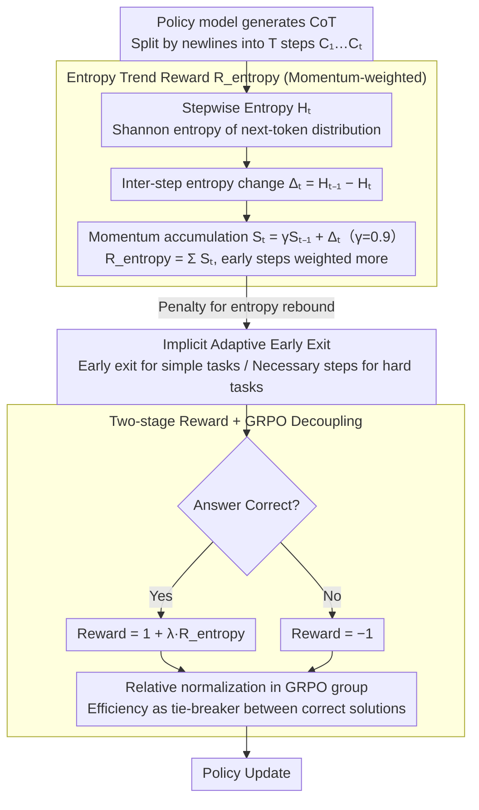

# ETR: Entropy Trend Reward for Efficient Chain-of-Thought Reasoning

**Conference**: ACL 2026  
**arXiv**: [2604.05355](https://arxiv.org/abs/2604.05355)  
**Code**: https://github.com/Xuan1030/ETR  
**Area**: LLM Reasoning / RL / CoT Compression / GRPO  
**Keywords**: Chain-of-thought efficiency, entropy trend reward, GRPO, momentum, adaptive early exit

## TL;DR
The authors propose ETR (Entropy Trend Reward), which incorporates momentum-weighted stepwise entropy reduction as a reward shaping term in GRPO. This constraint forces the LLM's CoT to converge adaptively under a "global entropy decay" objective, reducing average CoT length by 35–65% with maintained accuracy. On DeepSeek-R1-Distill-7B, it achieves a +9.9% accuracy gain while reducing tokens by 67%.

## Background & Motivation

**Background**: Long-CoT reasoning (e.g., R1, o1, Qwen3) is the current SOTA paradigm for LLM reasoning. However, "overthinking" causes models to generate tens of thousands of tokens even for simple problems, leading to linear increases in deployment costs and latency. Existing efficiency improvements follow three routes: (1) training-free prompting/early stopping (DEER, NoThink, CGRS); (2) variable-length SFT (TokenSkip, Liu et al.); and (3) RL reward design (LCPO, O1-Pruner, PEAR).

**Limitations of Prior Work**: Length-penalty rewards are content-blind—tokens of the same length may contribute vastly different amounts of information. Entropy-based methods (PEAR, Li 2025, Agarwal 2025) examine model uncertainty but focus on "globally minimizing entropy." This implicitly assumes that CoT should maintain low uncertainty at all times, which contradicts the natural human reasoning process of "divergent exploration $\rightarrow$ convergent determination." Forcibly suppressing entropy can eliminate useful self-reflection.

**Key Challenge**: High-entropy moments are often where self-reflection occurs (e.g., markers like "wait," "but," or "hmm"). Globally suppressing entropy eliminates both useful reflection and redundant divergence, harming accuracy. Conversely, failing to suppress it results in uncontrolled length.

**Goal**: (1) Identify a trajectory-level signal that truly reflects whether reasoning is converging; (2) use this signal as a shaping reward in GRPO rather than a hard constraint; (3) enable models to be naturally short for simple problems and long for difficult ones without manual length rules.

**Key Insight**: The authors conducted a key experiment on MATH500, calculating the Spearman $\rho$ between step index and step entropy for each CoT. They found that more negative $\rho$ (entropy decreasing significantly over steps) correlates with shorter lengths, while positive $\rho$ correlates with longer lengths. This links "reasoning efficiency" to the "directionality of the entropy trajectory."

**Core Idea**: Reward the "global entropy decay trend" instead of "instantaneous low entropy." This allows for local reflection and minor fluctuations while requiring overall uncertainty to decrease monotonically along the CoT, enabling the model to learn instance-adaptive early exit behavior naturally.

## Method

### Overall Architecture
ETR does not modify the GRPO optimization algorithm or add hard length constraints; it only rewrites the reward. The final reward is defined in two stages:
$$R(q,o)=\begin{cases}-1,&\text{if incorrect}\\ 1+\lambda R_{\text{entropy}}(o),&\text{if correct}\end{cases}$$
where $R_{\text{entropy}}(o)$ is the shaping term based on trajectory entropy. Since GRPO performs relative normalization of advantages within a group for the same problem, the ETR signal only acts as a tie-breaker between correct solutions, ensuring efficiency constraints do not compromise accuracy.

### Key Designs

**1. Momentum-Based Entropy Trend Reward: Rewarding the "direction of entropy decay" throughout the CoT, rather than instantaneous low entropy.**

Existing entropy-based methods focus on "globally suppressing entropy," assuming CoT should always have low uncertainty. This erases self-reflection ("wait / but / hmm") at high-entropy points. ETR instead rewards the trend: CoT is split into steps $\{C_1,\dots,C_T\}$ via "\n\n". For each step, the Shannon entropy of the next-token distribution $H_t=H(p_\theta(\cdot\mid C_{1:t}))$ is calculated. Let inter-step entropy change be $\Delta_t=H_{t-1}-H_t$, with momentum state $S_t=\gamma S_{t-1}+\Delta_t$ ($S_1=0$, $\gamma=0.9$). The final $R_{\text{entropy}}(o)=\sum_{t=2}^{T}S_t=\sum_t \alpha_t\Delta_t$, where weight $\alpha_t=\frac{1-\gamma^{T-t+1}}{1-\gamma}$ strictly decreases with $t$. The key is this decaying weight: a naive "total entropy drop" $R_{\text{naive}}=H_1-H_T$ would telescope to only depend on the start and end, failing to distinguish between smooth decay and oscillation. The momentum formula assigns gradient signals to every step while encoding "early convergence" into the reward by weighting early steps more heavily.

**2. Implicit Instance-Adaptive Early Exit: Avoiding hard length caps, allowing simple problems to be short and hard ones to be long.**

Explicit budgets (LCPO / O1-Pruner) require predefined length limits, applying a "one-size-fits-all" approach regardless of difficulty. ETR achieves adaptivity through its reward structure: since $R_{\text{entropy}}=\sum_t S_t$ accumulates momentum, an extra step is only beneficial if $S_{t+1}>0$ (i.e., $\Delta_{t+1}$ continues to decrease). Once entropy rebounds ($\Delta_t<0$), the model faces repeated penalties, automatically suppressing oscillatory self-reflection loops. Consequently, for simple problems, entropy collapses quickly, leading to early stopping. Hard problems require gradual disambiguation; they are allowed more steps, but each step is incentivized to contribute to entropy decay. The fundamental difference from global entropy minimization (PEAR / Li 2025) is that ETR permits "temporary increases for long-term decreases," aligning with human reasoning rhythms of "trying a hypothesis and backtracking if wrong."

**3. Two-Stage Reward Decoupled with GRPO: Correctness first, efficiency second.**

If entropy rewards are added directly to the global reward, models may sacrifice accuracy for brevity (as evidenced by No $R_{\text{corr}}$ in the ablation study, where length dropped to 1.2k but AMC23 plummeted from 80 to 65). ETR splits the reward: incorrect answers are constant at $-1$, while correct ones receive $1+\lambda R_{\text{entropy}}$. Leveraging GRPO's within-group relative normalization $\hat{A}_i=(r_i-\bar{r})/\sigma_r$, the ETR signal only distinguishes between multiple correct solutions for the same problem. This ensures correctness remains a hard constraint while efficiency acts as a tie-breaker, preventing efficiency from cannibalizing precision across different tasks.

### Loss & Training
Standard GRPO with PPO-clipped objective and intra-group advantage normalization, KL coefficient $\beta$. Reward as defined above; $\lambda$ controls entropy shaping strength; $\gamma=0.9$ for momentum. Training data: 7,000 problems from DeepMath-103K (difficulty 5–10). Trained using LoRA + VeRL framework on 8×H100; batch 32, lr $1\times10^{-5}$, max length 16384, 5 rollouts per problem.

## Key Experimental Results

### Main Results
Evaluated on AMC23 / AIME24 / MATH500 / GPQA-Diamond (greedy pass@1):

| Model | Method | Overall Acc ↑ | Overall Len ↓ | AES ↑ |
|------|-----|--------------|--------------|------|
| DeepSeek-R1-Distill-7B | Original | 58.1 | 8.5k | 0.00 |
| DeepSeek-R1-Distill-7B | DEER | 60.9 | 6.2k | 0.51 |
| DeepSeek-R1-Distill-7B | NoThink | 59.5 | 4.0k | 0.65 |
| DeepSeek-R1-Distill-7B | LCPO | 58.6 | 3.8k | 0.60 |
| DeepSeek-R1-Distill-7B | O1-Pruner | 66.9 | 4.8k | 1.18 |
| DeepSeek-R1-Distill-7B | PEAR | 69.8 | 5.1k | 1.41 |
| **DeepSeek-R1-Distill-7B** | **ETR** | **68.0** | **2.8k** | **1.53** |
| Qwen3-4B | Original | 69.5 | 8.7k | 0.00 |
| Qwen3-4B | PEAR | 77.2 | 6.7k | 0.79 |
| **Qwen3-4B** | **ETR** | **77.1** | **4.4k** | **1.03** |
| Qwen3-8B | Original | 74.0 | 8.9k | 0.00 |
| Qwen3-8B | PEAR | 74.6 | 7.6k | 0.18 |
| **Qwen3-8B** | **ETR** | **79.1** | **5.1k** | **0.77** |

On DeepSeek-R1-Distill-7B, ETR reduces CoT from 8.5k to 2.8k (33% compression) while increasing accuracy from 58.1 to 68.0. Results on AIME24 are particularly significant (11.8k $\rightarrow$ 4.6k, 43.3 $\rightarrow$ 56.7).

### Ablation Study
Comparison of different entropy reward designs on DeepSeek-R1-Distill-7B:

| Reward Design | AMC23 Acc / Len | AIME24 Acc / Len | MATH500 Acc / Len | GPQA-D Acc / Len | AES |
|-------------|-----------------|------------------|-------------------|------------------|------|
| Original | 80.0 / 6.6k | 43.3 / 11.8k | 85.0 / 4.2k | 24.2 / 11.3k | 0.00 |
| Min. $H$ (Global Extinction) | 80.0 / 2.1k | 43.3 / 5.1k | 88.2 / 1.3k | 38.3 / 2.1k | 1.06 |
| Max. $H$ (Reverse Maximize) | 10.0 / 15.1k | 0.0 / 16.4k | 9.0 / 15.3k | 1.5 / 16.0k | -5.4 |
| No $\gamma$ (No Momentum, telescope) | 87.5 / 4.9k | 46.7 / 10.0k | 87.8 / 3.6k | 31.8 / 10.0k | 0.61 |
| No $R_{\text{corr}}$ (No Correctness) | 65.0 / 1.2k | 23.3 / 1.4k | 78.6 / 0.7k | 29.8 / 0.7k | 0.11 |
| **Ours (Full ETR)** | **87.5 / 2.4k** | **56.7 / 4.6k** | **90.6 / 1.5k** | **37.4 / 2.5k** | **1.53** |

### Key Findings
- **Momentum is essential**: Removing momentum results in a telescope-only form where CoT length barely decreases (4.9k vs 2.4k for ETR), because starting/ending points alone provide no gradient for intermediate steps; momentum allows every entropy change to participate in shaping.
- **Entropy decay trend $\neq$ Global entropy minimization**: Min. $H$ yields a much lower AES than ETR (1.06 vs 1.53) and significantly suppresses the number of reflection tokens. ETR retains moderate self-reflection while maintaining low verbosity per step; Figure 6 confirms that ETR compresses CoT by reducing "wordiness" rather than prohibiting reflection.
- **Correctness requires hard constraints**: Removing $R_{\text{corr}}$ causes lengths to shrink to 1.2k but drops AMC23 accuracy from 80 to 65, proving that entropy shaping alone leads to "short but wrong" models.
- **Spearman $\rho$ reversal validates convergence**: Post-ETR training, models see $\rho(\text{step}, H_t)$ flip from positive/near-zero to negative, proving entropy indeed decays stepwise—direct evidence that ETR transforms the hypothesis into post-training behavior.
- **Cross-model generalization**: Achieving the highest AES across DeepSeek-R1-Distill and Qwen3 (4B–8B) shows the method does not rely on specific architectures or pre-training paradigms.
- **Hard problems gain most**: On AIME24, accuracy increased by 13.4 while length decreased by 60%, matching the intuition that hard problems require more steps but each step must contain "effective information."

## Highlights & Insights
- "Analyzing the trend rather than the absolute value of entropy" is a conceptual shift—modeling reasoning as a dynamic system rather than a static distribution, allowing RL to reward the abstract concept of "convergence speed."
- The strictly decreasing property of momentum-weighted $\alpha_t$ implicitly encodes a preference for "earlier convergence," mathematically formalizing the human intuition that CoT should rapidly converge toward an answer.
- Compared to methods like PEAR, ETR's ability to "allow temporary rises for long-term falls" naturally aligns with human explore-then-exploit reasoning; this "local tolerance but global strictness" could be transferred to tool-calling control or agent rollback strategies.
- Figure 6 decomposes CoT compression into steps, tokens per step, and reflection word count, revealing that ETR primarily reduces verbosity per step rather than cutting steps—this behavioral attribution is a valuable methodological contribution for evaluating reasoning compression.
- The combination of a two-stage reward (incorrect -1, correct $1+\lambda R$) and GRPO relative normalization neatly solves the common multi-objective RL problem where efficiency overrides accuracy, a template applicable to latency, safety, or formatting goals.

## Limitations & Future Work
- The authors acknowledge that due to compute limits, experiments were limited to 8B + LoRA; whether ETR behavior remains consistent on larger scales (32B/70B) needs verification, especially as larger models may converge quickly by default.
- $\lambda$ and $\gamma$ are fixed empirical values; optimal $\lambda$ might vary significantly across task difficulties, yet no adaptive tuning scheme is provided.
- Entropy calculation relies on the next-token prediction distribution, making it suitable only for white-box models; it cannot be directly applied to closed-source APIs (GPT-4/Claude).
- Step splitting via "\n\n" is heuristic and might be brittle for models that prefer single-paragraph blocks; semantic-level step segmentation might be more precise.
- Validated only on math/GPQA reasoning benchmarks; transferability to coding, tool-calling, or multi-turn dialogue is not yet established.
- ETR treats entropy as an introspective signal, but high entropy does not always equal useful information; if the model's distribution is poorly calibrated, ETR might learn incorrect trajectory patterns. Integration with external verifiers could improve robustness.

## Related Work & Insights
- **vs PEAR (Huang 2025a)**: PEAR also uses entropy rewards in GRPO but pursues global minimization (accuracy is maintained but CoT remains long). ETR looks at trends; on DeepSeek-R1-Distill-7B, AES is 1.53 vs PEAR's 1.41, with a more significant length reduction (2.8k vs 5.1k).
- **vs O1-Pruner / LCPO (length-based RL)**: Length-punishing training is content-blind and prone to accuracy loss; ETR uses efficiency as a "tie-breaker" among correct solutions to avoid this.
- **vs DEER / NoThink (training-free)**: Training-free methods struggle on large models and lack controllability; ETR learns generalized early exit behavior through RL, achieving significantly higher AES.
- **vs Min. $H$ / Compressing-CoT via Step Entropy (Li 2025)**: Global entropy minimization erases useful self-reflection; ETR's behavioral analysis (Figure 6) prove it preserves reflection while suppressing verbosity.
- **vs Token-skip / Variable-length SFT (Xia 2025 / Liu 2024)**: These require labeled CoT data for SFT, limiting generalization; ETR uses RL signals and requires no ground-truth trajectories.
- **Transferable Insight**: The momentum-weighted $\alpha_t$ decreasing structure and the "global trend + local tolerance" reward philosophy are valuable for any task requiring length compression without quality loss (e.g., code generation, summarization, multi-step planning).

## Rating
- Novelty: ⭐⭐⭐⭐ "Entropy trend" is a clear perspective shift; momentum weighting is elegant, though entropy reward direction was pioneered by PEAR.
- Experimental Thoroughness: ⭐⭐⭐⭐ 3 models × 4 benchmarks + full ablation (Min/Max/No momentum/No correctness) + Spearman $\rho$ validation + behavioral decomposition.
- Writing Quality: ⭐⭐⭐⭐ Motivation logic is direct (Spearman $\rho$ vs. length scatter plot is persuasive); human-like reasoning analogies are well-articulated.
- Value: ⭐⭐⭐⭐ Directly addresses the "overthinking" pain point in the reasoning model era; top AES and cross-family generalization make it highly practical for production deployment.

<!-- RELATED:START -->

## Related Papers

- [\[ACL 2026\] Efficient Process Reward Modeling via Contrastive Mutual Information](efficient_process_reward_modeling_via_contrastive_mutual_information.md)
- [\[ACL 2026\] Revisiting Entropy in Reinforcement Learning for Large Reasoning Models](revisiting_entropy_in_reinforcement_learning_for_large_reasoning_models.md)
- [\[NeurIPS 2025\] Re-FORC: Adaptive Reward Prediction for Efficient Chain-of-Thought Reasoning](../../NeurIPS2025/llm_reasoning/re-forc_adaptive_reward_prediction_for_efficient_chain-of-thought_reasoning.md)
- [\[ACL 2026\] Learning to Edit Knowledge via Instruction-based Chain-of-Thought Prompting](learning_to_edit_knowledge_via_instruction-based_chain-of-thought_prompting.md)
- [\[ACL 2026\] Reinforced Efficient Reasoning via Semantically Diverse Exploration](reinforced_efficient_reasoning_via_semantically_diverse_exploration.md)

<!-- RELATED:END -->
