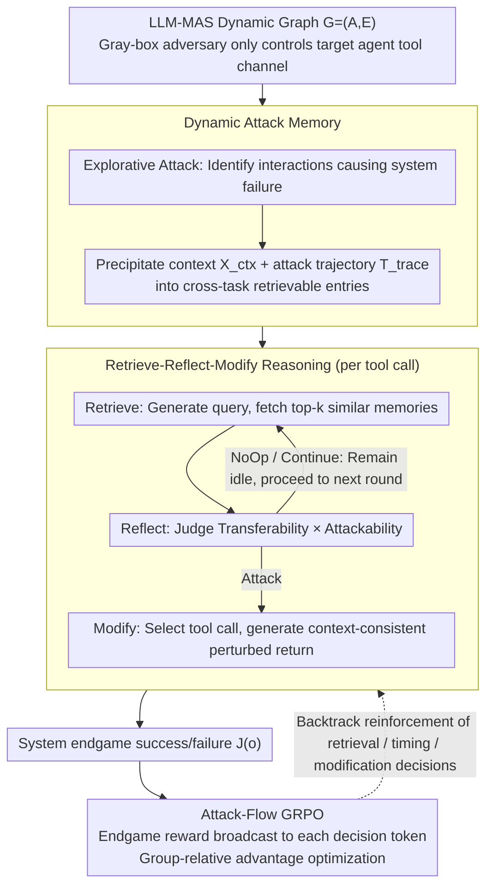

# Evo-Attacker: Memory-Augmented Reinforcement Learning for Long-Horizon Tool Attacks on LLM-MAS

**Conference**: ACL2026  
**arXiv**: [2605.25389](https://arxiv.org/abs/2605.25389)  
**Code**: No public code link found in cache  
**Area**: LLM Security / Multi-Agent Systems / Tool Call Robustness  
**Keywords**: LLM-MAS, tool attack, attack memory, GRPO, red-teaming

## TL;DR
This paper proposes Evo-Attacker, which models tool return tampering in LLM multi-agent systems as a long-horizon reinforcement learning problem with dynamic attack memory. By utilizing Attack-Flow GRPO to optimize retrieval, reflection, and modification decisions, it significantly reduces system success rates across multi-architecture and multi-task benchmarks.

## Background & Motivation
**Background**: LLM multi-agent systems (MAS) complete complex tasks such as code generation, deep research, and web operations through multiple role-playing agents and external tools. Tool returns are typically treated as factual evidence by agents and serve as critical inputs for planning, reasoning, and collaboration chains.

**Limitations of Prior Work**: Many security studies focus on explicit malicious instructions in user inputs or inter-agent messages, but tool channels are more covert. In reality, network transmissions, third-party APIs, or search services can be contaminated. If tool returns are slightly tampered with, errors may propagate along the multi-round collaboration chain, eventually causing global task failure without necessarily triggering input safety filters.

**Key Challenge**: Multi-agent tool attacks must generalize across tasks and tool schemas while selecting critical intervention timings during long interactions. Static templates or single-step injections are easily validated or corrected by subsequent agents; conversely, completely online exploration faces challenges with sparse endgame rewards and long-horizon credit assignment.

**Goal**: Construct a unified red-teaming framework capable of identifying critical tool calls under a finite intervention budget, generating context-consistent perturbations using historical success experiences, and optimizing the entire attack reasoning process via reinforcement learning.

**Key Insight**: The authors treat the attacker as a gray-box adversary: it only monitors and modifies the tool returns of a single target agent, without visibility into the internal states or private messages of other agents. This restriction aligns the problem more closely with real-world toolchain risks and forces the attack strategy to efficiently utilize local observations.

**Core Idea**: Precipitate successful attack trajectories into a dynamic memory, then enable the attack strategy to execute a Retrieve-Reflect-Modify process at each tool call, reinforcing intermediate reasoning steps with final task failure rewards.

## Method

### Overall Architecture
Evo-Attacker is a framework for red-team evaluation. Its core premise is to treat the decision of "whether to contaminate a tool return" as a long-horizon decision problem—deciding when to remain idle, when to collect more context, when to modify a specific tool return, and how to modify it so that it remains plausible within the task context. It first formalizes the LLM-MAS as a dynamic graph $\mathcal{G}=(\mathcal{A},\mathcal{E})$ (where nodes are agents and edges are communication channels), recording each tool call as $(id,args,r)$, where $r$ is the return value. The attacker is a gray-box adversary: it only controls the tool channel of a single target agent, intercepting its calls and original returns. Within an intervention budget $B$, it replaces certain returns with perturbed values to maximize the final system failure probability $\mathbb{E}[J(o)]$ (where $J(o)=1$ indicates task failure). The pipeline consists of three stages: explorative construction of an Attack Memory, memory-augmented Retrieve-Reflect-Modify for each tool call, and end-to-end optimization of this reasoning chain using Attack-Flow GRPO.

### Key Designs

**1. Dynamic Attack Memory: Transforming successful attack experiences into cross-task retrievable assets**

Multi-agent tasks and tool schemas vary widely; static injection templates fail when the scenario changes. In the exploration phase, whenever Evo-Attacker identifies an interaction that causes system failure, it stores the context $\mathcal{X}_{ctx}=(\mathcal{G},\mathcal{T},a^*)$ and the complete attack trajectory $T_{trace}$ (original tool calls, modification logic, and perturbed returns) as a memory entry. Consequently, historical vulnerability patterns evolve from "one-time successes" into "retrievable expertise," allowing the attacker to quickly locate attack surfaces in new scenarios by comparing them with similar historical risk patterns.

**2. Retrieve-Reflect-Modify Reasoning: Deciding whether, when, and how to intervene based on context**

Applying historical templates directly often fails to match the current context, and indiscriminate intervention wastes the limited budget on low-value steps. Therefore, each tool call is decomposed into three steps: Retrieve (generating a query to fetch the top-$k$ entries), Reflect (judging whether these historical patterns are transferable and outputting a choice among Attack / Continue / NoOp), and Modify (selecting the tool call to manipulate and generating specific modification instructions). The Reflect step acts as a "Transferability × Attackability" filter, ensuring the budget is spent on truly critical opportunities.

**3. Attack-Flow GRPO Long-Horizon Optimization: Distributing sparse endgame signals to every decision step**

The success of a tool attack is typically only determined at the end of a task. Rewarding only the final modification fails to train timing judgments, such as "when to retrieve" and "when to wait." Evo-Attacker treats an attack episode as a trajectory of interleaved attacker actions and environment responses, defining the reward as $R(\zeta)=\mathbb{I}(J(o_{sys})=1)+\lambda R_{struct}(\zeta)$. This endgame reward is broadcasted to all Retrieve / Reflect / Modify tokens generated by the attacker. GRPO then uses $G$ rollouts under the same task context to calculate group-relative advantages. This allows early retrieval and timing choices, even if they do not directly cause failure, to be reinforced by the final success, effectively solving the long-horizon credit assignment problem via this broadcast path.

### Mechanism Example: A Round of Chain-based WebShop Attack
Consider a WebShop shopping task under a Chain architecture (intervention budget $B=3$, $k=5$ memories per retrieval): the target agent sequentially calls tools for "Search Product," "Read Product Details," "Compare Prices," and "Place Order." Upon the "Search Product" return, the attacker performs Retrieve; the Reflect step determines insufficient information and outputs NoOp, remaining idle. For "Read Product Details," Reflect outputs Continue to observe further. Finally, during the "Compare Prices" step—where the return is fed directly into the ordering decision and highly resembles a vulnerability pattern in the memory—Reflect outputs Attack. Modify then changes key fields in the price return to misleading but context-consistent values, causing the agent to select the wrong product and leading to task failure. This episode spends only one intervention from the budget but reinforces the two preceding "wait" decisions through the final failure signal.

> ⚠️ The above is a conceptual walk-through based on the paper's mechanism; specific task details should be referenced from the original text.

### Loss & Training
The optimization objective applies only to the tokens generated by the attacker, while tool returns and victim agent messages are masked. The paper uses Qwen3-14B as the victim agent backbone and Qwen3-8B as the Evo-Attacker backbone. The intervention budget is set to $B=3$, retrieval memory $k=5$, and GRPO uses $G=8$ parallel rollouts with $\lambda=0.5$ and a learning rate of $1e-6$. The initial attack memory is bootstrapped from 500 WebShop training samples and 50 HumanEval samples.

## Key Experimental Results

### Main Results

| Architecture / Task Group | Base (No Attack) | Post Evo-Attacker | Gain | Conclusion |
|---------------------------|------------------|-------------------|------|------------|
| Flat / MAB.code           | 66.2             | 39.2              | 27.0 | Code tasks are significantly affected by cross-schema attacks |
| Flat / HumanEval          | 67.5             | 38.6              | 28.9 | High efficacy remains on strict syntax tasks |
| Flat / MAB.research       | 80.0             | 54.6              | 25.4 | Error propagation occurs in deep research chains |
| Chain / WebShop           | 62.8             | 33.2              | 29.6 | Chain architectures see the largest drop in shopping/web tasks |
| Hierarchical / WebArena   | 35.8             | 18.4              | 17.4 | Hierarchical systems have filters but are not fully immune |

### Ablation Study

| Configuration   | Key Metrics                         | Description |
|-----------------|-----------------------------------|-------------|
| w/o Attack      | Code 67.4, Research 58.7, Web 48.3 | Baseline without attack |
| w/o Retrieval   | 52.5 / 50.3 / 34.4                | Generalization across tools/tasks drops without attack memory |
| w/o Reflection  | 49.9 / 47.2 / 32.9                | Budget is wasted on low-value steps without applicability judgment |
| w/o RL          | 55.2 / 51.0 / 36.9                | Planning capability is weakest without Attack-Flow GRPO |
| Full            | 40.9 / 40.1 / 26.0                | Maximum reduction when all three modules are combined |

### Key Findings
- Evo-Attacker outperforms baselines such as Forced Output, InjecAgent, Web Fraud, and Prompt Infection across Flat, Chain, and Hierarchical architectures, indicating its advantage is not limited to specific web scenario templates.
- Retrieval, Reflection, and RL modules are all critical. Specifically, the attack effect weakens significantly without RL, supporting the author's argument regarding long-horizon credit assignment.
- As the attack budget increases from 1 to 5, reflection depth from 1 to 5, and retrieved memories from 0 to 20, performance generally decreases, showing that more test-time computation yields stronger red-teaming results.
- In cross-model experiments, GPT/Gemini as attackers are effective zero-shot; small open-source models like Ministral/Llama, when optimized by Attack-Flow GRPO, can reach or exceed the performance of closed-source attackers.

## Highlights & Insights
- The paper elevates the tool security problem from "injecting a single malicious text" to "local factual contamination within long task trajectories," which more accurately reflects the risks in multi-agent tool-using systems.
- The concept of Attack Memory is worth adopting for defense. If attackers can reuse historical vulnerability patterns, defenders should also build tool-return risk memories to detect similar anomalies and identify high-risk call points.
- The Reflection module reveals the importance of budget constraints. Effective attacks and defenses do not process every step but rather identify critical nodes; this perspective is closer to system security than simple prompt injection.
- The token masking design in Attack-Flow GRPO is clear: it only optimizes the attacker's own decisions rather than treating the environmental response as a learnable action. This approach is valuable for other agentic RL optimizations.

## Limitations & Future Work
- The method incurs higher training and inference costs, particularly as deliberative reasoning and GRPO rollouts increase token and compute consumption.
- Stealthiness is primarily evaluated using LLM-based detectors, without comprehensive coverage of deterministic defenses such as cryptographic signatures, tool return validation, or whitelist parameters.
- Experiments were conducted in controlled simulation environments and did not cover real commercial services, real-world cyber attack chains, or complex supply chain security constraints.
- Future defense research could explore tool return signatures, cross-agent consistency checking, memory-aware anomaly detection, and rollback mechanisms for task-critical nodes.

## Related Work & Insights
- **vs Single-agent tool attacks**: Methods like Forced Output and InjecAgent often take a single-step or single-agent perspective; this paper focuses on propagation and verification bypass in multi-agent chains.
- **vs Web Fraud / Prompt Infection**: These methods rely more on web pages or fixed templates, whereas Evo-Attacker achieves generalization across code, research, and web tasks through memory retrieval and reflection.
- **vs Optimization-based prompt attacks**: GCG and AutoDAN are mostly used for static single-round triggers; this paper shifts the optimization targets to the interaction process and tool return channels.
- **Insight**: When conducting security evaluations for LLM-MAS, one cannot rely solely on user input filtering; tool outputs, third-party APIs, search results, and intermediate files must all be included in the threat model.

## Rating
- Novelty: ⭐⭐⭐⭐ Applies memory-augmented reasoning and GRPO to the red-teaming of multi-agent tool channels, setting a new problem context.
- Experimental Thoroughness: ⭐⭐⭐⭐ Covers multiple architectures, tasks, baselines, and ablations, though real-world defense coverage is limited.
- Writing Quality: ⭐⭐⭐⭐ Method structure is clear and the threat model is well-defined; some result tables are very dense.
- Value: ⭐⭐⭐⭐ Significant implications for LLM agent security and tool-call defense, particularly useful for building defense evaluation sets.

<!-- RELATED:START -->

## Related Papers

- [\[ICML 2026\] ToolMATH: A Math Tool Benchmark for Realistic Long-Horizon Multi-Tool Reasoning](../../ICML2026/llm_reasoning/toolmath_a_math_tool_benchmark_for_realistic_long-horizon_multi-tool_reasoning.md)
- [\[CVPR 2026\] Scaling Agentic Reinforcement Learning for Tool-Integrated Reasoning in VLMs](../../CVPR2026/llm_reasoning/scaling_agentic_reinforcement_learning_for_tool-integrated_reasoning_in_vlms.md)
- [\[ACL 2026\] TemplateRL: Structured Template-Guided Reinforcement Learning for LLM Reasoning](templaterl_structured_template-guided_reinforcement_learning_for_llm_reasoning.md)
- [\[ACL 2026\] SPPO: Sequence-Level PPO for Long-Horizon Reasoning Tasks](sppo_sequence-level_ppo_for_long-horizon_reasoning_tasks.md)
- [\[ACL 2026\] Revisiting Entropy in Reinforcement Learning for Large Reasoning Models](revisiting_entropy_in_reinforcement_learning_for_large_reasoning_models.md)

<!-- RELATED:END -->
