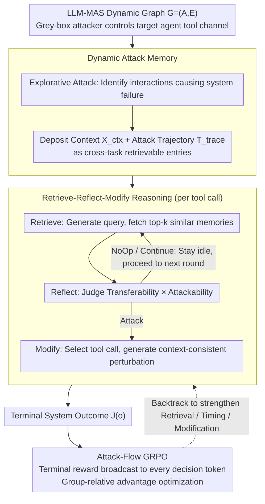

# Evo-Attacker: Memory-Augmented Reinforcement Learning for Long-Horizon Tool Attacks on LLM-MAS

**Conference**: ACL2026  
**arXiv**: [2605.25389](https://arxiv.org/abs/2605.25389)  
**Code**: No public code link found in cache  
**Area**: LLM Security / Multi-Agent Systems / Tool-Calling Robustness  
**Keywords**: LLM-MAS, tool attack, attack memory, GRPO, red-teaming

## TL;DR
This paper proposes Evo-Attacker, which models tool return tampering for LLM multi-agent systems (LLM-MAS) as a long-horizon reinforcement learning problem with dynamic attack memory. It optimizes retrieval, reflection, and modification decisions using Attack-Flow GRPO, significantly reducing system success rates across multiple architectures and task benchmarks.

## Background & Motivation
**Background**: LLM multi-agent systems accomplish complex tasks like code generation, deep research, and web operations through various agent roles and external tools. Tool returns are typically treated as factual evidence by agents, serving as critical inputs for planning, reasoning, and collaboration chains.

**Limitations of Prior Work**: Existing security research focuses on explicit malicious instructions in user inputs or inter-agent messages, while tool channels are more covert. In reality, network transmissions, third-party APIs, or search services can be contaminated. If tool returns are subtly tampered with, errors can propagate along multi-round collaboration, leading to global task failure without necessarily triggering input safety filters.

**Key Challenge**: Multi-agent tool attacks must be generalizable across tasks and tool schemas while choosing the critical timing within long interactions. Static templates or single-step injections are easily validated by subsequent agents; full online exploration faces sparse endgame rewards and long-horizon credit assignment.

**Goal**: Construct a unified red-teaming framework that can identify critical tool calls under a limited intervention budget, generate context-consistent perturbations using historical success experiences, and optimize the entire attack reasoning process through reinforcement learning.

**Key Insight**: The authors treat the attacker as a grey-box adversary: it can only monitor and modify the tool returns of a single target agent, without visibility into other agents' internal states or private messages. This limitation makes the problem more realistic regarding toolchain risks and forces the attack strategy to utilize local observations efficiently.

**Core Idea**: Successful attack trajectories are deposited into a dynamic memory. The attack strategy then performs Retrieve-Reflect-Modify at each tool call, with the intermediate reasoning steps reinforced by the terminal failure reward.

## Method

### Overall Architecture
Evo-Attacker is a framework for red-teaming evaluation. Its core stance is not to hand-craft fixed attack templates, but to treat "whether a tool return should be contaminated" as a long-horizon decision problem—determining when to stay idle, when to continue collecting context, when to modify a specific tool return, and how to modify it to remain consistent within the task context. It first formalizes the LLM-MAS as a dynamic graph $\mathcal{G}=(\mathcal{A},\mathcal{E})$ (nodes are agents, edges are communication channels). Each tool call is recorded as $(id,args,r)$, where $r$ is the return value. The attacker is a grey-box adversary controlling only the tool channel of a single target agent, intercepting its calls and original returns, and replacing partial returns with perturbed values within an intervention budget $B$ to maximize the final system failure probability $\mathbb{E}[J(o)]$ (where $J(o)=1$ denotes task failure). The pipeline has three phases: explorative construction of an Attack Memory, memory-augmented Retrieve-Reflect-Modify for each call, and end-to-end optimization of this reasoning chain using Attack-Flow GRPO.

### Key Designs

**1. Dynamic Attack Memory: Depositing successful attack experiences as cross-task retrievable assets**

Multi-agent tasks and tool schemas vary widely; static injection templates fail when the scenario changes. In the exploration phase, once Evo-Attacker identifies an interaction that causes system failure, it stores the context $\mathcal{X}_{ctx}=(\mathcal{G},\mathcal{T},a^*)$ along with the full attack trajectory $T_{trace}$ (original call, modification logic, perturbed return) as a memory entry. Thus, historical vulnerability patterns evolve from "one-time successes" into "retrievable knowledge," allowing the attacker to quickly locate risk surfaces in new scenarios by comparing them with similar historical patterns rather than starting from scratch.

**2. Retrieve-Reflect-Modify Reasoning: Deciding whether, when, and how to intervene based on context**

Applying historical templates directly may result in context mismatches, while opportunistic intervention might waste the limited budget on low-value steps. Each tool call is split into three steps: Retrieve generates a query to fetch the top-$k$ similar memories; Reflect judges whether these historical patterns are transferable and outputs a choice among Attack / Continue / NoOp; Modify then selects the tool call and generates specific modification instructions. The Reflect step acts as a "Transferability × Attackability" filter, ensuring the attacker spends its budget on critical junctures.

**3. Attack-Flow GRPO Long-Horizon Optimization: Distributing sparse terminal signals to step-by-step decisions**

The success of a tool attack is often only known at the end of a task. Rewarding only the final modification fails to train the timing judgment of "when to retrieve" and "when to wait." Evo-Attacker treats an attack episode as a trajectory of interleaved attacker actions and environment responses, defining the reward as $R(\zeta)=\mathbb{I}(J(o_{sys})=1)+\lambda R_{struct}(\zeta)$. This terminal reward is then broadcast to all Retrieve / Reflect / Modify tokens generated by the attacker. GRPO calculates the group-relative advantage using $G$ rollouts under the same task context. Consequently, early retrieval and timing choices, even if they do not directly cause failure, are strengthened through backtracking due to the final success, addressing the long-horizon credit assignment challenge via this broadcast path.

### Example Walkthrough: A Round of Chained WebShop Attack
Consider a WebShop shopping task under a Chain architecture (budget $B=3$, retrieval $k=5$): the target agent calls tools like "Search items," "Read details," "Compare prices," and "Place order." At the first "Search items" return, the attacker retrieves historical entries. Reflect judges that information is insufficient and modification might be caught by the comparison step, outputting NoOp to stay idle. At "Read details," Reflect finds context has accumulated but it is not yet the critical node, outputting Continue. Finally, at "Compare prices"—where the return directly feeds into the ordering decision and highly matches a vulnerability pattern in a memory—Reflect outputs Attack. Modify then changes key fields in the price return to context-consistent but misleading values, causing the agent to select the wrong product and fail the task. The entire episode consumes only one intervention from the budget, but the terminal failure signal reinforces the earlier timing decisions to "hold back."

> ⚠️ The above is a conceptual walkthrough based on the paper's mechanisms; refer to the original text for specific task details.

### Loss & Training
The optimization objective only applies to tokens generated by the attacker; tool returns and victim agent messages are masked. The paper uses Qwen3-14B as the victim agent backbone and Qwen3-8B as the Evo-Attacker backbone. The intervention budget is set to $B=3$, retrieval $k=5$, and GRPO uses $G=8$ parallel rollouts with $\lambda=0.5$ and a learning rate of $1e-6$. Initial attack memory is bootstrapped from 500 samples of the WebShop training set and 50 samples from HumanEval.

## Key Experimental Results

### Main Results

| Architecture / Task Group | Baseline (No Attack) | After Evo-Attacker | Gain (Drop) | Conclusion |
|---------------------------|----------------------|-------------------|------------|------------|
| Flat / MAB.code           | 66.2                 | 39.2              | 27.0       | Code tasks significantly impacted by cross-schema attacks |
| Flat / HumanEval          | 67.5                 | 38.6              | 28.9       | Strong effect even on strict syntax tasks |
| Flat / MAB.research       | 80.0                 | 54.6              | 25.4       | Errors propagate in deep research chains |
| Chain / WebShop           | 62.8                 | 33.2              | 29.6       | Largest drop in shopping/web tasks under chain architecture |
| Hierarchical / WebArena   | 35.8                 | 18.4              | 17.4       | Hierarchical systems filter some but not all attacks |

### Ablation Study

| Configuration   | Key Metric (Success Rate) | Description |
|-----------------|---------------------------|-------------|
| w/o Attack      | Code 67.4, Res. 58.7, Web 48.3 | No attack baseline |
| w/o Retrieval   | 52.5 / 50.3 / 34.4        | Cross-tool/task generalization drops without attack memory |
| w/o Reflection  | 49.9 / 47.2 / 32.9        | Budget wasted on low-value steps without applicability judgment |
| w/o RL          | 55.2 / 51.0 / 36.9        | Weakest long-horizon planning capacity without Attack-Flow GRPO |
| Full            | 40.9 / 40.1 / 26.0        | Maximum drop with all modules: 26.5 / 18.6 / 22.3 |

### Key Findings
- Evo-Attacker outperforms baselines like Forced Output, InjecAgent, Web Fraud, and Prompt Infection across Flat, Chain, and Hierarchical architectures, showing its advantage goes beyond task-specific templates.
- Retrieval, Reflection, and RL modules are all essential. Specifically, attack effectiveness drops significantly without RL, supporting the argument for long-horizon credit assignment.
- Increasing the attack budget (1 to 5), reflection depth (1 to 5), and retrieval memory (0 to 20) generally increases performance degradation, demonstrating that more test-time computation yields stronger red-teaming results.
- In cross-model experiments, GPT/Gemini are effective as attackers zero-shot; small open-source models like Ministral/Llama optimized via Attack-Flow GRPO can match or exceed closed-source attackers.

## Highlights & Insights
- The paper upgrades tool security from "injecting one malicious sentence" to "local fact contamination in long-horizon task trajectories." This is more aligned with real-world risks in multi-agent tool usage.
- The concept of Attack Memory is valuable for the defense side. As attackers reuse historical vulnerability patterns, defenders should build risk memories of tool returns to detect similar anomalies and high-risk invocation points.
- The Reflection module highlights the importance of budget constraints. Real-world attacks and defenses do not process every step but must identify critical nodes; this perspective is closer to system security than single-step prompt injection.
- The token masking design of Attack-Flow GRPO is clear: it only optimizes the attacker's own decisions and does not treat environmental responses as learnable actions. This approach is useful for other agentic RL optimizations.

## Limitations & Future Work
- The method incurs higher training and inference costs, particularly with deliberative reasoning and GRPO rollouts increasing token and compute consumption.
- Stealthiness is primarily evaluated using LLM-based detectors, lacking coverage of deterministic defenses like cryptographic signatures, tool return validation, or whitelist parameter filtering.
- Experiments were conducted in controlled simulation environments, failing to cover real commercial services, actual network attack chains, or complex supply chain security constraints.
- Future defensive research could explore tool return signatures, cross-agent consistency checking, memory-aware anomaly detection, least-trust tool interfaces, and rollback mechanisms for task-critical nodes.

## Related Work & Insights
- **vs. Single-Agent Tool Attack**: Methods like Forced Output and InjecAgent often take a single-step or single-agent perspective; this work focuses on propagation and validation bypass in multi-agent chains.
- **vs. Web Fraud / Prompt Infection**: These methods rely more on web pages or fixed templates, while Evo-Attacker achieves generalization across code, research, and web tasks through memory retrieval and reflection.
- **vs. Optimization-based Prompt Attack**: GCG and AutoDAN are mostly used for static single-round triggers; this work applies optimization to the interaction process and tool return channels.
- **Insight**: When evaluating LLM-MAS security, one must look beyond user input filtering; tool outputs, third-party APIs, search results, and intermediate files should all be included in the threat model.

## Rating
- Novelty: ⭐⭐⭐⭐ Using memory-augmented reasoning and GRPO for multi-agent tool channel red-teaming is a fresh problem setting.
- Experimental Thoroughness: ⭐⭐⭐⭐ Covers various architectures, tasks, baselines, and ablations, though real-world defense coverage remains limited.
- Writing Quality: ⭐⭐⭐⭐ Methods are structured clearly with a well-defined threat model; some result tables are very dense.
- Value: ⭐⭐⭐⭐ Highly significant for LLM agent security and tool-calling defense research, especially for building defense evaluation sets.

<!-- RELATED:START -->

## Related Papers

- [\[ICML 2026\] ToolMATH: A Math Tool Benchmark for Realistic Long-Horizon Multi-Tool Reasoning](../../ICML2026/llm_reasoning/toolmath_a_math_tool_benchmark_for_realistic_long-horizon_multi-tool_reasoning.md)
- [\[CVPR 2026\] Scaling Agentic Reinforcement Learning for Tool-Integrated Reasoning in VLMs](../../CVPR2026/llm_reasoning/scaling_agentic_reinforcement_learning_for_tool-integrated_reasoning_in_vlms.md)
- [\[ACL 2026\] TemplateRL: Structured Template-Guided Reinforcement Learning for LLM Reasoning](templaterl_structured_template-guided_reinforcement_learning_for_llm_reasoning.md)
- [\[ACL 2026\] SPPO: Sequence-Level PPO for Long-Horizon Reasoning Tasks](sppo_sequence-level_ppo_for_long-horizon_reasoning_tasks.md)
- [\[AAAI 2026\] Beyond ReAct: A Planner-Centric Framework for Complex Tool-Augmented LLM Reasoning](../../AAAI2026/llm_reasoning/beyond_react_a_planner-centric_framework_for_complex_tool-au.md)

<!-- RELATED:END -->
