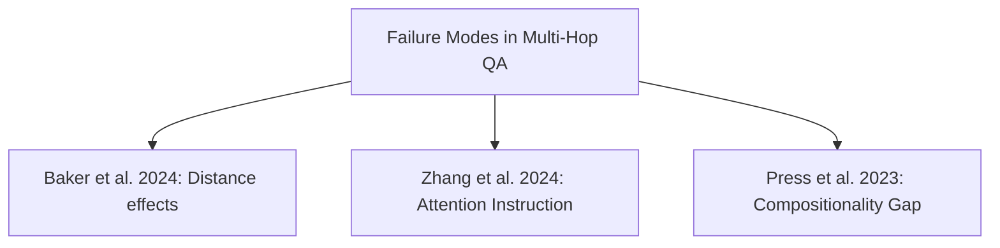

To support your work in Visual Studio Code, here is the translated paper note for the academic study on Multi-Hop QA failure modes.

# Failure Modes in Multi-Hop QA: The Weakest Link Effect and the Recognition Bottleneck

**Conference**: ACL 2026  
**arXiv**: [2601.12499](https://arxiv.org/abs/2601.12499)  
**Code**: [GitHub](https://github.com/cambridgeltl/weakest-link-effect)  
**Area**: LLM Reasoning / Long Context  
**Keywords**: Multi-hop QA, Positional Bias, Weakest Link Effect, Attention Guidance, System-2 Reasoning

## TL;DR

This paper proposes Multi-Focus Attention Instruction (MFAI) as a semantic probe to reveal the "Weakest Link Effect" in multi-hop QA—where multi-hop reasoning performance is determined by the absolute position of the least visible evidence rather than the distance between facts. Failures primarily stem from a recognition bottleneck rather than reasoning deficits, and System-2 reasoning models can effectively resist positional bias and misleading attention cues.

## Background & Motivation

**Background**: LLM context windows have expanded from 4K to millions of tokens, but effective utilization remains limited by positional biases (Lost-in-the-Middle, primacy/recency effects, etc.). Multi-hop QA requires models to synthesize dispersed evidence, making the impact of positional bias more severe.

**Limitations of Prior Work**: (1) Previous studies suggested performance decays linearly with increasing distance between facts, but this paper finds that inaccurate; (2) Prior work could not distinguish whether failure occurred because the model "could not find evidence" (recognition failure) or "could not integrate evidence" (synthesis failure); (3) Existing mitigation methods either require fine-tuning (data augmentation) or modified inference computation (architectural changes), both of which are costly.

**Key Challenge**: Without knowing if the root cause of failure is recognition or synthesis, effective mitigation strategies cannot be designed—as the two require fundamentally different solutions.

**Goal**: Precisely decouple recognition failure from synthesis failure through controlled experiments to reveal the true mechanism of positional bias in multi-hop reasoning.

**Key Insight**: Use natural language attention instructions (rather than architecture modifications or fine-tuning) as probes to artificially restore evidence visibility and isolate the two failure modes.

**Core Idea**: Multi-hop reasoning follows the "Weakest Link Effect"—performance is determined by the absolute position of the least visible evidence bucket; after matching MFAI to restore recognition capability, performance increases significantly, proving the bottleneck lies in recognition rather than reasoning.

## Method

### Overall Architecture

The authors designed factorial experiments: 18 documents divided into 3 positional buckets (Beginning/Middle/Tail, 6 docs each), with 2 gold documents. Five LLMs were evaluated under three MFAI conditions (No Instruction/Match/Mismatch) via two topological protocols: Spread Test (intra-bucket distance variation) and Cross Test (inter-bucket distribution).

### Key Designs

1. **Multi-Focus Attention Instruction (MFAI)**:
    - **Function**: Acts as a semantic probe to explicitly guide model attention to specified documents via natural language.
    - **Mechanism**: Pivot template: "The answer is in Document X and Document Y. Use the information from Document X and Document Y as the main reference." Three conditions: (a) No MFAI (baseline); (b) Matched MFAI—points to actual gold documents, simulating successful recognition; (c) Mismatched MFAI—deliberately points to corresponding positions in non-gold buckets to test robustness against misleading signals.
    - **Design Motivation**: MFAI is a diagnostic probe rather than a deployment technique—it relies on oracle knowledge to create controlled conditions. The performance gain from Matched MFAI provides an upper-bound estimate of the recognition bottleneck.

2. **Spread vs Cross Topological Protocols**:
    - **Function**: Decouples distance effects from absolute position effects.
    - **Mechanism**: Spread Test fixes two gold documents within the same bucket, varying the distance between them (1-5 doc intervals). Cross Test distributes gold documents across different buckets while maintaining the same local index. If performance is determined by distance, Spread should show a gradient; if determined by absolute position, Cross should show inter-bucket steps.
    - **Design Motivation**: Prior research attributed decay to linear distance, but topological decomposition reveals it is actually a discrete step function.

3. **System-2 Reasoning Comparison**:
    - **Function**: Evaluates the robustness of extended inference-time computation to positional bias.
    - **Mechanism**: Compares Qwen3-8B in thinking mode (triggered via `<think>`) vs. non-thinking mode. Thinking mode generates approximately 6× more output tokens but effectively resists positional bias and misleading MFAI.
    - **Design Motivation**: If System-2 reasoning can overcome recognition bottlenecks, it provides a path to solutions without architectural modifications.

### Loss & Training

A training-free method was used. Experiments evaluated Qwen2.5-7B/14B-Instruct, Llama-3.1-8B-Instruct, Ministral-8B-Instruct, and Qwen3-8B. MuSiQue was evaluated via EM (Exact Match), and NeoQA via Accuracy. Supplemental experiments extended to 2WikiMultiHopQA, 3-4 hops, and 32B models.

## Key Experimental Results

### Main Results

| Finding | MuSiQue Data | NeoQA Data |
| :--- | :--- | :--- |
| Inter- vs Intra-bucket Diff | Inter-bucket gap of 8.31% (max 14.75%), Intra-bucket only 1.87% | Smaller positional bias |
| Matched MFAI Gain | Low-visibility positions improved by 4.83%-11.49% | Primarily improved Beginning bucket |
| Weakest Link Effect | Beginning 29.71%, Middle 18.67%, B+M split only 21.54% (lower than naive average 24.19%) | Effect is weaker |
| System-2 Robustness | Thinking mode matches or exceeds gold-only baseline | 6× tokens but high precision, low variance |

### Ablation Study

| Analysis Dimension | Result |
| :--- | :--- |
| Distance Variation (Intra-bucket) | Performance variance ±3%, essentially no impact |
| Position Variation (Cross-bucket) | Step function observed, with a max 14.75% drop |
| Attention Heatmaps | Matched MFAI uniformly increases attention quality to gold docs in deeper layers |
| Mismatched MFAI (MuSiQue vs NeoQA) | MuSiQue performance decreased (fragile vertical reasoning chains), NeoQA unaffected (robust horizontal evidence structure) |

### Key Findings

- Performance follows a step function rather than linear decay—attention operates at bucket granularity rather than fine-grained distance.
- Elimination of positional bias by Matched MFAI proves failure is primarily a recognition bottleneck rather than a reasoning deficit.
- Task topology modulates the impact of misleading cues: Vertical reasoning chains (entity-centric) are fragile, while horizontal evidence structures (event-centric) are robust.
- Thinking models match gold-only baselines even in noisy long contexts—distractors might actually trigger more rigorous verification.

## Highlights & Insights

- The "Weakest Link Effect" concept is intuitive and practical—RAG system re-ranking should prioritize placing critical evidence in high-visibility positions.
- The experimental design isolating recognition vs. synthesis failure via diagnostic probes is highly effective, providing a new tool for understanding LLM reasoning mechanisms.
- The distinction between vertical vs. horizontal task topology explains why positional bias manifests inconsistently across different benchmarks.
- System-2 reasoning robustness findings provide strong evidence for "trading computation for accuracy," though the 6× token overhead still requires optimization.

## Limitations & Future Work

- Used a fixed 18-document and 3-bucket setup; did not explore other context scales or bucket counts.
- Did not perform mechanistic analysis based on log-probabilities.
- MuSiQue uses open generation while NeoQA uses multiple choice—format differences might confound task topology attribution.
- Landmark frontier models (70B+) were not tested.

## Related Work & Insights

- **vs Baker et al. (2024)**: The latter argued performance decays linearly with distance between facts; this paper proves it is a bucket-level step function.
- **vs Zhang et al. (2024a)**: The latter proposed single-document attention instructions; this paper extends this to multi-focus versions for multi-hop scenarios.
- **vs Press et al. (2023)**: The latter proposed the "compositionality gap"; this paper proves this is often an attention allocation failure rather than a reasoning deficit.

## Rating

- **Novelty**: ⭐⭐⭐⭐⭐ The "Weakest Link Effect" and recognition bottleneck hypothesis are novel; the MFAI diagnostic probe methodology is pioneering.
- **Experimental Thoroughness**: ⭐⭐⭐⭐⭐ 5 models, 2 datasets, detailed topological protocols, statistical testing, and supplemental experiments covering more datasets and scales.
- **Writing Quality**: ⭐⭐⭐⭐⭐ Research questions are clear, experimental design is rigorous, and visualization is excellent.
- **Value**: ⭐⭐⭐⭐⭐ Direct guiding significance for RAG architecture design and positional bias mitigation.

## Related Papers

## Related Papers

- [\[ACL 2025\] Beyond the Answer: Advancing Multi-Hop QA with Fine-Grained Graph Reasoning and Evaluation](../../ACL2025/llm_reasoning/beyond_the_answer_advancing_multi-hop_qa_with_fine-grained_graph_reasoning_and_e.md)
- [\[ACL 2026\] Dissecting Failure Dynamics in Large Language Model Reasoning](dissecting_failure_dynamics_in_large_language_model_reasoning.md)
- [\[ACL 2026\] Decoupling the Effect of Chain-of-Thought Reasoning: A Human Label Variation Perspective](decoupling_the_effect_of_chain-of-thought_reasoning_a_human_label_variation_pers.md)
- [\[ACL 2026\] MTR-Bench: A Comprehensive Benchmark for Multi-Turn Reasoning Evaluation](mtr-bench_a_comprehensive_benchmark_for_multi-turn_reasoning_evaluation.md)
- [\[ICLR 2026\] Fine-R1: Make Multi-modal LLMs Excel in Fine-Grained Visual Recognition by Chain-of-Thought Reasoning](../../ICLR2026/llm_reasoning/fine-r1_make_multi-modal_llms_excel_in_fine-grained_visual_recognition_by_chain-.md)

<!-- RELATED:END -->

<!-- RELATED:START -->

## Related Papers

- [\[ACL 2026\] Dissecting Failure Dynamics in Large Language Model Reasoning](dissecting_failure_dynamics_in_large_language_model_reasoning.md)
- [\[AAAI 2026\] ActiShade: Activating Overshadowed Knowledge to Guide Multi-Hop Reasoning in Large Language Models](../../AAAI2026/llm_reasoning/actishade_activating_overshadowed_knowledge_to_guide_multi-h.md)
- [\[ACL 2026\] Decoupling the Effect of Chain-of-Thought Reasoning: A Human Label Variation Perspective](decoupling_the_effect_of_chain-of-thought_reasoning_a_human_label_variation_pers.md)
- [\[ICLR 2026\] Fine-R1: Make Multi-modal LLMs Excel in Fine-Grained Visual Recognition by Chain-of-Thought Reasoning](../../ICLR2026/llm_reasoning/fine-r1_make_multi-modal_llms_excel_in_fine-grained_visual_recognition_by_chain-.md)
- [\[AAAI 2026\] A Reasoning Paradigm for Named Entity Recognition](../../AAAI2026/llm_reasoning/a_reasoning_paradigm_for_named_entity_recognition.md)

<!-- RELATED:END -->
