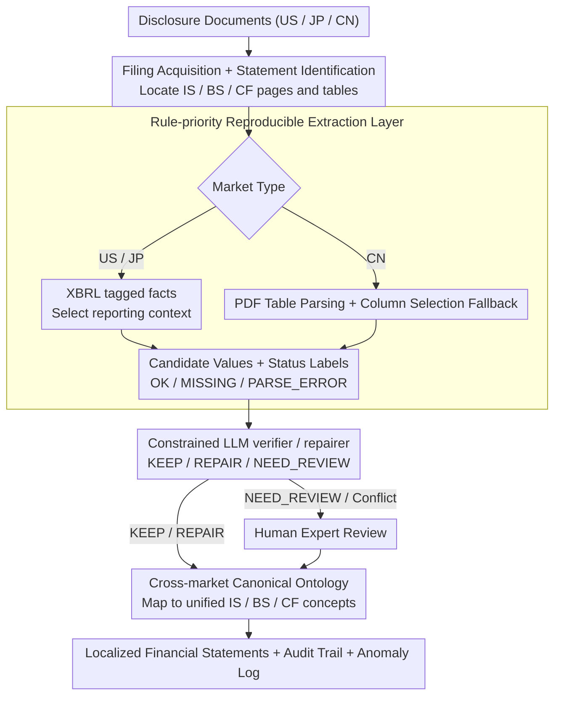

# FinReporting: An Agentic Workflow for Localized Reporting of Cross-Jurisdiction Financial Disclosures

**Conference**: ACL2026  
**arXiv**: [2604.05966](https://arxiv.org/abs/2604.05966)  
**Code**: Demo: https://huggingface.co/spaces/BoomQ/FinReporting-Demo  
**Area**: Financial NLP / LLM Agent  
**Keywords**: Financial Disclosure, Cross-Jurisdiction, agentic workflow, canonical ontology, LLM guardrail  

## TL;DR
FinReporting decomposes the localization of financial reports across the US, Japan, and China into an auditable agent workflow consisting of "rule-based extraction + ontological mapping + constrained LLM verification/repair + manual review." It utilizes a unified IS/BS/CF schema to alleviate inconsistencies in financial disclosure formats and accounting semantics across different jurisdictions.

## Background & Motivation
**Background**: Financial NLP has evolved from sentiment analysis and risk prediction to financial report QA, structured extraction, XBRL querying, and financial agents. LLMs assist users in extracting metrics from lengthy financial reports, summarizing disclosures, and answering financial questions, thereby reducing the cost of reading full annual reports.

**Limitations of Prior Work**: Many systems assume a single-market scenario where users are familiar with local accounting standards, disclosure formats, and taxonomies, requiring only information retrieval within known taxonomies. However, global investors frequently need to understand reports from companies in other markets. While the US and Japan rely heavily on XBRL with high machine-readability, Chinese annual reports are primarily PDF tables characterized by layout variations, fragmented tables, OCR noise, and custom line items. Identical labels may have different meanings, and the same concepts may be represented by different labels.

**Key Challenge**: Cross-jurisdiction "report localization" is not merely translating field names or extracting PDF tables. The true difficulty lies in semantic alignment and aggregation conventions: which canonical concept in the home market should a specific line item map to? If extraction is missing or suspected to be erroneous, the system must explicitly flag, repair, or escalate it to experts rather than allowing an LLM to freely generate a plausible-looking figure.

**Goal**: The authors propose FinReporting to map core financial items from annual reports in the US, Japan, and China to a unified Income Statement (IS), Balance Sheet (BS), and Cash Flow (CF) schema. Each step maintains an audit trail, quality signals, and anomaly logs to support cross-market comparisons and downstream financial QA.

**Key Insight**: The paper positions the LLM as a constrained verifier rather than a primary extractor or generator. A rule-based layer first generates reproducible candidate values. The LLM then performs KEEP, REPAIR, or NEED_REVIEW operations only within a space defined by explicit evidence and decision boundaries. Human experts ultimately handle high-impact or evidence-deficient cases.

**Core Idea**: Use a canonical financial ontology to unify cross-market semantics and integrate the LLM into a verification/repair layer with guardrails to ensure cross-jurisdiction report localization is both automated and auditable.

## Method
FinReporting is a systems-oriented paper with a pipeline consisting of three layers: a deterministic rule processing layer for producing reproducible candidate values, an LLM guardrail layer for verification and repair based on evidence, and a conditional expert review layer for high-impact or insufficient-evidence cases.

### Overall Architecture
The input consists of annual report disclosure documents from a specific market and company. The system first performs Filing Acquisition and Statement Identification: for the US and Japan markets, it directly reads XBRL tagged facts; for the Chinese market, it locates public annual report PDFs and detects pages and tables related to IS/BS/CF. During Extraction, the two market types are processed separately—XBRL-native markets focus on selecting the correct reporting context (consolidated vs. separate, period length, instant/duration), while PDF-centric markets undergo document decomposition, table parsing, column selection fallback, and field-by-field status labeling.

After extracting local items, a constrained LLM verifier validates or repairs candidate values when evidence is present. Validated items are then mapped to a unified canonical schema via a global ontology, covering core IS/BS/CF concepts while preserving metadata such as local labels, units, currency, and accounting standards. The final output includes localized financial statements, anomaly logs, audit trails, and structured workbooks, accessible via a demo featuring market selection, company selection, three-statement tabs, template QA, and download functions. The design goal is to leave a trace for every step, enabling both automation and auditability.

### Key Designs
**1. Rule-priority Reproducible Extraction Layer: Generating candidate values via deterministic rules to exclude LLM hallucinations from the numerical layer.**

Errors in financial values are extremely costly, making direct free-text generation inadmissible for numerical data. This layer employs XBRL tagged facts and reporting context selection for US/JP, and PDF table parsing with fallbacks for CN. Every field is tagged with status labels such as OK, MISSING, PARSE_ERROR, or NOT_APPLICABLE. While the rule layer has restricted coverage, its errors are localizable and reproducible, and it explicitly surfaces missing data and uncertainty via status labels instead of silently filling them with plausible figures.

**2. Constrained LLM Verifier / Repairer: Restricting the LLM decision space to a three-way choice to ensure evidence-based verification rather than hallucinated generation.**

A dangerous failure mode for unconstrained LLMs is the "plausible but incorrect" unlabeled error. FinReporting places the LLM after the rule layer and restricts its actions to KEEP, REPAIR, or NEED_REVIEW. A REPAIR is only permitted when a field is truly fixable, evidence originates clearly from the filing context, and the candidate value is consistent with the evidence; otherwise, it defaults to NEED_REVIEW. All decisions are logged with evidence and failure reasons. Thus, the LLM functions for reasoning and evidence cross-checking rather than generating financial figures, positioning it more reliably in high-risk financial scenarios.

**3. Cross-market Canonical Ontology: Aligning "same name different meaning, different name same meaning" cross-market items with a unified conceptual inventory.**

The most difficult aspect of cross-jurisdiction reporting is semantic alignment rather than simple translation. Labels for the same accounting concept vary across the US, Japan, and China, and identical labels can carry different meanings. Without an ontological layer, validated candidate values remain local figures within disparate frameworks, preventing cross-market comparison and QA. FinReporting defines canonical concepts for IS/BS/CF, mapping local labels to this unified inventory; for experiments, a shared subset of 18 target fields (5 IS, 7 BS, 6 CF) was used. This mapping enables cross-market benchmarking and financial QA under a unified schema.

## Method
**(The original Chinese note repeated the "Method" header; translating "一个完整示例" as a mechanism overview)**
### Mechanism
Suppose a Chinese company's annual report is being localized, and the target field is "Operating Revenue" in the Income Statement. The rule layer first locates the Income Statement in the PDF, parses "Operating Revenue = 1,203,456 (10k CNY)" as the candidate value, and labels it `OK`. If a table break causes only a partial capture, it labels it `PARSE_ERROR` instead of guessing. The candidate then enters the LLM verifier: the model compares it with the filing context, confirms consistency, and outputs `KEEP`, mapping it to the canonical "Revenue" concept. If "Financial Expenses" is extracted as negative but evidence suggests positive, the verifier identifies the conflict and, if clear evidence exists in the filing, outputs `REPAIR` with logged evidence. If a company-specific item cannot be mapped or evidence is insufficient, the verifier outputs `NEED_REVIEW`, pushing it to a human expert alongside anomaly logs. Each field follows this "rule candidate → LLM choice → (optional) human fallback" path, maintaining an audit trail throughout.

### Loss & Training
The paper does not train a new model but proposes a system workflow and evaluation scheme. The LLM guardrail layer experiments utilize GPT-4o, with horizontal comparisons across backbones like GPT-5.2, GPT-5 mini, GPT-4o, Gemini-2.5-Flash, Gemini-2.5-Flash-Lite, and DeepSeek-Chat. Three system-level metrics are used: Filled Rate (FR) is the proportion of non-empty outputs; Conflict Rate (CR) is the proportion of human reviews triggered by rule-LLM conflicts or insufficient evidence; Accuracy (ACC) is the accuracy relative to human gold labels.

> ⚠️ Note: Some backbone names (e.g., GPT-5.2) follow the original text.

## Key Experimental Results

### Main Results
| Jurisdiction | Metric | LLMReporting | FinReporting | Observation |
|--------------|--------|--------------|--------------|-------------|
| US           | FR     | 94.44        | 95.56        | XBRL standardization leads to highest coverage |
| US           | CR     | 5.56         | 15.56        | FinReporting more proactively surfaces conflict/review signals |
| US           | ACC    | 89.38        | 90.23        | Slight improvement |
| JP           | FR     | 84.44        | 84.44        | Japanese XBRL exhibits higher variation in labels/reports |
| JP           | CR     | 15.56        | 15.56        | Identical conflict rates |
| JP           | ACC    | 88.36        | 88.36        | No improvement observed |
| CN           | FR     | 63.33        | 63.33        | PDF-centric environment coverage remains low |
| CN           | CR     | 26.67        | 40.56        | Higher incident of NEED_REVIEW / conflicts |
| CN           | ACC    | 78.15        | 82.11        | Largest gain in the most challenging market |

### LLM Backbone Comparison (US filings)
| Backbone              | FR    | CR     | ACC   | Cost ($) |
|-----------------------|-------|--------|-------|----------|
| GPT-5.2               | 95.56 | 8.89   | 90.23 | 36.96    |
| GPT-5 mini            | 95.56 | 15.00  | 90.23 | 17.77    |
| GPT-4o                | 95.56 | 15.56  | 90.00 | 34.04    |
| Gemini-2.5-Flash      | 95.56 | 12.78  | 90.23 | 7.27     |
| Gemini-2.5-Flash-Lite | 95.56 | 8.89   | 90.00 | 1.47     |
| DeepSeek-Chat         | 95.56 | 100.00 | 90.23 | 2.41     |

### Key Findings
- Coverage is primarily determined by the pipeline and data source structure rather than the LLM backbone: FR for all US backbones is 95.56.
- The CN scenario accuracy increased from 78.15 to 82.11, demonstrating the value of verification/repair, although FR remains low at 63.33.
- Stronger/more expensive models do not necessarily yield higher ACC. Gemini-2.5-Flash-Lite achieved an ACC of 90.00 at a cost of $1.47, nearly matching GPT-5.2 at 90.23.
- DeepSeek-Chat's CR of 100.00 suggests certain backbones might over-trigger conflicts or fail to stably complete constrained verification under this guardrail setup.

## Highlights & Insights
- **LLM in the Correct Position**: Instead of having the LLM generate figures directly from disclosure text, the system delegates candidate generation to rules and uses the LLM for evidence checking and constrained repair. This is a more trustworthy architecture for high-risk financial scenarios.
- **CR is not a purely negative indicator**: Higher CR in US/CN for FinReporting might seem problematic, but it likely indicates the system's willingness to expose uncertainty to human review rather than providing silent outputs.
- **PDF-centric markets are the true stress test**: While US/JP XBRL provides machine-readable structures, CN layout, table fragmentation, and OCR noise resemble real-world Document AI challenges, making gains in CN more significant.
- **Cost analysis has deployment value**: If coverage is driven by the rule pipeline and the LLM only acts as a verifier, cheaper models might suffice, which is critical for enterprise-level financial report processing.

## Limitations & Future Work
- Currently covers only three jurisdictions (US, Japan, China) and evaluates annual filings, non-financial enterprises, consolidated statements, and 18 core IS/BS/CF fields.
- CN PDF scenarios remain under-covered (FR 63.33). Layout variations, table fragmentation, OCR noise, and idiosyncratic disclosure habits still lead to MISSING, PARSE_ERROR, or NEED_REVIEW statuses.
- The canonical ontology is manually predefined and may not cover long-tail taxonomies, company-specific metrics, or market-specific accounting semantics, leading to interpretation biases.
- The system is an auditable assistant, not a fully autonomous financial reporting tool. High-risk investment, auditing, and regulatory decisions must still be cross-checked against original filings.
- Future work could expand to footnotes, segment disclosures, more periods, and long-tail fields across more markets, incorporating stricter provenance tracking and numerical consistency checks.

## Related Work & Insights
- **vs. XBRL Agent / XBRL-centered systems**: These are suitable for machine-readable disclosures but often assume a fixed taxonomy; FinReporting explicitly addresses cross-jurisdiction heterogeneity and PDF-based markets.
- **vs. FinQA / TAT-QA / ConvFinQA**: These benchmarks focus on financial QA and numerical reasoning; FinReporting focuses on upstream structuring and localization, converting heterogeneous disclosures into a unified schema.
- **vs. Free-form LLM financial annotator**: Free generation is flexible but risky; the KEEP/REPAIR/NEED_REVIEW design is transferable to other high-risk extraction tasks like medical insurance, legal compliance, and auditing.
- **Insight**: The key to high-risk agent systems is not "automating every step," but making the evidence, status, repair, and failure reasons for every step traceable.

## Rating
- Novelty: ⭐⭐⭐⭐☆ Solid system design integrating canonical ontology and guardrailed LLM verification, though individual components are not entirely new.
- Experimental Thoroughness: ⭐⭐⭐☆☆ Covers 90 companies across three markets, but the field count is limited, no improvement was shown for JP, and more long-tail scenarios are missing.
- Writing Quality: ⭐⭐⭐☆☆ Clear logic, though the source PDF cache had significant color artifacts and some experimental details were compressed.
- Value: ⭐⭐⭐⭐☆ Highly relevant for financial NLP agents and high-risk document structuring, particularly the "LLM as an evidence-based verifier" paradigm.

<!-- RELATED:START -->

## Related Papers

- [\[ACL 2026\] Towards Effective In-context Cross-domain Knowledge Transfer via Domain-invariant-neurons-based Retrieval](towards_effective_in-context_cross-domain_knowledge_transfer_via_domain-invarian.md)
- [\[AAAI 2026\] L2V-CoT: Cross-Modal Transfer of Chain-of-Thought Reasoning via Latent Intervention](../../AAAI2026/llm_reasoning/l2v-cot_cross-modal_transfer_of_chain-of-thought_reasoning_v.md)
- [\[CVPR 2026\] Scaling Agentic Reinforcement Learning for Tool-Integrated Reasoning in VLMs](../../CVPR2026/llm_reasoning/scaling_agentic_reinforcement_learning_for_tool-integrated_reasoning_in_vlms.md)
- [\[ACL 2026\] HISR: Hindsight Information Modulated Segmental Process Rewards for Multi-turn Agentic Reinforcement Learning](hisr_hindsight_information_modulated_segmental_process_rewards_for_multi-turn_ag.md)
- [\[ICML 2026\] Deliberate Evolution: Agentic Reasoning for Sample-Efficient Symbolic Regression with LLMs](../../ICML2026/llm_reasoning/deliberate_evolution_agentic_reasoning_for_sample-efficient_symbolic_regression_.md)

<!-- RELATED:END -->
