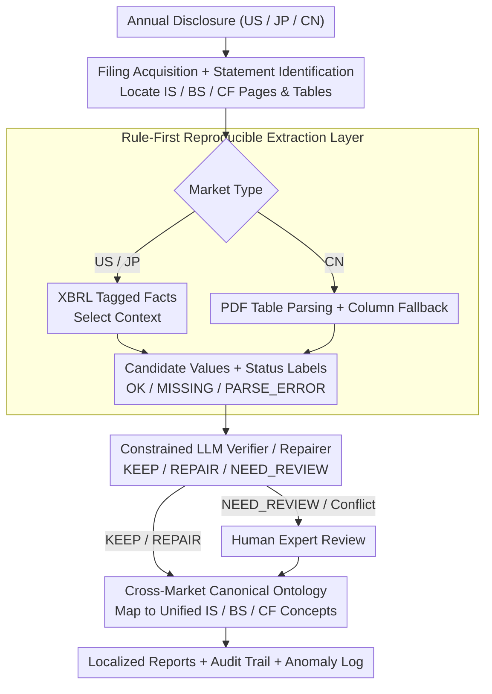

# FinReporting: An Agentic Workflow for Localized Reporting of Cross-Jurisdiction Financial Disclosures

**Conference**: ACL2026  
**arXiv**: [2604.05966](https://arxiv.org/abs/2604.05966)  
**Code**: Demo: https://huggingface.co/spaces/BoomQ/FinReporting-Demo  
**Area**: Financial NLP / LLM Agent  
**Keywords**: Financial Disclosures, Cross-Jurisdiction, agentic workflow, canonical ontology, LLM guardrail  

## TL;DR
FinReporting decomposes the localization of US, Japanese, and Chinese financial reports into an auditable agent workflow comprising "rule-based extraction + ontological mapping + constrained LLM verification/repair + human review." It utilizes a unified IS/BS/CF schema to mitigate inconsistencies in financial disclosure formats and accounting semantics across different jurisdictions.

## Background & Motivation
**Background**: Financial NLP has evolved from sentiment analysis and risk prediction to financial report QA, structured extraction, XBRL querying, and financial agents. LLMs assist users in extracting metrics from lengthy reports, summarizing disclosures, and answering financial questions, thereby reducing the cost of reading full annual reports.

**Limitations of Prior Work**: Many systems assume a single-market scenario where users understand local accounting standards, disclosure formats, and taxonomies, requiring only information retrieval within familiar taxonomies. However, global investors frequently need to comprehend financial statements from foreign markets. While the US and Japan rely heavily on XBRL for high machine-readability, Chinese annual reports are primarily PDF tables, plagued by layout variations, broken tables, OCR noise, and company-specific line items. Identical labels may have different meanings, while the same concept may be represented by different labels.

**Key Challenge**: "Localizing financial reports" across jurisdictions is not a simple translation of field names or the mere extraction of PDF tables. The true difficulty lies in semantic alignment and aggregation conventions: which home-market canonical concept should a specific line item map to? If extraction is missing or suspected to be erroneous, the system must explicitly flag, repair, or escalate the case to an expert rather than allowing the LLM to hallucinate a plausible figure.

**Goal**: The authors propose FinReporting to map core financial items from US, Japanese, and Chinese annual reports into a unified Income Statement (IS), Balance Sheet (BS), and Cash Flow (CF) schema. Each step maintains an audit trail, quality signals, and anomaly logs to support cross-market comparisons and downstream financial QA.

**Key Insight**: The paper positions the LLM as a constrained verifier rather than an extractor or generator. A rule-based layer first generates reproducible candidate values. The LLM then performs KEEP, REPAIR, or NEED_REVIEW operations only within clear evidence and decision spaces. Finally, human experts handle high-impact or evidence-deficient cases.

**Core Idea**: Unify cross-market semantics using a canonical financial ontology, then integrate the LLM into a verification/repair layer with guardrails. This makes cross-jurisdictional financial report localization both automated and auditable.

## Method
FinReporting is a systems paper where the pipeline is concatenated through three layers: a deterministic rule-processing layer responsible for producing reproducible candidate values, an LLM guardrail layer for verification and repair based on evidence, and a conditional expert review layer as a fallback for high-impact or low-evidence cases.

### Overall Architecture
The input consists of annual report disclosures for a specific company in a given market. The system first performs Filing Acquisition and Statement Identification: it directly reads XBRL tagged facts for US and Japanese markets; for the Chinese market, it locates the public annual report PDF and detects pages and tables related to IS/BS/CF. During Extraction, the markets are processed separately—XBRL-native markets focus on selecting the correct reporting context (consolidated vs. separate, period length, instant/duration), while PDF-centric markets undergo document decomposition, table parsing, column selection fallbacks, and field-by-field status labeling.

After extracting local items, a constrained LLM verifier validates or repairs candidate values when evidence is present. Items that pass are mapped to a unified canonical schema via a global ontology, covering core IS/BS/CF concepts while retaining metadata such as local labels, units, currency, and accounting standards. The final output is a set of localized financial statements, supplemented by an anomaly log, audit trail, and structured workbook.

### Key Designs
**1. Rule-First Reproducible Extraction Layer: Generating candidates via deterministic rules to block LLM hallucinations from the value layer.**

Errors in financial values are extremely costly, so free-text generation must not directly enter the numerical data. This layer uses XBRL tagged facts for US/JP and PDF table parsing for CN, assigning status labels like OK, MISSING, PARSE_ERROR, or NOT_APPLICABLE to each field. While rules have limited coverage, they provide locatable and reproducible errors and explicitly expose uncertainty.

**2. Constrained LLM Verifier / Repairer: Locking the LLM’s decision space to three options to ensure evidence-based verification rather than fabrication.**

The most dangerous failure mode of LLM extraction is the "plausible but incorrect" unlabeled error. FinReporting places the LLM after the rule layer and restricts it to KEEP, REPAIR, or NEED_REVIEW. REPAIR is only permitted when a field is indeed repairable, evidence is clearly found in the filing context, and the candidate is consistent with the evidence; otherwise, it defaults to NEED_REVIEW. All decisions, evidence, and failure reasons are logged.

**3. Cross-Market Canonical Ontology: Aligning items with "same name, different meaning" or "different name, same meaning" across markets using a unified concept library.**

The hardest part of cross-jurisdictional reporting is semantic alignment. FinReporting defines canonical concepts for IS/BS/CF, mapping local labels from each market to this unified library. In experiments, the shared subset covers 18 target fields (5 for IS, 7 for BS, 6 for CF), enabling cross-market benchmarking and QA under a unified schema.

## Key Experimental Results

### Main Results

| Jurisdiction | Metric | LLMReporting | FinReporting (Ours) | Observation |
|:---:|:---:|:---:|:---:|:---|
| US | FR | 94.44 | 95.56 | High coverage due to XBRL standardization |
| US | CR | 5.56 | 15.56 | Ours actively exposes conflict/review signals |
| US | ACC | 89.38 | 90.23 | Slight improvement |
| JP | FR | 84.44 | 84.44 | Japanese XBRL shows larger label variations |
| JP | CR | 15.56 | 15.56 | Identical conflict rates |
| JP | ACC | 88.36 | 88.36 | No change in accuracy |
| CN | FR | 63.33 | 63.33 | Low coverage in PDF-centric environment |
| CN | CR | 26.67 | 40.56 | More NEED_REVIEW / conflicts exposed |
| CN | ACC | 78.15 | 82.11 | Largest gain in the most difficult market |

### LLM Backbone Comparison (US filings)

| Backbone | FR | CR | ACC | Cost ($) |
|:---|:---:|:---:|:---:|:---:|
| GPT-5.2 | 95.56 | 8.89 | 90.23 | 36.96 |
| GPT-5 mini | 95.56 | 15.00 | 90.23 | 17.77 |
| GPT-4o | 95.56 | 15.56 | 90.00 | 34.04 |
| Gemini-2.5-Flash | 95.56 | 12.78 | 90.23 | 7.27 |
| Gemini-2.5-Flash-Lite | 95.56 | 8.89 | 90.00 | 1.47 |
| DeepSeek-Chat | 95.56 | 100.00 | 90.23 | 2.41 |

### Key Findings
- Coverage (FR) is primarily determined by the pipeline and data source structure rather than the LLM backbone: FR remains constant at 95.56 for all US backbones.
- The ACC improvement in the CN scenario (from 78.15 to 82.11) demonstrates the value of verification/repair, although FR remains low at 63.33.
- Stronger/more expensive models do not necessarily yield higher ACC. Gemini-2.5-Flash-Lite (Cost: $1.47) achieves an ACC of 90.00, nearly matching GPT-5.2's 90.23.
- DeepSeek-Chat’s CR of 100.00 suggests certain backbones might over-trigger conflicts or fail to complete constrained verification stably under this guardrail configuration.

## Highlights & Insights
- **Optimal LLM Positioning**: Instead of allowing the LLM to read reports and generate values directly, the system uses rules for candidates and LLMs for evidence checking and restricted repair. This is a more trustworthy architecture for high-stakes financial scenarios.
- **Interpretation of CR**: A higher Conflict Rate (CR) is not purely negative; it indicates the system is more willing to expose uncertainties for human review rather than silent outputting.
- **PDF-Centric Markets as the True Stress Test**: While XBRL provides machine-readable structures, CN's layout variations and OCR noise represent the real challenges of document AI, making the improvements on CN more significant.
- **Cost-Effective Deployment**: If coverage is driven by the rule pipeline and the LLM only serves as a verifier, cheaper models may suffice, which is critical for enterprise-level processing.

## Limitations & Future Work
- Currently covers only three jurisdictions and evaluates annual filings of non-financial firms, focusing on consolidated statements for 18 core fields.
- Coverage in CN PDF scenarios remains insufficient (FR 63.33) due to layout issues, table fragmentation, and company-specific disclosure habits.
- The canonical ontology is manually predefined and may not cover long-tail taxonomies or market-specific accounting nuances.
- The system is an auditable assistant, not a fully autonomous tool; high-risk decisions still require manual verification of the original filing.
- Future work could extend to footnotes, segmented disclosures, more periods, and stricter provenance tracking with numerical consistency checks.

## Related Work & Insights
- **vs XBRL Agents**: These are suited for machine-readable disclosures but often assume fixed taxonomies; FinReporting explicitly addresses cross-jurisdictional heterogeneity and PDF markets.
- **vs FinQA / TAT-QA**: These focus on numerical reasoning; FinReporting targets upstream structuring and localization.
- **vs Unconstrained LLM Financial Annotators**: Free generation is flexible but risky; the KEEP/REPAIR/NEED_REVIEW design is transferable to other high-risk extraction tasks like medical insurance or legal compliance.

## Rating
- Novelty: ⭐⭐⭐⭐☆ Solid system design with canonical ontology and guardrailed LLM verification.
- Experimental Thoroughness: ⭐⭐⭐☆☆ Covers 90 firms across three markets, but the field count is low and improvements in JP are missing.
- Writing Quality: ⭐⭐⭐☆☆ Clear logic, though some technical layout issues exist in the source material.
- Value: ⭐⭐⭐⭐☆ Highly relevant for financial NLP agents and high-stakes document structuring.

<!-- RELATED:START -->

## Related Papers

- [\[ACL 2026\] Towards Effective In-context Cross-domain Knowledge Transfer via Domain-invariant-neurons-based Retrieval](towards_effective_in-context_cross-domain_knowledge_transfer_via_domain-invarian.md)
- [\[AAAI 2026\] L2V-CoT: Cross-Modal Transfer of Chain-of-Thought Reasoning via Latent Intervention](../../AAAI2026/llm_reasoning/l2v-cot_cross-modal_transfer_of_chain-of-thought_reasoning_v.md)
- [\[ACL 2026\] HISR: Hindsight Information Modulated Segmental Process Rewards for Multi-turn Agentic Reinforcement Learning](hisr_hindsight_information_modulated_segmental_process_rewards_for_multi-turn_ag.md)
- [\[ICML 2026\] Deliberate Evolution: Agentic Reasoning for Sample-Efficient Symbolic Regression with LLMs](../../ICML2026/llm_reasoning/deliberate_evolution_agentic_reasoning_for_sample-efficient_symbolic_regression_.md)
- [\[CVPR 2026\] Scaling Agentic Reinforcement Learning for Tool-Integrated Reasoning in VLMs](../../CVPR2026/llm_reasoning/scaling_agentic_reinforcement_learning_for_tool-integrated_reasoning_in_vlms.md)

<!-- RELATED:END -->
