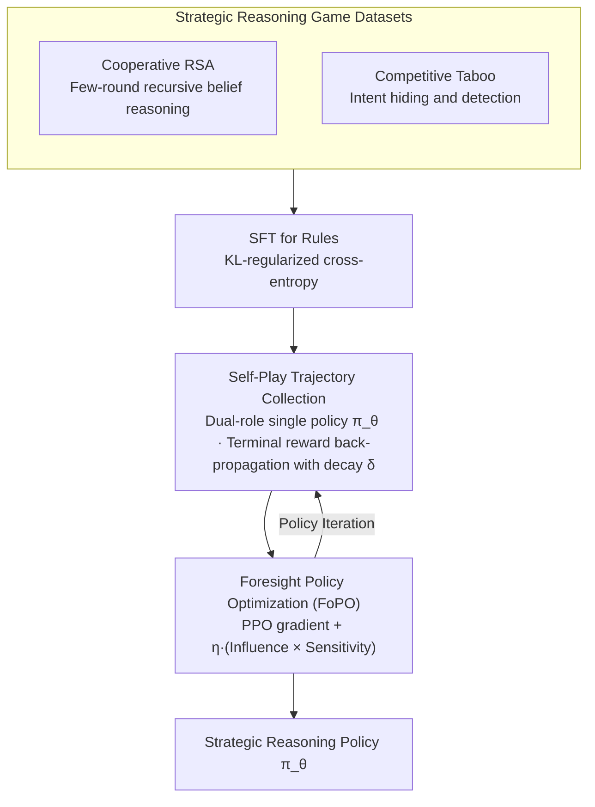

# Foresight Optimization for Strategic Reasoning in Large Language Models

**Conference**: ACL 2026  
**arXiv**: [2604.13592](https://arxiv.org/abs/2604.13592)  
**Code**: [GitHub](https://github.com/wangjs9/ForesightOptim)  
**Area**: LLM Reasoning / Game Strategy  
**Keywords**: Strategic Reasoning, Foresight Optimization, Opponent Modeling, Self-Play, Multi-Agent

## TL;DR

This paper proposes Foresight Policy Optimization (FoPO), which introduces a foresight correction term for opponent modeling into policy optimization. This allows LLMs to explicitly anticipate opponent behaviors and adjust their own strategies accordingly. FoPO significantly enhances strategic reasoning capabilities across both cooperative (Cooperative RSA) and competitive (Competitive Taboo) game tasks, achieving consistent performance gains on the cross-domain $\gamma$-Bench.

## Background & Motivation

**Background**: While LLM reasoning has improved significantly (e.g., in math and logic), strategic reasoning in multi-agent environments—the ability to foresee opponent actions and formulate optimal decisions—remains insufficient. Existing reasoning enhancement methods (CoT, search methods, graph-structured frameworks) have specific strengths but fail to explicitly model "foresight," a core feature of strategic reasoning.

**Limitations of Prior Work**: (1) Standard RL methods like PPO optimize only the self-policy without considering opponent responses; updates are isolated and lack anticipation of future opponent actions. (2) Existing game datasets (e.g., Chess, Poker) have high domain complexity where domain expertise requirements often outweigh strategic reasoning itself, making controlled studies difficult. (3) Opponent modeling methods in game theory (e.g., LOLA) require computing second-order information (mixed Hessian), which is computationally infeasible for large models.

**Key Challenge**: The essence of strategic reasoning is "foresight"—anticipating how an opponent will act and how one's own actions influence that opponent. Existing RL optimization frameworks treat the self and the opponent as independent processes, lacking this coupling.

**Goal**: To design a computationally efficient foresight policy optimization method that enables LLMs to explicitly consider opponent responses during policy updates, and to construct game datasets suitable for controlled research.

**Key Insight**: Drawing on opponent modeling principles from game theory, the influence of opponent strategy changes on self-value is embedded as a gradient correction term within the PPO update formula. Gradient truncation is used to avoid second-order computations.

**Core Idea**: A "foresight correction term" is added to standard PPO updates. This term couples two factors: (1) the influence of self-actions on the opponent's learning gradient, and (2) the sensitivity of the self-objective to changes in the opponent's strategy, thereby achieving explicit anticipation of future opponent behavior.

## Method

### Overall Architecture

FoPO is built upon self-play RL: two agents with opposing roles are instantiated from the same LLM policy $\pi_\theta$. The model first learns game rules via SFT, then refines strategic reasoning through RL self-play. The core problem it addresses is that standard PPO treats the self and the opponent as two unrelated optimization processes, focusing only on immediate individual returns while ignoring opponent reactions. FoPO inserts a "foresight correction term" into the PPO gradient update, allowing each step to explicitly anticipate how the opponent is affected by strategy changes. To facilitate controlled research, the authors also developed a pair of linguistic game datasets: Cooperative RSA and Competitive Taboo, minimizing domain knowledge requirements to focus on pure strategic reasoning.

### Key Designs

**1. Foresight Correction Term: Embedding Opponent Response in Gradient Updates**

The parameter update for FoPO is formulated as:

$$\theta_{t+1} \leftarrow \theta_t + \alpha \nabla_\theta [r^1_t \hat{A}^{1,clip}_t] - \alpha\beta \nabla_\theta \text{KL} + \alpha\eta (O^1 \nabla_\theta r^2_{t+1})^\top (\nabla_\theta r^1_t \nabla_\theta O^2)$$

The first two terms represent standard PPO with KL regularization. The novelty lies in the third term, which is the product of two factors: **Influence on the opponent** ($\nabla_\theta r^1_t \nabla_\theta O^2$), describing how self-strategy changes alter the opponent's learning gradient; and **Sensitivity to the opponent** ($O^1 \nabla_\theta r^2_{t+1}$), describing how opponent strategy changes affect the self-objective. Their product allow the update to account for the chain of "my move $\rightarrow$ opponent's response $\rightarrow$ impact on me." While game-theoretic opponent modeling (like LOLA) requires mixed Hessians, FoPO uses gradient truncation to reduce this to a first-order approximation, making foresight capabilities viable at LLM scales. The weight is controlled by the hyperparameter $\eta$.

**2. Cooperative RSA Dataset: Forcing Recursive Belief Reasoning in Minimal Rounds**

The cooperative scenario is designed as a reference game based on the Rational Speech Acts framework: a speaker provides features of a target object step-by-step, and a listener infers the target. The goal is to identify the target in as few rounds as possible, with rewards inversely proportional to the number of rounds. To be efficient, the speaker must anticipate how the listener will interpret cues, and the listener must reverse-engineer why the speaker chose specific cues. This recursive belief reasoning is inherently "foresight," providing ideal training and evaluation signals for the correction term.

**3. Competitive Taboo Dataset: Intent Hiding and Detection via Adversarial Induction**

In the competitive scenario, an attacker attempts to induce a defender to say a target word through dialogue, while the defender must identify the target word without being manipulated. The winner receives $+1$ and the loser $-1$. The attacker must anticipate the defender's level of vigilance to adjust induction strategies, while the defender must infer the attacker's true intent to thwart manipulation. Both parties are forced into foresight reasoning. This complements Cooperative RSA, covering two distinct dimensions of strategic reasoning: "thinking for the other" (recursive belief) and "gaming the other" (adversarial intent).

### Loss & Training

The training consists of three stages: (1) SFT stage using cross-entropy loss with KL regularization to teach the model game rules; (2) Trajectory collection stage using self-play to generate dialogues, where terminal rewards are back-propagated to each round using a decay factor $\delta$; (3) RL stage using FoPO for policy optimization, with the foresight correction weight $\eta$. Foresight correction is decoupled from specific RL algorithms and can thus be integrated into GRPO (forming GR.FoPO).

## Key Experimental Results

### Main Results

**$\gamma$-Bench Cross-Domain Evaluation (Trained on Taboo + RSA)**

| Method | Backbone | Guessing | Bar | Dollar | Diner | Pirate | Average |
|------|----------|----------|-----|--------|-------|--------|------|
| PPO | Llama-3-8B | 78.29 | 72.00 | 60.99 | 97.80 | 49.58 | 56.71 |
| ArCHer | Llama-3-8B | 78.78 | 73.83 | 57.17 | 93.40 | 46.19 | 54.46 |
| **FoPO** | Llama-3-8B | **80.47** | **72.83** | **64.61** | **98.40** | **58.05** | **60.08** |
| PPO | Qwen3-14B | 93.88 | 43.83 | 85.79 | 32.40 | 83.07 | 62.10 |
| **FoPO** | Qwen3-14B | **94.12** | **52.33** | **87.85** | **32.70** | **84.04** | **64.30** |

### Ablation Study

**Transfer Effects of Different Training Data (Llama-3-8B SFT → $\gamma$-Bench Average)**

| Training Data | Average Score | Relative Gain |
|----------|--------|-------------|
| None (Base) | 51.90 | — |
| 20 Questions | 55.19 | +3.29 |
| Guess My City | 53.37 | +1.47 |
| Taboo | 56.47 | +4.57 |
| RSA | 56.54 | +4.64 |
| **Taboo + RSA** | **57.23** | **+5.33** |

### Key Findings

- FoPO consistently outperforms PPO, GRPO, and ArCHer across two backbones (Llama-3-8B and Qwen3-14B) and three training configurations.
- Foresight correction can be seamlessly integrated into GRPO (GR.FoPO) while maintaining GRPO's advantages over PPO.
- The transfer effect of the Cooperative RSA dataset is superior to Competitive Taboo, as cooperative reasoning places more emphasis on opponent modeling.
- GRPO experienced probability collapse on RSA (due to continuous rewards causing advantage estimates to penalize suboptimal yet successful trajectories) but functioned normally on Taboo (binary rewards).
- OpenAI o3 performs excellently as a defender (responsive reasoning) but struggles as an attacker (proactive strategic reasoning), revealing fundamental limitations in current LLM foresight reasoning.

## Highlights & Insights

- The design of the foresight correction term is elegant and efficient—by using gradient truncation to reduce second-order modeling to a first-order calculation, it becomes feasible for large models.
- The comparison between cooperative and competitive tasks reveals different facets of strategic reasoning: cooperation requires recursive belief reasoning, while competition requires intent hiding and detection.
- The discovery of GRPO's collapse on continuous reward tasks provides independent value, highlighting a potential limitation of group-relative methods.

## Limitations & Future Work

- Focuses only on pure linguistic dialogue games, without involving complex multi-agent environments with world states.
- Limited to two-player settings; not yet extended to multi-party interaction scenarios.
- The foresight correction weight $\eta$ requires manual tuning; an adaptive mechanism is lacking.
- Interaction between strategic reasoning and other cognitive abilities such as long-term planning and Theory of Mind remains unexplored.

## Related Work & Insights

- **vs PPO**: PPO optimizes self-policy in isolation; FoPO couples self and opponent policy updates via the foresight correction term.
- **vs LOLA**: LOLA requires computing mixed Hessians (second-order), which is computationally infeasible; FoPO achieves an efficient approximation via gradient truncation.
- **vs ArCHer**: ArCHer is a multi-turn RL method but does not model opponents; FoPO explicitly models opponent responses.
- **vs Self-Play**: Standard self-play improves strategies implicitly through competition; FoPO explicitly encodes foresight into the optimization objective.

## Rating

- Novelty: ⭐⭐⭐⭐ The foresight correction term is a novel design that efficiently adapts game-theoretic opponent modeling for LLMs.
- Experimental Thoroughness: ⭐⭐⭐⭐⭐ Extremely comprehensive, covering two backbones, three data configurations, multiple baselines, and both in-domain and out-of-domain evaluations.
- Writing Quality: ⭐⭐⭐⭐ Clear methodological exposition, though high table density adds some reading overhead.
- Value: ⭐⭐⭐⭐ Provides a viable optimization framework for LLM strategic reasoning in multi-agent scenarios.

<!-- RELATED:START -->

## Related Papers

- [\[ACL 2026\] SeLaR: Selective Latent Reasoning in Large Language Models](selar_selective_latent_reasoning_in_large_language_models.md)
- [\[ICML 2026\] Reasoning Structure of Large Language Models](../../ICML2026/llm_reasoning/reasoning_structure_of_large_language_models.md)
- [\[ACL 2026\] JTPRO: A Joint Tool-Prompt Reflective Optimization Framework for Language Agents](jtpro_a_joint_tool-prompt_reflective_optimization_framework_for_language_agents.md)
- [\[ACL 2026\] Chain-of-Thought as a Lens: Evaluating Structured Reasoning Alignment between Human Preferences and Large Language Models](chain-of-thought_as_a_lens_evaluating_structured_reasoning_alignment_between_hum.md)
- [\[ACL 2026\] Dissecting Failure Dynamics in Large Language Model Reasoning](dissecting_failure_dynamics_in_large_language_model_reasoning.md)

<!-- RELATED:END -->
