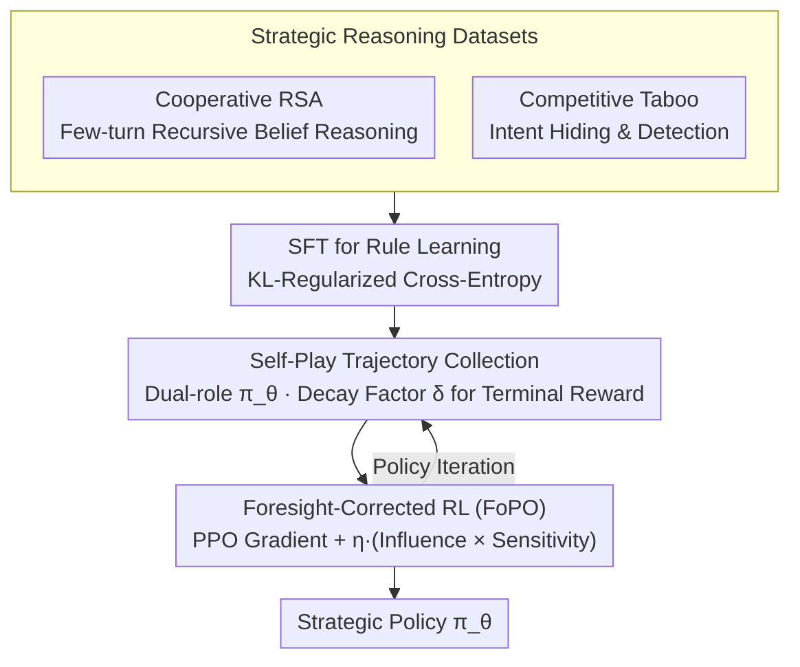

# Foresight Optimization for Strategic Reasoning in Large Language Models

**Conference**: ACL 2026  
**arXiv**: [2604.13592](https://arxiv.org/abs/2604.13592)  
**Code**: [GitHub](https://github.com/wangjs9/ForesightOptim)  
**Area**: LLM Reasoning / Game Strategy  
**Keywords**: Strategic Reasoning, Foresight Optimization, Opponent Modeling, Self-Play, Multi-Agent  

## TL;DR

This paper proposes Foresight Policy Optimization (FoPO), which introduces a foresight correction term based on opponent modeling into policy optimization. This enables LLMs to explicitly anticipate opponent behaviors and adjust their own strategies accordingly. FoPO significantly improves strategic reasoning in both cooperative (Cooperative RSA) and competitive (Competitive Taboo) game tasks and achieves consistent improvements on the cross-domain $\gamma$-Bench.

## Background & Motivation

**Background**: While LLM reasoning has significantly advanced in domains like mathematics and logic, strategic reasoning in multi-agent environments—the ability to anticipate opponent actions and formulate optimal decisions—remains insufficient. Existing reasoning-enhancement methods (CoT, search methods, graph-structured frameworks) do not explicitly model "foresight," the core feature of strategic reasoning.  

**Limitations of Prior Work**: (1) Standard RL methods like PPO optimize the agent's own policy without considering the opponent's response, treating updates as isolated events; (2) Existing game datasets (e.g., Chess, Poker) have high domain complexity where domain-specific knowledge outweighs strategic reasoning, making controlled studies difficult; (3) Traditional opponent modeling methods in game theory (e.g., LOLA) require second-order information (mixed Hessians), which is computationally infeasible for large models.  

**Key Challenge**: The essence of strategic reasoning is "foresight"—predicting how an opponent will act in the future and how one's own actions influence that opponent. Existing RL frameworks treat the self and the opponent as independent processes, lacking this coupling.  

**Goal**: To design a computationally efficient foresight policy optimization method that allows LLMs to explicitly consider opponent responses during policy updates, and to construct game datasets suitable for controlled research.  

**Key Insight**: Drawing from opponent modeling principles in game theory, the impact of opponent strategy changes on the agent's own value is embedded into the PPO update formula as a gradient correction term. Second-order computation is avoided through gradient truncation.  

**Core Idea**: A "foresight correction term" is added to standard PPO updates. This term couples two factors: (1) the influence of the agent's actions on the opponent's learning gradient, and (2) the sensitivity of the agent's objective to changes in the opponent's strategy. This enables explicit anticipation of future opponent behavior.  

## Method

### Overall Architecture

FoPO is built upon self-play RL: two agents with opposing roles are instantiated from the same LLM policy $\pi_\theta$. The model first learns game rules through SFT, followed by strategy refinement via RL self-play. The core problem it addresses is that standard PPO treats the self and the opponent as two unrelated optimization processes. FoPO inserts a "foresight correction term" into the PPO gradient update, ensuring each step optimizes its own reward while explicitly predicting how the opponent will be affected by its policy changes. To facilitate controlled studies, the authors developed cooperative (Cooperative RSA) and competitive (Competitive Taboo) linguistic game datasets that minimize domain knowledge requirements and focus on pure strategic reasoning.  

### Key Designs

**1. Foresight Correction Term: Embedding Opponent Response in Gradient Updates**  

The parameter update in FoPO is formulated as:  

$$\theta_{t+1} \leftarrow \theta_t + \alpha \nabla_\theta [r^1_t \hat{A}^{1,clip}_t] - \alpha\beta \nabla_\theta \text{KL} + \alpha\eta (O^1 \nabla_\theta r^2_{t+1})^\top (\nabla_\theta r^1_t \nabla_\theta O^2)$$  

The first two terms represent standard PPO with KL regularization. The novelty lies in the third term, which couples two factors: **Influence on the opponent** ($\nabla_\theta r^1_t \nabla_\theta O^2$), characterizing how the agent's policy change alters the opponent's learning gradient; and **Sensitivity to the opponent** ($O^1 \nabla_\theta r^2_{t+1}$), characterizing how the opponent's strategy change affects the agent's own objective. By multiplying these, the update accounts for the chain: "I move, the opponent reacts, and their reaction affects me." While opponent modeling in game theory (like LOLA) involves mixed Hessians, FoPO utilizes gradient truncation for a first-order approximation, making foresight feasible at LLM scales, controlled by the hyperparameter $\eta$.  

**2. Cooperative RSA: Forcing Recursive Belief Reasoning**  

The cooperative scenario is designed as a reference game based on the Rational Speech Acts framework. A Speaker provides features of a target object step-by-step, and a Listener infers the target. The goal is to identify the target in minimal interaction turns, with rewards inversely related to the number of turns. To be efficient, the Speaker must anticipate how the Listener will interpret clues, and the Listener must reverse-engineer why the Speaker chose a specific clue—this recursive belief reasoning naturally requires "foresight."  

**3. Competitive Taboo: Forcing Intent Hiding and Detection via Adversarial Induction**  

In the competitive scenario, an Attacker tries to induce a Defender to say a target word through conversation, while the Defender must identify the target word without being manipulated. The winner receives $+1$ and the loser $-1$. The Attacker must anticipate the Defender's suspicion level to adjust induction strategies, and the Defender must infer the Attacker's true intent to spot manipulation. This construct complements Cooperative RSA by focusing on adversarial intent defense versus recursive belief.  

### Loss & Training  

Training consists of three stages: (1) SFT stage using cross-entropy loss with KL regularization to learn game rules; (2) Trajectory collection stage using self-play to generate dialogue paths, with a decay factor $\delta$ propagating terminal rewards back to each turn; (3) RL stage using FoPO for policy optimization with foresight weight $\eta$. Since foresight correction is decoupled from specific RL algorithms, it can be integrated into GRPO as GR.FoPO.  

## Key Experimental Results

### Main Results

**$\gamma$-Bench Cross-Domain Evaluation (Trained on Taboo + RSA)**  

| Method | Backbone | Guessing | Bar | Dollar | Diner | Pirate | Average |
| :--- | :--- | :---: | :---: | :---: | :---: | :---: | :---: |
| PPO | Llama-3-8B | 78.29 | 72.00 | 60.99 | 97.80 | 49.58 | 56.71 |
| ArCHer | Llama-3-8B | 78.78 | 73.83 | 57.17 | 93.40 | 46.19 | 54.46 |
| **FoPO** | Llama-3-8B | **80.47** | **72.83** | **64.61** | **98.40** | **58.05** | **60.08** |
| PPO | Qwen3-14B | 93.88 | 43.83 | 85.79 | 32.40 | 83.07 | 62.10 |
| **FoPO** | Qwen3-14B | **94.12** | **52.33** | **87.85** | **32.70** | **84.04** | **64.30** |

### Ablation Study

**Transfer Effects of Different Training Data (Llama-3-8B SFT → $\gamma$-Bench Average)**  

| Training Data | Average Score | Gain vs. Baseline |
| :--- | :---: | :---: |
| None | 51.90 | — |
| 20 Questions | 55.19 | +3.29 |
| Guess My City | 53.37 | +1.47 |
| Taboo | 56.47 | +4.57 |
| RSA | 56.54 | +4.64 |
| **Taboo + RSA** | **57.23** | **+5.33** |

### Key Findings

- FoPO consistently outperforms PPO, GRPO, and ArCHer across both backbones (Llama-3-8B and Qwen3-14B) and three training configurations.  
- Foresight correction can be seamlessly integrated into GRPO (GR.FoPO) while maintaining GRPO's advantages over PPO.  
- Transfer effects from Cooperative RSA are superior to Competitive Taboo, as cooperative reasoning places heavier emphasis on opponent modeling.  
- GRPO experienced probability collapse on RSA (due to continuous rewards causing advantage estimation to penalize suboptimal but successful trajectories) but functioned normally on Taboo (binary rewards).  
- OpenAI o3 performs excellently as a Defender (reactive reasoning) but struggles as an Attacker (proactive strategic reasoning), revealing a fundamental limitation in current LLM foresight capabilities.  

## Highlights & Insights

- The design of the foresight correction term is elegant and efficient—by using gradient truncation, it reduces second-order opponent modeling to a first-order calculation feasible for LLMs.  
- The comparison between cooperative and competitive tasks reveals different facets of strategic reasoning: cooperation requires recursive belief reasoning, while competition requires intent hiding and detection.  
- The discovery of GRPO's collapse on continuous reward tasks is of independent value, highlighting a potential limitation of group relative methods.  

## Limitations & Future Work

- Focused solely on pure linguistic dialogue games; does not address complex multi-agent environments with world states.  
- Limited to two-player settings; not yet extended to multi-party interaction scenarios.  
- The foresight term weight $\eta$ requires manual tuning and lacks an adaptive mechanism.  
- Interaction between strategic reasoning and other cognitive abilities like long-term planning or Theory of Mind was not explored.  

## Related Work & Insights

- **vs PPO**: PPO optimizes the policy in isolation; FoPO couples self and opponent policy updates via the foresight correction term.  
- **vs LOLA**: LOLA requires computing mixed Hessians (second-order info), which is infeasible; FoPO provides an efficient first-order approximation via gradient truncation.  
- **vs ArCHer**: ArCHer is a multi-turn RL method but does not model the opponent; FoPO explicitly models the opponent's response.  
- **vs Self-Play**: Standard self-play improves policies implicitly through competition; FoPO explicitly encodes foresight into the optimization objective.  

## Rating

- Novelty: ⭐⭐⭐⭐  
- Experimental Thoroughness: ⭐⭐⭐⭐⭐  
- Writing Quality: ⭐⭐⭐⭐  
- Value: ⭐⭐⭐⭐  

<!-- RELATED:START -->

## Related Papers

- [\[ACL 2026\] SeLaR: Selective Latent Reasoning in Large Language Models](selar_selective_latent_reasoning_in_large_language_models.md)
- [\[ACL 2026\] TInR: Exploring Tool-Internalized Reasoning in Large Language Models](tinr_exploring_tool-internalized_reasoning_in_large_language_models.md)
- [\[ICLR 2026\] Inpainting-Guided Policy Optimization for Diffusion Large Language Models](../../ICLR2026/llm_reasoning/inpainting-guided_policy_optimization_for_diffusion_large_language_models.md)
- [\[ICML 2026\] Reasoning Structure of Large Language Models](../../ICML2026/llm_reasoning/reasoning_structure_of_large_language_models.md)
- [\[ACL 2026\] Chain-of-Thought as a Lens: Evaluating Structured Reasoning Alignment between Human Preferences and Large Language Models](chain-of-thought_as_a_lens_evaluating_structured_reasoning_alignment_between_hum.md)

<!-- RELATED:END -->
