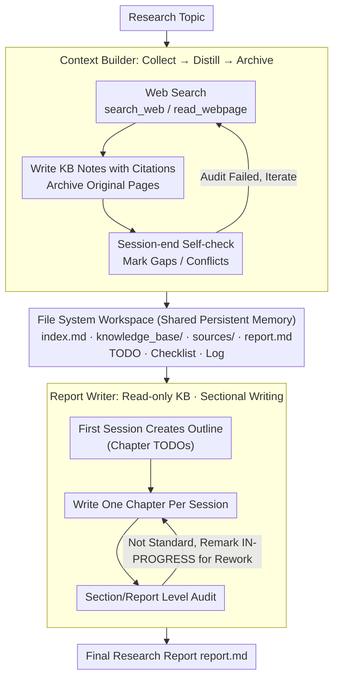

# FS-Researcher: Test-Time Scaling for Long-Horizon Research Tasks with File-System-Based Agents

**Conference**: ACL 2026  
**arXiv**: [2602.01566](https://arxiv.org/abs/2602.01566)  
**Code**: [https://github.com/Ignoramus0817/FS-Researcher](https://github.com/Ignoramus0817/FS-Researcher)  
**Area**: LLM Reasoning  
**Keywords**: Deep Research, File System, Test-time Scaling, Knowledge Base Construction, Dual-Agent Framework

## TL;DR

This paper introduces FS-Researcher, a file-system-based dual-agent framework for deep research. By utilizing a Context Builder to construct a hierarchical knowledge base and a Report Writer for sectional reporting within a persistent workspace, it overcomes context window limitations. FS-Researcher achieves 53.94 RACE (SOTA) on the DeepResearch Bench and demonstrates a positive test-time scaling effect between context construction computation and report quality.

## Background & Motivation

**Background**: Deep research is a representative frontier task for LLM agents, requiring them to systematically collect evidence from the internet and synthesize it into long-form reports. Commercial products from OpenAI, Google, and Anthropic have demonstrated human-level performance in this domain.

**Limitations of Prior Work**: (1) Models have limited context lengths, and long-trajectory research tasks easily exceed this capacity, leading to execution interruptions. (2) Existing methods (static pipelines, single-agent flows) force thoughts, tool observations, and report drafts to compete for a limited token budget, resulting in incomplete coverage and premature synthesis. (3) Current compression strategies (e.g., summarizing tool observations) extend trajectories at the cost of lossy bottlenecks, where fine-grained evidence and sources may be lost.

**Key Challenge**: A fundamental contradiction exists between the volume of information required for deep research (hundreds of webpages, reports with tens of thousands of tokens) and the capacity of the model's context window. Existing methods either truncate information or use lossy compression, failing to achieve true test-time scaling (allocating more computation to improve quality).

**Goal**: (1) Design a deep research framework capable of scaling beyond the context window. (2) Verify whether the framework can consistently improve report quality by increasing computation. (3) Surpass closed-source and open-source SOTA on multiple benchmarks.

**Key Insight**: Inspired by programming agents and AI IDEs (Cursor, Claude Code), file-system workspaces serve as effective infrastructure for long-duration tool use and iterative development. This paradigm is migrated to deep research, using the file system as persistent external memory.

**Core Idea**: Replace the context window with a file system as the agent's memory infrastructure. Information is written to files rather than kept in context, loaded on demand, and supports infinite scaling and cross-session iterative optimization.

## Method

### Overall Architecture

The core contradiction FS-Researcher seeks to resolve is that deep research requires digesting hundreds of webpages and producing massive reports, far exceeding the context window. The solution is to move memory from the context to the file system—writing information to files and loading it as needed to break the window limit. The framework consists of a dual-agent, two-stage process: the Context Builder acts as a librarian to browse the internet, write structured notes, and archive raw pages to build a hierarchical knowledge base; the Report Writer then uses this knowledge base as the sole source of truth to write the report section by section. Both agents share a file-system workspace containing deliverables (KB, report) and control files (TODO, Checklist, Log), allowing each to iterate and optimize independently.

### Key Designs

**1. File System Workspace: Replacing context windows with persistent external memory to remove token budget constraints**

In long trajectories of deep research, thoughts, tool observations, and report drafts compete for the limited token budget, resulting in incomplete coverage. FS-Researcher externalizes everything into Markdown files: deliverables include `index.md`, `knowledge_base/`, `sources/`, and `report.md`, while control files include todos, checklists, and logs. At the start of each session, the agent inspects the workspace state to plan; at the end, it audits against a checklist and marks unfinished items as `[IN-PROGRESS]` for subsequent sessions. The toolset is divided into file system tools (`ls`, `grep`, `read_file`, `insert`/`delete`/`replace`) and web browsing tools (`search_web`, `read_webpage`). This approach mirrors how humans handle complex tasks, provides storage far exceeding the context window, and ensures intermediate products are persistent and traceable.

**2. Context Builder: Systematically collecting, distilling, and archiving information into a structured KB**

Directly accumulating facts in the context quickly exhausts the window and leads to disorganized structures. The Context Builder produces three components: `index.md` (directory with topic decomposition), `knowledge_base/` (tree-like notes with citations to `sources/`), and `sources/` (archived raw pages). The workflow is non-linear: `index.md` and `knowledge_base/` are updated dynamically during browsing. Each session concludes with a self-audit to identify errors, gaps, or conflicts in the KB, which can iterate until the session budget is exhausted or the audit passes. Externalizing information allows the KB to grow far beyond context capacity, while structured organization enables precise retrieval by the Report Writer.

**3. Report Writer: Disabling web access for read-only KB use, employing multi-session sectional writing for depth and self-correction**

Generating an entire report at once often degrades into a list of facts lacking depth. The Report Writer is restricted to reading facts from the KB (web tools removed) and utilizes a multi-session sectional process. The first session creates an outline (acting as a TODO), and each subsequent session focuses on one chapter. Section-level audits (against checklists) follow each chapter, and a final report-level audit is conducted upon completion. If issues are found, chapters are remarked as `[IN-PROGRESS]` for rework. Sectional writing provides frequent "re-anchoring" opportunities, allowing the agent to return to the KB for local planning and self-correction.

### Loss & Training

This work focuses on the framework and does not involve model training. Both agents are driven by a standard ReAct architecture:

$$T_i, A_i = M_\theta(T_{j<i}, A_{j<i}, O_{j<i}, P), \quad O_i = \mathrm{Execute}(A_i)$$

Where $T_i$, $A_i$, and $O_i$ represent the thought, action, and observation at step $i$, and $P$ is the prompt. The framework supports various backbones such as GPT-5, Claude-Sonnet-4.5, and Gemini-2.5-Pro.

## Key Experimental Results

### Main Results

**Performance Comparison on DeepResearch Bench**

| Method | Backbone | Comp. | Insight | Instr. | Read. | RACE |
|------|---------|-------|---------|--------|-------|------|
| OpenAI-DeepResearch | - | 46.46 | 43.73 | 49.39 | 47.22 | 46.45 |
| Gemini-2.5-Pro-DR | - | 49.51 | 49.45 | 50.12 | 50.00 | 49.71 |
| WebWeaver | Qwen3-235B | 51.45 | 51.39 | 50.26 | 48.98 | 50.80 |
| RhinoInsight | Gemini-2.5-Pro | 50.51 | 51.45 | 51.72 | 50.00 | 50.92 |
| **FS-Researcher** | Claude-Sonnet-4.5 | **54.25** | **55.85** | **52.47** | **51.54** | **53.94** |
| **FS-Researcher** | GPT-5 | 51.96 | 54.44 | 52.14 | 51.26 | 52.76 |

**Performance Comparison on DeepConsult**

| Method | Win% | Tie% | Lose% | Avg Score |
|------|------|------|-------|-----------|
| OpenAI-DeepResearch | 0.00 | 100.00 | 0.00 | 5.00 |
| WebWeaver | 66.16 | 12.14 | 21.68 | 6.94 |
| **FS-Researcher** (Claude) | **80.00** | 10.42 | 9.58 | **8.33** |

### Ablation Study

**Module Ablation (GPT-5 Backbone, 10 sample queries)**

| Configuration | Comp. | Insight | Instr. | Read. | RACE |
|------|-------|---------|--------|-------|------|
| FS-Researcher (Full) | 51.96 | 54.44 | 52.14 | 51.26 | 52.76 |
| - Persistent Workspace | 48.38(-3.58) | 46.49(-7.95) | 50.78 | 49.92 | 48.69(-4.07) |
| - Dual-Agent $\rightarrow$ Single-Agent | 40.90(-11.06) | 37.55(-16.89) | 46.30 | 44.78 | 42.41(-10.35) |
| - Sectional $\rightarrow$ One-shot | 47.06(-4.90) | 45.64(-8.80) | 50.50 | 46.46 | 47.63(-5.13) |

## Key Findings

- FS-Researcher consistently outperforms closed-source and open-source SOTA across three benchmarks, proving that the file-system paradigm's advantages are independent of the backbone model.
- The dual-agent ablation shows the largest impact (RACE -10.35), indicating that separating evidence collection from report writing is a core design requirement.
- Increasing Context Builder rounds (3 $\rightarrow$ 5 $\rightarrow$ 10) consistently improves report quality (Insight from 49.48 to 55.88), though readability slightly decreases after 5 rounds as increased information density leads to a more technical style.
- Persistent workspaces have the greatest impact on Insight (-7.95), suggesting that a structured KB is crucial for in-depth analysis.
- Compressing context with a smaller summarization model reduces Context Builder costs by 47% with negligible quality loss.

## Highlights & Insights

- The paradigm shift of using a file system as an agent's external memory—moving from "information in context" to "information in files loaded on demand"—is a simple yet profound architectural innovation.
- The dual-agent separation solves a fundamental problem: information gathering and report writing require different cognitive modes; mixing them leads to premature synthesis and shallow exploration.
- The successful verification of the test-time scaling effect (more computation $\rightarrow$ better reports) provides preliminary evidence for scaling laws in agentic systems.

## Limitations & Future Work

- The framework depends on strong backbone models—it requires robust multi-turn planning, web searching, and long-form writing capabilities; smaller models may terminate early.
- There is a trade-off between readability and comprehensiveness, as richer KBs lead to more technical writing styles.
- Multi-agent collaboration (e.g., multiple Context Builders searching different sub-topics in parallel) was not explored.
- Archiving raw webpages may involve copyright and privacy concerns.

## Related Work & Insights

- **vs OpenAI/Google Deep Research**: While commercial product internals are opaque, FS-Researcher provides a reproducible open-source alternative that surpasses them on multiple benchmarks.
- **vs LangChain Open Deep Research**: Using the same GPT-5 backbone, FS-Researcher improves RACE by +2.16, proving the framework's contribution is independent of the model.
- **vs Summarization Compression**: Summarization is lossy and still context-constrained; the file system approach is lossless and has no upper limit.

## Rating

- Novelty: ⭐⭐⭐⭐⭐ The paradigm of using a file system for agent memory is simple and effective; the validation of test-time scaling is valuable.
- Experimental Thoroughness: ⭐⭐⭐⭐⭐ Conducted across three benchmarks, three backbones, three ablation studies, scaling analysis, and case studies.
- Writing Quality: ⭐⭐⭐⭐⭐ Clear motivation, detailed method descriptions, and logical ablation designs.
- Value: ⭐⭐⭐⭐⭐ Provides a reproducible SOTA framework and design principles for deep research agents.

<!-- RELATED:START -->

## Related Papers

- [\[ACL 2026\] SPPO: Sequence-Level PPO for Long-Horizon Reasoning Tasks](sppo_sequence-level_ppo_for_long-horizon_reasoning_tasks.md)
- [\[ACL 2026\] Parallel Test-Time Scaling for Latent Reasoning Models](parallel_test-time_scaling_for_latent_reasoning_models.md)
- [\[ACL 2026\] Efficient Test-Time Scaling via Temporal Reasoning Aggregation](efficient_test-time_scaling_via_temporal_reasoning_aggregation.md)
- [\[ICLR 2026\] Test-Time Scaling with Reflective Generative Model](../../ICLR2026/llm_reasoning/test-time_scaling_with_reflective_generative_model.md)
- [\[ACL 2026\] Scaling Test-Time Compute to Achieve IOI Gold Medal with Open-Weight Models](scaling_test-time_compute_to_achieve_ioi_gold_medal_with_open-weight_models.md)

<!-- RELATED:END -->
