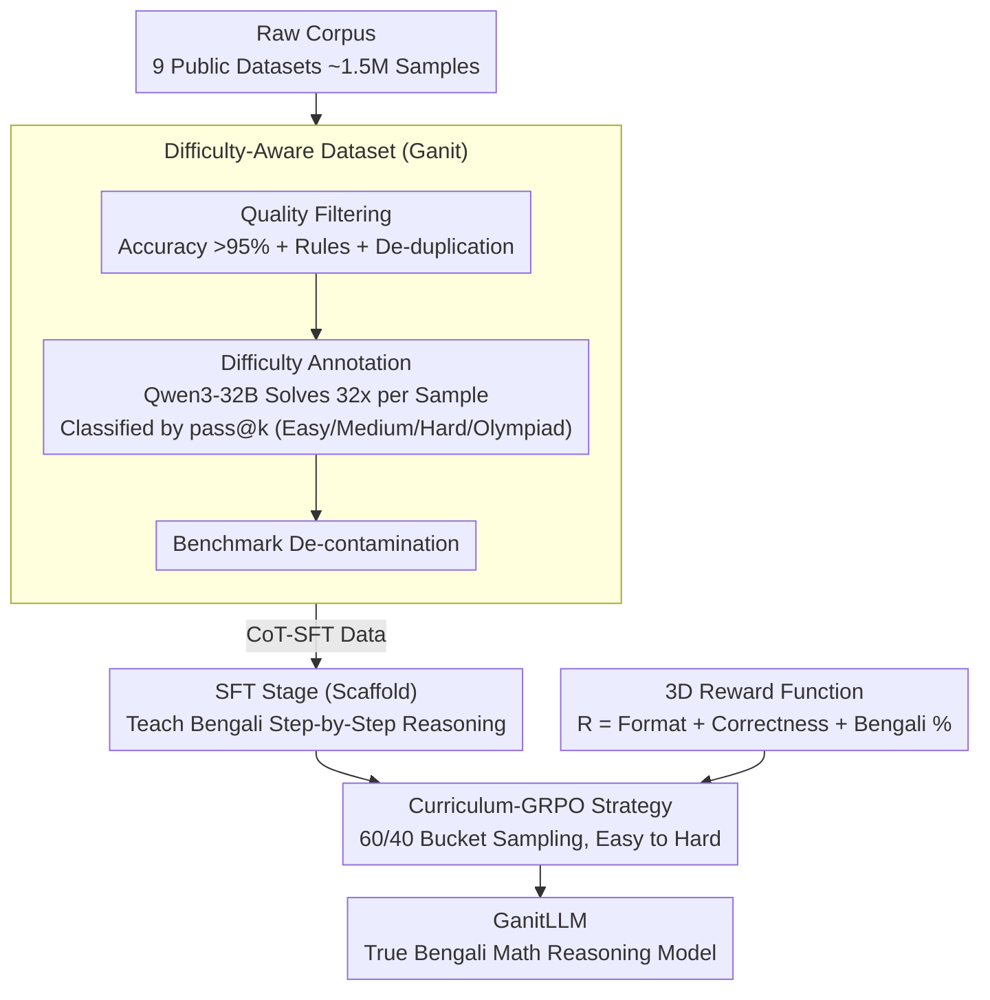

# GanitLLM: Difficulty-Aware Bengali Mathematical Reasoning through Curriculum-GRPO

**Conference**: ACL 2026 Findings  
**arXiv**: [2601.06767](https://arxiv.org/abs/2601.06767)  
**Code**: [Website](https://dipta007.github.io/GanitLLM/)  
**Area**: Low-Resource Language Reasoning / Mathematical Reasoning  
**Keywords**: Bengali Mathematical Reasoning, Curriculum Learning, GRPO Cold Start, Difficulty-Awareness, Low-Resource Languages

## TL;DR

This paper introduces GanitLLM, the first model to perform mathematical reasoning genuinely in Bengali (rather than through translation or reasoning in English). Through the construction of Ganit, a difficulty-annotated Bengali mathematics dataset, and the proposal of Curriculum-GRPO to address the cold start problem in low-resource GRPO training, the 4B model achieves an 8-percentage-point accuracy gain on Bn-MGSM, while increasing Bengali reasoning tokens from 14% to 88%.

## Background & Motivation

**Background**: LLMs have achieved significant progress in mathematical reasoning in high-resource languages like English (e.g., DeepSeek-R1, OpenAI o1), where RL methods such as GRPO have proven effective. However, reasoning in low-resource languages lags behind. Despite Bengali being the seventh most spoken language globally, existing LLMs either reason in English and translate the answer or fail entirely on Bengali math problems.

**Limitations of Prior Work**: (1) Even when explicitly prompted, existing LLMs tend to reason in English before outputting Bengali answers, which offers poor interpretability for native users; (2) Standard GRPO training encounters a "cold start problem" in low-resource settings—the policy model lacks sufficient target language capability to generate any correct solutions in a rollout group, resulting in zero rewards, zero gradients, and ineffective training; (3) Existing Bengali math datasets vary in quality and lack difficulty annotations and systematic quality filtering.

**Key Challenge**: GRPO requires at least some correct answers within a rollout group to compute effective advantage values. However, low-resource models often fail completely to generate correct solutions for difficult problems—a "chicken and egg" problem where the model needs basic competence to learn further.

**Goal**: To build a high-quality, difficulty-annotated Bengali mathematical dataset and design a training strategy that solves the cold start problem, enabling models to reason truly in Bengali.

**Key Insight**: The problem is decomposed into three steps: (1) Data: Constructing a quality-filtered and difficulty-annotated dataset; (2) SFT: Teaching the model how to reason step-by-step in Bengali (prioritizing language over correctness); (3) GRPO: Utilizing a curriculum learning strategy to train the model progressively from easy to hard.

**Core Idea**: Use Curriculum-GRPO to arrange training data by difficulty, ensuring the model can generate partially correct answers at each stage to obtain valid gradients and avoid cold start.

## Method

### Overall Architecture

The training consists of two stages: (1) SFT Stage: Teaching the model step-by-step reasoning in Bengali using CoT-SFT data, focusing on language consistency; (2) Curriculum-GRPO Stage: Training with GRPO on RL data sorted by difficulty, starting with simple problems. The Ganit dataset is derived from ~1.5M raw samples through multi-stage filtering and difficulty annotation; these difficulty signals guide the curriculum scheduling. The GRPO optimization is controlled by a three-dimensional reward function targeting both correctness and Bengali language usage.

### Key Designs

**1. Difficulty-Aware Dataset (Ganit): Refining Raw Corpus into a Graduated Training Set**

Existing Bengali math datasets vary in quality, and standard benchmarks (Bn-MGSM / Bn-MSVAMP) are too simple for modern LLMs (77-86% categorized as "Easy"), failing to train high-level capabilities. Ganit uses a multi-stage pipeline: starting with ~1.5M samples from 9 sources, it retains only datasets with accuracy >95% (~1.1M). It applies rule-based filtering (numerical answers, >99% Bengali characters, excluding MCQs) and deduplication (Fuzzy + MinHash). Most importantly, it performs difficulty annotation: Qwen3-32B generates 32 solutions per problem, classifying them into Easy, Medium, Hard, or Olympiad based on pass@k. Finally, decontamination is performed against evaluation benchmarks. This creates a dataset with continuous difficulty signals to serve as a curriculum scale.

**2. Curriculum-GRPO Strategy: Avoiding Cold Start via Difficulty-Mixed Sampling**

Standard GRPO requires rollout groups to contain correct answers to compute advantages. A weak Bengali model failing 100% of hard problems results in zero gradients. Curriculum-GRPO utilizes the fine-grained difficulty signals (1-32 correct generations): problems are placed in buckets. Each training batch samples 60% from the current difficulty bucket and 40% from the remaining 31 buckets (3 samples each). The curriculum advances from the easiest bucket to the hardest. This 60/40 design ensures the model gains correct experience on simple tasks for non-zero gradients, while the 40% mixed samples prevent overfitting and forgetting.

**3. Three-Dimensional Reward Function: Rewarding Bengali Reasoning Specifically**

Traditional GRPO focuses only on answer correctness, which leads models to "shortcut"—reasoning in English and only translating the final answer. This work adds rewards for target language consistency:

$$R = R_{format} + R_{correctness} + R_{bengali}$$

Where $R_{format} \in \{0,1\}$ checks format compliance, $R_{correctness} \in \{0,1,2\}$ rewards correctness (with a bonus point for Bengali responses), and $R_{bengali} \in \{0,1\}$ rewards instances where Bengali tokens exceed 80% of the reasoning process. The 80% threshold allows for language-independent mathematical symbols and formulas. This explicitly optimizes for "thinking in the target language," increasing the Bengali reasoning ratio from 14% to 88%.

### Loss & Training

The SFT stage uses standard cross-entropy loss. The GRPO stage uses standard GRPO loss with an ultra-long sequence filter and token-level penalties. The base model is Qwen3-4B.

## Key Experimental Results

### Main Results

| Model | Bn-MGSM | Bn-MSVAMP | Bengali % | Avg Length (Words) |
|------|---------|-----------|----------|------------|
| Qwen3-4B (Base) | 69 | 78 | 14% | 943 |
| + SFT only | 73 | 81 | 82% | 210 |
| + Curriculum-GRPO | **77** | **84** | **88%** | **193** |
| Qwen3-8B | 76 | 83 | 18% | 876 |
| GPT-5-mini | 82 | 88 | 45% | 520 |

### Ablation Study

| Training Strategy | Bn-MGSM | Cold Start Rate |
|---------|---------|---------|
| Shuffled GRPO | 72 | 35% |
| Fully Sorted (Easy→Hard) | 74 | 12% |
| **Curriculum-GRPO (60/40)** | **77** | **5%** |

### Key Findings

- Curriculum-GRPO reduces the cold start rate from 35% to 5%, proving essential for low-resource RL.
- The SFT stage is critical for language switching; GRPO rewards alone struggle to flip the reasoning language from English to Bengali.
- The 4B model achieves accuracy comparable to an 8B base model while reducing reasoning tokens by 79.5%.
- The Ganit-Dev set offers a more balanced difficulty distribution (21-29% per level) compared to standard sets (77-86% Easy), providing more discriminative evaluation.

## Highlights & Insights

- Identifying and solving the "cold start problem" provides a reference for RL training across all low-resource languages.
- The 3D reward function design is elegant—optimizing for correctness while explicitly incentivizing reasoning in the target language.
- The 80% Bengali threshold demonstrates domain awareness by accounting for language-agnostic mathematical symbols.

## Limitations & Future Work

- Validated only on 4B models; the cold start problem might manifest differently at larger scales.
- The 60/40 curriculum ratio is empirically tuned and lacks theoretical derivation.
- Difficulty labels depend on the capabilities of Qwen3-32B and may need updates as model capabilities evolve.
- Only validated on mathematical reasoning; applicability to logical or commonsense reasoning remains unknown.

## Related Work & Insights

- **vs. Confucius3-Math**: Chinese K-12 math models use standard RL; GanitLLM must resolve cold start issues specific to smaller Bengali data scales.
- **vs. mCoT**: mCoT uses multilingual CoT tuning but does not enforce target language reasoning; GanitLLM achieves 88% native reasoning through specific rewards.
- **vs. MathOctopus**: Uses parallel corpora but reasoning remains in English; GanitLLM achieves true native-language reasoning.

## Rating

- Novelty: ⭐⭐⭐⭐ The identification of the cold start problem and Curriculum-GRPO are novel contributions.
- Experimental Thoroughness: ⭐⭐⭐⭐ Detailed ablation, dataset quality analysis, and language ratio statistics.
- Writing Quality: ⭐⭐⭐⭐ Clear problem definition and detailed data construction process.
- Value: ⭐⭐⭐⭐ Provides a practical solution for RL training in low-resource languages.

<!-- RELATED:START -->

## Related Papers

- [\[ICLR 2026\] Harder Is Better: Boosting Mathematical Reasoning via Difficulty-Aware GRPO and Multi-Aspect Question Reformulation](../../ICLR2026/llm_reasoning/harder_is_better_boosting_mathematical_reasoning_via_difficulty-aware_grpo_and_m.md)
- [\[ACL 2026\] Budget-Aware Anytime Reasoning with LLM-Synthesized Preference Data](budget-aware_anytime_reasoning_with_llm-synthesized_preference_data.md)
- [\[ACL 2026\] DELTA: Dynamic Layer-Aware Token Attention for Efficient Long-Context Reasoning](delta_dynamic_layer-aware_token_attention_for_efficient_long-context_reasoning.md)
- [\[ACL 2026\] Distilling Long-CoT Reasoning through Collaborative Step-wise Multi-Teacher Decoding (CoRD)](distilling_long-cot_reasoning_through_collaborative_step-wise_multi-teacher_deco.md)
- [\[NeurIPS 2025\] Curriculum Abductive Learning](../../NeurIPS2025/llm_reasoning/curriculum_abductive_learning.md)

<!-- RELATED:END -->
