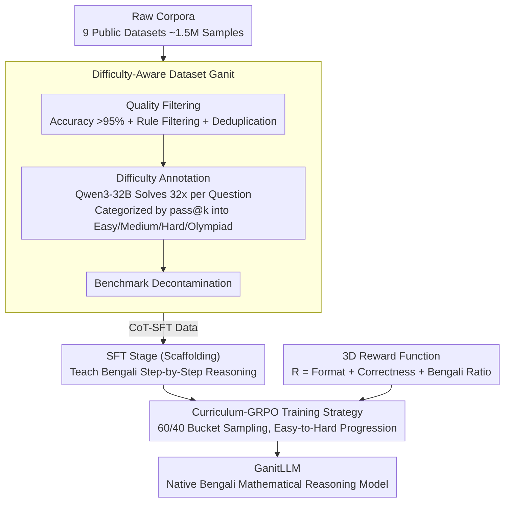

# GanitLLM: Difficulty-Aware Bengali Mathematical Reasoning through Curriculum-GRPO

**Conference**: ACL 2026 Findings  
**arXiv**: [2601.06767](https://arxiv.org/abs/2601.06767)  
**Code**: [Website](https://dipta007.github.io/GanitLLM/)  
**Area**: Low-Resource Language Reasoning / Mathematical Reasoning  
**Keywords**: Bengali Mathematical Reasoning, Curriculum Learning, GRPO Cold-Start, Difficulty-Aware, Low-Resource Languages

## TL;DR

This paper introduces GanitLLM, the first mathematical reasoning model that truly reasons in Bengali (rather than translating or reasoning in English). The authors construct Ganit, a Bengali math dataset with difficulty annotations, and propose Curriculum-GRPO to address the cold-start issue during GRPO training for low-resource languages. The 4B model achieves an 8 percentage point accuracy improvement on Bn-MGSM, with the proportion of Bengali reasoning tokens increasing from 14% to 88%.

## Background & Motivation

**Background**: LLMs have made significant progress in mathematical reasoning for high-resource languages like English (e.g., DeepSeek-R1, OpenAI o1). Reinforcement Learning (RL) methods such as GRPO have proven effective in enhancing these capabilities. However, progress in low-resource languages lags significantly. Despite Bengali being the seventh most spoken language globally, existing LLMs either reason in English before translating the answer or fail entirely on Bengali math problems.

**Limitations of Prior Work**: (1) Even when explicitly prompted to reason in Bengali, LLMs tend to use English for internal reasoning and only output the final answer in Bengali, leading to poor interpretability for native speakers. (2) Standard GRPO training suffers from a "cold-start problem" in low-resource settings—the policy model lacks sufficient capability in the target language to generate any correct solutions in the rollout group, resulting in zero rewards, zero gradients, and ineffective training. (3) Existing Bengali math datasets vary in quality and lack difficulty annotations or systematic quality filtering.

**Key Challenge**: GRPO requires at least some correct answers within a rollout group to calculate valid advantages. However, models for low-resource languages often fail to generate any correct answers for difficult problems, creating a "chicken-and-egg" problem where the model must already possess some ability to learn further.

**Goal**: Construct a high-quality, difficulty-annotated Bengali mathematical dataset and design a training strategy to solve the cold-start problem, enabling the model to reason natively in Bengali.

**Key Insight**: The problem is decomposed into three steps: (1) Data: Constructing a quality-filtered and difficulty-annotated dataset; (2) SFT: Teaching the model to reason in Bengali (focusing on language consistency over correctness); (3) GRPO: Implementing a curriculum learning strategy to train the model progressively from easy to hard.

**Core Idea**: Use Curriculum-GRPO to arrange training data by difficulty, ensuring the model can generate partially correct answers in each stage to obtain valid gradients and avoid the cold-start state.

## Method

### Overall Architecture

The training consists of two stages: (1) SFT Stage: Teaching the model to perform step-by-step reasoning in Bengali using CoT-SFT data, prioritizing language over accuracy; (2) Curriculum-GRPO Stage: Training via GRPO on RL data sorted by difficulty, starting with simple problems. The Ganit dataset is derived from ~1.5M raw samples through multi-stage filtering and difficulty labeling. These labels define the curriculum for GRPO, while a three-dimensional reward function steers optimization toward "correctness" and "native Bengali thinking."

### Key Designs

**1. Difficulty-Aware Dataset Ganit: Refining Raw Corpora into a Scaled Training Set**

Existing Bengali math datasets are inconsistent in quality, and standard benchmarks like Bn-MGSM / Bn-MSVAMP are too simple for modern LLMs (77-86% of questions are "Easy"), making it difficult to train advanced capabilities or differentiate performance. Ganit addresses this via a multi-stage pipeline: collecting ~1.5M samples from 9 sources, performing manual evaluation to retain datasets with >95% accuracy (~1.1M remaining), and applying rule-based filters (numerical solutions only, >99% Bengali characters, excluding multiple-choice). Fuzzy and MinHash deduplication follow. Crucially, difficulty is annotated by prompting Qwen3-32B to generate 32 independent solutions per problem; the pass@k rate categorizes questions into Easy, Medium, Hard, or Olympiad. Finally, decontamination ensures no overlap with test sets. This provides a clean dataset with continuous difficulty signals for curriculum training.

**2. Curriculum-GRPO Training Strategy: Avoiding Cold-Start via Mixed Difficulty Sampling**

Standard GRPO requires rollout groups to contain correct answers to compute effective advantages. Weak Bengali models often fail every rollout for hard problems, leading to zero gradients—the cold-start problem. Curriculum-GRPO leverages the fine-grained difficulty signal (1-32 correct generations): questions are binned, and each training batch samples 60% from the "current" difficulty bucket and 40% from the remaining 31 buckets (3 samples each). The curriculum progresses from easy to hard. This 60/40 design ensures: (1) the model experiences success on simple problems to get non-zero gradients; (2) the 40% mixed samples prevent forgetting previous difficulties; and (3) a balance between strong curriculum signals and sample diversity. Unlike strict 100% sorting (which causes overfitting on easy tasks) or random shuffling (which triggers early cold-starts), this approach maintains training stability.

**3. Three-Dimensional Reward Function: Incentivizing Bengali Reasoning Directly**

Traditional GRPO focuses only on final answer accuracy, which encourages models to take the shortcut of reasoning in English and translating at the end. This paper defines a collective reward:

$$R = R_{format} + R_{correctness} + R_{bengali}$$

Where $R_{format} \in \{0,1\}$ checks for schema compliance; $R_{correctness} \in \{0,1,2\}$ rewards the correct answer, with an extra point if the answer is in Bengali; and $R_{bengali} \in \{0,1\}$ rewards agents if the Bengali token ratio in the reasoning chain is $\ge 80\%$. The 80% threshold allows for language-independent mathematical symbols and formulas. This objective forces the model to optimize for both "getting it right" and "thinking in the target language," increasing the Bengali reasoning ratio from 14% to 88%.

### Loss & Training

The SFT stage uses standard cross-entropy loss. The GRPO stage uses the standard GRPO loss paired with an ultra-long response filter and token-level losses. The base model used is Qwen3-4B.

## Key Experimental Results

### Main Results

| Model | Bn-MGSM | Bn-MSVAMP | Bengali % | Avg. Length (Words) |
|-------|---------|-----------|-----------|---------------------|
| Qwen3-4B (Base) | 69 | 78 | 14% | 943 |
| + SFT only | 73 | 81 | 82% | 210 |
| + Curriculum-GRPO | **77** | **84** | **88%** | **193** |
| Qwen3-8B | 76 | 83 | 18% | 876 |
| GPT-5-mini | 82 | 88 | 45% | 520 |

### Ablation Study

| Training Strategy | Bn-MGSM | Cold-Start Rate |
|-------------------|---------|-----------------|
| Random Shuffle GRPO | 72 | 35% |
| Full Sort (Easy $\rightarrow$ Hard) | 74 | 12% |
| **Curriculum-GRPO (60/40)** | **77** | **5%** |

### Key Findings

- Curriculum-GRPO reduces the cold-start rate from 35% to 5%, serving as a key solution for RL in low-resource settings.
- The SFT stage is critical for language switching—GRPO rewards alone are insufficient to shift the reasoning language from English to Bengali.
- The 4B model trained with Curriculum-GRPO matches the accuracy of the 8B base model while using 79.5% fewer reasoning tokens.
- The Ganit-Dev set has a much more balanced difficulty distribution (~21-29% per level) compared to standard benchmarks (77-86% "Easy"), providing more discriminative evaluation.

## Highlights & Insights

- Identifying and solving the "cold-start problem" provides valuable insights for RL training in all low-resource languages.
- The three-dimensional reward function is elegant—it doesn't just optimize for correctness but explicitly incentivizes reasoning in the target language.
- The 80% Bengali threshold demonstrates domain awareness by accounting for the language-independent nature of mathematical symbols.

## Limitations & Future Work

- Validated only on a 4B model; the cold-start dynamics might differ for larger scales.
- The 60/40 curriculum ratio is empirically tuned and lacks theoretical guidance.
- Difficulty labels depend on the capability of Qwen3-32B and may need updating as evaluation models evolve.
- Only validated on mathematical reasoning; applicability to other tasks like logical or commonsense reasoning remains unknown.

## Related Work & Insights

- **vs Confucius3-Math**: A Chinese K-12 math model using standard RL; GanitLLM must solve cold-start issues specific to the smaller data scale of Bengali.
- **vs mCoT**: mCoT uses multilingual CoT tuning but does not enforce native reasoning; GanitLLM achieves 88% native reasoning via specialized rewards.
- **vs MathOctopus**: Uses parallel corpora but reasoning remains in English; GanitLLM achieves true native-language reasoning.

## Rating

- Novelty: ⭐⭐⭐⭐ The identification of the cold-start problem and the Curriculum-GRPO solution are novel contributions.
- Experimental Thoroughness: ⭐⭐⭐⭐ Detailed ablations, quality analysis, and language distribution statistics.
- Writing Quality: ⭐⭐⭐⭐ Clear problem definition and detailed data construction process.
- Value: ⭐⭐⭐⭐ Provides a practical solution for RL training in low-resource languages.

<!-- RELATED:START -->

## Related Papers

- [\[ICLR 2026\] Harder Is Better: Boosting Mathematical Reasoning via Difficulty-Aware GRPO and Multi-Aspect Question Reformulation](../../ICLR2026/llm_reasoning/harder_is_better_boosting_mathematical_reasoning_via_difficulty-aware_grpo_and_m.md)
- [\[ACL 2026\] Budget-Aware Anytime Reasoning with LLM-Synthesized Preference Data](budget-aware_anytime_reasoning_with_llm-synthesized_preference_data.md)
- [\[ACL 2026\] Distilling Long-CoT Reasoning through Collaborative Step-wise Multi-Teacher Decoding (CoRD)](distilling_long-cot_reasoning_through_collaborative_step-wise_multi-teacher_deco.md)
- [\[ACL 2026\] DELTA: Dynamic Layer-Aware Token Attention for Efficient Long-Context Reasoning](delta_dynamic_layer-aware_token_attention_for_efficient_long-context_reasoning.md)
- [\[ICLR 2026\] Overthinking Reduction with Decoupled Rewards and Curriculum Data Scheduling](../../ICLR2026/llm_reasoning/overthinking_reduction_with_decoupled_rewards_and_curriculum_data_scheduling.md)

<!-- RELATED:END -->
