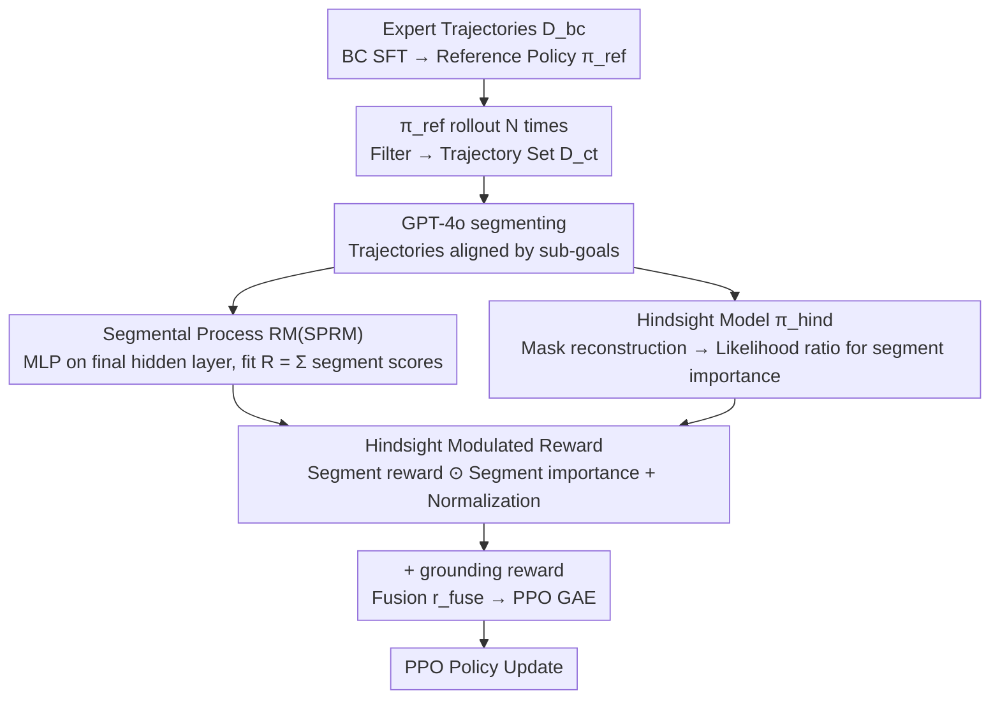

# HISR: Hindsight Information Modulated Segmental Process Rewards for Multi-turn Agentic Reinforcement Learning

**Conference**: ACL 2026  
**arXiv**: [2603.18683](https://arxiv.org/abs/2603.18683)  
**Code**: Coming soon  
**Area**: LLM Agent / Multi-turn Reinforcement Learning / Process Reward  
**Keywords**: agentic RL, segmental process reward, hindsight model, credit assignment, PPO

## TL;DR
HISR uses GPT-4o to segment agent trajectories into segments aligned with sub-goals, then employs the likelihood ratio between a hindsight model and a policy model to compute an importance score for each segment. This modulates segment-level process rewards—making credit assignment more reliable on Alfworld, Virtualhome, and Webshop, with average scores increasing by 5+ compared to SPA.

## Background & Motivation

**Background**: Enabling LLMs as agents for multi-turn decision-making (chores, online shopping, etc.) relies on multi-turn RL (PPO/GRPO). The reward model is central: (a) outcome RM (a single scalar at the end of the trajectory); (b) turn-level pseudo process rewards labeled by MCTS or GPT-4; (c) indirect supervision of turn-level credit as in SPA.

**Limitations of Prior Work**:
- Outcome RM: "Delayed rewards" are difficult to propagate to early actions over long horizons, leading to arbitrary credit assignment.
- Turn-level pseudo labels: MCTS/GPT-4 labeling is expensive and noisy.
- Label-free turn-level: Completely ignores action importance, making process rewards "unfocused."
- **Key Challenge**: The aforementioned methods provide rewards per turn, but a sub-goal often spans multiple turns (e.g., "find object then clean"). Turn-level granularity is too fine, breaking apart different actions belonging to the same sub-goal.

**Key Challenge**: Difficulty in balancing reward granularity, labeling cost, and signal focus—finer granularity is often less accurate, while coarser granularity hinders propagation.

**Goal**: (1) Raise granularity from turn-level to sub-goal segments; (2) Add action importance signals to segments without introducing extra manual process labels.

**Key Insight**: Leveraging Hindsight Credit Assignment (Harutyunyan 2019)—the rationality of an action is better reflected by "looking back" after the outcome is known than by "predicting ahead."

**Core Idea**: Use GPT-4o to segment trajectories and a segment-level RM to provide rewards. Then, use the token-level likelihood ratio between a hindsight model and the policy model, aggregated to the segment level, to modulate the reward. This yields a "sub-goal aligned + important action amplified" modified reward.

## Method

### Overall Architecture
Three stages:
1. **Behavior Cloning + Trajectory Collection**: SFT on expert trajectories $D_{bc}$ to obtain a reference policy $\pi_{ref}$; then run $N$ rollouts of $\pi_{ref}$ in the environment, filtering for successful/non-redundant samples to obtain $D_{ct} = \{(\tau_{i,j}, R_{i,j})\}$.
2. **Construction of Two Auxiliary Models**: Use GPT-4o to segment each trajectory into segments $\tau^s = \{s_1, \dots, s_n\}$, then train a Segmental Process RM (SPRM) and a hindsight model $\pi_{hind}$.
3. **PPO Training**: Use SPRM to predict segment-level rewards $\hat R$ and the hindsight/policy likelihood ratio for segment-level importance $\hat z_s$. These are multiplied and normalized to get $\hat R_{him}$, which drives PPO after adding grounding rewards.

### Key Designs

**1. Segmental Process Reward Model (SPRM): Decomposing the final scalar reward into sub-goal aligned segment rewards**

Turn-level rewards fragment multiple actions belonging to the same sub-goal (e.g., "find object, then clean"), making the granularity too fine; meanwhile, using GPT-4 for pseudo labels is expensive and noisy. SPRM takes a third path: attaching an MLP to the final hidden layer of $\pi_{ref}$ to output a score $r_i = W_2(\text{SiLU}(W_1 h_i))$ at each segment's end token. It uses:

$$\mathcal{L}_{sprm}(\tau^s) = \big(R - \sum_{i=1}^n r_i\big)^2$$

to fit the trajectory's scalar outcome $R$ as the sum of segment contributions. This is equivalent to letting the model learn its own "task progress estimator"—requiring only the final outcome label to align reward granularity with naturally occurring sub-goal segments.

**2. Hindsight Model and Likelihood Ratio Importance: Calculating "hindsight importance" for each action without process labels**

Segment rewards solve the granularity issue, but which action in a segment is truly critical remains unknown. Ours borrows from Hindsight Credit Assignment—looking back at an action knowing the outcome reflects its true contribution better than forward prediction. Specifically, a hindsight model $\pi_{hind}$ is trained on $\pi_{ref}$ with an objective similar to masked language modeling: mask the response $a_k$ of each turn and reconstruct $a_k$ given the rest of the trajectory (including future tokens). The token-level likelihood ratio is defined as:

$$r(a_k^j) = \frac{\pi_{hind}(a_k^j \mid o, a_{<k}, a_{>k}, a_k^{<j})}{\pi_{policy}(a_k^j \mid o_{\le k}, a_{<k}, a_k^{<j})}$$

This is aggregated into action importance $z(a_k) = \exp\!\big(\frac{1}{\beta |a_k|} \sum_j \log r(a_k^j)\big)$, and turn-level $z(a_k)$ are summed to get segment importance $z(s_i)$. The intuition is clear: if $z(a_k) > 1$, the agent is more likely to choose this action when looking back with hindsight, indicating the action was critical to performance.

**3. Hindsight-modulated reward + grounding reward: Amplifying critical segment rewards and adding executability constraints**

With segment rewards $\hat R$ and importance $\hat z_s$, the two are multiplied element-wise and normalized to amplify critical segments and suppress secondary ones:

$$\hat R_{him} = \frac{\hat R \odot \hat z_s}{\|\hat R \odot \hat z_s\|}$$

However, "correctness" is insufficient; without constraints, agents often generate hallucinated actions that cannot be executed. Thus, a grounding reward $\hat r^g$ (1 for legal actions, 0 otherwise) is added to form $\hat r^{fuse} = (1-\alpha)\,\hat r^{him} + \alpha\,\hat r^g$. $\hat R_{him}$ ensures the agent "does it right," while $\hat r^g$ ensures it "can do it." The final $\hat r^{fuse}$ is fed into PPO's GAE.

### Loss & Training
- BC Phase: NLL is calculated only for thought-action tokens, skipping observation tokens to improve stability.
- SPRM Training: Uses segment-level MSE based on the outcome label; no turn-level labels are needed.
- PPO Phase: Standard clip-objective $\mathcal{L}_{clip}(\theta) = \mathbb{E}_t[\min(\frac{\pi_\theta}{\pi_{\theta_{old}}} \hat A_t^{fuse}, \text{clip}(\cdot, 1-\epsilon, 1+\epsilon) \hat A_t^{fuse})]$ with GAE-based advantage.

## Key Experimental Results

### Main Results
Evaluated on Alfworld (6 sub-tasks: PICK, CLEAN, HEAT, COOL, LOOK, PICK2), Virtualhome, and Webshop against 12+ baselines.

| Method | Type | Alfworld-Avg | Virtualhome | Webshop |
|------|------|--------------|-------------|---------|
| GPT-4o | PE | 48.0 | 20.8 | 23.7 |
| Gemini2.5pro | PE | 60.3 | 31.7 | 35.9 |
| SFT | BC | 73.1 | 51.8 | 62.0 |
| DPO | BC | 76.1 | 52.8 | 62.6 |
| PPO | RL | 73.9 | 51.0 | 62.1 |
| GRPO | RL | 73.4 | 51.2 | 61.8 |
| RAGEN | RL | 75.4 | 52.1 | 63.0 |
| PRM4A | RL | 73.9 | — | — |
| SPA (Prev. SOTA) | RL | 79.1 | 53.4 | 64.1 |
| **HISR (Ours)** | RL | **83.6** | **59.1** | **69.1** |

HISR achieved SOTA on three benchmarks: Alfworld +4.5, Virtualhome +5.7, and Webshop +5.0; notably, it achieved 100% completion on the LOOK sub-task.

### Ablation Study

| Configuration | Alfworld-Avg | Virtualhome | Webshop | Description |
|------|--------------|-------------|---------|------|
| HISR (full) | 83.6 | 59.1 | 69.1 | Full Method |
| w/o HIM | 80.6 | 55.1 | 63.7 | SPRM only |
| w/o SPR | 82.1 | 57.9 | 69.1 | Turn-level estimation |
| w/o BOTH | 87.5 (single) | — | — | Outcome-only |

### Key Findings
- The HIM module contributes the most: removing it drops scores by 5+ on Webshop, proving the marginal gain of hindsight exceeds simple segmentation.
- Segmentation is necessary: removing SPR drops Virtualhome scores by 1.2; the two are complementary.
- HISR shows the most significant gains on long-horizon tasks (e.g., PICK2), where SPA rose from 58.8 to 82.4, confirming that the importance + granularity duality is most effective for long-chain reasoning.

## Highlights & Insights
- **LLM-based Hindsight Credit Assignment**: The classic hindsight concept is implemented naturally via the likelihood ratio of two LMs, with almost no additional hyperparameters.
- **Importance Calculation without Process Labels**: This is the core advantage over MCTS labeling methods like PRM4A; it is engineering-friendly.
- **Sub-goal Alignment**: Aligning reward granularity to task structures (e.g., chores/shopping) serves as a simple yet effective inductive bias for LLM agent RL.

## Limitations & Future Work
- Dependency on GPT-4o for segmenting; migrating to new tasks without GPT-4 friendly structures might require redesigned strategies.
- The hindsight and policy models share a common origin ($\pi_{ref}$), which could amplify similar biases.
- $\beta$ and $\alpha$ are hyperparameters without detailed sensitivity analysis.
- The paper is marked as "Work in progress," with some experiments still iterating.

## Related Work & Insights
- **vs SPA (Wang 2025a)**: Both use outcome to supervise process, but SPA is turn-level while HISR is segment-level and uses hindsight modulation.
- **vs PRM4A**: PRM4A requires MCTS pseudo-labels; HISR is completely label-free.
- **vs RAGEN**: RAGEN focuses on exploration/diversity; HISR focuses on credit assignment. They are potentially stackable.

## Rating
- Novelty: ⭐⭐⭐⭐ Hindsight credit assignment implemented via likelihood ratios for LLM agents.
- Experimental Thoroughness: ⭐⭐⭐⭐ 3 benchmarks, 12 baselines, and full ablation, though lacking hyperparameter analysis.
- Writing Quality: ⭐⭐⭐⭐ Formulas and Figure 2 clearly explain the dual-model synergy.
- Value: ⭐⭐⭐⭐ A plug-and-play reward enhancement for long-horizon LLM agent RL.

<!-- RELATED:START -->

## Related Papers

- [\[ACL 2026\] MTR-Bench: A Comprehensive Benchmark for Multi-Turn Reasoning Evaluation](mtr-bench_a_comprehensive_benchmark_for_multi-turn_reasoning_evaluation.md)
- [\[ACL 2026\] Efficient Process Reward Modeling via Contrastive Mutual Information](efficient_process_reward_modeling_via_contrastive_mutual_information.md)
- [\[CVPR 2026\] Scaling Agentic Reinforcement Learning for Tool-Integrated Reasoning in VLMs](../../CVPR2026/llm_reasoning/scaling_agentic_reinforcement_learning_for_tool-integrated_reasoning_in_vlms.md)
- [\[ACL 2026\] CSRP: Chain-of-Thought Reasoning for Chinese Text Correction via Reinforcement Learning with Efficiency-Aware Rewards](csrp_chain-of-thought_reasoning_for_chinese_text_correction_via_reinforcement_le.md)
- [\[ACL 2026\] Process Reward Models Meet Planning: Generating Precise and Scalable Datasets for Step-Level Rewards](process_reward_models_meet_planning_generating_precise_and_scalable_datasets_for.md)

<!-- RELATED:END -->
