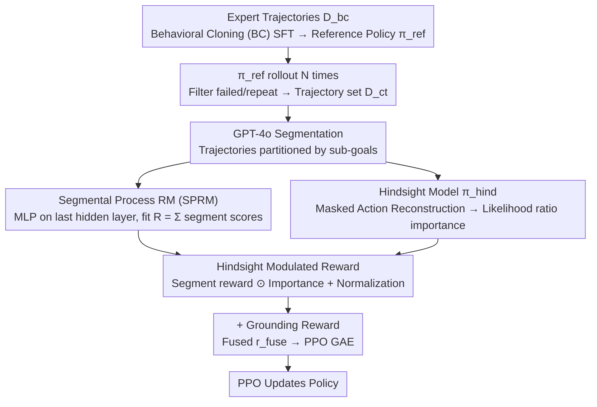

# HISR: Hindsight Information Modulated Segmental Process Rewards for Multi-turn Agentic Reinforcement Learning

**Conference**: ACL 2026  
**arXiv**: [2603.18683](https://arxiv.org/abs/2603.18683)  
**Code**: To be open-sourced  
**Area**: LLM Agent / Multi-turn Reinforcement Learning / Process Reward  
**Keywords**: agentic RL, segmental process reward, hindsight model, credit assignment, PPO

## TL;DR
HISR utilizes GPT-4o to partition agent trajectories into segments aligned with sub-goals. Subsequently, a hindsight model and a policy model calculate importance scores via likelihood ratios to modulate segmental process rewards. This approach improves credit assignment on Alfworld, Virtualhome, and Webshop, achieving an average score increase of 5+ over SPA.

## Background & Motivation

**Background**: Employing LLMs as agents to solve multi-turn decision-making tasks (e.g., housework, online shopping) relies on multi-turn RL (PPO/GRPO). The reward model is central: (a) outcome RM (a single scalar at the end of the trajectory); (b) turn-level pseudo process rewards labeled via MCTS or GPT-4; (c) indirect turn-level credit supervision using outcomes, as seen in SPA.

**Limitations of Prior Work**:
- Outcome RM: "Delayed rewards" are difficult to propagate to early actions in long horizons, leading to unreliable credit assignment.
- Turn-level pseudo labels: MCTS or GPT-4 labeling is expensive and noisy.
- Unlabeled turn-level: Completely ignores action importance, making process rewards "unfocused."
- **Common Issue**: The aforementioned methods provide rewards per turn, but a sub-goal often spans multiple turns (e.g., "find object then clean"). Turn-level granularity is too fine, fragmenting actions belonging to the same sub-goal.

**Key Challenge**: There is a trade-off between reward granularity, labeling cost, and signal focus—finer granularity is often less accurate, while coarser granularity hinders propagation.

**Goal**: (1) Increase granularity from turn-level to sub-goal segments; (2) Introduce action importance signals to segments without additional manual process labels.

**Key Insight**: Drawing from Hindsight Credit Assignment (Harutyunyan 2019), "looking back" at the rationality of an action after the outcome is known reflects its true contribution more accurately than "predicting ahead."

**Core Idea**: Use GPT-4o for segmentation and a segment-level RM for rewards. Then, use the token-level likelihood ratio between a hindsight model and the policy model to aggregate segment importance. This importance is multiplied by the reward to obtain a corrected reward that is "sub-goal aligned + important actions amplified."

## Method

### Overall Architecture
Three stages:
1. **Behavioral Cloning + Trajectory Collection**: SFT on expert trajectories $D_{bc}$ to obtain a reference policy $\pi_{ref}$. Perform $N$ rollouts with $\pi_{ref}$ in the environment, filtering failed or duplicate samples to obtain $D_{ct} = \{(\tau_{i,j}, R_{i,j})\}$.
2. **Construction of Two Auxiliary Models**: Use GPT-4o to segment each trajectory into $\tau^s = \{s_1, \dots, s_n\}$. Train a Segmental Process RM (SPRM) and a hindsight model $\pi_{hind}$.
3. **PPO Training**: Use SPRM to predict segmental rewards $\hat R$. Use the hindsight/policy likelihood ratio to calculate segmental importance $\hat z_s$. Multiply and normalize to get $\hat R_{him}$, then add grounding rewards to drive PPO.

### Key Designs

**1. Segmental Process Reward Model (SPRM): Decomposing the final outcome scalar into rewards for sub-goal-aligned segments**

Turn-level rewards fragment actions belonging to the same sub-goal (e.g., "find object, then clean"), while using GPT-4 for turn-level pseudo labels is expensive and noisy. SPRM takes a third path: attaching an MLP to the last hidden layer of $\pi_{ref}$. At the end token of each segment, it outputs a score $r_i = W_2(\text{SiLU}(W_1 h_i))$, and uses:

$$\mathcal{L}_{sprm}(\tau^s) = \big(R - \sum_{i=1}^n r_i\big)^2$$

to fit the scalar outcome $R$ of the trajectory as the sum of contributions from each segment. This is equivalent to letting the model learn a "task progress estimator." It only requires a final outcome label, eliminating turn-by-turn labeling, and aligns reward granularity naturally with sub-goals.

**2. Hindsight Model and Likelihood Ratio Importance: Calculating "hindsight importance" without process labels**

While segmental rewards address granularity, identifying the most critical action within a segment remains difficult. This paper adopts Hindsight Credit Assignment—reviewing an action after knowing the outcome better reflects its contribution to success. A hindsight model $\pi_{hind}$ is trained via masked language modeling: masking the response $a_k$ of each turn and reconstructing it given the rest of the trajectory (including future tokens). The token-level likelihood ratio is defined as:

$$r(a_k^j) = \frac{\pi_{hind}(a_k^j \mid o, a_{<k}, a_{>k}, a_k^{<j})}{\pi_{policy}(a_k^j \mid o_{\le k}, a_{<k}, a_k^{<j})}$$

This is aggregated into action-level importance $z(a_k) = \exp\!\big(\frac{1}{\beta |a_k|} \sum_j \log r(a_k^j)\big)$, and turns within the same segment are summed to get segmental importance $z(s_i)$. Intuitively, if $z(a_k) > 1$, the agent is more inclined to choose that action after knowing the outcome, indicating the action's criticality. This mechanism captures process information solely through the likelihood difference between hindsight and policy models, requiring no manual process labels.

**3. Hindsight-modulated reward + grounding reward: Amplifying key segmental rewards and adding executability constraints**

With segmental rewards $\hat R$ and segmental importance $\hat z_s$, the two are element-wise multiplied and normalized to amplify rewards for critical segments and suppress secondary ones:

$$\hat R_{him} = \frac{\hat R \odot \hat z_s}{\|\hat R \odot \hat z_s\|}$$

To prevent the agent from generating hallucinatory actions that are unexecutable in the environment, a grounding reward $\hat r^g$ is added (1 if the action is legal, 0 otherwise), resulting in $\hat r^{fuse} = (1-\alpha)\,\hat r^{him} + \alpha\,\hat r^g$. $\hat R_{him}$ ensures "correctness," while $\hat r^g$ ensures "feasibility." Finally, $\hat r^{fuse}$ is fed into PPO's GAE to calculate the advantage $\delta_t = \hat r_t^{fuse} + \gamma V_\phi(s_{t+1}) - V_\phi(s_t)$.

### Loss & Training
- BC Phase: NLL is calculated only for thought-action tokens, skipping observation tokens to improve stability.
- SPRM Training: Uses segment-level MSE based on the outcome label alone.
- PPO Phase: Employs the clip-objective $\mathcal{L}_{clip}(\theta) = \mathbb{E}_t[\min(\frac{\pi_\theta}{\pi_{\theta_{old}}} \hat A_t^{fuse}, \text{clip}(\cdot, 1-\epsilon, 1+\epsilon) \hat A_t^{fuse})]$ with GAE for the advantage.

## Key Experimental Results

### Main Results
Evaluation on Alfworld (6 sub-tasks: PICK/CLEAN/HEAT/COOL/LOOK/PICK2), Virtualhome, and Webshop against 12+ baselines.

| Method | Type | Alfworld-Avg | Virtualhome | Webshop |
|------|------|--------------|-------------|---------|
| GPT-4o | PE | 48.0 | 20.8 | 23.7 |
| Gemini2.5pro | PE | 60.3 | 31.7 | 35.9 |
| SFT | BC | 73.1 | 51.8 | 62.0 |
| DPO | BC | 76.1 | 52.8 | 62.6 |
| PPO | RL | 73.9 | 51.0 | 62.1 |
| GRPO | RL | 73.4 | 51.2 | 61.8 |
| RAGEN | RL | 75.4 | 52.1 | 63.0 |
| PRM4A | RL | 73.9 | — | — |
| SPA (Prev. SOTA) | RL | 79.1 | 53.4 | 64.1 |
| **HISR** | RL | **83.6** | **59.1** | **69.1** |

HISR sets a new SOTA on all three benchmarks: +4.5 on Alfworld, +5.7 on Virtualhome, and +5.0 on Webshop. Notably, it achieved 100% completion on the LOOK sub-task.

### Ablation Study

| Configuration | Alfworld-Avg | Virtualhome | Webshop | Description |
|------|--------------|-------------|---------|------|
| HISR (full) | 83.6 | 59.1 | 69.1 | Full Method |
| w/o HIM | 80.6 | 55.1 | 63.7 | SPRM rewards only |
| w/o SPR | 82.1 | 57.9 | 69.1 | Turn-level progress |
| w/o BOTH | 87.5 (single) | — | — | Reverts to outcome |

### Key Findings
- The HIM module contributes the most: removing it leads to a 5+ drop on Webshop, proving the marginal benefit of hindsight over simple segmentation.
- Segmentation is essential: removing SPR leads to a 1.2 drop on Virtualhome; the two modules are complementary.
- HISR shows the most significant improvement on long-horizon sub-tasks (e.g., PICK2 requiring multiple steps), where PICK2 rose from 58.8 (SPA) to 82.4.

## Highlights & Insights
- **LLM-ification of Hindsight Credit Assignment**: The classic hindsight concept is implemented naturally via likelihood ratios between two LMs, with almost no new hyperparameters.
- **Importance calculation without process labels**: This is a core engineering advantage over MCTS labeling methods like PRM4A, as it is label-free.
- **Segmental reward alignment**: Aligning reward granularity with sub-goals is an effective inductive bias for tasks like housework or shopping.

## Limitations & Future Work
- Relies on GPT-4o for segmentation; migrating to tasks where GPT-4 cannot easily identify structures might require resetting segmentation strategies.
- The hindsight and policy models share the same origin ($\pi_{ref}$), which may amplify similar biases.
- $\beta$ and $\alpha$ are hyperparameters; the paper lacks a detailed sensitivity analysis for them.
- Labeled as "Work in progress," indicating some analyses are still iterative.

## Related Work & Insights
- **vs SPA (Wang 2025a)**: Both use outcomes to supervise process rewards, but SPA uses turn-level granularity while HISR uses segment-level with hindsight modulation, outperforming SPA across all benchmarks.
- **vs PRM4A**: PRM4A requires MCTS pseudo-labels, whereas HISR is completely label-free.
- **vs RAGEN**: RAGEN focuses on exploration/data diversity, while HISR focuses on credit assignment; the two are potentially stackable.

## Rating
- Novelty: ⭐⭐⭐⭐ Hindsight credit assignment is grounded in LLM agent RL via likelihood ratios for the first time.
- Experimental Thoroughness: ⭐⭐⭐⭐ 3 benchmarks, 12 baselines, and complete ablations, though lacking hyperparameter sensitivity analysis.
- Writing Quality: ⭐⭐⭐⭐ Formulas and Figure 2 clearly explain the dual-model synergy.
- Value: ⭐⭐⭐⭐ A plug-and-play reward enhancement for all long-horizon LLM agent RL tasks.

<!-- RELATED:START -->

## Related Papers

- [\[ACL 2026\] MTR-Bench: A Comprehensive Benchmark for Multi-Turn Reasoning Evaluation](mtr-bench_a_comprehensive_benchmark_for_multi-turn_reasoning_evaluation.md)
- [\[ACL 2026\] Efficient Process Reward Modeling via Contrastive Mutual Information](efficient_process_reward_modeling_via_contrastive_mutual_information.md)
- [\[ACL 2026\] CSRP: Chain-of-Thought Reasoning for Chinese Text Correction via Reinforcement Learning with Efficiency-Aware Rewards](csrp_chain-of-thought_reasoning_for_chinese_text_correction_via_reinforcement_le.md)
- [\[ACL 2026\] Process Reward Models Meet Planning: Generating Precise and Scalable Datasets for Step-Level Rewards](process_reward_models_meet_planning_generating_precise_and_scalable_datasets_for.md)
- [\[ACL 2026\] Stratagem: Learning Transferable Reasoning via Trajectory-Modulated Game Self-Play](stratagem_learning_transferable_reasoning_via_trajectory-modulated_game_self-pla.md)

<!-- RELATED:END -->
