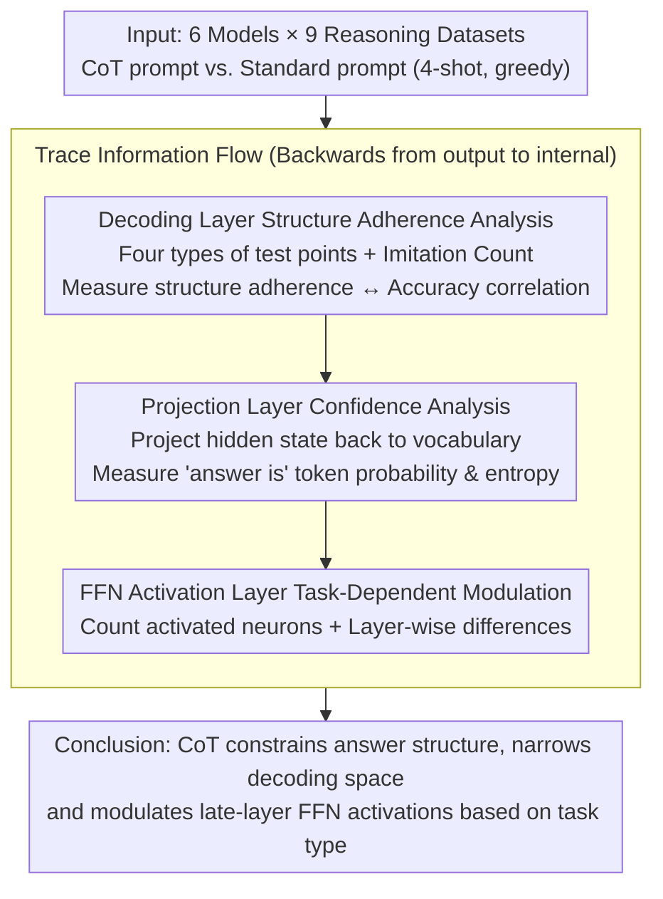

# How Chain-of-Thought Works? Tracing Information Flow from Decoding, Projection, and Activation

**Conference**: ACL2025  
**arXiv**: [2507.20758](https://arxiv.org/abs/2507.20758)  
**Code**: https://github.com/How-Young-X/cot  
**Area**: LLM Reasoning / Mechanistic Interpretability / Prompt Analysis  
**Keywords**: Chain-of-Thought, Information Flow Tracing, Decoding Space Pruning, Neuron Activation, Mechanistic Interpretability  

## TL;DR
This paper traces the information flow of CoT in reverse from three levels: decoding, probability projection, and FFN activation. It finds that CoT primarily improves reasoning performance by constraining answer structures, reducing prediction entropy, and modulating neuron activation based on task types, rather than simply making the model "truly more capable of logical reasoning."

## Background & Motivation
**Background**: Chain-of-Thought (CoT) prompting is a classic method for enhancing the multi-step reasoning capabilities of LLMs, providing significant gains in arithmetic, commonsense, and symbolic reasoning tasks. While many variants of CoT have been proposed, direct mechanistic evidence for why vanilla CoT is effective remains scarce.

**Limitations of Prior Work**: Existing explanations often remain at the behavioral level, such as "CoT reduces task complexity," "models imitate answer templates," or "prompt format is more important than logical content." These claims have intuitive plausibility but rarely connect external output changes to internal probability/activation shifts within the model.

**Key Challenge**: While the final text generated by CoT looks like reasoning, this does not equate to the model's internal execution of logic following human reasoning patterns. To understand CoT, one must look back from the output tokens: whether the generative distribution narrows, whether the answer space becomes more concentrated, and whether internal neurons participate in computation in different ways.

**Goal**: Establish an information flow analysis framework to explain how CoT alters model behavior across three stages—decoding, projection, and activation—and answer whether CoT expands reasoning capabilities or constrains output space and activation patterns.

**Key Insight**: The authors select vanilla CoT, six models ranging from 3B to 70B parameters, and nine reasoning datasets. They compare CoT with standard prompts under identical settings and map results to keyword imitation, answer structure adherence, token probability, entropy, and FFN activation.

**Core Idea**: CoT is viewed as an information flow regulator: it provides structural templates at the decoding layer, narrows the candidate answer distribution at the probability projection layer, and selectively increases or decreases the participation of late-layer FFN neurons according to the task type.

## Method
The paper does not propose a new reasoning model but rather a mechanistic analysis pipeline. It first examines whether the generated text imitates structures from the prompt, then checks if these structures lead to more concentrated probability distributions, and finally observes whether the quantity and layer-wise differences of FFN activations change systematically.

### Overall Architecture

Experiments cover three task categories: arithmetic reasoning (GSM8K, SVAMP, AQuA), commonsense reasoning (Bamboogle, StrategyQA, Date, Sports), and symbolic reasoning (Coin Flip, Last Letters Concatenation). Models include LLaMA3.1 8B/70B, Gemma2 2B/9B/27B, and LLaMA3.2-3B. All experiments use 4-shot prompts, greedy decoding, and a maximum generation length of 300 tokens.

The analysis follows a reverse order: it starts with **decoding**, observing how output tokens borrow keywords from prompts and questions; then **projection**, examining token probability and entropy when the hidden state is projected back to the vocabulary; and finally **activation**, counting activated neurons in FFNs and identifying hierarchical differences between CoT and standard prompts.

### Key Designs

**1. Decoding Layer Structure Adherence Analysis: Testing if CoT gains come from templates or true logic**

Existing explanations often rely on behavioral intuition like "CoT imitates answer templates" without quantification. The authors define four types of test points—time, action, loc&peo, and number—to count how many keywords in the generated text originate from the prompt versus the question. They further characterize the CoT reasoning structure (an "input entity" through an "operation" produces a "generated entity," followed by a "final answer statement"). An "Imitation Count" measures how strictly the results follow this structure. The key criterion is: if CoT's benefits truly come from the structural template, then structure adherence should strongly correlate with task accuracy—providing a better explanation than just looking at final accuracy.

**2. Projection Layer Confidence Analysis: Checking if CoT narrows the answer decoding space**

Outputting more steps of explanation does not automatically mean the model is more certain about the answer. The authors project the hidden state back to the vocabulary to track the token probability sequence of common decision phrases like "answer is ..." and use KDE to compare the probability distributions of CoT versus standard prompts. For closed-set answer spaces (e.g., AQuA, Sports, Coin Flip), they calculate the top-$k$ probability of candidate tokens and compute entropy. The criterion is: if CoT indeed prunes the decoding space, the probability of generating answer tokens should be more concentrated and the entropy should be lower.

**3. FFN Activation Layer Task-Dependent Modulation: Asking if CoT changes internal neuron participation**

If CoT only changes the output format, internal computation might not show systematic differences. The authors define units with FFN activation output greater than 0 as "activated neurons." They count the average number of activated neurons across layers and compare the difference between CoT and standard prompts. Total activation reflects global efficiency, while layer-wise difference reveals which layers CoT impacts most. Findings show that differences are not uniform: they concentrate in the top 1/3 of layers (late layers), and the direction depends on the task type—open-domain tasks often show negative differences (CoT acts as a pruner, reducing activation to focus), while closed-set tasks show positive differences (CoT acts as an amplifier, increasing activation for a fuller comparison of limited options).

### Loss & Training

This paper does not train new models or use new loss functions. All models are pre-trained LLMs performing inference under standard vs. CoT prompts. Key measurements include: Pearson correlation and $R^2$ between structure adherence and accuracy; token probability entropy for answer candidates; FFN activation counts $A_t^{(l)}$, representing the number of neurons with activation output $> 0$ at the $l$-th layer for the $t$-th generated token; and layer-wise activation differences.

## Key Experimental Results

### Main Results

| Dataset | Answer Space | LLaMA3.1-8B Standard Acc | LLaMA3.1-8B CoT Acc | Gain |
|--------|----------|--------------------------|---------------------|----------|
| AQuA | Closed Options | 0.3110 | 0.4961 | +59.49% |
| Sports | Yes/No | 0.7497 | 0.9395 | +25.30% |
| Coin Flip | Yes/No | 0.4580 | 1.0000 | +118.34% |
| GSM8K | Open Numeric | 0.1774 | 0.7771 | +338.03% |
| Date | Formatted Date | 0.4417 | 0.7100 | +67.4% |
| Last Letter Concat | Open Text | 0.0000 | 0.4496 | $\infty$ |

Note: Accuracies are based on LLaMA3.1-8B. CoT significantly improves accuracy across different answer spaces; for tasks where standard prompts are weak (e.g., GSM8K and Last Letter), structured intermediate steps provide the highest relative gains.

### Ablation Study

| Analysis Target | Key Findings/Values | Explanation |
|------|--------------------------|------|
| Adherence vs. Acc (GSM8K) | Pearson $r=0.75$ to $0.92$; $p<0.05$ for 4/5 models; $R^2=0.57$ to $0.84$ | Structural adherence explains a large portion of performance variance. |
| CoT Token Probability | CoT "answer is..." distribution is higher and more concentrated than standard. | CoT narrows the decoding space and increases confidence at the answer stage. |
| Closed-Set Entropy | In AQuA/Sports/Coin Flip, correct answer entropy is lower than incorrect; CoT < Standard. | CoT makes the candidate answer distribution sharper. |
| Total FFN Activation | LLaMA3.1-70B on AQuA: Standard activates ~820K neurons, CoT ~790K. | CoT reduces irrelevant activations in some tasks, forming more focused processing. |
| Layer-wise Activation Diff | Differences concentrate in the last 1/3 of layers; negative for open-domain, positive for closed-set. | CoT acts as a pruner in open-domain tasks and an amplifier in closed-set tasks. |

### Key Findings

- CoT does not just make models output longer text; it makes generation align with a specific reasoning structure. Stronger structural adherence correlates with higher GSM8K accuracy.
- Evidence from the projection layer supports **decoding space pruning**: answer token probabilities are more concentrated, and answer entropy is lower in closed-set tasks under CoT.
- Activation layers exhibit **task dependency**: in open-domain tasks, CoT tends to reduce late-layer activations (focusing), while in closed-set tasks, it tends to increase them (comparing limited options).

## Highlights & Insights
- **More Actionable Perspective on CoT**: Rather than vaguely stating CoT "helps reasoning," the paper decomposes the effect into measurable phenomena: structural adherence, probability concentration, and activation modulation.
- **Stronger Evidence for "Structure over Logic"**: The high correlation between structure adherence and accuracy suggests that part of CoT's benefit comes from constraining the output path into a stable template, rather than every natural language step necessarily being logically sound.
- **Task-Dependent Activation is Insightful**: CoT acts as a pruner for open-domain tasks and an amplifier for closed-set tasks. This suggests that future prompt or inference optimizations should not assume CoT has a uniform mechanism across all tasks.
- **Practical Implications for Efficient Inference**: If the key to CoT lies in structure and answer space constraints, one could design shorter, more structured prompts or trigger enhancements only at necessary late layers/stages, rather than blindly lengthening the chain.

## Limitations & Future Work

- **Correlation is not Causation**: The authors explicitly note that while there is strong evidence for relations between structure adherence and accuracy or CoT and activation differences, these remain heuristic or correlational and do not fully prove specific neural mechanisms cause performance gains.
- **Fragmented Granularity of Explanation**: The study analyzes decoding, projection, and activation separately, but has not yet combined them into a rigorous, unified causal chain. How levels drive each other requires stronger intervention experiments.
- **Internal Model remains a Black Box**: The function of individual FFN neurons, the meaning of high-dimensional representations, and cross-layer information flow are still difficult to determine. Using activation counts only provides a coarse-grained view of participation.
- **Limited Task Coverage**: Experiments focused on vanilla CoT and typical reasoning benchmarks. Mechanisms might differ for self-consistency, tool-augmented CoT, agentic planning, or long-context complex tasks.

## Related Work & Insights
- **Behavioral Analysis of CoT**: Early work observed CoT improves accuracy or imitates templates; this paper quantifies template imitation via test points and Imitation Count, linking it statistically to accuracy.
- **Mechanistic Interpretability**: Existing work analyzes FFN memory, reasoning neurons, activation sparsity, and logit lenses; this paper applies these concepts to CoT, focusing on how prompts change output probabilities and FFN activation.
- **Prompt Format Research**: Works like Madaan et al. suggest format and structure affect CoT performance; this paper provides direct decoding/projection/activation evidence for these claims.
- **Inspiring Prompt Design**: Instead of pursuing longer chains, design structural templates that match the task's answer space; emphasize comparison for closed-set tasks and step-wise pruning/entity constraints for open-domain tasks.

## Rating
- Novelty: ⭐⭐⭐⭐ Systematically analyzes CoT across three information flow stages; task-dependent activation findings are particularly novel.
- Experimental Thoroughness: ⭐⭐⭐⭐ Covers 6 models and 9 datasets with multiple analysis dimensions; however, some core results are presented as trends rather than exhaustive tables of values.
- Writing Quality: ⭐⭐⭐⭐ Logic is clear and limitations are addressed honestly.
- Value: ⭐⭐⭐⭐ Very helpful for understanding CoT and designing more efficient prompts; a strong reference for mechanistic explanation research.

<!-- RELATED:START -->

## Related Papers

- [\[ICML 2026\] How Far Ahead Do LLMs Plan? Uncovering the Latent Horizon in Chain-of-Thought Reasoning](../../ICML2026/llm_reasoning/how_far_ahead_do_llms_plan_uncovering_the_latent_horizon_in_chain-of-thought_rea.md)
- [\[ACL 2026\] AIM-CoT: Active Information-driven Multimodal Chain-of-Thought for Vision-Language Reasoning](aim-cot_active_information-driven_multimodal_chain-of-thought_for_vision-languag.md)
- [\[CVPR 2026\] Rationale-Enhanced Decoding for Multi-modal Chain-of-Thought](../../CVPR2026/llm_reasoning/rationale-enhanced_decoding_for_multi-modal_chain-of-thought.md)
- [\[ACL 2026\] Reasoning Fails Where Step Flow Breaks](reasoning_fails_where_step_flow_breaks.md)
- [\[ACL 2026\] Is Chain-of-Thought Really Not Explainability? Chain-of-Thought Can Be Faithful without Hint Verbalization](is_chain-of-thought_really_not_explainability_chain-of-thought_can_be_faithful_w.md)

<!-- RELATED:END -->
