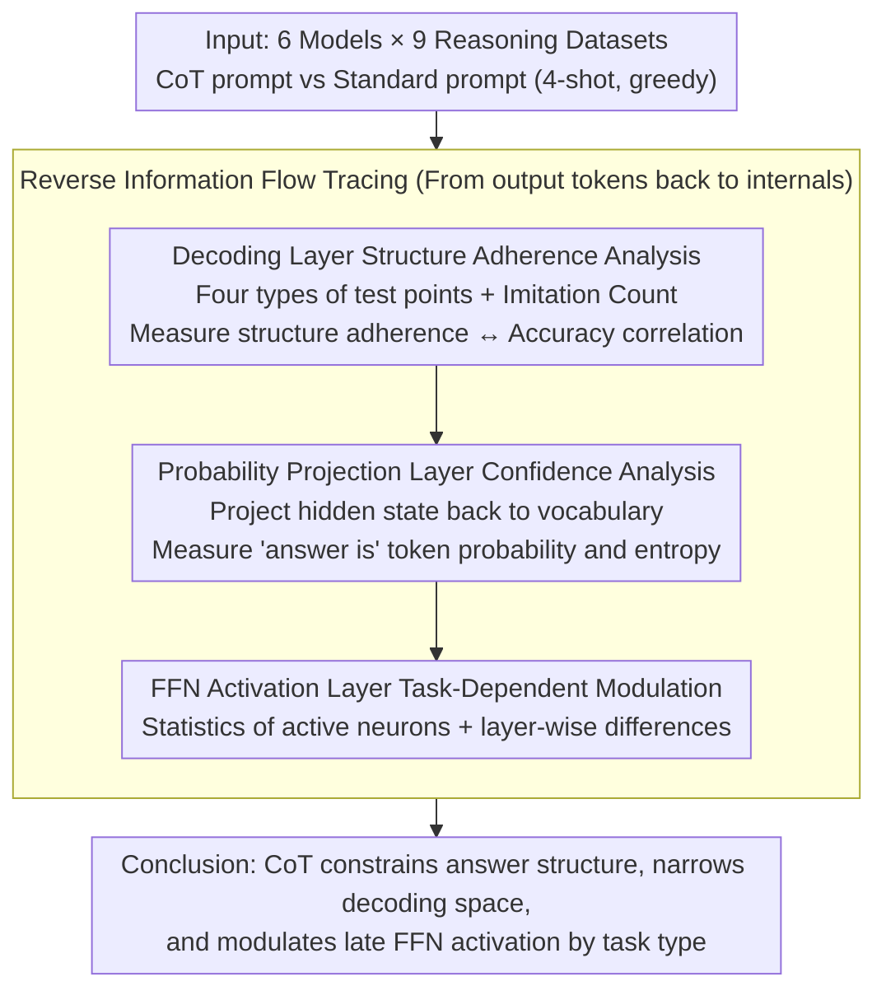

# How Chain-of-Thought Works? Tracing Information Flow from Decoding, Projection, and Activation

**Conference**: ACL2026  
**arXiv**: [2507.20758](https://arxiv.org/abs/2507.20758)  
**Code**: https://github.com/How-Young-X/cot  
**Area**: LLM Reasoning / Mechanistic Interpretability / Prompt Analysis  
**Keywords**: Chain-of-Thought, information flow tracing, decoding space pruning, neuron activation, mechanistic interpretability  

## TL;DR
This paper traces the information flow of CoT in reverse across three levels: decoding, probability projection, and FFN activation. It finds that CoT enhances reasoning performance primarily by constraining answer structures, reducing prediction entropy, and modulating neuron activation based on task type, rather than merely making models "genuinely more capable of logical reasoning."

## Background & Motivation
**Background**: Chain-of-Thought (CoT) prompting is a classic method for enhancing multi-step reasoning in LLMs, yielding significant gains in arithmetic, commonsense, and symbolic reasoning tasks. While many variants of CoT have been proposed, direct mechanistic evidence explaining why vanilla CoT is effective remains scarce.

**Limitations of Prior Work**: Existing explanations often remain at a behavioral level, such as "CoT reduces task complexity," "models imitate answer templates," or "prompt format is more important than logical content." These claims have intuitive appeal but rarely link external output changes to internal model probabilities or activation shifts.

**Key Challenge**: The final text generated by CoT appears to be reasoning, but this does not equate to the model internally executing logic according to human reasoning. To understand CoT, one must look back from the output tokens to see if the generation distribution narrows, the answer space becomes more concentrated, and whether internal neurons participate in computation differently.

**Goal**: Establish an information flow analysis framework to explain how CoT alters model behavior across decoding, projection, and activation stages, answering whether CoT expands reasoning capabilities or merely constrains the output space and activation patterns.

**Key Insight**: The authors select vanilla CoT, six models ranging from 3B to 70B parameters, and nine reasoning datasets. They compare CoT with standard prompts under identical settings, mapping results to keyword imitation, structural adherence, token probabilities, entropy, and FFN activation.

**Core Idea**: CoT is viewed as an information flow regulator: it provides structural templates at the decoding layer, narrows the candidate answer distribution at the probability projection layer, and selectively increases or decreases FFN neuron involvement in the later layers based on task type.

## Method
Instead of proposing a new model, this paper introduces a mechanistic analysis pipeline. It examines whether generated text imitates prompt structures, whether these structures lead to more concentrated probability distributions, and whether systematic changes occur in FFN activation counts and inter-layer differences.

### Overall Architecture

The experiments cover three task categories: arithmetic reasoning (GSM8K, SVAMP, AQuA), commonsense reasoning (Bamboogle, StrategyQA, Date, Sports), and symbolic reasoning (Coin Flip, Last Letters Concatenation). Models used include LLaMA3.1 8B/70B, Gemma2 2B/9B/27B, and LLaMA3.2-3B. All experiments utilize 4-shot prompts, greedy decoding, and a maximum generation length of 300 tokens.

The analysis follows a reverse order: beginning with decoding (how output text borrows keywords from prompts and questions); moving to projection (token probability and entropy after projecting hidden states to the vocabulary); and concluding with activation (counting activated neurons in FFN layers and layer-wise differences between CoT and standard prompts).

### Key Designs

**1. Decoding Layer Structure Adherence Analysis: Testing whether CoT gains come from templates or logic**

Existing explanations often rely on the behavioral intuition that "CoT imitates answer templates" without quantifying it. The authors define four types of test points—time, action, loc&peo, and number—to count whether keywords in generated text originate from the prompt or the question. They further characterize the CoT reasoning structure (an "input entity processed by an operation yields a generated entity, followed by a final answer statement") using an "Imitation Count" to measure adherence. If CoT's benefits stem from structural templates, adherence should strongly correlate with task accuracy—providing a better explanation than final accuracy alone.

**2. Probability Projection Layer Confidence Analysis: Testing if CoT narrows the answer decoding space**

Outputting more explanation steps does not necessarily mean the model is more certain about the answer. The authors project hidden states back to the vocabulary to track the token probability sequence of common decision phrases like "answer is..." and use KDE to compare CoT and standard prompt distributions. For closed-set tasks (AQuA, Sports, Coin Flip), they calculate the top-$k$ probability and entropy of candidate tokens. If CoT prunes the decoding space, answer token probabilities should be more concentrated and entropy lower.

**3. FFN Activation Layer Task-Dependent Modulation: Testing if CoT changes internal neuron participation**

If CoT only changes output format, internal computation might not show systematic differences. Units with FFN activation outputs $>0$ are regarded as activated neurons. The authors count the average activated neurons per layer and compare the difference between CoT and standard prompts. Total activation reflects global efficiency, while layer-wise differences reveal which layers CoT impacts most. Differences were found to be non-uniform, concentrating in the final 1/3 of layers. The direction varies by task: open-domain tasks show negative differences (CoT acts as a pruner to help the model focus), while closed-set tasks show positive differences (CoT acts as an amplifier to compare limited options).

### Loss & Training
This study does not train new models or use new loss functions. All models are pre-trained LLMs performing inference. Key measurements include: Pearson correlation and $R^2$ between structure adherence and accuracy; entropy of answer candidate probabilities; FFN activation counts $A_t^{(l)}$, representing the number of neurons with activation $>0$ for the $t$-th token at layer $l$; and layer-wise activation differences.

## Key Experimental Results

### Main Results

| Dataset | Answer Space | LLaMA3.1-8B Standard Acc | LLaMA3.1-8B CoT Acc | Gain |
|--------|----------|--------------------------|---------------------|----------|
| AQuA | Closed-set options | 0.3110 | 0.4961 | +59.49% |
| Sports | Yes/No | 0.7497 | 0.9395 | +25.30% |
| Coin Flip | Yes/No | 0.4580 | 1.0000 | +118.34% |
| GSM8K | Open numeric | 0.1774 | 0.7771 | +338.03% |
| Date | Formatted date | 0.4417 | 0.7100 | +67.4% |
| Last Letter Concat | Open text | 0.0000 | 0.4496 | (Inf) |

This table represents LLaMA3.1-8B results. CoT significantly improves accuracy across different answer spaces. In tasks where standard prompts are weak (e.g., GSM8K and Last Letter), structured intermediate steps provide the highest relative gains.

### Ablation Study

| Analysis Target | Key Observation/Value | Explanation |
|------|--------------------------|------|
| Structure Adherence & GSM8K | Pearson $r=0.75$ to $0.92$; $p<0.05$ for 4/5 models; $R^2=0.57$ to $0.84$ | Structure adherence explains a large portion of performance variance. |
| CoT token probability | "answer is ..." distribution is higher and more concentrated for CoT. | CoT narrows the decoding space and increases confidence. |
| Closed-set entropy | Entropy is lower for correct vs. incorrect answers, and lower for CoT vs. standard. | CoT sharpens the candidate answer distribution. |
| Total FFN Activation | LLaMA3.1-70B on AQuA: Standard activates ~820K neurons vs. CoT ~790K. | CoT reduces irrelevant activations in some tasks for more focused processing. |
| Layer-wise Activation | Differences concentrate in the final 1/3 of layers. | Negative difference for open-domain (pruner), positive for closed-set (amplifier). |

### Key Findings

- CoT does more than lengthen output; it makes generation adhere to a specific reasoning structure. Stronger structural adherence correlates with higher GSM8K accuracy.
- Evidence from the projection layer supports decoding space pruning: answer token probabilities are more concentrated, and entropy is lower for closed-set tasks under CoT.
- Activation layers exhibit task dependency: in open-domain tasks, CoT tends to reduce late-layer activations to help the model focus; in closed-set tasks, it increases them to better compare limited options.

## Highlights & Insights
- **More Actionable Explanation**: The paper avoids vague claims about "helping reasoning" by decomposing CoT's effects into measurable phenomena: structural adherence, probability concentration, and activation modulation.
- **Evidence for Structure Over Logic**: High correlation between structure adherence and accuracy suggests much of CoT's benefit comes from constraining the output path into a stable template rather than every natural language step being perfectly logical.
- **Insightful Task-Dependent Activation**: CoT functions as a pruner in open-domain tasks and an amplifier in closed-set tasks. This implies that future prompt optimization should not assume a unified mechanism across all task types.
- **Practical Implications for Efficient Inference**: If CoT relies on structure and answer space constraints, designers can create shorter, highly structured prompts or trigger enhancements only in necessary late layers rather than blindly lengthening the chain.

## Limitations & Future Work

- **Correlation is Not Causality**: The authors note that while they provide strong evidence linking structure adherence to accuracy and CoT to activation shifts, these remain heuristic or correlational explanations that do not fully prove specific neural mechanisms cause the performance gain.
- **Fragmented Granularity**: The study analyzes decoding, projection, and activation separately without yet forming a strictly unified causal chain. Stronger intervention experiments are needed to show how these layers drive one another.
- **Model Internals Remain a Black Box**: Determining the function of individual FFN neurons or the meaning of high-dimensional representations remains difficult. Activation counts offer a coarse view of involvement but do not specify where knowledge or algorithms are executed.
- **Limited Task Coverage**: Experiments are focused on vanilla CoT and typical reasoning benchmarks. Mechanisms might differ for self-consistency, tool-augmented CoT, agentic planning, or long-context complex tasks.

## Related Work & Insights
- **vs. CoT Behavioral Analysis**: Early work observed accuracy gains or template imitation; this paper quantifies template imitation via test points and Imitation Count, establishing statistical links to accuracy.
- **vs. Mechanistic Interpretability**: Prior studies analyzed FFN memory, reasoning neurons, and logit lenses; this paper applies these concepts to CoT, focusing on how prompts change output probabilities and FFN activation.
- **vs. Prompt Format Research**: Work by Madaan et al. suggests format and structure affect CoT; this paper provides more direct evidence at the decoding, projection, and activation levels.
- **Inspiration for Prompt Design**: Rather than pursuing longer CoT, focus on designing structural templates that match the task's answer space—emphasizing option comparison for closed-set tasks and step-wise pruning/entity constraints for open-domain tasks.

## Rating
- Novelty: ⭐⭐⭐⭐ Systematically analyzing CoT across three information flow stages, particularly task-dependent activation, is innovative.
- Experimental Thoroughness: ⭐⭐⭐⭐ Covers 6 models and 9 datasets with multiple analysis dimensions, though some values are represented as trends rather than full tables.
- Writing Quality: ⭐⭐⭐⭐ Clear narrative and honest about limitations, though some numbering in the cached text is slightly inconsistent.
- Value: ⭐⭐⭐⭐ Highly useful for understanding CoT and designing efficient prompts; serves as a strong reference for mechanistic explanation research.

<!-- RELATED:START -->

## Related Papers

- [\[ICML 2026\] How Far Ahead Do LLMs Plan? Uncovering the Latent Horizon in Chain-of-Thought Reasoning](../../ICML2026/llm_reasoning/how_far_ahead_do_llms_plan_uncovering_the_latent_horizon_in_chain-of-thought_rea.md)
- [\[CVPR 2026\] Rationale-Enhanced Decoding for Multi-modal Chain-of-Thought](../../CVPR2026/llm_reasoning/rationale-enhanced_decoding_for_multi-modal_chain-of-thought.md)
- [\[ACL 2026\] AIM-CoT: Active Information-driven Multimodal Chain-of-Thought for Vision-Language Reasoning](aim-cot_active_information-driven_multimodal_chain-of-thought_for_vision-languag.md)
- [\[ACL 2026\] Reasoning Fails Where Step Flow Breaks](reasoning_fails_where_step_flow_breaks.md)
- [\[ICLR 2026\] AIMCoT: Active Information-driven Multimodal Chain-of-Thought for Vision-Language Reasoning](../../ICLR2026/llm_reasoning/aimcot_active_information-driven_multimodal_chain-of-thought_for_vision-language.md)

<!-- RELATED:END -->
