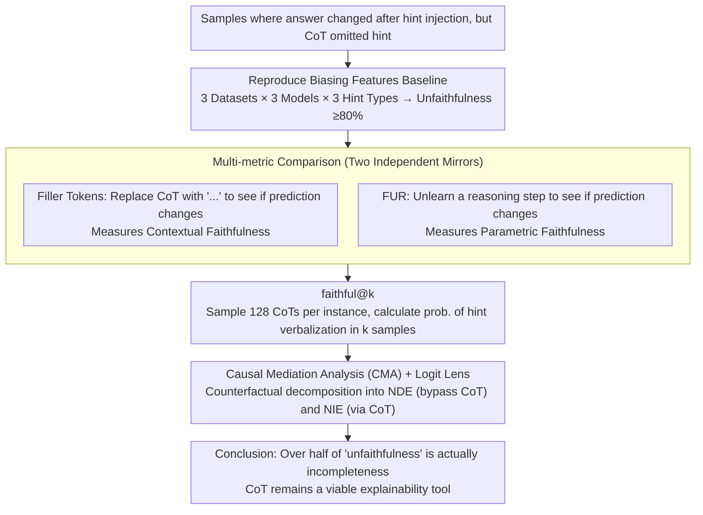

# Is Chain-of-Thought Really Not Explainability? Chain-of-Thought Can Be Faithful without Hint Verbalization

**Conference**: ACL 2026  
**arXiv**: [2512.23032](https://arxiv.org/abs/2512.23032)  
**Code**: https://github.com/KeremZaman/IsCotExplainability (Available)  
**Area**: LLM Reasoning / Explainability / CoT Faithfulness  
**Keywords**: Chain-of-Thought, faithfulness evaluation, hint verbalization, causal mediation analysis, faithful@k

## TL;DR
This paper systematically refutes the popular recent conclusion that "CoT does not count as explainability." Using four complementary metrics—Filler Tokens, FUR, faithful@k, and Causal Mediation Analysis—it demonstrates that over half of CoT samples judged "unfaithful" by Biasing Features (hint verbalization) actually reflect model reasoning "in other ways." Unfaithfulness primarily stems from "incompleteness" due to lossy natural language compression rather than true divergence—increasing the sampling budget can raise hint verbalization probability to 90%, and even non-verbalized hints can causally transmit influence through the CoT.

## Background & Motivation
**Background**: Over the past two years, the academic community has repeatedly debated whether CoT is trustworthy. The mainstream "CoT is unfaithful" narrative is almost entirely built on the Biasing Features (hint verbalization) metric: a hint is injected into the input (e.g., "A Stanford professor thinks the answer is A"); if the model's answer changes accordingly but the CoT does not explicitly mention the hint, it is judged as unfaithful. Lanham 2023, Turpin 2023, Chen 2025, and Chua 2025 have all used this to reach pessimistic conclusions of "≥80% CoT unfaithfulness."

**Limitations of Prior Work**: (a) This definition is too narrow—it equates "the model didn't write out the hint" with "model reasoning is inconsistent with CoT," yet Transformer reasoning is highly distributed, and natural language can only perform lossy compression (missing words $\ne$ false statements); (b) A single-metric perspective collapses faithfulness into one dimension, ignoring the alignment between CoT and the model's decision-making computations; (c) If this narrative is absorbed into future training pipelines, it will incentivize "verbalization for the sake of verbalization" rather than improving true explainability.

**Key Challenge**: Faithfulness $\ne$ Completeness. Biasing Features actually measures "verbalized sensitivity to a known intervention," which is a useful reporting measure but has been mistakenly elevated to a synonym for faithfulness.

**Goal**: (1) Re-evaluate samples judged unfaithful by Biasing Features using other existing faithfulness metrics; (2) Use increased sampling budgets (faithful@k) to test if unfaithfulness is simply caused by token constraints; (3) Use Causal Mediation Analysis to quantify whether "non-verbalized hints" are propagated through the CoT.

**Key Insight**: Distinguish "hint not in CoT" into two possibilities: incompleteness (partial writing) vs unfaithfulness (no actual influence), empirically separating them using multi-metrics, multi-sample budgets, and causal mediation.

**Core Idea**: The "broad-brush description" of unfaithfulness is inaccurate—CoT remains a viable explainability tool, provided it is paired with diverse validations (FUR / Filler Tokens / faithful@k / CMA) to avoid being misled by the narrow metric of hint verbalization.

## Method

### Overall Architecture
The paper is an analytical/critical work with a pipeline consisting of four segments:

1. **Reproduce Biasing Features Baseline**: Run standard results showing "unfaithfulness rate ≥ 80%" on OpenbookQA / StrategyQA / ARC-Easy using 3 hint types × 3 instruct models (Llama-3-8B-Instruct, Llama-3.2-3B-Instruct, gemma-3-4b-it).
2. **Re-assessment via Filler Tokens + FUR**: Pass samples judged "unfaithful" by Biasing Features through two other metrics.
3. **faithful@k Test for Incompleteness**: Sample 128 CoTs per instance to calculate the probability of "at least one verbalized hint in $k$ samples," analogous to pass@k.
4. **Logit Lens + Causal Mediation Analysis**: Trace hint information flow at token and layer levels to quantify the proportion of hint→prediction influence carried by CoT as a "mediator variable" (NIE vs NDE).

Key experiments were finally repeated on Llama-3.3-70B-Instruct and Qwen-3-32B (thinking mode) to verify generalizability.

### Key Designs

**1. Multi-metric Comparison: Using Two Independent Mirrors to Reveal Biasing Features' Blind Spots**

The fundamental problem with Biasing Features is its singular focus on whether the "hint is written into the CoT." If it's missing, it's judged unfaithful—but missing words do not equal false statements. The paper's counter-strategy is to re-evaluate the same "unfaithful" samples using two metrics with different mechanisms: Filler Tokens replaces the entire CoT with meaningless "..." to see if the prediction changes, $\mathcal{F}_{\mathrm{FT}}=\mathbb{1}[\hat y_{h,\text{corr}}\ne\hat y_h]$; if the prediction changes, it proves the CoT was truly used during reasoning (contextual faithfulness). FUR conversely unlearns a reasoning step, $\mathcal{F}_{\mathrm{FUR}}=\mathbb{1}[\exists\,r_i: M(x_h)\ne M^{(i)*}(x_h)]$; if the prediction changes, it indicates the step reflects actual computation in model parameters (parametric faithfulness).

**2. faithful@k: Decoupling Sampling Luck from Faithfulness**

Greedy decoding looks at only one trajectory. If the hint isn't written once, it's a final verdict—like judging a movie by one frame. The model might have the ability to write the hint but simply didn't sample it. faithful@k adapts the pass@k idea: $\text{faithful@k}=\mathbb{E}[1-\binom{n-c}{k}/\binom{n}{k}]$, where $n$ is the number of hint-influenced samples and $c$ is those with verbalized hints. It represents the probability that at least one of $k$ sampled CoTs mentions the hint.

**3. Causal Mediation Analysis: Using Counterfactual Intervention to Prove CoT is a Causal Mediator, Not a Post-hoc Rationalization**

CMA decomposes the "total change caused by the hint" into two paths. Natural Direct Effect (NDE) fixes the original CoT and only replaces the hinted input, $\text{NDE}=\mathbb{E}_x[p_h(x_h,c)-p_h(x,c)]$, capturing the portion where the hint bypasses the CoT. Natural Indirect Effect (NIE) fixes the original input and only replaces the hinted CoT, $\text{NIE}=\mathbb{E}_x[p_h(x,c_h)-p_h(x,c)]$, capturing the portion where the hint modifies the CoT, which then influences the prediction. A significant NIE confirms that the CoT causally carries the hint's influence.

### Loss & Training
This is an analytical work and does not involve training losses. FUR uses unlearning via NPO (Negative Preference Optimization) + KL constraint. For Llama, standard lrs were used; for gemma-3-4b, a 7-step lr grid search was performed to find $5e-6$ (max efficacy with specificity $\ge 95\%$). faithful@k uses default sampling (Llama: T=0.6, top-p=0.9; gemma: top-k=64, top-p=0.95; Qwen: top-k=20, top-p=0.95, T=0.6) with 128 samples per instance.

## Key Experimental Results

### Main Results
Comparison of Biasing Features with alternative metrics (percentage of "samples judged unfaithful by Biasing that are judged faithful by alternatives"):

| Model | Hint Type | Filler Tokens Faithfulness | FUR Faithfulness |
|---|---|---|---|
| Llama-3.2-3B-Instruct | Black Squares | **60%** | $\ge 50\%$ across all tasks |
| Llama-3.2-3B-Instruct | Professor | 38.6% (ARC-Easy avg) | 65.1% (ARC-Easy) |
| Llama-3.2-3B-Instruct | Metadata | 47.5% (ARC-Easy) | 56.6% (ARC-Easy) |
| Llama-3-8B-Instruct | Black Squares | 50% (ARC-Easy) | 60% |
| Llama-3-8B-Instruct | Professor | 56.4% (ARC-Easy) | 89.3% |
| gemma-3-4b-it | Professor | 45% (ARC-Easy) | 33.6% (ARC-Easy) |

faithful@k trends (averaged across tasks):

| Model | Professor faithful@1 → @16 | Black Squares faithful@1 → @16 |
|---|---|---|
| gemma-3-4b-it | ~0.3 → **~0.90** | Flat |
| Llama-3.2-3B-Instruct | ~0.4 → ~0.5 | Flat |
| Llama-3-8B-Instruct | Moderate increase | Flat |
| Llama-3.3-70B-Instruct | 0.4 → > 0.8 (StrategyQA) | Flat |
| Qwen-3-32B (reasoning) | All hints increase | Slow growth |

### Ablation Study (Causal Mediation Analysis)

Core conclusions for NDE / NIE on Professor hints (based on 10,000 bootstrap iterations):

| Model | Task | NDE Signif. | NIE Signif. | Magnitude |
|---|---|---|---|---|
| Llama-3-8B-Instruct | StrategyQA | Yes | **Yes** | NIE > NDE |
| Llama-3-8B-Instruct | OpenbookQA | Yes | **Yes** | NIE > NDE |
| gemma-3-4b-it | OpenbookQA | Yes | Yes | NDE > NIE |
| gemma-3-4b-it | ARC-Easy | Yes | Yes | NDE > NIE |
| Llama-3.2-3B-Instruct | All | Yes | Yes | Comparable |

### Key Findings
- **Scale doesn't fix Biasing Features**: On Llama-3.3-70B and Qwen-3-32B, unfaithfulness remains $\ge 65\%$, yet Filler Tokens identifies up to 72% of "substantially faithful" samples under Black Squares hints.
- **CoT is a true causal mediator**: NIE is significant almost everywhere; for Llama-3-8B, NIE > NDE. Even when the CoT doesn't mention the hint, it remains the primary causal path to the prediction.
- **Logit Lens reveals peaks at layers 20–25**: Even if CoT omits the hint, hint-related tokens appear frequently in intermediate MHA top-5 logits, concentrated near "answer" text or reasoning step markers.
- **Contrast in gemma**: High Filler Tokens (context sensitive) but low FUR (low parametric alignment) proves models excel in different faithfulness dimensions.

## Highlights & Insights
- **Paradigm Correction**: The paper provides a cool-headed rebuttal to the popular "CoT is untrustworthy" narrative, showing it remains a useful tool if not limited to a single narrow metric.
- **Conceptual Distinction**: Separating "compressed statements" (incompleteness) from "systematic misleading" (unfaithfulness) provides the explainability community with more refined analytical vocabulary.
- **faithful@k Utility**: Moving pass@k to faithfulness evaluation makes latent faithfulness explicit.
- **CMA Proof**: Formally proving that even non-verbalized CoT acts as a causal channel for inputs fundamentally changes the interpretation of model "rationalizations."

## Limitations & Future Work
- **Ours**: (a) faithful@k cannot distinguish between "always influenced but rarely verbalized" vs "only occasionally faithful" at the instance level; (b) does not distinguish incompleteness from non-exhaustiveness; (c) LLM-as-judge recall is only 31%.
- **Future Directions**: Extend CMA to step-by-step granularity; establish a unified benchmark merging verbalization, NIE, FUR, and FT; study the "compression-faithfulness" trade-off curve.

## Related Work & Insights
- **vs Turpin 2023 / Chen 2025**: Uses the same Biasing Features but provides a substantive rebuttal using complementary metrics.
- **vs Lanham 2023**: Reuses Filler Tokens to identify contextual faithfulness missed by hint-based tests.
- **vs Tutek 2025**: Reuses FUR to show that parametric and hint-based metrics often yield opposite conclusions.

## Rating
- Novelty: ⭐⭐⭐⭐ (Counter-narrative + faithful@k + CMA combination).
- Experimental Thoroughness: ⭐⭐⭐⭐⭐ (Broad model/dataset/metric coverage).
- Writing Quality: ⭐⭐⭐⭐⭐ (Clear logic and categorical distinctions).
- Value: ⭐⭐⭐⭐⭐ (Actionable suggestions for AI safety and interpretability communities).

<!-- RELATED:START -->

## Related Papers

- [\[ICML 2026\] Chain-of-Thought Reasoning in the Wild Is Not Always Faithful](../../ICML2026/llm_reasoning/chain-of-thought_reasoning_in_the_wild_is_not_always_faithful.md)
- [\[ACL 2026\] Learning to Edit Knowledge via Instruction-based Chain-of-Thought Prompting](learning_to_edit_knowledge_via_instruction-based_chain-of-thought_prompting.md)
- [\[ACL 2026\] Render-of-Thought: Rendering Textual Chain-of-Thought as Images for Visual Latent Reasoning](render-of-thought_rendering_textual_chain-of-thought_as_images_for_visual_latent.md)
- [\[ICML 2026\] Hidden Error Awareness in Chain-of-Thought Reasoning: The Signal Is Diagnostic, Not Causal](../../ICML2026/llm_reasoning/hidden_error_awareness_in_chain-of-thought_reasoning_the_signal_is_diagnostic_no.md)
- [\[ACL 2026\] ETR: Entropy Trend Reward for Efficient Chain-of-Thought Reasoning](etr_entropy_trend_reward_for_efficient_chain-of-thought_reasoning.md)

<!-- RELATED:END -->
