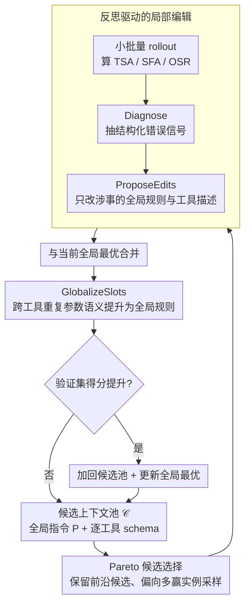

# JTPRO: A Joint Tool-Prompt Reflective Optimization Framework for Language Agents

**Conference**: ACL 2026  
**arXiv**: [2604.19821](https://arxiv.org/abs/2604.19821)  
**Code**: None  
**Area**: LLM Reasoning  
**Keywords**: Tool call optimization, Prompt optimization, Reflective learning, Large tool libraries, Joint optimization

## TL;DR
JTPRO proposes a joint optimization framework that avoids model fine-tuning. By using reflection-driven iterative editing, it simultaneously optimizes global instructions and tool-wise schemas/parameter descriptions. This significantly improves end-to-end success rates in large-scale tool library scenarios, achieving a 5%–20% gain in OSR compared to baselines like GEPA.

## Background & Motivation

**Background**: The paradigm of extending LLM Agent capabilities via external tools has become mainstream. However, tool call reliability drops sharply as the number of tools grows to hundreds or thousands. Existing methods include fine-tuning, retrieval augmentation, and prompt optimization, yet most treat global instructions and tool descriptions separately.

**Limitations of Prior Work**: Two core problems emerge in large toolkits: (1) Generic global prompts cannot distinguish between similar tools, leading to tool mis-selection; (2) Tool schema descriptions are insufficiently precise, causing parameter instantiation errors (slot/value errors). Experimental results on ToolACE indicate that even with GPT-5 level models, tool selection accuracy decreases significantly when scaling from 300 to 1000 tools.

**Key Challenge**: There is a coupled dependency between global instructions and local tool descriptions—the global strategy relies on differentiation cues between tools, while parameter filling depends on global conventions (e.g., date formats, numerical ranges). Optimizing either component in isolation is insufficient.

**Goal**: Design a framework to iteratively optimize global instructions $P$ and tool-wise schemas $\{T_i\}$ without fine-tuning, maximizing the agent's call-level correctness (tool + parameters + values) under large-scale tool libraries.

**Key Insight**: The authors observe that the bottleneck for end-to-end success is often parameter filling (slot filling) rather than tool selection. Furthermore, many parameter semantics (such as date formats or boolean flags) recur across multiple tools; redundancy and inconsistency can be eliminated through globalization.

**Core Idea**: Jointly and iteratively optimize the Agent's global instructions and tool-specific descriptions through Pareto candidate selection, reflection-driven local editing, and globalization of shared parameter semantics.

## Method

### Overall Architecture
JTPRO maintains a candidate context pool $\mathcal{C}$. In each iteration: (1) A candidate is selected via Pareto sampling; (2) Small-batch rollouts are conducted to obtain diagnostic feedback; (3) Local edits to the global instruction $P$ and relevant tool schemas $\{T_i\}$ are proposed based on feedback; (4) The edited version is merged with the current best; (5) Repeated parameter semantics are globalized; (6) The candidate pool and global optimum are updated after validation.

### Key Designs

**1. Pareto Candidate Selection: Avoiding Single-Optimum Convergence and Preserving Exploration Diversity**

Iterative optimization in text space is prone to converging prematurely to a locally optimal context. JTPRO mitigates this by adopting the Pareto principle from GEPA: any context that achieves the highest score on at least one training instance is kept in the candidate pool, while those strictly dominated by others are pruned. Sampling then occurs from these frontier candidates with a probability biased toward those that "win more instances." This ensures the system is not locked into a single global optimum and allows diverse versions with historical strengths to be further refined.

**2. Reflection-driven Local Editing: Target Specific Rules Without Rewriting**

Large tool libraries exhibit diverse failure modes—incorrect tool selection, missing parameters, or format/value errors. Coarsely rewriting the entire prompt leads to context bloat and may break previously correct parts. JTPRO first performs small-batch rollouts, uses a `Diagnose` function to extract structured error signals (tool confusion / missing parameters / format errors) for each failure, and then employs a reflector `ProposeEdits` to generate targeted edits. Only the global rules or tool descriptions responsible for the failure are modified. By restricting changes to the "involved local area," specific errors are removed precisely without causing context expansion.

**3. GlobalizeSlots: Elevating Recurring Parameter Semantics into Global Rules**

In libraries with thousands of tools, many parameter semantics repeat—such as date formats, numerical boundaries, and boolean flags. In the ETID dataset, parameters like identifiers and datetimes recur across 77/124 tools. Writing these into every tool schema causes text redundancy, occupies space meant for differentiating tools, and risks inconsistency. `GlobalizeSlots` identifies shared semantics and elevates them to named rules in the global instructions (e.g., a unified "DateTime Fields"). Local tool schemas then use short pointers to reference fields like `startDate` or `endDate`. This ensures semantic consistency, eliminates potential conflicts, and reclaims schema space for tool-specific cues—directly addressing the finding that parameter filling (SFA) is a major bottleneck for end-to-end success.

### Loss & Training
The optimization goal is to minimize call-level loss, which comprises tool selection, parameter filling, and overall success rate. The entire process requires no gradient updates and iterates entirely within the text space.

## Key Experimental Results

### Main Results

| Model | Tool Count | Method | TSA(%) | SFA(%) | OSR(%) |
|------|--------|------|--------|--------|--------|
| GPT-5 | 500 | Base | 73.02 | 84.79 | 62.73 |
| GPT-5 | 500 | GEPA | 77.17 | 85.75 | 66.12 |
| GPT-5 | 500 | **JTPRO** | **82.28** | **90.00** | **74.38** |
| GPT-5 | 1000 | Base | 67.66 | 87.35 | 62.37 |
| GPT-5 | 1000 | GEPA | 75.13 | 86.40 | 67.77 |
| GPT-5 | 1000 | **JTPRO** | **78.72** | **89.26** | **73.55** |
| o3-mini | 1000 | Base | 58.92 | 85.04 | 51.27 |
| o3-mini | 1000 | **JTPRO** | **71.48** | **87.46** | **64.46** |

### Ablation Study (ETID Dataset)

| Configuration | Description |
|------|------|
| Optimize Global Instruction $P$ Only | Lacks tool-level differentiation; lower OSR |
| Optimize Tool Schema $T$ Only | Lacks global conventions; lower OSR |
| **Joint Optimization $P+T$ (JTPRO)** | Complementary gains; optimal OSR |

### Key Findings
- **Joint Optimization outperforms individual optimization**: Optimizing only instructions or only schemas is inferior to joint optimization, confirming their coupled dependency.
- **Maximum gains in 1000-tool scenarios**: As the library grows and confusion increases, JTPRO's advantages become more pronounced (o3-mini OSR gain of +13.2 percentage points at 1000 tools).
- **SFA is the key OSR bottleneck**: In datasets with complex schemas like ETID, parameter filling correctness contributes significantly more to end-to-end success than tool selection.
- **Globalization reduces redundancy and improves consistency**: The `GlobalizeSlots` step shrinks schema length and improves parameter filling accuracy through semantic unification.

## Highlights & Insights
- The **argument for the necessity of joint optimization** is compelling: Figure 1 clearly shows SFA driving OSR, while Figure 2 illustrates the performance drop caused by tool scaling.
- The **design of GlobalizeSlots** is highly practical—in enterprise tool libraries where semantics frequently repeat (dates, IDs, booleans), elevating them to global rules is a clean and effective engineering trick applicable to any multi-tool Agent system.
- **Fine-tuning-free optimization paradigm**: Operates entirely in text space, making it applicable to closed-source models, which is highly valuable for real-world deployment.

## Limitations & Future Work
- Evaluation is limited to single-turn tool call scenarios and does not cover multi-turn tool chain calls.
- High dependence on high-quality annotated tool-call traces for reflective optimization leads to high cold-start costs.
- Incremental optimization efficiency in scenarios with dynamic tool addition/deletion was not considered.
- Deeper integration with retrieval-augmented methods and extension to multi-step planning scenarios could be explored.

## Related Work & Insights
- **vs GEPA**: GEPA also utilizes Pareto selection and reflective optimization but only targets global instructions. JTPRO extends this to joint optimization, offering clear advantages in tool-specific differentiation and parameter constraints.
- **vs DRAFT**: DRAFT improves tool-wise documentation through trial and error but does not optimize global strategies. JTPRO handles both layers to prevent global-local inconsistency.
- **vs MIPRO**: MIPRO optimizes module prompts and examples but is not designed for tool-call scenarios, lacking slot-level diagnostics and globalization mechanisms.

## Rating
- Novelty: ⭐⭐⭐⭐ The idea of joint instruction and schema optimization is valuable, though the framework is a natural extension of GEPA.
- Experimental Thoroughness: ⭐⭐⭐⭐⭐ Three datasets, multiple models, detailed ablation, and various tool scales.
- Writing Quality: ⭐⭐⭐⭐ Problem definitions are clear, though the paper is long with some repetitive content.
- Value: ⭐⭐⭐⭐ Highly practical for large-scale tool-calling scenarios.

<!-- RELATED:START -->

## Related Papers

- [\[ICLR 2026\] Adaptive Social Learning via Mode Policy Optimization for Language Agents](../../ICLR2026/llm_reasoning/adaptive_social_learning_via_mode_policy_optimization_for_language_agents.md)
- [\[ACL 2026\] Foresight Optimization for Strategic Reasoning in Large Language Models](foresight_optimization_for_strategic_reasoning_in_large_language_models.md)
- [\[ICML 2026\] Diversity Over Frequency: Rethinking Tool Use in Visual Chain-of-Thought Agents](../../ICML2026/llm_reasoning/diversity_over_frequency_rethinking_tool_use_in_visual_chain-of-thought_agents.md)
- [\[ICLR 2026\] ReForm: Reflective Autoformalization with Prospective Bounded Sequence Optimization](../../ICLR2026/llm_reasoning/reform_reflective_autoformalization_with_prospective_bounded_sequence_optimizati.md)
- [\[AAAI 2026\] Beyond ReAct: A Planner-Centric Framework for Complex Tool-Augmented LLM Reasoning](../../AAAI2026/llm_reasoning/beyond_react_a_planner-centric_framework_for_complex_tool-au.md)

<!-- RELATED:END -->
