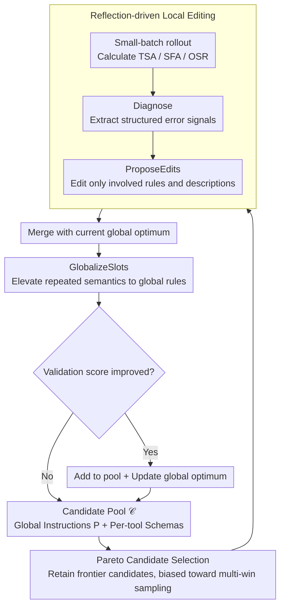

# JTPRO: A Joint Tool-Prompt Reflective Optimization Framework for Language Agents

**Conference**: ACL 2026  
**arXiv**: [2604.19821](https://arxiv.org/abs/2604.19821)  
**Code**: None  
**Area**: LLM Reasoning  
**Keywords**: Tool Call Optimization, Prompt Optimization, Reflective Learning, Large-scale Tool Library, Joint Optimization

## TL;DR
JTPRO proposes a joint optimization framework without model fine-tuning. By utilizing reflection-driven iterative editing, it simultaneously optimizes global instructions and per-tool schemas/parameter descriptions. This significantly improves end-to-end success rates in large-scale tool library scenarios, achieving a 5%–20% OSR improvement over baselines like GEPA.

## Background & Motivation

**Background**: LLM Agents extending their capabilities via external tools has become a mainstream paradigm. However, when the number of tools grows to hundreds or thousands, the reliability of tool calling drops sharply. Existing methods include fine-tuning, retrieval augmentation, and prompt optimization, but most treat global instructions and tool descriptions separately.

**Limitations of Prior Work**: Two core problems emerge as tool libraries scale: (1) General global prompts fail to distinguish between similar tools, leading to tool mis-selection; (2) Inprecise tool schema descriptions result in parameter instantiation errors (slot/value errors). The authors' experiments on ToolACE show that when the tool count expands from 300 to 1000, tool selection accuracy drops significantly even for GPT-5 class models.

**Key Challenge**: There is a coupled dependency between global instructions and local tool descriptions—global strategies rely on discriminative clues between tools, while parameter filling depends on global conventions (e.g., date formats, value ranges). Optimizing either aspect in isolation is insufficient.

**Goal**: Design a framework to iteratively optimize global instructions $P$ and per-tool schemas $\{T_i\}$ without model fine-tuning, maximizing call-level correctness (tool + parameters + values) under large-scale tool libraries.

**Key Insight**: The authors observe that the bottleneck of end-to-end success is often parameter filling (slot filling) rather than tool selection. Furthermore, many parameter semantics (e.g., date formats, boolean flags) repeat across multiple tools, and redundancy/inconsistency can be eliminated through globalization.

**Core Idea**: Jointly and iteratively optimize the Agent's global instructions and per-tool descriptions through Pareto candidate selection + reflection-driven local editing + shared parameter semantic globalization.

## Method

### Overall Architecture
JTPRO maintains a candidate context pool $\mathcal{C}$. In each iteration: (1) Select a candidate via Pareto sampling; (2) Perform rollouts on small batches to obtain diagnostic feedback; (3) Propose local edits to global instructions $P$ and relevant tool schemas $\{T_i\}$ based on feedback; (4) Merge edited versions with the current best; (5) Globalize repeated parameter semantics; (6) Update the candidate pool and global optimum after validation.

### Key Designs

**1. Pareto Candidate Selection: Avoiding single-best bias to preserve exploration diversity**

Iterative optimization in text space is prone to early convergence toward a local optimum. JTPRO adopts the Pareto concept from GEPA to hedge against this: a candidate is retained in the pool as long as it achieves the highest score on at least one training instance; those strictly dominated by others are pruned. Candidates are then sampled from this frontier with a probability biased toward those "winning more instances." This prevents being locked into a single global optimum while allowing historically strong versions to be further refined.

**2. Reflection-driven Local Editing: Targeted modification of error-prone rules**

With large tool libraries, failure modes are diverse—wrong tool selection, missing parameters, or format errors. Naive rewriting of the entire prompt causes the context to bloat and risks breaking correctly functioning parts. JTPRO first performs rollouts on small batches, uses a `Diagnose` function to extract structured signals (tool confusion / missing parameters / value errors), and then uses a reflector (`ProposeEdits`) to generate targeted edits. By strictly constraining modifications to the "involved localities," it precisely eliminates the root cause and avoids context expansion.

**3. GlobalizeSlots: Elevating cross-tool parameter semantics into global rules**

When there are thousands of tools, many parameter semantics repeat—date formats, numerical boundaries, boolean flags, and sorting conventions. In the ETID dataset, parameters like identifiers and datetimes repeat across as many as 77/124 tools. Writing these in every tool schema causes redundancy, consumes space meant for discriminative descriptions, and risks inconsistency. `GlobalizeSlots` identifies these shared semantics and elevates them to named rules in the global instructions (e.g., a unified "DateTime Fields"), leaving only a short pointer reference (like `startDate`) in the local schemas. This enforces consistency, eliminates conflicts, and frees up schema space for tool-specific clues—addressing the finding that slot filling (SFA), not just tool selection, is the critical bottleneck.

### Loss & Training
The optimization objective is to minimize call-level loss, which consists of three components: tool selection, parameter filling, and overall success rate. The entire process requires no gradient updates and is optimized iteratively within the text space.

## Key Experimental Results

### Main Results

| Model | Tool Count | Method | TSA(%) | SFA(%) | OSR(%) |
|------|--------|------|--------|--------|--------|
| GPT-5 | 500 | Base | 73.02 | 84.79 | 62.73 |
| GPT-5 | 500 | GEPA | 77.17 | 85.75 | 66.12 |
| GPT-5 | 500 | **JTPRO** | **82.28** | **90.00** | **74.38** |
| GPT-5 | 1000 | Base | 67.66 | 87.35 | 62.37 |
| GPT-5 | 1000 | GEPA | 75.13 | 86.40 | 67.77 |
| GPT-5 | 1000 | **JTPRO** | **78.72** | **89.26** | **73.55** |
| o3-mini | 1000 | Base | 58.92 | 85.04 | 51.27 |
| o3-mini | 1000 | **JTPRO** | **71.48** | **87.46** | **64.46** |

### Ablation Study (ETID Dataset)

| Configuration | Description |
|------|------|
| Optimize global instructions $P$ only | Lacks tool-level distinction, lower OSR |
| Optimize tool schema $T$ only | Lacks global conventions, lower OSR |
| **Joint optimization P+T (JTPRO)** | Complementary gains, optimal OSR |

### Key Findings
- **Joint optimization outperforms individual optimization**: Optimizing only instructions or only schemas is inferior to joint optimization, verifying the coupled dependency between the two.
- **Largest gains in 1000-tool scenarios**: As the library grows and confusion increases, JTPRO's advantages become more pronounced (o3-mini OSR +13.2 percentage points at 1000 tools).
- **SFA is a critical OSR bottleneck**: On datasets with complex schemas like ETID, parameter filling accuracy contributes significantly more to end-to-end success than tool selection.
- **Globalization reduces redundancy and improves consistency**: The `GlobalizeSlots` step shrinks schema length and improves parameter filling accuracy through unified semantics.

## Highlights & Insights
- **The argument for the necessity of joint optimization** is compelling: Figure 1 clearly shows SFA driving OSR, and Figure 2 shows performance degradation due to tool expansion, providing strong motivation for joint optimization.
- **The design of GlobalizeSlots** is highly practical—in enterprise tool libraries, many parameter semantics (dates, IDs, booleans) repeat. Elevating them to global rules is a clean and effective engineering trick transferable to any multi-tool Agent system.
- **Fine-tuning-free optimization paradigm**: Operating entirely in the text space makes it applicable to closed-source models, which is highly valuable in practical deployments.

## Limitations & Future Work
- Primarily evaluates single-turn tool calling, not involving multi-turn tool chains.
- Relies on high-quality labeled tool-call traces for reflective optimization, resulting in high cold-start costs.
- Does not consider incremental optimization efficiency in dynamic tool addition/deletion scenarios.
- Potential to explore deeper integration with retrieval-augmented methods and extension to multi-step planning.

## Related Work & Insights
- **vs GEPA**: GEPA also uses Pareto selections and reflective optimization but only optimizes global instructions without touching tool schemas. JTPRO extends this to joint optimization, offering clear advantages in tool-specific distinction and parameter constraints.
- **vs DRAFT**: DRAFT improves per-tool documentation through trial and error but does not optimize global strategies. JTPRO handles both layers simultaneously, preventing global-local inconsistencies.
- **vs MIPRO**: MIPRO optimizes module prompts and examples but is not designed for tool-calling scenarios, lacking slot-level diagnosis and globalization mechanisms.

## Rating
- Novelty: ⭐⭐⭐⭐ The idea of jointly optimizing instructions and schemas is valuable, though the framework is a natural extension of GEPA.
- Experimental Thoroughness: ⭐⭐⭐⭐⭐ Three datasets, multiple models, detailed ablations, and various tool scales.
- Writing Quality: ⭐⭐⭐⭐ Clear problem definition, though the paper is long with some internal repetition.
- Value: ⭐⭐⭐⭐ Provides excellent practical guidance for large-scale tool calling scenarios.

<!-- RELATED:START -->

## Related Papers

- [\[ICLR 2026\] Adaptive Social Learning via Mode Policy Optimization for Language Agents](../../ICLR2026/llm_reasoning/adaptive_social_learning_via_mode_policy_optimization_for_language_agents.md)
- [\[ICLR 2026\] ReForm: Reflective Autoformalization with Prospective Bounded Sequence Optimization](../../ICLR2026/llm_reasoning/reform_reflective_autoformalization_with_prospective_bounded_sequence_optimizati.md)
- [\[ACL 2026\] Foresight Optimization for Strategic Reasoning in Large Language Models](foresight_optimization_for_strategic_reasoning_in_large_language_models.md)
- [\[ICML 2026\] Diversity Over Frequency: Rethinking Tool Use in Visual Chain-of-Thought Agents](../../ICML2026/llm_reasoning/diversity_over_frequency_rethinking_tool_use_in_visual_chain-of-thought_agents.md)
- [\[ICLR 2026\] Estimating the Empowerment of Language Model Agents](../../ICLR2026/llm_reasoning/estimating_the_empowerment_of_language_model_agents.md)

<!-- RELATED:END -->
