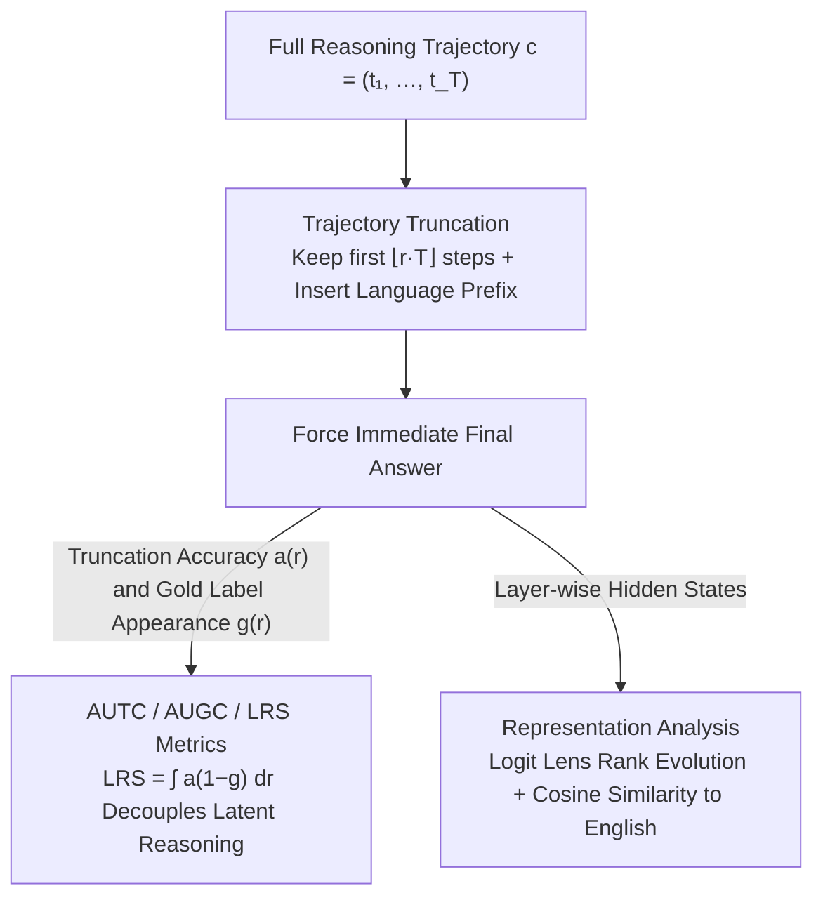

# Large Reasoning Models Are (Not Yet) Multilingual Latent Reasoners

**Conference**: ACL 2026 Findings  
**arXiv**: [2601.02996](https://arxiv.org/abs/2601.02996)  
**Code**: [https://github.com/cisnlp/multilingual-latent-reasoner](https://github.com/cisnlp/multilingual-latent-reasoner)  
**Area**: LLM Reasoning  
**Keywords**: Multilingual reasoning, Latent reasoning, Chain-of-Thought truncation, Representation analysis, Reasoning models

## TL;DR

This paper systematically investigates the latent reasoning behavior of Large Reasoning Models (LRMs) across 11 languages. It finds that latent reasoning capabilities exist in multiple languages but are unevenly distributed (strong in high-resource languages, weak in low-resource ones), and internal reasoning dynamics tend to follow an English-centric shared path.

## Background & Motivation

**Background**: Large Reasoning Models (such as DeepSeek-R1) have achieved breakthrough progress in tasks like mathematical reasoning by generating explicit Chains-of-Thought (CoT). Recent studies indicate that before completing explicit reasoning steps, these models have already formed correct answers within their hidden states—models can "think ahead" of the results via "latent reasoning."

**Limitations of Prior Work**: Existing research on latent reasoning focuses almost exclusively on English, leaving its performance in multilingual scenarios unknown. At the explicit reasoning level, multilingual performance is known to have significant disparities, with the reasoning quality of low-resource languages being notably poorer.

**Key Challenge**: If explicit reasoning performs unevenly across different languages, does latent reasoning exhibit similar imbalances? Or does latent reasoning follow a language-agnostic internal mechanism?

**Goal**: Two research questions—(RQ1) Do LRMs exhibit latent reasoning capabilities across various languages, and how does the strength vary? (RQ2) Do different languages follow distinct internal latent reasoning paths, or do they share a unified mechanism?

**Key Insight**: Utilize a reasoning trajectory truncation strategy—provide the model with only partial reasoning steps and observe whether it can provide the correct answer at the truncation point. If the model can answer correctly after seeing only a few reasoning steps, it indicates that the answer was computed internally (i.e., latent reasoning exists).

**Core Idea**: Reveal the multilingual characteristics of latent reasoning through multilingual truncation experiments and representation analysis—it exists but is uneven, and internally trends toward an English-centric shared path.

## Method

### Overall Architecture

Truncation experiments were conducted on three scales of models (7B/14B/32B) distilled from DeepSeek-R1 across 11 languages (covering high/medium/low resources). Two mathematical reasoning benchmarks, MGSM (simple) and Multilingual AIME (hard), were used. The proportion of retained reasoning steps was controlled by a truncation ratio $r \in [0,1]$. Accuracy was evaluated under partial reasoning information, and internal reasoning dynamics were analyzed using logit lens and hidden state similarity. The overall process is a measurement pipeline that "strips reasoning, then uses dual-track probes": first generating full trajectories and truncating them proportionally while forcing an immediate answer. The accuracy curve $a(r)$ and gold standard appearance $g(r)$ are used to decouple latent reasoning strength, while layer-wise hidden states are analyzed to determine if languages share an internal path.

### Key Designs

**1. Reasoning Trajectory Truncation: Quantification of Explicit Step Dependency**

To determine if the model calculates answers internally, explicit reasoning must be stripped to see if the model remains accurate. For each question $x$, a full trajectory $c = (t_1, \dots, t_T)$ is generated, then only the first $\lfloor r \cdot T \rfloor$ steps are kept based on the ratio $r$, followed by a forced immediate answer. To prevent the language from drifting back to English after truncation, a language-specific prefix is inserted after `<think>`. The key comparison is between the "accuracy after truncation" and "whether the gold answer appeared in the visible trajectory"—the difference represents the contribution of internal latent reasoning. 

If the model sees only 10% of steps and the answer hasn't appeared in the text yet but the model answers correctly, it strongly suggests the answer was pre-calculated in hidden states. Non-zero accuracy at $r=0$ (no reasoning steps provided) is the most direct evidence of latent reasoning.

**2. AUTC / AUGC / LRS Metrics: Cleanly Decoupling Latent from Explicit Reasoning**

Relying solely on truncation accuracy overestimates latent reasoning, as the model might be "correct" simply because the answer was already written in early steps. The paper integrates the areas under three curves: AUTC $= \int_0^1 a_k(r)\, dr$ measures how early and stable correct predictions appear; AUGC $= \int_0^1 g_k(r)\, dr$ measures the extent to which the answer is explicitly written.

The core metric is the Latent Reasoning Score LRS $= \int_0^1 a_k(r)\,(1 - g_k(r))\, dr$, which weights accuracy by $(1-g_k(r))$, specifically counting only cases where the model is correct but the answer is not yet explicit. This eliminates the inflation from early explicit answers, leaving a pure measure of non-explicit latent reasoning for fair cross-lingual comparison.

**3. Representation Analysis (Logit Lens + Hidden State Similarity): Identifying Shared Internal Paths**

While metrics address existence and strength (RQ1), internal mechanisms (RQ2) require representation probes. First, logit lens projects hidden states into the vocabulary space to track the rank evolution of the correct answer token across layers. Second, the cosine similarity between the hidden states of each language and English is calculated layer-by-layer and step-by-step.

If rank evolution trajectories are identical and non-English states align with English ones, it indicates the model converges to an English-centric shared path—even with Chinese input, it might "think in English" internally. Experiments confirm high-resource languages align significantly better with English than low-resource ones, consistent with LRS gradients.

### Loss & Training

This is an analytical study and does not involve training. Analysis was performed on DeepSeek-R1-Distill-Qwen-{7B, 14B, 32B} models.

## Key Experimental Results

### Main Results

**Truncation Metrics on MGSM (R1-Qwen-32B)**

| Language | AUTC | AUGC | LRS |
| :--- | :--- | :--- | :--- |
| EN (High-resource) | 0.75 | 0.25 | 0.53 |
| ZH (High-resource) | 0.70 | 0.30 | 0.45 |
| DE (High-resource) | 0.67 | 0.20 | 0.51 |
| JA (Mid-resource) | 0.63 | 0.21 | 0.47 |
| BN (Mid-resource) | 0.61 | 0.23 | 0.44 |
| SW (Low-resource) | 0.38 | 0.20 | 0.30 |
| TE (Low-resource) | 0.39 | 0.23 | 0.30 |

**Truncation Metrics on Multilingual AIME (R1-Qwen-32B)**

| Language | AUTC | AUGC | LRS |
| :--- | :--- | :--- | :--- |
| EN | 0.18 | 0.61 | 0.06 |
| ZH | 0.13 | 0.75 | 0.03 |
| SW | 0.01 | 0.05 | 0.00 |

### Ablation Study

**Impact of Model Scale on LRS (MGSM, English)**

| Model | AUTC | LRS |
| :--- | :--- | :--- |
| R1-Qwen-7B | 0.52 | 0.38 |
| R1-Qwen-14B | 0.59 | 0.44 |
| R1-Qwen-32B | 0.75 | 0.53 |

### Key Findings

- **Latent Reasoning is Uneven**: On MGSM, high-resource languages like EN/ZH have a pass@1 of ~0.2 at 0% truncation, meaning they calculate answers without explicit reasoning. LRS for low-resource languages (SW, TE) is only ~60% of high-resource ones.
- **Task Difficulty Dictates Detectability**: LRS drops sharply on Multilingual AIME (EN from 0.38 to 0.06), indicating complex problems require more explicit reasoning.
- **English-Centric Internal Paths**: Logit lens shows highly similar layer-wise answer rank evolution across languages. High-resource languages exhibit significantly higher cosine similarity to English hidden states.
- **Scale Enhances but Doesn't Close Gaps**: Scaling from 7B to 32B improves LRS for all languages, but the resource-based gap persists.

## Highlights & Insights

- First systematic study of LRM latent reasoning behavior across languages, filling a critical research gap.
- The LRS metric provides a pure measure of latent reasoning by decoupling accuracy from explicit answer occurrence.
- The "English-centric shared path" finding provides deep insight into multilingual LLM mechanisms—suggesting models "think in English" even for non-English inputs.
- Non-zero accuracy at 0% truncation provides the strongest evidence for the existence of latent reasoning.

## Limitations & Future Work

- Evaluation is limited to mathematical tasks, excluding logic or code reasoning.
- Analysis focused on distilled models; behavior in the original DeepSeek-R1 may differ.
- Causal analysis is limited—observed correlations (entropy vs. correctness) do not imply causation.
- Future work could explore post-training with multilingual reasoning data to enhance latent reasoning in low-resource languages.

## Related Work & Insights

- Connects two research lines: multilingual reasoning (known performance gaps) and latent reasoning (a new dimension of internal capability).
- Logit lens analysis methodology can be extended to multilingual studies of other model capabilities.
- Provides a representation-level explanation for "translate-then-solve" strategies—models naturally trend toward English-path reasoning internally.

## Rating

- Novelty: ⭐⭐⭐⭐⭐ First multilingual study of latent reasoning with innovative metrics.
- Experimental Thoroughness: ⭐⭐⭐⭐ Extensive languages and scales, though lacking non-math tasks.
- Writing Quality: ⭐⭐⭐⭐⭐ Clear research questions, rigorous design, and precise conclusions.

<!-- RELATED:START -->

## Related Papers

- [\[ACL 2026\] SeLaR: Selective Latent Reasoning in Large Language Models](selar_selective_latent_reasoning_in_large_language_models.md)
- [\[ACL 2026\] Revisiting Entropy in Reinforcement Learning for Large Reasoning Models](revisiting_entropy_in_reinforcement_learning_for_large_reasoning_models.md)
- [\[ACL 2026\] TrigReason: Trigger-Based Collaboration between Small and Large Reasoning Models](trigreason_trigger-based_collaboration_between_small_and_large_reasoning_models.md)
- [\[ACL 2026\] Parallel Test-Time Scaling for Latent Reasoning Models](parallel_test-time_scaling_for_latent_reasoning_models.md)
- [\[ACL 2025\] Large Language and Reasoning Models are Shallow Disjunctive Reasoners](../../ACL2025/llm_reasoning/large_language_and_reasoning_models_are_shallow_disjunctive_reasoners.md)

<!-- RELATED:END -->
