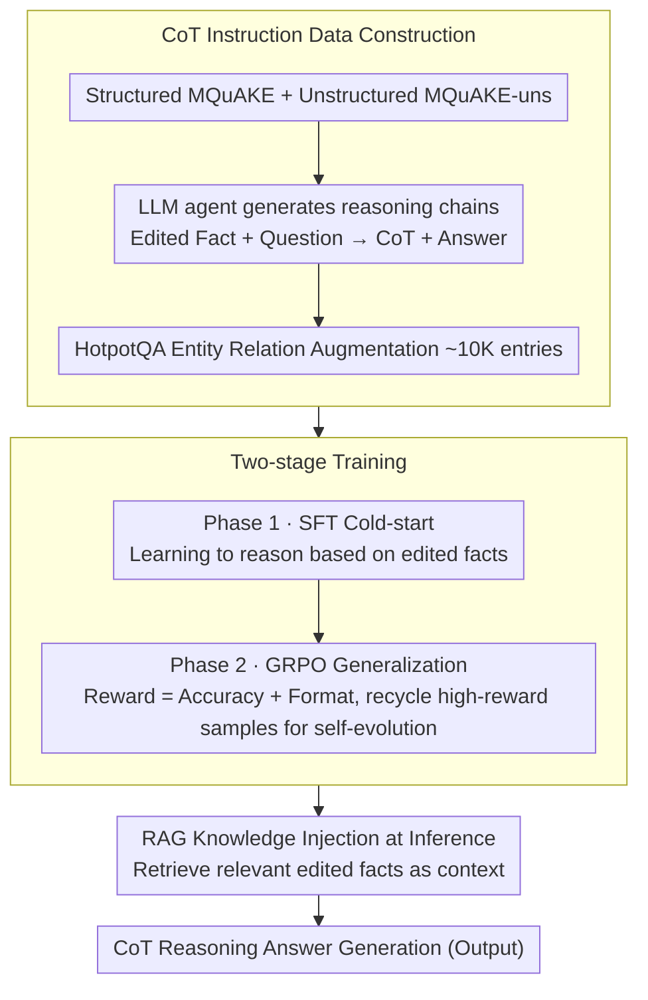

# Learning to Edit Knowledge via Instruction-based Chain-of-Thought Prompting

**Conference**: ACL 2026  
**arXiv**: [2604.05540](https://arxiv.org/abs/2604.05540)  
**Code**: [https://github.com/FredJDean/CoT2Edit](https://github.com/FredJDean/CoT2Edit)  
**Area**: LLM Reasoning / Knowledge Editing  
**Keywords**: Knowledge Editing, Chain-of-Thought, GRPO, RAG, Multi-hop Reasoning

## TL;DR

CoT2Edit proposes a new paradigm for teaching LLMs to perform knowledge editing via CoT reasoning. By constructing CoT instruction data for structured and unstructured editing, the model undergoes SFT cold-start followed by GRPO optimization. During inference, it combines RAG to retrieve edited facts, achieving SOTA performance on 6 editing benchmarks with strong generalization capabilities from a single training run.

## Background & Motivation

**Background**: Knowledge editing aims to update outdated or incorrect knowledge in LLMs. Mainstream methods include In-Context Editing (ICE/IKE), Parameter Modification (ROME/MEMIT/AlphaEdit), and the Train-and-Retrieve paradigm (LTE/EditCoT).

**Limitations of Prior Work**: (1) Locate-and-edit methods (ROME/MEMIT) directly modify model parameters, which is incompatible with frozen production LLMs and suffers from "rote memorization" issues—answering exact queries correctly while failing semantically equivalent ones; (2) LTE does not explicitly model reasoning paths, and requiring single-step generation of correct answers easily leads to hallucinations; (3) EditCoT requires a multi-model pipeline (one to generate CoT, one to execute the edit), which is complex and non-scalable; (4) Existing methods primarily process structured fact triplets, ignoring unstructured knowledge such as news and articles.

**Key Challenge**: Prior methods treat knowledge editing as a memory problem of "remembering new facts" rather than a reasoning problem of "understanding and reasoning with new facts". SFT is prone to overfit the training distribution, showing poor generalization on OOD editing data.

**Goal**: To construct a knowledge editing method that can generalize to various editing scenarios (structured/unstructured, single-hop/multi-hop) with a single training run.

**Key Insight**: Knowledge editing is redefined as a two-stage function $f_{\theta'}(e,q) = g_{\theta'}(h_{\theta'}(e,q))$, where an interpretable reasoning chain $h$ is generated first, followed by an answer $g$ produced based on that reasoning. SFT provides the cold start, while GRPO provides the generalization capability.

**Core Idea**: Utilize an LLM agent to generate CoT instructions for structured and unstructured editing data. SFT is used to learn editing reasoning paradigms, and GRPO enhances generalization to unseen editing scenarios. During inference, RAG is employed to retrieve relevant edited facts.

## Method

### Overall Architecture

The framework consists of three stages: (1) Data Construction—generating CoT instruction data from MQuAKE (structured) and MQuAKE-uns (unstructured), with additional data augmentation from HotpotQA entity relations; (2) Training—Phase 1 SFT cold-start to learn editing reasoning patterns, Phase 2 GRPO on merged data to enhance generalization; (3) Inference—RAG retrieves relevant edited facts, and the model generates answers via CoT reasoning.

### Key Designs

**1. CoT Instruction Data Construction: Transforming "Remembering Facts" into "Step-by-step Reasoning Based on Facts"**

Prior methods only feed structured triplets and require the model to provide correct answers in one step, failing to cover unstructured knowledge like news and the resulting in hallucinations due to lack of explicit reasoning paths. CoT2Edit uses an LLM agent to translate edited facts and questions into readable reasoning chains: For structured data, the agent takes edited facts $\mathcal{E}$ and multi-hop questions $\mathcal{Q}$ as input to generate $\text{Agent}(\mathcal{Q}, \mathcal{E}, \mathcal{T}) \to \text{CoT}, \mathcal{A}$; for unstructured data, it extracts relevant facts from the editing context $\mathcal{C}$ before reasoning, $\text{Agent}(\mathcal{Q}, \mathcal{C}, \mathcal{T}) \to \mathcal{E}, \text{CoT}, \mathcal{A}$.

To ensure the model encounters diverse reasoning forms, approximately 10K additional instruction data entries are synthesized using HotpotQA entity relations. Thus, the training set covers both structured and unstructured edits, with each sample possessing an explicit chain from "new facts" to "answers," reducing hallucinations caused by direct single-step answering.

**2. Two-stage Training (SFT Cold-start + GRPO Generalization): Learning Editing Paradigms before Migrating to Unseen Edits**

Pure SFT is prone to overfitting patterns seen during training, leading to generalization failure on OOD editing data. Consequently, Phase 1 performs standard auto-regressive SFT on CoT instruction data to provide a stable cold start for "how to reason based on edited facts." Phase 2 switches to GRPO, using rewards $\mathcal{R} = \mathcal{R}_{acc} + \mathcal{R}_{format}$ (answer accuracy + presence of think/answer tags and keywords) on merged data to explore diverse reasoning paths.

GRPO incorporates a self-evolution strategy: high-reward samples from each round are recycled into the next training set, $\mathcal{D}_{t+1} = \mathcal{D}_t \cup \{s \mid \mathcal{R}(s) > \theta\}$, allowing the model to reinforce and accelerate convergence on difficult cases it has already mastered. In ablation studies, GRPO is the core source of gain over pure SFT—RL achieves generalization to unseen editing scenarios through the exploration of reasoning paths rather than memorizing the training distribution.

**3. RAG Knowledge Injection at Inference: Decoupling Knowledge Bases from Reasoning Capability**

Injecting all edited facts into parameters requires retraining whenever knowledge updates, which is impractical for frozen production LLMs. CoT2Edit retrieves the most relevant edited facts for a user query at inference and provides them as context to the model, which then uses the CoT reasoning capability learned during training to answer based on these facts.

Consequently, the model only needs to learn the abstract capability of "how to reason based on given facts" once. Specific facts are managed by an external knowledge base that can be updated at any time—decoupling knowledge storage from reasoning capability as orthogonal tasks. This allows the model, trained once, to generalize directly to 6 unseen editing benchmarks. Removing RAG in ablation studies leads to performance degradation, confirming that retrieved edited facts are critical inputs for correct reasoning.

### Loss & Training

SFT: Standard auto-regressive cross-entropy. GRPO: Accuracy reward + Format reward (including think/answer tags and keywords). Validated on Llama-3.1-8B, Qwen-2.5-7B, and DeepSeek-R1-Distill-Qwen-7B.

## Key Experimental Results

### Main Results (Comprehensive Performance on 6 Editing Benchmarks)

| Method | Edit Succ | Paraphrase | Neighborhood | Scope |
|------|-----------|-----------|-------------|---------|
| AlphaEdit | 88.78 | ~81 | ~70 | Structured only |
| EditCoT | 86.13 | 83.55 | ~70 | Structured only |
| **CoT2Edit** | **93.17** | **89** | **93** | Structured + Unstructured |

### Ablation Study

| Configuration | Effect | Description |
|------|------|------|
| SFT Only | Overfitting, poor OOD | Cold start but insufficient generalization |
| SFT + GRPO | Comprehensive Gain | GRPO is the core contribution |
| No Data Augmentation | Insufficient GRPO training | 10K augmented samples are critical |
| No RAG | Performance Drop | Retrieval provides key edited facts |

### Key Findings

- A single training run generalizes to 6 unseen editing benchmarks, proving the model has learned general "fact-based reasoning" capabilities.
- Unstructured knowledge editing reaches 92% accuracy (approx. 20% higher than IKE).
- Maintains 89% paraphrase and 93% neighborhood success rates even under large-scale editing (20K-30K facts vs. traditional 2K-3K).
- GRPO is applied to the knowledge editing field for the first time, with self-evolution strategies accelerating convergence.
- Demonstrates that RL is superior to pure SFT for editing generalization by enabling reasoning path exploration.

## Highlights & Insights

- Redefines knowledge editing from a "memory problem" to a "reasoning problem"—the model does not need to memorize all edited facts but needs to learn how to reason based on given facts. This paradigm shift is fundamental.
- The two-stage training strategy of SFT cold-start + GRPO generalization is transferable to other tasks requiring OOD generalization.
- The self-evolution strategy (collecting high-reward samples for training) serves as a simple yet effective data augmentation method.

## Limitations & Future Work

- RAG retrieval quality directly impacts editing efficacy; failures may occur when relevant facts cannot be retrieved.
- The training data scale is approximately 13K; scaling behavior at much larger scales remains unverified.
- Validated only on 7-8B models; larger models may exhibit different behaviors.
- Conflict resolution between edited facts has not been explicitly handled.

## Related Work & Insights

- **vs. AlphaEdit/MEMIT**: Parameter modification methods are incompatible with frozen models and suffer from rote memorization. CoT2Edit generalizes to semantic variants through reasoning.
- **vs. EditCoT**: Requires two independent LLMs (CoT generation + edit execution), whereas CoT2Edit uses a single model. Additionally, EditCoT does not support unstructured editing.

## Rating

- Novelty: ⭐⭐⭐⭐ First application of GRPO to knowledge editing; reasoning paradigm replaces memory paradigm.
- Experimental Thoroughness: ⭐⭐⭐⭐⭐ Comprehensive analysis across 6 benchmarks, 3 models, and multiple editing scenarios.
- Writing Quality: ⭐⭐⭐⭐ Clear framework diagrams and complete methodological descriptions.
- Value: ⭐⭐⭐⭐ High practical value for generalizing to multiple scenarios with a single training run.

<!-- RELATED:START -->

## Related Papers

- [\[ECCV 2024\] Controllable Navigation Instruction Generation with Chain of Thought Prompting](../../ECCV2024/llm_reasoning/controllable_navigation_instruction_generation_with_chain_of_thought_prompting.md)
- [\[ACL 2026\] Is Chain-of-Thought Really Not Explainability? Chain-of-Thought Can Be Faithful without Hint Verbalization](is_chain-of-thought_really_not_explainability_chain-of-thought_can_be_faithful_w.md)
- [\[ACL 2026\] Does Self-Consistency Improve the Recall of Encyclopedic Knowledge?](does_self-consistency_improve_the_recall_of_encyclopedic_knowledge.md)
- [\[ACL 2026\] ETR: Entropy Trend Reward for Efficient Chain-of-Thought Reasoning](etr_entropy_trend_reward_for_efficient_chain-of-thought_reasoning.md)
- [\[ACL 2026\] TemplateRL: Structured Template-Guided Reinforcement Learning for LLM Reasoning](templaterl_structured_template-guided_reinforcement_learning_for_llm_reasoning.md)

<!-- RELATED:END -->
