# LegalDrill: Diagnosis-Driven Synthesis for Legal Reasoning in Small Language Models

**Conference**: ACL 2026  
**arXiv**: [2604.23809](https://arxiv.org/abs/2604.23809)  
**Code**: TBD  
**Area**: Law / SLM / Knowledge Distillation / DPO  
**Keywords**: Legal Reasoning, SLM Distillation, Diagnosis-Driven Synthesis, Difficulty Score, Iterative DPO

## TL;DR
LegalDrill employs an Audit Agent to diagnose specific error patterns in 0.6B/1.7B small language models (SLMs) during legal reasoning. It prompts a strong teacher (GPT-4o / Qwen3-30B) to "deliberately reproduce and correct" these errors to generate preference pairs based on diagnostic instructions. Samples that the student already understands are filtered out using a Difficulty Score derived from the student's own forced-choice probabilities. After iterative SFT+DPO, the 1.7B student model approaches the performance of the 30B teacher across multiple LegalBench subsets.

## Background & Motivation
**Background**: There is a strong demand for legal LLMs in tasks such as judgment prediction, contract QA, and privacy policy entailment. However, legal documents are inherently sensitive, precluding the use of external APIs (GPT/Gemini) or cloud-based RAG. Consequently, local deployment is required, but open-source LLMs exceeding 30B are too costly. Pragmatic industry applications rely on **SLMs < 3B** (e.g., Qwen3-0.6B/1.7B).

**Limitations of Prior Work**: SLMs in legal reasoning often "write like a lawyer but reason like a novice"—frequently misinterpreting legal provisions or making logical leaps, leading to incorrect final verdicts. Direct SFT using CoT trajectories from strong LLMs is often ineffective because strong models (especially RL-aligned ones like o1/DeepSeek-R1) produce long, self-reflective, and exploratory chains that exceed the capacity of an SLM.

**Key Challenge**: High-quality legal SFT data is expensive (requiring expert annotation), and standard rejection sampling (based on the final verdict) is too coarse—it indicates "what's right" without explaining "why it's wrong," failing to generate the "concise yet precise" reasoning chains SLMs can effectively learn. Fundamentally, the teacher's behavioral distribution $\neq$ the student's learnable distribution.

**Goal**: (1) Transfer the teacher's implicit knowledge into concise, error-correcting reasoning chains within SLM capacity; (2) Focus the training budget on samples the SLM **genuinely fails** at; (3) Eliminate the need for human legal expert annotation.

**Key Insight**: Rather than allowing the teacher full creative freedom, an Audit Agent first **diagnoses the student's current specific errors** (e.g., "misinterpretation of statutes" or "logical leaps"). These diagnoses are abstracted into **context-agnostic error instructions**, which the teacher uses to "deliberately fail + simultaneously correct." The resulting preference pairs serve as "targeted training data" for the student's current blind spots.

**Core Idea**: Diagnosis → Abstracting error patterns → Targeted preference pair synthesis → Filtering trivial samples using student probabilities → Iterative DPO.

## Method

### Overall Architecture
LegalDrill is an iterative teacher-student framework consisting of three steps per round $t$:

- **Inputs**: $N$ legal queries $x_i = (c_i, q_i)$ (context + question), current student $\pi_{\theta_t}$, teacher $\pi_{\text{teach}}$, and Audit Agent $\pi_{\text{audit}}$.
- **Stage 1 Exploration + Diagnosis**: The student generates response $\hat{y}_i$ using CoT prompts. The Audit Agent examines $(x_i, \hat{y}_i)$ to produce **context-agnostic** error instructions $\mathcal{I}^{(i)}$ (e.g., "ignore the statute of limitations"). These are aggregated into an Error Instruction Bank $\Phi_{\text{err}} = \{\mathcal{I}^{(1)}, ..., \mathcal{I}^{(N)}\}$.
- **Stage 2 Targeted Generation**: For each sample $x$, $K$ error instructions are sampled from $\Phi_{\text{err}}$. The teacher first follows the instruction to generate a rejected response $y_-^{(k)} \sim \pi_{\text{teach}}(\cdot \mid x, \mathcal{I}_k)$, then generates a chosen response conditioned on the error: $y_+^{(k)} \sim \pi_{\text{teach}}(\cdot \mid x, \mathcal{I}_k, y_-^{(k)})$.
- **Stage 3 Self-Reflective Verification**: A Difficulty Score is calculated using the student model to filter out trivial samples. The remaining $\mathcal{D}_{\text{train}}^t$ is used for SFT (initial cold start) + DPO updates.
- **Iteration**: $\pi_{\theta_{t+1}}$ enters the next round for re-diagnosis, with the reference model updated as $\pi_{\text{ref}} \leftarrow \pi_{\theta_t}$.

```mermaid
%%{init: {'flowchart': {'rankSpacing': 24, 'nodeSpacing': 28, 'padding': 6, 'wrappingWidth': 400, 'subGraphTitleMargin': {'top': 8, 'bottom': 16}}}}%%
flowchart TD
    X["Legal query x=(context, question)<br/>+ Current Student π_θt"]
    subgraph S1["Diagnosis-Driven Error Instruction Synthesis"]
        direction TB
        A["Student CoT Exploration: Output ŷ"] --> B["Audit Agent Diagnosis:<br/>Context-agnostic error instructions"]
        B --> C["Error Instruction Bank Φerr = {I⁽¹⁾…I⁽ᴺ⁾}"]
    end
    subgraph S2["Targeted Two-Step Preference Generation"]
        direction TB
        D["Sample K Error Instructions Iₖ"] --> E["Teacher follows Iₖ to fail → rejected y₋"]
        E --> F["Teacher corrects y₋ → chosen y₊"]
    end
    G["Self-Reflective Difficulty Score Filtering:<br/>Calculate DS via forced-choice probability;<br/>Keep high-confusion samples (DS > τ)"]
    H["Training: SFT(t=0) + Iterative DPO<br/>Update π_ref ← π_θt"]
    X --> S1
    S1 --> S2
    S2 --> G
    G --> H
    H -->|"π_θt+1 next round diagnosis"| X
```

### Key Designs

**1. Diagnosis-Driven Error Instruction Synthesis: Abstracting specific student errors into reusable templates**

Directly asking a teacher to generate rejected responses often leads to significant surface-level differences (e.g., length or formatting) between chosen and rejected outputs. This causes the model to learn "chosen is longer" rather than "chosen is logically rigorous." LegalDrill requires the Audit Agent to produce diagnoses of $(x_i, \hat{y}_i)$ that are **forbidden from referencing specific case details**. Instead, it outputs context-agnostic descriptions like "ignoring time windows when calculating limitations," calibrated against a taxonomy of common legal errors.

This context decoupling provides two benefits. First, data augmentation: each error instruction can be recombined with any context, expanding the dataset from $|\mathcal{D}|$ to $K \cdot |\mathcal{D}|$. Second, it acts as a strong regularizer: since the chosen and rejected responses share the same context and error type, the student cannot rely on surface shortcuts and is forced to learn the nuances of logical rigor.

**2. Targeted Two-Step Preference Generation: Deliberately failing and then correcting based on that failure**

The standard approach of independently sampling chosen and rejected responses from a teacher results in noisy DPO signals across multiple dimensions (style, length, reasoning path). LegalDrill utilizes a two-step conditional generation: first, the teacher deliberately commits an error based on $\mathcal{I}_k$ to produce $y_-^{(k)} \sim \pi_{\text{teach}}(\cdot \mid x, \mathcal{I}_k)$. In the second step, $y_-^{(k)}$ is provided as input, and the teacher is tasked with identifying and fixing that specific error to generate $y_+^{(k)} \sim \pi_{\text{teach}}(\cdot \mid x, \mathcal{I}_k, y_-^{(k)})$.

This ensures the chosen response is not just "correct" but is a **direct counter-example to the logic in the rejected response**. The variance between the pair is strictly tied to the presence of the specified logical error, yielding clean DPO signals.

**3. Self-Reflective Difficulty Score Filtering: Using student confidence to pruning "easy" samples**

Many teacher-synthesized pairs may already be distinguishable by the student. Training on these is inefficient and risks degradation. To avoid shortcuts where the likelihood $\pi(y \mid x)$ is influenced by length, LegalDrill uses a binary forced-choice verification prompt $\mathcal{P}_{\text{ver}}(c, q, y)$ to normalize scores over $\{\texttt{correct}, \texttt{incorrect}\}$:

$$s_{\theta_t}(y \mid x) = \frac{\pi_{\theta_t}(\texttt{correct} \mid \mathcal{P}_{\text{ver}})}{\pi_{\theta_t}(\texttt{correct}) + \pi_{\theta_t}(\texttt{incorrect})}$$

The difficulty score $\mathrm{DS} = s_{\theta_t}(y_-^{(k)} \mid x) - s_{\theta_t}(y_+^{(k)} \mid x)$ measures how much the student is deceived by the rejected response. Only high-confusion samples where $\mathrm{DS} > \tau$ are kept for $\mathcal{D}_{\text{train}}^t$. Using forced-choice probabilities avoids the bias where longer "chosen" responses naturally have lower sequence likelihoods.

### Loss & Training
Two-stage optimization:

- **Cold-Start SFT (at $t=0$)**: $\mathcal{L}_{\text{SFT}}(\theta_0) = -\mathbb{E}_{(x, y_+) \sim \mathcal{D}_{\text{train}}^0}[\log \pi_{\theta_0}(y_+ \mid x)]$, providing a stable baseline for DPO.
- **Iterative DPO**: $\mathcal{L}_{\text{DPO}}(\theta_{t+1}) = -\mathbb{E}[\log \sigma(\beta(\log\frac{\pi_{\theta_{t+1}}(y_+ \mid x)}{\pi_{\theta_t}(y_+ \mid x)} - \log\frac{\pi_{\theta_{t+1}}(y_- \mid x)}{\pi_{\theta_t}(y_- \mid x)}))]$, where $\pi_{\text{ref}} = \pi_{\theta_t}$ (the current strategy acts as the next round's reference) for online-style progressive improvement.
- **Hyperparameters**: 1-3 epochs, learning rate $1 \times 10^{-4}$, where $K$ and $\tau$ are tuned per dataset.

## Key Experimental Results

### Main Results
Evaluations were conducted on four LegalBench subsets (Cos. QA / Con. QA / Sara Ent. / Priv. Ent.) and two real-world financial-legal document datasets (Real-World POA / Trust). Metrics include Accuracy, F1, and Judge Accuracy (LLM-as-Judge for reasoning quality).

| Model | Cos. QA Acc | Con. QA Acc | Sara Ent. Acc | Priv. Ent. Acc | RW POA Acc | RW Trust Acc |
|------|-------------|-------------|---------------|----------------|------------|--------------|
| Qwen3-0.6B (base) | 0.69 | 0.83 | 0.59 | 0.30 | 0.76 | 0.74 |
| Qwen3-1.7B (base) | 0.79 | 0.87 | 0.66 | 0.47 | 0.78 | 0.79 |
| Qwen3-30B-A3B (teacher) | 0.98 | 0.96 | 0.86 | 0.83 | — | — |
| GPT-4o (teacher) | 0.98 | 0.92 | 0.83 | 0.67 | 0.91 | 0.89 |
| **LegalDrill-0.6B (Qwen3-30B teach)** | **0.84** | **0.91** | **0.74** | **0.81** | — | — |
| **LegalDrill-1.7B (Qwen3-30B teach)** | **0.96** | **0.93** | **0.73** | **0.85** | — | — |
| **LegalDrill-0.6B (GPT-4o teach)** | 0.86 | 0.95 | 0.75 | 0.59 | **0.87** | **0.86** |
| **LegalDrill-1.7B (GPT-4o teach)** | 0.94 | 0.97 | 0.75 | 0.60 | **0.92** | **0.90** |

Notable data: LegalDrill-1.7B improved from 0.47 to 0.85 on Priv. Ent. (+0.38), **surpassing the 30B teacher** (0.83). On Real-World POA, the 1.7B student (0.92) roughly matched GPT-4o (0.91). On Con. QA, the 1.7B student distilled from GPT-4o reached 0.97, **outperforming its teacher** (0.92).

### Ablation Study

| Configuration | Trend | Description |
|------|------|------|
| Full (SFT + DPO) | Optimal | Complete LegalDrill framework |
| SFT Only (w/o DPO) | Consistent Decline | The contrast signal in DPO is critical for gains |
| Remove DS Filtering | High volume, low gain | Trivial samples dilute critical gradients |
| Remove context-agnostic constraint | Robustness decline | Decoupling is the key to preventing shortcut learning |
| Increase iterations | Diminishing returns | Student blind spots are filled over rounds |

### Key Findings
- **DPO > SFT-only across nearly all settings**: This suggests that "learning where one failed" is more effective than "seeing only correct examples" in legal reasoning, mirroring intuitive human legal training.
- **Gain for 1.7B > 0.6B**: Qwen3-1.7B with LegalDrill approaches or beats 30B teachers, but 0.6B has a lower ceiling, suggesting a capacity threshold for complex reasoning.
- **GPT-4o is not an omnipotent teacher**: On Priv. Ent., GPT-4o scored 0.67, and its student reached 0.60; however, Qwen3-30B (scoring 0.83) yielded a student at 0.85. The teacher's domain performance dictates the student's upper bound.

## Highlights & Insights
- **Context-agnostic instructions represent an anti-shortcut breakthrough**: By sharing the same context and error type between pairs, DPO is forced to focus strictly on reasoning rigor. This can be generalized to any reasoning distillation task (math, code, medicine).
- **Forced-choice Difficulty Score**: Using binary probabilities instead of sequence likelihood avoids length biases, serving as an elegant verification reward model.
- **Two-step conditional generation**: Conditioning chosen on rejected responses creates a purer signal compared to independent sampling, representing a best practice for DPO data synthesis.
- **Iterative reference models**: Updating $\pi_{\text{ref}} = \pi_{\theta_t}$ creates a flywheel of "diagnosis → data → training → re-diagnosis."

## Limitations & Future Work
- **Teacher Dependency**: The student's performance is limited by the teacher's domain-specific capability. No solution is provided for cases where the teacher is weaker than the student.
- **Diagnostic Source**: The Audit Agent uses the same teacher model, potentially missing errors that the teacher themselves cannot identify.
- **Hyperparameter Sensitivity**: $\tau$ and $K$ are manually tuned per dataset rather than being adaptive.
- **Task Scope**: Evaluation is restricted to binary yes/no tasks; subjective legal tasks like contract drafting or judgment writing are not covered.

## Related Work & Insights
- **vs. Standard Rejection Sampling**: Rejection sampling based on final answers is coarse. LegalDrill's diagnosis-driven approach acts as a "precision-guided" upgrade.
- **vs. Reasoning Compression**: Unlike methods that prune teacher CoT, LegalDrill regenerates targeted chains to better align with SLM behavioral distributions.
- **vs. SMART**: While SMART requires external LLM calls during inference, LegalDrill internalizes knowledge into the SLM parameters for zero-dependency local deployment.
- **vs. Iterative DPO**: LegalDrill distinguishes itself by introducing the diagnosis-synthesis loop on the data generation side, rather than just iterating on sampling.

## Rating
- Novelty: ⭐⭐⭐⭐ The combination of diagnosis-driven, context-agnostic instructions and DS filtering is innovative in the SLM space.
- Experimental Thoroughness: ⭐⭐⭐⭐ 6 datasets (4 public, 2 industrial) with multiple teacher-student combinations.
- Writing Quality: ⭐⭐⭐⭐ Clear logical progression from motivation to methodology.
- Value: ⭐⭐⭐⭐⭐ Locally deployed legal SLMs are a genuine industry need; the method is applicable to other high-stakes domains like medicine and finance.

<!-- RELATED:START -->

## Related Papers

- [\[ACL 2026\] Accurate Legal Reasoning at Scale: Neuro-Symbolic Offloading and Structural Auditability for Robust Legal Adjudication](accurate_legal_reasoning_at_scale_neuro-symbolic_offloading_and_structural_audit.md)
- [\[ACL 2026\] AIM-CoT: Active Information-driven Multimodal Chain-of-Thought for Vision-Language Reasoning](aim-cot_active_information-driven_multimodal_chain-of-thought_for_vision-languag.md)
- [\[ICML 2026\] DenseSteer: Steering Small Language Models towards Dense Math Reasoning](../../ICML2026/llm_reasoning/densesteer_steering_small_language_models_towards_dense_math_reasoning.md)
- [\[ACL 2026\] RSAT: Structured Attribution Makes Small Language Models Faithful Table Reasoners](rsat_structured_attribution_makes_small_language_models_faithful_table_reasoners.md)
- [\[AAAI 2026\] Chain-of-Thought Driven Adversarial Scenario Extrapolation for Robust Language Models](../../AAAI2026/llm_reasoning/chain-of-thought_driven_adversarial_scenario_extrapolation_for_robust_language_m.md)

<!-- RELATED:END -->
