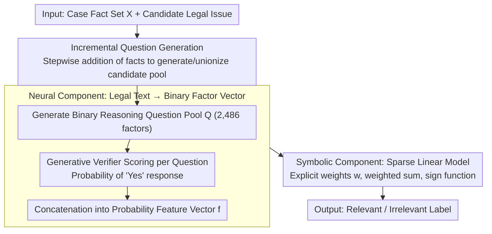

# LePREC: Reasoning as Classification over Structured Factors for Assessing Relevance of Legal Issues

**Conference**: ACL 2026  
**arXiv**: [2604.19464](https://arxiv.org/abs/2604.19464)  
**Code**: None  
**Area**: Legal NLP / Interpretability  
**Keywords**: Legal Issue Relevance Assessment, Neuro-symbolic Reasoning, Feature Selection, Legal AI, Structured Factor Classification

## TL;DR

This paper proposes LePREC, a neuro-symbolic framework inspired by legal professionals that transforms unstructured legal text into structured features via LLM-generated reasoning QA pairs. It then utilizes sparse linear models for relevance classification, achieving a 30–40% improvement over LLM baselines like GPT-4o on the LIC dataset constructed from 769 Malaysian contract law cases.

## Background & Motivation

**Background**: More than half of the global population struggles to meet their civil justice needs. In the IRAC (Issue-Rule-Application-Conclusion) framework, legal issue identification is a critical first step, involving the generation of candidate legal issues and the assessment of their relevance. Although LLMs demonstrate powerful linguistic capabilities, their precision in real-world legal scenarios remains insufficient.

**Limitations of Prior Work**: Existing legal AI benchmarks are mostly limited to simplified or synthetic scenarios (e.g., textbook cases) and lack expert-annotated datasets based on real court cases. Directly using GPT-4o for legal issue relevance assessment only achieves 62% accuracy because LLMs struggle to distinguish between issues that are "factually related" and those "truly involving the core dispute of the case."

**Key Challenge**: Legal professionals consider multi-layered contexts such as jurisdictional constraints, procedural backgrounds, and case-specific factors when assessing relevance. In contrast, LLMs tend to perform surface-level factual matching and lack deep legal reasoning capabilities. End-to-end "black-box" methods cannot provide such fine-grained judgment.

**Goal**: (1) Construct the first legal issue relevance assessment dataset, LIC, based on real court cases; (2) Propose an explainable and data-efficient neuro-symbolic framework, LePREC, that converts legal reasoning into statistical classification over structured factors.

**Key Insight**: It is observed that legal professionals' analysis follows a two-stage process: first identifying key analytical factors (brainstorming) and then weighing these factors to make a judgment. This decomposition naturally corresponds to the neuro-symbolic paradigm: the neural component extracts factors, and the symbolic component performs weighted reasoning.

**Core Idea**: Reframe legal issue relevance assessment from "fact-issue relationship assessment" to "factor-issue relevance classification." Binary reasoning questions generated by LLMs serve as structured features, and a sparse linear model learns explicit algebraic weights to achieve explainable and data-efficient relevance judgment.

## Method

### Overall Architecture

LePREC aims to solve the following problem: directly using GPT-4o to judge whether a legal issue "truly involves the core dispute" yields only 62% accuracy because LLMs perform surface-level factual matching. The paper's approach is to mimic the two-stage analysis of legal professionals—brainstorming analytical factors and then weighing them—implementing this as a neuro-symbolic pipeline. The first half is the neural component: using an LLM to transcribe each (fact set, candidate issue) pair into a sequence of binary reasoning questions, compressing the unstructured text into a numerical feature vector using answer probabilities. The second half is the symbolic component: training a sparse linear model on these discrete features to output binary relevance labels (Relevant / Irrelevant) using explicit weights. This pipeline maintains the LLM's linguistic understanding while delegating the final judgment to an explainable, data-efficient linear classifier.

### Key Designs

**1. LIC Dataset and Incremental Question Generation: Ensuring a Broad Candidate Pool**

Legal AI benchmarks have long been trapped in simplified or synthetic textbook cases, lacking expert annotations on real court cases. LePREC starts with 769 Malaysian contract law cases, using GPT-4o to extract facts and issues, followed by senior legal expert annotations for relevance (Fleiss' $\kappa = 0.659$). A key design for generating candidate issues is incremental feeding rather than providing all facts to the LLM at once: given a fact list $\mathbf{X}=\{\mathbf{x}_1,\ldots,\mathbf{x}_m\}$, facts are added stepwise to generate issues, which are then unionized $\hat{\mathcal{Y}}=\bigcup_{i=1}^{m}\hat{\mathcal{Y}}_i$. Varying the context "depth" forces the LLM to focus on different fact combinations, capturing subtle candidate issues often missed in one-shot generation. This incremental strategy outperforms one-shot baselines on quality metrics like FBD and EMBD, as well as diversity metrics like Self-BLEU and Distinct-N.

**2. Neural Component: Translating Legal Text into Calculable Binary Factors**

Having candidate issues is not enough; the key is transforming unstructured legal text into machine-calculable features. For each fact-issue pair, LePREC has the LLM generate binary reasoning questions, accumulating a shared question pool $\mathcal{Q}$ (eventually 2,486 questions). For each question $q_t \in \mathcal{Q}$, a generative verifier calculates the probability of it being answered "yes" given the current case $G_{q_t}(\mathbf{X}, \hat{Y}_j) \in (0,1)$. These probabilities are concatenated into a feature vector $\mathbf{f} = G_{\mathcal{Q}}(\mathbf{X}, \hat{Y}_j) \in \mathbb{R}^h$. Continuous probabilities are intentionally used over binary answers; initial experiments showed direct "yes/no" responses from LLMs were unreliable, while retaining confidence information via probabilities consistently outperformed the binary label variant in classification.

**3. Symbolic Component: Explainable Relevance Weighting via Sparse Linear Models**

For the final relevance judgment, the paper avoids another black box and uses a linear model $\hat{y}_j = \text{sign}(\mathbf{w}^\top \mathbf{f})$. The learned coefficients $\mathbf{w}$ naturally achieve two goals: they automatically down-weight noise/redundant questions that give conflicting answers despite semantic similarity, and they perform adaptive weighting for domain-specific questions that are only meaningful in certain case types. Choosing a linear model over deep networks provides explicit weighting and transparent algebraic combinations (symbolic interpretability) while remaining more stable and data-efficient when the number of parameters is comparable to the training samples. This also allows for statistical analysis of which reasoning questions contribute most significantly.

### Mechanism: A Two-Stage Walkthrough of a Contract Dispute

Consider a contract dispute case: first, the case is decomposed into facts $\mathbf{X}$ and a candidate issue (e.g., "Does this constitute a breach of contract?"). The neural component doesn't answer this directly but retrieves 2,486 binary reasoning questions (e.g., "Is there a written agreement?" "Was a performance deadline specified?") from the shared pool $\mathcal{Q}$. The verifier provides the probability of a "yes" answer for each, compressing the case-issue pair into a 2,486-dimensional probability vector $\mathbf{f}$. The symbolic component then applies trained weights $\mathbf{w}$ to this vector for a weighted sum, with the sign indicating "Relevant / Irrelevant." The judgment can be traced to the dimensions (reasoning questions) with the highest weights, allowing lawyers to see why the model reached its conclusion rather than facing a black box.

### Loss & Training

The neural component uses GPT-4o for question generation, which is model-agnostic (subsequent sparse feature selection automatically retains the most predictive factors). The symbolic component utilizes standard linear classifiers (SVC, LR, Ridge, etc.) trained using 5-fold stratified cross-validation on LIC; feature selection experiments utilize L1-regularized variants.

## Key Experimental Results

### Main Results

**RQ1: SOTA LLM Baselines (Direct Judgment)**

| Method | F1 | Accuracy | Precision | Recall |
|------|------|------|------|------|
| Claude | 54.55 | 70.91 | 66.00 | 56.19 |
| GPT-4o | 57.80 | 70.91 | 64.46 | 58.07 |
| GenQwen | 63.70 | 68.59 | 63.84 | 63.92 |
| LegalBERT | 52.31 | 41.28 | 52.10 | 50.79 |

**RQ2: LePREC Framework (Ours)**

| Method | F1 | Accuracy | Precision | Recall |
|------|------|------|------|------|
| SVCPhi | **80.19** | 82.66 | 79.67 | **81.01** |
| LRPhi | 79.70 | 82.49 | 79.58 | 80.05 |
| RidgePhi | 80.10 | 82.91 | 80.06 | 80.28 |
| L1RegPhi | 80.01 | **83.34** | **81.13** | 79.32 |
| LDAPhi | 79.56 | 83.50 | 81.77 | 78.39 |

### Ablation Study

| Configuration | F1 | Description |
|------|------|------|
| Linear Models (SVC/LR/Ridge) | 79.70–80.19% | Best, consistent and stable |
| Tree/Distance Models (RF/KNN) | 74–75% | Slightly lower but competitive |
| Deep Learning (Transformer/FFN) | 75.44/75.65% | Non-linearity provided no additional gain |
| LLM-Select Feature Selection | 45–58% | Failed; LLM could not identify predictive questions |
| L1 SVC Feature Selection | 77.60% | Dropped only 2.5 percentage points |

### Key Findings

- LePREC achieved an F1 gain of approximately 16.5 percentage points (80.19%) compared to the best LLM baseline (GenQwen 63.70%).
- Linear models (SVC, LR, Ridge) showed the most consistent performance (79.70–80.19% F1) among all classifiers, proving that simple linear weighting suffices to capture legal reasoning patterns.
- Stability analysis revealed the absence of a "universal golden question set": only 0.04–0.53% of features were selected consistently across all folds by L1 LR, and only 38% overlap existed between L1 LR and L1 SVC features.
- Interviews with legal practitioners confirmed that lawyers do not rely on a fixed checklist but judge based on a broad set of context-sensitive analytical factors.

## Highlights & Insights

- Reframing legal reasoning as statistical classification over structured factors successfully applies the neuro-symbolic paradigm to legal AI, achieving both interpretability and high performance.
- The discovery that "no universal core question set exists" is supported by both quantitative (feature selection instability) and qualitative (practitioner interviews) evidence, revealing the fundamental nature of legal reasoning.
- The question generation process is model-agnostic—sparse feature selection automatically filters model-specific noise, granting the framework excellent generalizability.

## Limitations & Future Work

- The dataset focuses purely on Malaysian contract law (Common Law system) and has not yet been validated in other systems like Civil Law.
- Dependency on LLMs for generating reasoning questions; alternative question-sourcing methods might provide new insights.
- The linear model assumes a linear combination captures relevance patterns; extracting high-level insights from detailed weight distributions requires careful analysis.
- Deployment in actual legal practice requires additional verification to avoid bias.

## Related Work & Insights

- **vs Direct LLM Judgment (GPT-4o/Claude)**: Direct LLM judgment reached only 55–58% F1. LePREC achieves 80% F1 by decomposing the reasoning process, proving structured approaches are superior to end-to-end black boxes.
- **vs LegalBERT**: Legal pre-trained models showed high variance (F1 = 52.31±13.4) due to insufficient training data. LePREC addresses this via data-efficient linear models.
- **vs GCI (Causal Inference Methods)**: Rigid causal discovery in GCI overly restricts the feature space. LePREC's relevance-based approach retains a broader range of signals.

## Rating

- Novelty: ⭐⭐⭐⭐ The idea of reframing legal reasoning as structured factor classification is novel, and the neuro-symbolic decomposition aligns well with legal practice.
- Experimental Thoroughness: ⭐⭐⭐⭐⭐ Three RQs systematically answered, 14 classifiers compared, stability analysis + practitioner interviews; extremely comprehensive.
- Writing Quality: ⭐⭐⭐⭐ Clear structure, rigorous logic, and progressively developed experimental design.
- Value: ⭐⭐⭐⭐ Provides a new explainable and data-efficient paradigm for legal AI. The LIC dataset fills a significant gap.

<!-- RELATED:START -->

## Related Papers

- [\[ACL 2026\] Accurate Legal Reasoning at Scale: Neuro-Symbolic Offloading and Structural Auditability for Robust Legal Adjudication](accurate_legal_reasoning_at_scale_neuro-symbolic_offloading_and_structural_audit.md)
- [\[ACL 2026\] LegalDrill: Diagnosis-Driven Synthesis for Legal Reasoning in Small Language Models](legaldrill_diagnosis-driven_synthesis_for_legal_reasoning_in_small_language_mode.md)
- [\[ACL 2026\] TemplateRL: Structured Template-Guided Reinforcement Learning for LLM Reasoning](templaterl_structured_template-guided_reinforcement_learning_for_llm_reasoning.md)
- [\[AAAI 2026\] From Classification to Ranking: Enhancing LLM Reasoning for MBTI Personality Detection](../../AAAI2026/llm_reasoning/from_classification_to_ranking_enhancing_llm_reasoning_capabilities_for_mbti_per.md)
- [\[CVPR 2026\] Agile Deliberation: Concept Deliberation for Subjective Visual Classification](../../CVPR2026/llm_reasoning/agile_deliberation_concept_deliberation_for_subjective_visual_classification.md)

<!-- RELATED:END -->
