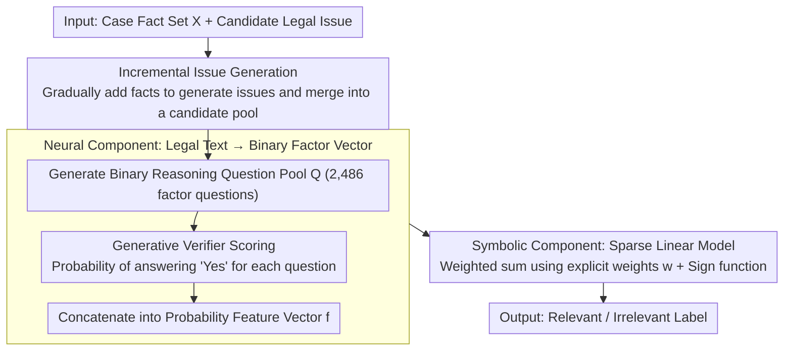

# LePREC: Reasoning as Classification over Structured Factors for Assessing Relevance of Legal Issues

**Conference**: ACL 2026  
**arXiv**: [2604.19464](https://arxiv.org/abs/2604.19464)  
**Code**: None  
**Area**: Legal NLP / Explainability  
**Keywords**: Legal Issue Relevance Assessment, Neuro-symbolic Reasoning, Feature Selection, Legal AI, Structured Factor Classification

## TL;DR

This paper proposes LePREC, a neuro-symbolic framework inspired by legal professionals that transforms unstructured legal text into structured features via LLM-generated reasoning QA pairs. By utilizing sparse linear models for relevance classification, it achieves a 30–40% performance gain over LLM baselines like GPT-4o on the LIC dataset constructed from 769 Malaysian contract law cases.

## Background & Motivation

**Background**: Over half of the global population struggles to meet their civil justice needs. Within the IRAC (Issue-Rule-Application-Conclusion) framework, legal issue identification is a critical first step, involving the generation and relevance assessment of candidate legal issues. While LLMs exhibit strong language capabilities, their precision in real-world legal scenarios remains insufficient.

**Limitations of Prior Work**: Existing legal AI benchmarks are mostly limited to simplified or synthetic scenarios (e.g., textbook cases), lacking expert-annotated datasets based on real court cases. Directly using GPT-4o for legal issue relevance assessment achieves only 62% accuracy, as LLMs struggle to distinguish between issues that are merely "factually related" and those "truly central to the case's core dispute."

**Key Challenge**: Assessing relevance requires legal professionals to consider multi-layered contexts such as jurisdictional constraints, procedural backgrounds, and case-specific factors. LLMs tend to perform surface-level factual matching and lack deep legal reasoning capabilities. End-to-end "black-box" methods cannot provide such fine-grained judgment.

**Goal**: (1) Construct LIC, the first legal issue relevance assessment dataset based on real court cases; (2) Propose LePREC, a data-efficient and interpretable neuro-symbolic framework that transforms legal reasoning into statistical classification over structured factors.

**Key Insight**: Legal professional analysis follows a two-stage process: first brainstorming key analytical factors, then weighing these factors to make a judgment. This decomposition naturally maps to the neuro-symbolic paradigm: the neural component extracts factors, and the symbolic component performs weighted reasoning.

**Core Idea**: Reformulate legal issue relevance assessment from "fact-issue relationship assessment" to "factor-issue relevance classification." Binary reasoning questions generated by LLMs serve as structured features, while sparse linear models learn explicit algebraic weights to achieve interpretable and data-efficient relevance judgments.

## Method

### Overall Architecture

LePREC addresses the limitation where GPT-4o achieves only 62% accuracy in judging whether a legal issue is "truly central to the dispute." The reasoning is that LLMs confuse "factual relevance" with "dispute relevance." The proposed solution mimics the two-stage analysis of legal experts: brainstorming analytical factors and then weighing them. This is implemented as a neuro-symbolic pipeline. The neural component uses an LLM to transcribe each (fact set, candidate issue) pair into a series of binary reasoning questions, compressing unstructured text into a numerical feature vector based on answer probabilities. The symbolic component trains a sparse linear model on these discrete features, outputting binary relevance labels (Relevant / Irrelevant) via explicit weights.

### Key Designs

**1. LIC Dataset and Incremental Issue Generation: Ensuring a Broad Candidate Pool**

Legal AI benchmarks often rely on simplified textbook cases and lack expert annotations on real court cases. LePREC utilizes 769 Malaysian contract law cases, using GPT-4o to extract facts and issues, followed by expert relevance annotation (Fleiss' $\kappa = 0.659$). To generate candidate issues, facts are fed to the LLM incrementally rather than all at once: given a fact list $\mathbf{X}=\{\mathbf{x}_1,\ldots,\mathbf{x}_m\}$, issues are generated sequentially, and the final set is the union $\hat{\mathcal{Y}}=\bigcup_{i=1}^{m}\hat{\mathcal{Y}}_i$. Varying the context "depth" forces the LLM to focus on different fact combinations, capturing subtle candidate issues often missed in single-pass generation. This strategy outperforms one-time generation baselines across quality metrics (FBD, EMBD) and diversity metrics (Self-BLEU, Distinct-N).

**2. Neural Component: Translating Legal Text into Computable Binary Factors**

To transform unstructured legal text into machine-calculable features, LePREC has the LLM generate binary reasoning questions for each fact-issue pair, forming a shared pool $\mathcal{Q}$ (2,486 questions). For each question $q_t \in \mathcal{Q}$, a generative verifier calculates the probability of a "Yes" answer given the current case: $G_{q_t}(\mathbf{X}, \hat{Y}_j) \in (0,1)$. These probabilities are concatenated into a feature vector $\mathbf{f} = G_{\mathcal{Q}}(\mathbf{X}, \hat{Y}_j) \in \mathbb{R}^h$. Continuous probabilities are intentionally used over binary answers, as preliminary experiments showed that binary "Yes/No" labels from LLMs are unreliable, while confidence information in probabilities yields more stable classification.

**3. Symbolic Component: Interpretable Relevance Weighting via Sparse Linear Models**

For the final relevance judgment, a linear model $\hat{y}_j = \text{sign}(\mathbf{w}^\top \mathbf{f})$ is used instead of a black-box model. The learned coefficients $\mathbf{w}$ serve two purposes: they automatically down-weight noisy/redundant questions that provide conflicting answers despite semantic similarity, and they apply adaptive weighting to domain-specific questions that are only meaningful in certain case types. Linear models provide explicit weights and transparent algebraic combinations (symbolic interpretability) while remaining stable and data-efficient when the number of parameters is comparable to the training sample size.

### Mechanism (Example)

In a contract dispute case, facts $\mathbf{X}$ and a candidate issue (e.g., "Was there a breach of contract?") are input. The neural component does not answer directly; instead, it retrieves 2,486 binary reasoning questions (e.g., "Was there a written agreement?" "Was a performance deadline specified?") from the pool $\mathcal{Q}$. The verifier provides "Yes" probabilities for each, compressing the case-issue pair into a 2,486-dimensional vector $\mathbf{f}$. The symbolic component performs a weighted sum using trained weights $\mathbf{w}$. Lawyers can trace which dimensions (reasoning questions) contributed most to the judgment, ensuring transparency over a "conclusions-only" black box.

### Loss & Training

The neural component uses GPT-4o for question generation, which is model-agnostic (sparse feature selection later retains predictive factors). The symbolic component uses standard linear classifiers (SVC, LR, Ridge, etc.) trained using 5-fold stratified cross-validation on LIC. Feature selection experiments utilize L1 regularization variants.

## Key Experimental Results

### Main Results

**RQ1: SOTA LLM Baselines (Direct Judgment)**

| Method | F1 | Accuracy | Precision | Recall |
|------|------|------|------|------|
| Claude | 54.55 | 70.91 | 66.00 | 56.19 |
| GPT-4o | 57.80 | 70.91 | 64.46 | 58.07 |
| GenQwen | 63.70 | 68.59 | 63.84 | 63.92 |
| LegalBERT | 52.31 | 41.28 | 52.10 | 50.79 |

**RQ2: LePREC Framework (Neuro-Symbolic)**

| Method | F1 | Accuracy | Precision | Recall |
|------|------|------|------|------|
| SVCPhi | **80.19** | 82.66 | 79.67 | **81.01** |
| LRPhi | 79.70 | 82.49 | 79.58 | 80.05 |
| RidgePhi | 80.10 | 82.91 | 80.06 | 80.28 |
| L1RegPhi | 80.01 | **83.34** | **81.13** | 79.32 |
| LDAPhi | 79.56 | 83.50 | 81.77 | 78.39 |

### Ablation Study

| Configuration | F1 | Description |
|------|------|------|
| Linear Models (SVC/LR/Ridge) | 79.70–80.19% | Best performance, consistent and stable |
| Tree/Distance Models (RF/KNN) | 74–75% | Slightly lower but competitive |
| Deep Learning (Transformer/FFN) | 75.44/75.65% | Non-linearity provided no additional gain |
| LLM-Select Feature Selection | 45–58% | Failed: LLMs cannot identify predictive questions |
| L1 SVC Feature Selection | 77.60% | Only a 2.5 percentage point drop |

### Key Findings

- LePREC achieves an F1 improvement of approximately 16.5 percentage points (80.19%) over the best LLM baseline (GenQwen 63.70%).
- Linear models (SVC, LR, Ridge) are the most consistent performers, proving that simple linear weighting suffices for capturing legal reasoning patterns.
- Stability analysis reveals the absence of a "universal golden question set": only 0.04–0.53% of features were consistently selected across folds in L1 LR.
- Legal practitioner interviews confirm that lawyers do not rely on fixed checklists but judge based on a broad, context-sensitive array of analytical factors.

## Highlights & Insights

- Reframing legal reasoning as statistical classification over structured factors successfully applies the neuro-symbolic paradigm to Legal AI, unifying interpretability and high performance.
- The discovery that "no universal core issue set exists" is supported by both quantitative (feature selection instability) and qualitative (practitioner interviews) evidence, revealing a fundamental trait of legal reasoning.
- The question generation process is model-agnostic; sparse feature selection automatically filters model-specific noise, enhancing the framework's generalizability.

## Limitations & Future Work

- The dataset focuses solely on Malaysian contract law (Common Law) and has yet to be validated in other legal systems like Civil Law.
- Dependency on LLMs for reasoning question generation suggests that alternative acquisition methods might offer new insights.
- The linear model assumes linear combinations can capture relevance patterns; extracting high-level insights from weight distributions requires careful analysis.
- Deployment in practical legal settings requires additional validation to mitigate potential biases.

## Related Work & Insights

- **vs. Direct LLM Judgment (GPT-4o/Claude)**: Direct judgment achieves only 55–58% F1. LePREC achieves 80% F1 by decomposing the reasoning process, proving structured methods are superior to end-to-end black boxes.
- **vs. LegalBERT**: Pre-trained legal models show high variance (F1 = 52.31±13.4) due to insufficient training data. LePREC solves this via data-efficient linear models.
- **vs. GCI (Causal Inference Methods)**: Strict causal discovery in GCI over-restricts the feature space. LePREC's relevance-based approach retains a broader range of signals.

## Rating

- Novelty: ⭐⭐⭐⭐ Reformulating legal reasoning as structured factor classification is novel and aligns with legal practice.
- Experimental Thoroughness: ⭐⭐⭐⭐⭐ Comprehensive evaluation across three RQs, 14 classifiers, stability analysis, and practitioner interviews.
- Writing Quality: ⭐⭐⭐⭐ Clear structure, rigorous logic, and progressive experimental design.
- Value: ⭐⭐⭐⭐ Provides a new interpretable and data-efficient paradigm for Legal AI; the LIC dataset fills a significant gap.

<!-- RELATED:START -->

## Related Papers

- [\[ACL 2026\] Accurate Legal Reasoning at Scale: Neuro-Symbolic Offloading and Structural Auditability for Robust Legal Adjudication](accurate_legal_reasoning_at_scale_neuro-symbolic_offloading_and_structural_audit.md)
- [\[ACL 2026\] LegalDrill: Diagnosis-Driven Synthesis for Legal Reasoning in Small Language Models](legaldrill_diagnosis-driven_synthesis_for_legal_reasoning_in_small_language_mode.md)
- [\[ACL 2026\] TemplateRL: Structured Template-Guided Reinforcement Learning for LLM Reasoning](templaterl_structured_template-guided_reinforcement_learning_for_llm_reasoning.md)
- [\[ICLR 2026\] LEXam: Benchmarking Legal Reasoning on 340 Law Exams](../../ICLR2026/llm_reasoning/lexam_benchmarking_legal_reasoning_on_340_law_exams.md)
- [\[AAAI 2026\] From Classification to Ranking: Enhancing LLM Reasoning for MBTI Personality Detection](../../AAAI2026/llm_reasoning/from_classification_to_ranking_enhancing_llm_reasoning_capabilities_for_mbti_per.md)

<!-- RELATED:END -->
