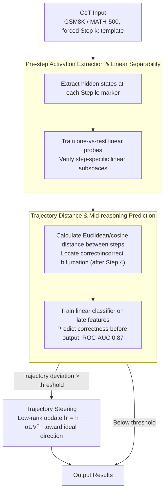

# LLM Reasoning as Trajectories: Step-Specific Representation Geometry and Correctness Signals

**Conference**: ACL 2026  
**arXiv**: [2604.05655](https://arxiv.org/abs/2604.05655)  
**Code**: https://github.com/slhleosun/reasoning-trajectory  
**Area**: LLM Reasoning / Interpretability / Representation Geometry  
**Keywords**: chain-of-thought, representation trajectory, linear separability, correctness prediction, activation steering

## TL;DR
This paper models LLM chain-of-thought reasoning as geometric trajectories in the representation space. It discovers that (a) each reasoning step occupies a linearly separable subspace that becomes clearer in deeper layers, and (b) correct and incorrect solutions overlap in early stages but diverge systematically later. This allows predicting the final correctness with an ROC-AUC of 0.87 before the answer is output, leading to a proposed "trajectory steering" method for reasoning correction and length control.

## Background & Motivation
**Background**: LLM CoT reasoning is typically treated as a "text-sequential generation" black box. Interpretability research often focuses on localized components like attention heads or conceptual directions, rarely analyzing the entire reasoning process as a continuous geometric object.

**Limitations of Prior Work**: (a) It is unclear what stage of reasoning the model has reached internally or why specific errors occur; (b) Existing inference-time interventions (e.g., test-time scaling with token injection or fixed steering vectors) often trigger unconditionally, lacking criteria for when to intervene, which leads to unstable effects; (c) The internal changes induced by reasoning training (such as distillation from DeepSeek-R1) remain poorly understood.

**Key Challenge**: Reasoning is a **time-series** process, yet most representation analysis methods focus on single tokens or single layers via probing, discarding the critical "transition between steps" signal.

**Goal**: Model the internal states of the reasoning process as a trajectory $\mathbf{h}_{t(\text{Step }1)-1}^{(\ell)},\mathbf{h}_{t(\text{Step }2)-1}^{(\ell)},\dots,\mathbf{h}_{t(\text{term})-1}^{(\ell)}$ to answer: Do steps correspond to distinct subspaces? Are correct and incorrect trajectories distinguishable? Can midpoint intervention be performed?

**Key Insight**: Using a fixed zero-shot CoT template, each step naturally begins with a "Step k:" marker. By extracting the hidden state immediately preceding this marker, an internal snapshot of the state after completing step $k$ and before entering step $k+1$ is obtained, avoiding contamination from surface-level formatting tokens.

**Core Idea**: Geometrize CoT using "pre-step activation" sequences. Employ linear probes and distance analysis to reveal step separability and correctness divergence, and perform low-rank steering corrections based on an "ideal trajectory."

## Method

### Overall Architecture
The research consists of three components corresponding to three key findings:
1. **Geometric Structure Analysis**: Uses t-SNE visualization and linear probing (one-vs-rest classification) to measure whether "pre-step activations" occupy step-specific subspaces, comparing Base, Instruct, and R1-Distill (Llama-3.1-8B variants).
2. **Correctness Signal Analysis**: Groups trajectories by final answer correctness and calculates Euclidean/cosine distances step-by-step to locate bifurcation points. Linear classifiers are trained on late-step features to predict final correctness.
3. **Trajectory Steering**: Constructs an "ideal trajectory" (mean path of correct samples). During inference, if the current trajectory deviates beyond a threshold, low-rank steering is triggered to pull it back toward the ideal direction. The same logic is applied to control reasoning length (pushing toward or pulling away from the termination subspace).

The study uses GSM8K (7,473 train / 1,319 test) and MATH-500, with prompts forcing each step to start with `Step k:` and answers to be marked with `####`.

### Key Designs

**1. Pre-step Activation Extraction & Linear Separability: Snapshots of Accumulated Reasoning State**

To capture how reasoning transitions between steps, hidden states $\mathbf{h}_{t(\text{Step }k)-1}^{(\ell)}$ are extracted at all layers immediately before each `Step k:` marker. Extracting "before" the marker captures the actual reasoning state after completing step $k$ without being contaminated by formatting tokens. Linear separability is used as the criterion because information being readable by a linear probe is standard evidence of explicit encoding. Cross-model transfer tests (Base/Instruct/R1-Distill) are used to ensure the probe learns structural features rather than surface patterns.

**2. Trajectory Distance & Mid-reasoning Correctness Prediction: Shifting signals from the end to the middle**

To predict failure before the answer is generated, distances $d(\mathbf{h}_{t(a)-1}^{(L)}, \mathbf{h}_{t(b)-1}^{(L)})$ between adjacent steps are calculated. Euclidean distance measures magnitude while cosine distance measures direction. The difference $\Delta(\text{Incorrect}-\text{Correct})$ identifies where trajectories diverge. Signals are statistically indistinguishable in early steps but diverge systematically after roughly step 4. A linear classifier using late-stage activations and distance features achieves a peak ROC-AUC of 0.87 at layer 29. This allows intervention before the answer is finalized, saving test-time compute and blocking error propagation.

**3. Trajectory Steering: Adaptive Low-rank Correction Based on Ideal Trajectories**

The "ideal trajectory" is defined by the centroid of activations from correct samples. During runtime, the deviation of the current trajectory from this centroid is tracked. If it exceeds a threshold, a low-rank steering update is applied:

$$\mathbf{h}' = \mathbf{h} + \alpha U V^\top \mathbf{h}$$

The steering matrix $UV^\top$ is derived from the SVD of the correct-incorrect difference vector. This also enables reasoning length control by pushing activations toward or away from the termination subspace. Unlike unconditional test-time scaling (e.g., injecting "Wait" tokens), this gated approach provides an objective criterion for intervention, affecting incorrect trajectories while remaining transparent to correct ones.

### Loss & Training
No models are trained; only linear probes and classifiers (logistic regression/SVM) are used. The steering matrix is obtained via closed-form SVD of the difference vectors, requiring no gradients.

## Key Experimental Results

### Main Results (Step Recognition Accuracy via Linear Probe, from Figure 1b / Table 1)

| Probe From | Eval On | Step 2 | Step 3 | Step 4 | Step 5 | Final Ans Marker |
|------------|---------|--------|--------|--------|--------|------------------|
| Instruct | R1-Distill | 0.99 (L18) | 0.93 (L19) | 0.87 (L12) | 0.91 (L18) | 0.87 (L23) |
| Instruct | Base | 1.00 (L12) | 0.97 (L08) | 0.95 (L08) | 0.93 (L18) | 0.97 (L21) |
| R1-Distill | Instruct | 1.00 (L03) | 0.92 (L08) | 0.88 (L07) | 0.93 (L27) | 0.98 (L19) |
| R1-Distill | Base | 1.00 (L06) | 0.94 (L04) | 0.89 (L30) | 0.91 (L08) | 0.96 (L19) |
| Base | Instruct | 1.00 (L21) | 0.98 (L18) | 0.97 (L18) | 0.97 (L23) | 1.00 (L31) |
| Base | R1-Distill | 0.99 (L12) | 0.91 (L18) | 0.90 (L18) | 0.92 (L17) | 0.94 (L02) |

Cross-model transfer accuracy is consistently $>0.90$, suggesting that step-specific linear structures are shared across Base, Instruct, and R1-Distill paradigms. In R1-Distill, the termination subspace forms much earlier (level 0 accuracy of 0.99 vs 0.80 for Instruct).

### Ablation Study

| Configuration | Key Metric | Description |
|------|---------|------|
| Full (Pre-step activations + true labels) | Step 2 probe 1.00, AUC 0.87 | Full setup |
| Randomly shuffled step labels | Mean 0.59 ± 0.04 | Near chance; proves geometry is not probe overfitting |
| Freeform prompt (No forced `Step k:`) | Best-layer accuracy ≥ 0.84 | Model spontaneously uses `Step k:` in 64.5% of cases |
| Step 1 features only for prediction | AUC ≈ 0.63 | Almost no correctness signal in early steps |
| Last steps features for prediction | AUC 0.83 / Peak 0.87 (L29) | Strong divergence in later steps |

### Key Findings
- Step-specific structures exist even in Base models; reasoning training highlights the termination subspace earlier rather than "creating" new structures.
- Early trajectories for correct and incorrect solutions are indistinguishable; bifurcation occurs after step 4, suggesting that early exiting is a poor strategy for reasoning.
- In freeform settings, models spontaneously use `Step k:` formatting 64.5% of the time, and probes transfer effectively ($>0.84$), proving the geometry is a true reasoning property rather than a prompt artifact.
- Mid-reasoning prediction-based gated intervention is more stable than unconditional token injection or steering across GSM8K and MATH-500.

## Highlights & Insights
- Reframing CoT as continuous trajectories in representation space provides a new unit of study for interpretability (trajectory vs. token/direction).
- The discovery that training primarily affects the timing of geometric emergence rather than the geometric form suggests that reasoning training's primary benefit is "termination calibration" rather than the acquisition of entirely new geometric capabilities.
- The 0.87 AUC mid-reasoning predictor can serve as a reward proxy for RL training, mitigating the sparsity issues of outcome-based rewards.
- The "ideal trajectory + low-rank steering" paradigm offers a clean geometric abstraction for inference-time intervention, transferable to code agents and planning.

## Limitations & Future Work
- Experiments were limited to Llama-3.1-8B and mathematical tasks; generalizability to other backbones (Qwen/Mistral) or domains (commonsense/code) remains to be verified.
- Defining the "ideal trajectory" via a single centroid ignores cases where multiple valid reasoning paths exist (multi-modal distributions), which may fail for open-ended problems.
- While consistent, the actual accuracy gains from steering are described as modest, indicating loss during the transition from signal detection to intervention.
- The reliance on `Step k:` markers limits application to tasks without clear step boundaries (e.g., open dialogue); alternative marking strategies are needed.

## Related Work & Insights
- **vs. Lanham et al. (CoT faithfulness)**: While they measure behavioral impacts of step removal, this work provides a geometric explanation at the representation level.
- **vs. Park et al. (Linear Representation Hypothesis)**: This work extends the idea that "concepts are linear directions" to "reasoning stages are linear subspaces."
- **vs. Turner et al. (Activation Steering)**: Traditional steering is unconditional; this work uses trajectory deviation as a gate for more precise intervention with fewer side effects.
- **vs. Muennighoff et al. (s1 / Test-time scaling)**: While they extend reasoning by injecting "Wait" tokens, this work uses termination subspace steering to achieve the same result in a continuous, controllable, and reversible manner.

## Rating
- Novelty: ⭐⭐⭐⭐⭐ "Reasoning as geometric trajectories" is a significant paradigm shift.
- Experimental Thoroughness: ⭐⭐⭐⭐ Solid cross-paradigm and freeform controls, though limited to one model family.
- Writing Quality: ⭐⭐⭐⭐ Clear structure with findings well-aligned to sections.
- Value: ⭐⭐⭐⭐ Provides new interfaces for interpretability, intervention, and reward modeling.

<!-- RELATED:START -->

## Related Papers

- [\[ACL 2026\] Reasoning Fails Where Step Flow Breaks](reasoning_fails_where_step_flow_breaks.md)
- [\[ACL 2026\] Which Reasoning Trajectories Teach Students to Reason Better? A Simple Metric of Informative Alignment](which_reasoning_trajectories_teach_students_to_reason_better_a_simple_metric_of_.md)
- [\[ICLR 2026\] Rethinking LLM Reasoning: From Explicit Trajectories to Latent Representations](../../ICLR2026/llm_reasoning/rethinking_llm_reasoning_from_explicit_trajectories_to_latent_representations.md)
- [\[ACL 2026\] On the Step Length Confounding in LLM Reasoning Data Selection](on_the_step_length_confounding_in_llm_reasoning_data_selection.md)
- [\[ICLR 2026\] The Path of Least Resistance: Guiding LLM Reasoning Trajectories for Efficient Consistency](../../ICLR2026/llm_reasoning/the_path_of_least_resistance_guiding_llm_reasoning_trajectories_for_efficient_co.md)

<!-- RELATED:END -->
