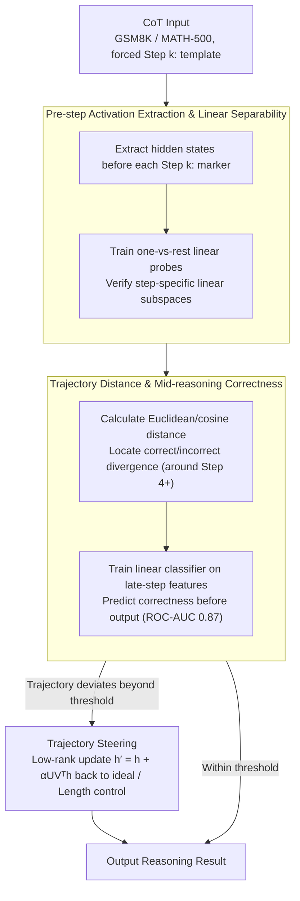

# LLM Reasoning as Trajectories: Step-Specific Representation Geometry and Correctness Signals

**Conference**: ACL 2026  
**arXiv**: [2604.05655](https://arxiv.org/abs/2604.05655)  
**Code**: https://github.com/slhleosun/reasoning-trajectory  
**Area**: LLM Reasoning / Interpretability / Representation Geometry  
**Keywords**: chain-of-thought, representation trajectories, linear separability, correctness prediction, activation steering  

## TL;DR
This paper views the chain-of-thought (CoT) reasoning of LLMs as a geometric trajectory in the representation space. It discovers that (a) each reasoning step occupies a linearly separable subspace that becomes clearer in deeper layers; (b) correct and incorrect solutions overlap in early steps but diverge systematically in later stages, enabling the prediction of final correctness with a ROC-AUC of 0.87 before the answer is generated. Based on these findings, it proposes "trajectory steering" for reasoning correction and length control.

## Background & Motivation
**Background**: LLM CoT reasoning is often treated as a "text-ordered generation" black box. Interpretability research has mostly focused on identifying specific functions of attention heads or "concept directions," while few have analyzed the entire reasoning process as a continuous geometric object.

**Limitations of Prior Work**: (a) It remains unclear what stage of reasoning the model has reached during a specific step or why certain problems are solved incorrectly; (b) Existing inference-time interventions (test-time scaling via token injection or fixed steering vectors) are mostly triggered unconditionally, lacking a criterion for when to intervene and resulting in unstable performance; (c) The specific changes brought by reasoning training (such as distillation from DeepSeek-R1) to the internal representations are not well understood.

**Key Challenge**: Reasoning is a **time-series** process, but the vast majority of representation analysis methods only perform probing on single tokens or single layers, losing the critical signal of how states transition between steps.

**Goal**: Model the internal states of the reasoning process as a trajectory $\mathbf{h}_{t(\text{Step }1)-1}^{(\ell)},\mathbf{h}_{t(\text{Step }2)-1}^{(\ell)},\dots,\mathbf{h}_{t(\text{term})-1}^{(\ell)}$ to answer: Do steps correspond to different subspaces? Are correct and incorrect trajectories distinguishable? Can we intervene mid-trajectory based on these signals?

**Key Insight**: Under a fixed zero-shot CoT template, each step is naturally preceded by a `Step k:` marker token. By extracting the hidden state immediately before this marker, one can obtain an internal snapshot of the state "after completing step $k$ and about to enter step $k+1$," avoiding contamination from surface formatting tokens.

**Core Idea**: Geometrize CoT using "pre-step activation" sequences, use linear probes and distance analysis to reveal step separability and correctness divergence, and finally perform low-rank steering for correction based on an "ideal trajectory."

## Method

### Overall Architecture
The study is divided into three parts corresponding to three findings:
1. **Geometric Structure Analysis**: Uses t-SNE visualization and linear probes (one-vs-rest classification) to measure whether "pre-step activations" occupy step-specific subspaces, comparing the impact of training paradigms across Base, Instruct, and R1-Distill variants (Llama-3.1-8B).
2. **Correctness Signal Analysis**: Groups trajectories by final correctness and calculates Euclidean/cosine distances step-by-step to locate divergence points. A linear classifier is trained on "late-step features" to predict final correctness.
3. **Trajectory Steering Intervention**: Constructs an "ideal trajectory" (the average path of correct samples). During runtime, if the current trajectory deviates beyond a threshold, low-rank steering is triggered to pull it back toward the ideal direction or control reasoning length.

Datasets used are GSM8K (7,473 train / 1,319 test) and MATH-500, with prompts forcing each step to start with `Step k:` and the answer to be marked with `####`.

### Key Designs

**1. Pre-step Activation Extraction & Linear Separability: A snapshot of "accumulated reasoning state"**

Reasoning is often treated as a sequence where signals between steps are lost. The first task is to cleanly extract internal states. The paper extracts hidden states $\mathbf{h}_{t(\text{Step }k)-1}^{(\ell)}$ from all layers immediately before each `Step k:` marker in a fixed zero-shot CoT template. Extracting *before* the marker captures the true reasoning state just as the model completes step $k$, avoiding format token contamination. Linear separability is used as a criterion because, in representation learning, information that can be read by a linear probe is standard evidence of being explicitly encoded. Cross-model transfer tests (Base/Instruct/R1-Distill) are used to ensure probes do not merely learn surface formats.

**2. Trajectory Distance & Mid-reasoning Correctness: Moving correctness signals from the end to the middle**

The paper aims to judge if reasoning will fail before the answer is output. It calculates distances $d(\mathbf{h}_{t(a)-1}^{(L)}, \mathbf{h}_{t(b)-1}^{(L)})$ between adjacent steps, using Euclidean distance for magnitude and cosine for direction. By comparing the difference $\Delta(\text{Incorrect}-\text{Correct})$, it locates where trajectories diverge. Results show early steps are statistically indistinguishable (95% CI overlap), with systematic divergence starting after Step 4. Based on this, a linear classifier predicts final correctness with a peak AUC of 0.87 at layer 29. This allows interventions to trigger mid-reasoning, saving test-time compute and preventing error propagation.

**3. Trajectory Steering: Adaptive low-rank correction based on ideal trajectories**

Once the divergence is identified, the final step is correction. The paper defines an "ideal trajectory" (centroid) using the average path of correct samples and tracks the deviation of the current trajectory in real-time. If the threshold is exceeded, a low-rank steering update is applied:

$$\mathbf{h}' = \mathbf{h} + \alpha U V^\top \mathbf{h}$$

This pushes the model back toward the ideal direction, where the steering matrix $UV^\top$ is derived from the SVD of the correct-incorrect difference vectors. This same logic allows length control: pushing activations toward a termination subspace shortens CoT, while pulling away extends it. Compared to unconditional test-time scaling, this provides an objective criterion for intervention, ensuring perturbations occur primarily on incorrect trajectories.

### Loss & Training
No fine-tuning of the LLM is performed. Only linear probes and classifiers (standard Logistic Regression / SVM) are trained. Steering matrices are computed via closed-form SVD of difference vectors without gradients.

## Key Experimental Results

### Main Results (Linear probe step recognition accuracy, from Figure 1b / Table 1)

| Probe From | Eval On | Step 2 | Step 3 | Step 4 | Step 5 | Final Ans Marker |
|------------|---------|--------|--------|--------|--------|------------------|
| Instruct | R1-Distill | 0.99 (L18) | 0.93 (L19) | 0.87 (L12) | 0.91 (L18) | 0.87 (L23) |
| Instruct | Base | 1.00 (L12) | 0.97 (L08) | 0.95 (L08) | 0.93 (L18) | 0.97 (L21) |
| R1-Distill | Instruct | 1.00 (L03) | 0.92 (L08) | 0.88 (L07) | 0.93 (L27) | 0.98 (L19) |
| R1-Distill | Base | 1.00 (L06) | 0.94 (L04) | 0.89 (L30) | 0.91 (L08) | 0.96 (L19) |
| Base | Instruct | 1.00 (L21) | 0.98 (L18) | 0.97 (L18) | 0.97 (L23) | 1.00 (L31) |
| Base | R1-Distill | 0.99 (L12) | 0.91 (L18) | 0.90 (L18) | 0.92 (L17) | 0.94 (L02) |

Cross-model transfer scores are almost all >0.90, indicating that step-specific linear structures are shared across Base, Instruct, and R1-Distill paradigms. The primary difference for R1-Distill is that the termination subspace forms in much shallower layers (0.99 at Layer 0 vs. 0.80 for Instruct).

### Ablation Study

| Configuration | Key Metric | Description |
|------|---------|------|
| Full (Pre-step activation + Ground truth labels) | Step 2 probe 1.00, AUC 0.87 | Full setting |
| Randomly shuffled step labels (Control) | Avg 0.59 ± 0.04 | Near chance; proves geometry isn't probe overfitting |
| Freeform prompt (No forced `Step k:` template) | Best-layer ≥ 0.84 | Model spontaneously uses `Step k:` in 64.5% samples; others still transferable at boundaries |
| Predict correctness using Step 1 features only | AUC ≈ 0.63 | Almost no correctness signal in early steps |
| Predict correctness using final steps features | AUC 0.83 / Peak 0.87 (L29) | Strong divergence in late steps |

### Key Findings
- Step-specific structures exist in Base models. Reasoning training primarily highlights the termination subspace earlier/deeper rather than "creating" new structures.
- Early trajectories do not differ by correctness; divergence occurs after Step 4. This suggests "early exit" is a poor strategy for reasoning, as the first 4 steps are necessary.
- In freeform prompts, the model spontaneously chooses the `Step k:` format in 64.5% of cases, and probes transferred from the fixed template still achieve >0.84, proving this is an inherent reasoning structure rather than a prompt artifact.
- Mid-reasoning prediction gating for intervention is more stable than unconditional token injection or steering across GSM8K/MATH-500.

## Highlights & Insights
- Reframing CoT from discrete token sequences to "continuous trajectories in representation space" is a paradigm shift, providing a new unit of study (trajectory vs. token/direction).
- Discovery: "Training changes *when* geometry appears, not the geometry itself." This suggests reasoning training's key benefit is "termination calibration" rather than the acquisition of fundamentally new capabilities.
- The 0.87 AUC mid-trajectory predictor can be used directly as a reward proxy for RL, bypassing the sparsity of outcome-based rewards.
- The "ideal trajectory + low-rank steering" framework provides a clean geometric abstraction for inference-time intervention, transferable to code agents and planning.

## Limitations & Future Work
- Experiments were restricted to the Llama-3.1-8B backbone and GSM8K/MATH-500. Generality across Qwen/Mistral or commonsense/code reasoning is unverified.
- Using a centroid for the "ideal trajectory" ignores that correct solutions may have multiple paths (multi-modal distribution), which might fail for open-ended proofs.
- The practical accuracy gain from steering is "modest but consistent," indicating loss during the transition from signal detection to intervention.
- Activation extraction relies on `Step k:` markers. For tasks without clear steps (NLG, dialogue), the marking strategy must be redesigned, which is the biggest bottleneck for broader application.

## Related Work & Insights
- **vs. Lanham et al. (CoT faithfulness)**: They measured if deleting steps affects the answer at a behavioral level; this work provides a geometric explanation from the representation side.
- **vs. Park et al. (Linear Representation Hypothesis)**: This work extends "concepts are linear directions" to "reasoning stages are linear subspaces."
- **vs. Turner et al. (Activation Steering)**: Traditional steering adds fixed vectors unconditionally; this work uses trajectory deviation as a gate for more precise, less intrusive interventions.
- **vs. Muennighoff et al. (s1 / Test-time scaling)**: They extend reasoning via "Wait" tokens; this work uses termination subspace steering for continuous, reversible control.

## Rating
- Novelty: ⭐⭐⭐⭐⭐ "Reasoning = Geometric Trajectory" is a strong new paradigm.
- Experimental Thoroughness: ⭐⭐⭐⭐ Solid cross-paradigm/format/freeform controls, though limited to one model family.
- Writing Quality: ⭐⭐⭐⭐ Clear structure with findings mapping directly to sections.
- Value: ⭐⭐⭐⭐ Opens new interfaces for interpretability, test-time intervention, and reward modeling.

<!-- RELATED:START -->

## Related Papers

- [\[ACL 2026\] On the Step Length Confounding in LLM Reasoning Data Selection](on_the_step_length_confounding_in_llm_reasoning_data_selection.md)
- [\[ICLR 2026\] The Path of Least Resistance: Guiding LLM Reasoning Trajectories for Efficient Consistency](../../ICLR2026/llm_reasoning/the_path_of_least_resistance_guiding_llm_reasoning_trajectories_for_efficient_co.md)
- [\[ICLR 2026\] The Path of Least Resistance: Guiding LLM Reasoning Trajectories with Prefix Consensus](../../ICLR2026/llm_reasoning/the_path_of_least_resistance_guiding_llm_reasoning_trajectories_with_prefix_cons.md)
- [\[ACL 2026\] Which Reasoning Trajectories Teach Students to Reason Better? A Simple Metric of Informative Alignment](which_reasoning_trajectories_teach_students_to_reason_better_a_simple_metric_of_.md)
- [\[ACL 2026\] Reasoning Fails Where Step Flow Breaks](reasoning_fails_where_step_flow_breaks.md)

<!-- RELATED:END -->
