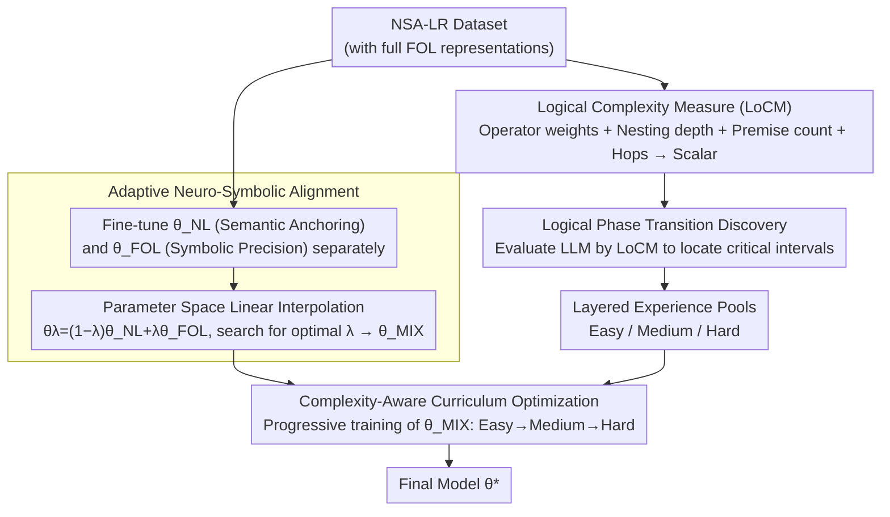

# Logical Phase Transitions: Understanding Collapse in LLM Logical Reasoning

**Conference**: ACL 2026  
**arXiv**: [2601.02902](https://arxiv.org/abs/2601.02902)  
**Code**: [https://github.com/AI4SS/Logical-Phase-Transitions](https://github.com/AI4SS/Logical-Phase-Transitions)  
**Area**: LLM Reasoning  
**Keywords**: Logical Reasoning, Phase Transitions, Curriculum Learning, Neuro-Symbolic Alignment, Reasoning Collapse

## TL;DR

This paper discovers the "logical phase transition" phenomenon in LLM logical reasoning—performance collapses abruptly at specific complexity thresholds rather than degrading smoothly. It proposes the Logical Complexity Measure (LoCM) to quantify this phenomenon and designs the Neuro-Symbolic Curriculum Tuning (NSCT) framework. Through adaptive neuro-symbolic alignment and complexity-aware curriculum optimization, NSCT improves accuracy by an average of +1.26 over naive prompting and +3.95 over CoT across five benchmarks.

## Background & Motivation

**Background**: Symbolic logical reasoning is a critical capability for LLMs, underpinning high-stakes domains such as mathematical proof and legal reasoning. Existing research indicates that LLMs perform well on simple logical tasks, but performance degrades significantly as complexity increases.

**Limitations of Prior Work**: Although performance degradation is widely observed, a systematic characterization of "how logical depth affects reasoning capacity" is lacking. Existing analyses rely on coarse-grained difficulty proxies (such as hop counts), which fail to precisely quantify logical complexity itself. Existing reasoning enhancement methods (CoT, ToT, symbolic reasoning, etc.) improve surface performance but lack insight into the laws governing reasoning behavior changes across complexity levels.

**Key Challenge**: Existing logical reasoning datasets lack complete First-Order Logic (FOL) representations, making it impossible to precisely characterize logical dependency structures and compositional depth. Consequently, the fundamental laws of reasoning collapse cannot be discovered or explained.

**Goal**: (1) Propose a metric to precisely quantify logical complexity; (2) Discover and formalize the phenomenon of reasoning collapse; (3) Design training strategies specifically for the collapse regions.

**Key Insight**: The authors draw an analogy to phase transitions in physics—where substances like water undergo sudden changes at 0°C and 100°C rather than continuous variation. Logical reasoning performance also collapses at critical complexity thresholds, exhibiting characteristics of a phase transition.

**Core Idea**: Quantify logical complexity using LoCM to identify phase transition intervals, then utilize weight space interpolation for neuro-symbolic alignment to bridge natural language and logical symbolic representations. Finally, apply complexity-aware curriculum learning to progressively reinforce reasoning at the phase transition boundaries.

## Method

### Overall Architecture

The framework consists of three stages: (1) Logical Complexity Measurement—constructing the NSA-LR dataset and using LoCM to quantify the logical difficulty of each sample; (2) Logical Phase Transition Discovery—evaluating LLM performance using LoCM to identify phase transition intervals and categorizing samples into Easy/Medium/Hard experience pools; (3) Neuro-Symbolic Curriculum Tuning—deriving a hybrid semantic model $\theta_{MIX}$ via NL-FOL weight interpolation, followed by curriculum optimization with increasing complexity to obtain the final model $\theta^*$.

### Key Designs

**1. Logical Complexity Measure (LoCM): Assigning a scalar to precisely characterize "Logical Difficulty"**

Existing complexity estimations almost exclusively count "reasoning hops," yet this ignores the fact that different operators like negation or implication vary vastly in difficulty. Furthermore, nesting depth and the number of premises significantly elevate difficulty. LoCM integrates these dimensions into a single scalar by synthesizing the type weights of logical operators $\omega(o)$, the frequency of operators in the formula $\text{freq}(o, \phi)$ (which accounts for nesting depth $d$ and premise count $N_\phi$), and reasoning hops $h$, followed by a normalized monotonic transformation $f$:

$$\text{LoCM}(\phi) = f\!\left(\sum_{o \in \mathcal{O}} \omega(o) \cdot \text{freq}(o, \phi) + \gamma \cdot h(\phi)\right)$$

With this fine-grained multi-dimensional score, the paper accurately characterizes "how logical depth affects reasoning," facilitating the discovery of phase transition phenomena that remain invisible when only considering hop counts.

**2. Adaptive Neuro-Symbolic Alignment: Merging NL semantics and FOL precision via weight interpolation**

Logical reasoning involves a natural tension: Natural Language (NL) provides semantic anchoring but is loose and prone to ambiguity; First-Order Logic (FOL) provides precise symbolic constraints but lacks semantic intuition. Instead of heavy multi-modal joint training, the paper adopts a lightweight approach: fine-tune a pure NL model $\theta_{NL}$ and a pure FOL model $\theta_{FOL}$ separately, then perform linear interpolation in the parameter space $\theta_\lambda = (1-\lambda)\theta_{NL} + \lambda\theta_{FOL}$ to form a hybrid model family. After searching for the optimal $\lambda$ on a validation set, $\theta_{MIX}$ is obtained. This essentially leverages "mode connectivity"—where effective solutions exist along the parameter path between two models of common descent—to achieve hybrid reasoning capabilities that are both semantically anchored and symbolically precise.

**3. Complexity-Aware Curriculum Optimization: Progressive reinforcement at transition boundaries**

The discovery of phase transitions directly dictates the training strategy. Since model performance has already "collapsed" in high-complexity regions, training directly with high-complexity samples is ineffective and can lead to instability. Based on $\theta_{MIX}$, samples are organized into a curriculum of Easy → Medium → Hard according to LoCM. Each stage involves training on samples from the current and all preceding complexity levels, with performance monitored until gains stabilize before proceeding to the next stage. The loss function uses standard token-level cross-entropy. This progressive exposure allows the model to "cross" phase transition intervals smoothly, pushing the capability boundary further into high-complexity zones rather than failing in the collapse region.

### Loss & Training

Standard token-level cross-entropy loss is used throughout: $\mathcal{L}(\theta) = -\mathbb{E}[\sum_t \log p_\theta(y_t | x, y_{<t})]$. The NSA-LR dataset was dual-translated by GPT-5 and Qwen3-Max, with inconsistencies resolved via CFG verification or human arbitration.

## Key Experimental Results

### Main Results

| Method | ProntoQA | ProofWriter | FOLIO | ProverQA | NSA-LR | Average |
|------|----------|-------------|-------|----------|--------|------|
| Naive Original | 55.20 | 44.16 | 60.78 | 54.13 | 49.55 | 52.76 |
| **Naive + NSCT** | **56.80** | **44.66** | **62.25** | **55.47** | **50.91** | **54.02 (+1.26)** |
| CoT Original | 67.60 | 55.16 | 66.17 | 60.70 | 57.70 | 61.47 |
| **CoT + NSCT** | **72.00** | **60.71** | 65.20 | **64.20** | **65.00** | **65.42 (+3.95)** |

### Ablation Study (NSA-LR dataset stratified by complexity)

| Method | Low | Medium | High | Overall |
|------|-----|--------|------|---------|
| CoT Original | 75.5 | 58.4 | 39.4 | 57.7 |
| **CoT + NSCT** | **84.0 (+8.5)** | **64.2 (+5.8)** | **46.8 (+7.4)** | **65.0 (+7.3)** |

### Key Findings

- The logical phase transition phenomenon consistently appears across all tested open-source and closed-source LLMs, suggesting it is a universal law of reasoning capacity rather than model-specific.
- Phase transitions do not occur at a single threshold but across multiple critical intervals $\mathcal{I}_k$, where accuracy drops sharply within the interval and stabilizes afterward (resembling solid-liquid-gas multi-phase transitions).
- NSCT achieves the greatest gain (+7.4) on High complexity samples, proving the method's effectiveness in phase transition regions.
- Fine-tuning on a single dataset often leads to degradation on others (e.g., FOLIO-tuned dropped 0.33 on ProverQA), whereas NSCT is the only method showing consistent improvements across all datasets.
- The analogy between phase transition discovery and Landau's phase transition theory in physics is precise—system behavior changes abruptly as the control variable (LoCM) enters critical intervals.

## Highlights & Insights

- The concept of "logical phase transition" borrowed from physics is highly apt—performance does not degrade smoothly but changes abruptly at thresholds. This provides a fresh perspective for understanding the boundaries of LLM reasoning capacity and explains why simply increasing training data fails to improve high-complexity reasoning.
- The design of LoCM, which unifies logical operator weights, nesting depth, premise counts, and reasoning hops into a scalar metric, represents the first systematic attempt at logical complexity quantification and can serve as a standard tool for future research.
- Using weight interpolation to merge NL and FOL models is simple yet effective, leveraging mode connectivity properties while remaining more lightweight than multi-task joint training.

## Limitations & Future Work

- The setting of operator weights $\omega(o)$ in LoCM requires domain knowledge; different logic systems may require different weights.
- Only validated within the SFT framework; the effects of Reinforcement Learning (e.g., GRPO) on phase transition regions have not been explored.
- The NSA-LR dataset consists of synthetic data; real-world natural language logical reasoning may exhibit more complex noise patterns.
- The automatic detection method for phase transition intervals is not detailed; how to determine critical intervals in practical applications requires more guidance.

## Related Work & Insights

- **vs Apple (Shojaee et al.)**: Apple discovered reasoning collapse in procedural tasks (e.g., Tower of Hanoi) but focused on structured puzzles. This paper focuses on symbolic reasoning in propositional/first-order logic, with entirely different complexity definitions, evaluation targets, and intervention methods.
- **vs CoT-Valve**: CoT-Valve controls reasoning chain length; this paper reveals that the problem lies in logical complexity rather than chain length, providing a more fundamental explanation.

## Rating

- Novelty: ⭐⭐⭐⭐⭐ The logical phase transition concept is novel and supported by experiments; LoCM fills a gap in logical complexity quantification.
- Experimental Thoroughness: ⭐⭐⭐⭐ Comparison across five benchmarks and various reasoning methods, though absolute improvements are relatively modest.
- Writing Quality: ⭐⭐⭐⭐⭐ The physics analogy is precise and appropriate, the framework overview is clear, and the narrative is fluent.
- Value: ⭐⭐⭐⭐ Provides a new framework for understanding LLM reasoning boundaries, though the actual gains are moderate (+1.26/+3.95).

<!-- RELATED:START -->

## Related Papers

- [\[ACL 2026\] Discovering a Shared Logical Subspace: Steering LLM Logical Reasoning via Alignment of Natural-Language and Symbolic Views](discovering_a_shared_logical_subspace_steering_llm_logical_reasoning_via_alignme.md)
- [\[ACL 2026\] Semantic-Aware Logical Reasoning via a Semiotic Framework](semantic-aware_logical_reasoning_via_a_semiotic_framework.md)
- [\[ICLR 2026\] LogicReward: Incentivizing LLM Reasoning via Step-Wise Logical Supervision](../../ICLR2026/llm_reasoning/logicreward_incentivizing_llm_reasoning_via_step-wise_logical_supervision.md)
- [\[ACL 2026\] Self-Awareness before Action: Mitigating Logical Inertia via Proactive Cognitive Awareness](self-awareness_before_action_mitigating_logical_inertia_via_proactive_cognitive_.md)
- [\[ICLR 2026\] ActivationReasoning: Logical Reasoning in Latent Activation Spaces](../../ICLR2026/llm_reasoning/activationreasoning_logical_reasoning_in_latent_activation_spaces.md)

<!-- RELATED:END -->
