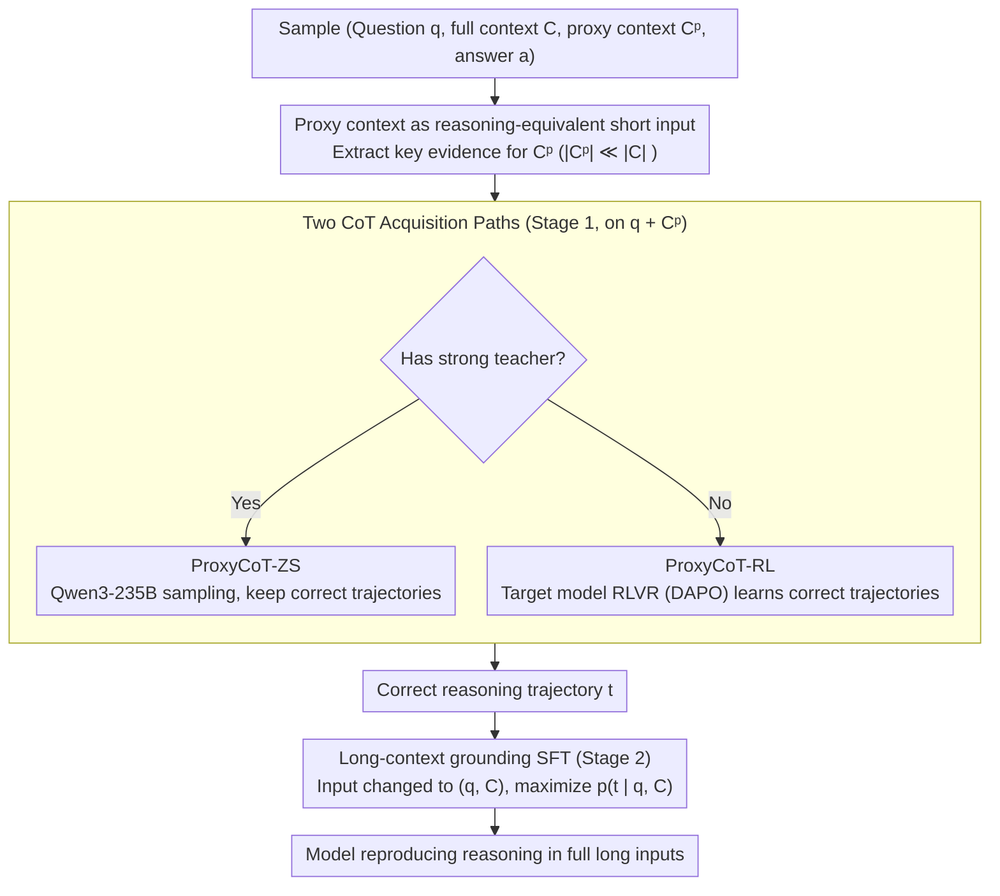

# Long-Context Reasoning Through Proxy-Based Chain-of-Thought Tuning

**Conference**: ACL2026  
**arXiv**: [2605.20201](https://arxiv.org/abs/2605.20201)  
**Code**: https://github.com/oaimli/ProxyCoT  
**Area**: LLM Reasoning / Long Context / Chain-of-Thought  
**Keywords**: Long-context reasoning, proxy context, CoT distillation, RLVR, ProxyCoT  

## TL;DR
ProxyCoT leverages short yet sufficient proxy contexts to obtain high-quality reasoning trajectories, which are then distilled into full long-context inputs. This approach enables 4B models to significantly improve long-context reasoning on SciTrek, HotpotQA, and Loong while reducing the number of CoT tokens during inference.

## Background & Motivation
**Background**: Modern LLM context windows have expanded to millions of tokens, but the ability to read long text does not equate to stable reasoning over it. Many tasks only require locating a small amount of evidence from long inputs for comparison, filtering, aggregation, or multi-hop reasoning.

**Limitations of Prior Work**: Common methods for enhancing reasoning include CoT distillation or Reinforcement Learning (RL). The former requires a large teacher model to generate high-quality trajectories, while the latter requires massive sampling. Both are feasible in short contexts, but once applied directly to 64K, 128K, or longer contexts, costs skyrocket, and teacher models themselves may generate unreliable trajectories in long contexts.

**Key Challenge**: The reasoning logic of long-context tasks often depends on a small segment of key evidence, yet training and supervision are forced to process the entire long input. Models can better execute the same reasoning on a proxy context but fail on the full context due to failures in evidence localization and grounding.

**Goal**: To utilize proxy contexts to obtain correct CoT at low cost and then train the model to reproduce these trajectories under full context conditions, transferring reasoning behaviors learned from short contexts to long inputs.

**Key Insight**: The authors define a proxy context as a short input containing sufficient evidence, satisfying $|C^p|\ll |C|$, while maintaining consistency in the question, answer, and reasoning steps with the full context. Thus, the proxy context serves as an upper bound for "perfect retrieval" and a source of low-cost reasoning supervision.

**Core Idea**: First, generate correct CoT on the proxy context using a strong teacher or RLVR, then use SFT to train the student model to produce the same reasoning trajectories given the full long context.

## Method
ProxyCoT is a two-stage training framework. The first stage focuses on short proxy contexts to obtain high-quality, low-cost reasoning trajectories. The second stage binds these trajectories to the full long context, teaching the model to locate and use the corresponding evidence within long inputs.

### Overall Architecture
Each sample consists of a question $q$, full context $C$, proxy context $C^p$, and answer $a$. Stage 1 obtains the reasoning trajectory $t$ on $(q, C^p)$. If a strong teacher is available, ProxyCoT-ZS is used: Qwen3-235B-A22B-Thinking samples multiple times on the proxy context, retaining only trajectories with correct answers. If no suitable teacher exists, ProxyCoT-RL is used: the target model learns to generate correct reasoning trajectories via RLVR on the proxy context.

Stage 2 employs SFT, using trajectories from Stage 1 as supervision, but replaces the input with $(q, C)$. This step requires the model to reproduce proxy-derived CoT within the full long context, thereby learning evidence grounding. Validations were conducted on Qwen3-4B-Instruct-2507 and Gemma3-4B-IT using SciTrek and HotpotQA, with out-of-domain testing on Loong.

### Key Designs

**1. Proxy context as reasoning-equivalent short input: Replacing long inputs with short evidence segments to generate trajectories**

Repeatedly sampling reasoning trajectories directly on 64K or 128K full contexts is extremely costly, and teachers themselves are prone to grounding failures and unreliable chains in long inputs. The premise of ProxyCoT is that reasoning for long-context tasks often relies on a small slice of evidence. By extracting this evidence to form a proxy context $C^p$ where $|C^p|\ll|C|$, the model maintains the same task structure. This acts as a "perfect retrieval" upper bound. The extraction method depends on the task: SciTrek uses metadata (titles, authors, citations), while HotpotQA uses human-annotated supporting sentences. Training on these sufficient short segments is much more efficient than using long inputs.

**2. Two CoT acquisition paths: Covering scenarios with and without strong teachers**

ProxyCoT provides two complementary paths to obtain correct trajectories. With a strong teacher (ProxyCoT-ZS), Qwen3-235B-A22B-Thinking samples trajectories on proxy contexts, keeping only correct ones; the teacher is both cheap and reliable on short inputs. Without a suitable teacher (ProxyCoT-RL), the target model undergoes RLVR (DAPO) on the proxy context, optimized with rewards for F1 and exact match. Both paths confine expensive operations to short inputs, avoiding the high cost of RL sampling on 128K contexts.

**3. Long-context grounding SFT: Migrating reasoning from short evidence back to full long inputs**

Training only on proxies would make the model dependent on short evidence formats, leading to grounding failures on real long inputs. Stage 2 uses SFT with Stage 1 trajectories $t$ as supervision but changes the input to the full $(q, C)$. By maximizing $p_\theta(t\mid q,C)$, the model is forced to reproduce the proxy-derived reasoning within the long text, effectively learning to locate and use evidence in situ. This is critical for full context performance: for Qwen3-4B, RLVR alone reached only 29.0 on full context metrics, which rose to 46.5 after adding grounding SFT.

### Loss & Training
For ProxyCoT-ZS, the SFT loss is $\mathcal{L}_{SFT}=-\mathbb{E}[\log p_\theta(t\mid q,C)]$. For ProxyCoT-RL, RLVR optimization on the proxy context uses reward $R(a,\hat{a})=F1(a,\hat{a})+\mathds{1}_{a==\hat{a}}$, followed by SFT from the RL checkpoint. RL was implemented using OpenRLHF with a batch size of 64, max generation length of 2,048, and actor learning rate of $5e{-7}$ over 10 epochs (8 trajectories per prompt). SFT used a batch size of 64 and learning rate of $5e{-6}$ with a 10% linear warmup.

## Key Experimental Results

### Main Results

| Dataset / Model | Method | Proxy Metric | Full Metric | Description |
| :--- | :--- | :--- | :--- | :--- |
| SciTrek / Qwen3-4B | Zero-shot | 67.2 | 30.8 | Significant drop in full context |
| SciTrek / Qwen3-4B | ProxyCoT-ZS | 67.8 | 38.8 | Teacher proxy CoT distillation is effective |
| SciTrek / Qwen3-4B | ProxyCoT-RL | 88.5 | 46.5 | Close to Qwen3-235B-Thinking full (48.8) |
| SciTrek / Gemma3-4B | Zero-shot | 34.2 | 3.0 | Very weak baseline long-context capability |
| SciTrek / Gemma3-4B | ProxyCoT-RL | 69.8 | 43.7 | Most significant improvement |
| HotpotQA / Qwen3-4B | Zero-shot | 91.3 | 44.5 | Strong on proxy, weak on full context |
| HotpotQA / Qwen3-4B | ProxyCoT-RL | 92.1 | 52.7 | Optimal in full context |
| Loong / Gemma3-4B | Zero-shot → ProxyCoT-RL | Financial 25.85 → 32.05; Academic 3.55 → 24.32 | Generalization without retraining | Demonstrated it's not just memorizing SciTrek format |

### Ablation Study

| Analysis Item | Config | Key Result | Description |
| :--- | :--- | :--- | :--- |
| CoT tokens | Qwen3-4B on SciTrek full | Zero-shot 1,744 tokens/30.8 EM; SFT full CoT 6,683/31.6; ProxyCoT-RL 617/46.5 | ProxyCoT-RL is both more accurate and concise |
| Two-stage Ablation | Qwen3-4B | Stage1+2 full 46.5; only RLVR full 29.0; only SFT full 46.3 | SFT grounding is critical for Qwen3; RL improves proxy performance |
| Two-stage Ablation | Gemma3-4B | Stage1+2 full 43.7; only RLVR full 8.0; only SFT full 37.3 | Weak long-context models rely more on the two-stage combination |
| Proxy Types | SciTrek | Random 3.4; Title/Auth/Cit 24.6; Structured Metadata 91.5 | Proxy quality determines the effectiveness of RLVR |
| Proxy Noise | SciTrek | Oracle:Noise 1:5 is 85.3; 1:0 is 91.5 | Robustness: limited drop after adding noise |
| Proxy Noise | HotpotQA | 1:5 is 83.7; 1:0 is 92.2 | Excessive noise degrades proxy but doesn't cause immediate failure |

### Key Findings
- The performance gap between full and proxy contexts is the true bottleneck: models lack the ability to ground reasoning steps in long inputs rather than the ability to reason.
- ProxyCoT-RL typically outperforms ProxyCoT-ZS, indicating that task-specific trajectories from RLVR on proxy contexts are more suitable for distillation than zero-shot teacher trajectories.
- SFT or RLVR directly on full context is unstable; obtaining trajectories on short proxies and grounding them in full context is the optimal trade-off.
- The structure of the proxy is vital. Structured metadata in SciTrek significantly outperforms unstructured text.

## Highlights & Insights
- The paper identifies a key fact in long-context reasoning: most tokens act as a localization burden; the actual evidence needed for reasoning is brief.
- ProxyCoT transforms RAG's "evidence retrieval" concept into training signals rather than just concatenating results at inference. This allows the model to learn reasoning patterns on short evidence within long contexts.
- Achieving 46.5 EM with only 617 CoT tokens vs. 31.6 EM with 6,683 tokens shows that longer reasoning is not always better, especially if grounding is incorrect.
- Practical for resource-constrained labs: avoids full 128K context teacher inference and expensive long-input RL sampling.

## Limitations & Future Work
- The method assumes the availability of proxy contexts. Automated proxy construction remains difficult for tasks without explicit supporting evidence.
- The interaction between ProxyCoT and standard RAG workflows (who manages evidence selection) is not deeply discussed.
- Experiments are restricted to English; generalization across languages and even longer contexts needs more validation.
- Poor proxy quality shifts the bottleneck from training to proxy construction.
- Future work could explore automated proxy discovery, training with noisy evidence, and combining tool-calling with long-context grounding.

## Related Work & Insights
- **vs CoT Distillation**: Standard distillation uses teacher trajectories on full inputs; ProxyCoT uses short proxy trajectories and migrates to full context.
- **vs RLVR on full context**: Direct long-context RLVR is sampling-heavy; ProxyCoT-RL moves RL to short proxies, significantly reducing training difficulty.
- **vs RAG**: RAG retrieves evidence at inference; ProxyCoT uses "perfectly retrieved evidence" as intermediate supervision during training to strengthen the model itself.
- **vs Architecture Improvements**: Sparse attention or RoPE scaling solve readable length; ProxyCoT solves holding correct reasoning trajectories within that length.

## Rating
- Novelty: ⭐⭐⭐⭐☆ The CoT migration from proxy to full context is intuitive and precisely targeted.
- Experimental Thoroughness: ⭐⭐⭐⭐☆ Covers two models, two main datasets, and Loong migration, though language range is limited.
- Writing Quality: ⭐⭐⭐⭐☆ Clear motivation and sufficient data support the necessity of the two-stage approach.
- Value: ⭐⭐⭐⭐⭐ Highly practical for long-context reasoning training, especially with computation budgets.

<!-- RELATED:START -->

## Related Papers

- [\[ACL 2026\] PPA-Plan: Proactive Pitfall Avoidance for Reliable Planning in Long-Context LLM Reasoning](ppa-plan_proactive_pitfall_avoidance_for_reliable_planning_in_long-context_llm_r.md)
- [\[ACL 2026\] DELTA: Dynamic Layer-Aware Token Attention for Efficient Long-Context Reasoning](delta_dynamic_layer-aware_token_attention_for_efficient_long-context_reasoning.md)
- [\[ACL 2026\] Distilling Long-CoT Reasoning through Collaborative Step-wise Multi-Teacher Decoding (CoRD)](distilling_long-cot_reasoning_through_collaborative_step-wise_multi-teacher_deco.md)
- [\[ICLR 2026\] InftyThink: Breaking the Length Limits of Long-Context Reasoning in Large Language Models](../../ICLR2026/llm_reasoning/inftythink_breaking_the_length_limits_of_long-context_reasoning_in_large_languag.md)
- [\[ACL 2025\] Enhancing Chain-of-Thought Reasoning with Critical Representation Fine-tuning](../../ACL2025/llm_reasoning/enhancing_chain-of-thought_reasoning_with_critical_representation_fine-tuning.md)

<!-- RELATED:END -->
