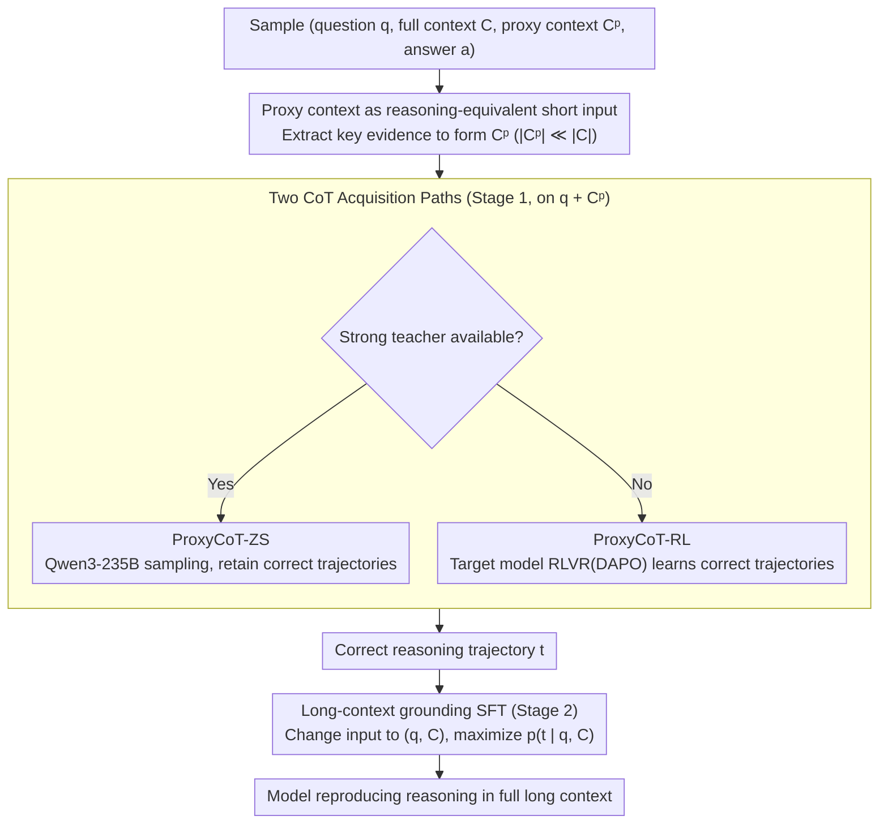

# Long-Context Reasoning Through Proxy-Based Chain-of-Thought Tuning

**Conference**: ACL2026  
**arXiv**: [2605.20201](https://arxiv.org/abs/2605.20201)  
**Code**: https://github.com/oaimli/ProxyCoT  
**Area**: LLM Reasoning / Long Context / Chain-of-Thought  
**Keywords**: Long-context reasoning, proxy context, CoT distillation, RLVR, ProxyCoT  

## TL;DR
ProxyCoT leverages short yet sufficient proxy contexts to first obtain high-quality reasoning trajectories, and then distills these trajectories into the full long-context input. This approach enables a 4B model to significantly improve long-context reasoning on SciTrek, HotpotQA, and Loong while reducing the number of CoT tokens during inference.

## Background & Motivation
**Background**: Modern LLM context windows have expanded to millions or even tens of millions of tokens, but the ability to read long text does not equate to stable reasoning over it. Many tasks only require locating a small amount of evidence from long inputs to perform matching, filtering, aggregation, or multi-hop reasoning.

**Limitations of Prior Work**: Common methods to enhance reasoning involve CoT distillation or reinforcement learning (RL). The former requires a large teacher model to generate high-quality reasoning trajectories, while the latter requires extensive sampling. Both are feasible in short contexts but become costly when applied directly to 64K, 128K, or longer contexts. Furthermore, teacher models themselves may generate unreliable trajectories in long contexts.

**Key Challenge**: The reasoning logic of long-context tasks often relies only on a small segment of key evidence, yet training and supervision are forced to process the entire long input. Models can better execute the same reasoning on a proxy context but fail on the full context due to failures in evidence localization and grounding.

**Goal**: Utilize proxy contexts to obtain correct CoTs at a low cost, and then train the model to reproduce these reasoning trajectories under full-context conditions, allowing the model to transfer reasoning behaviors learned in short contexts to long inputs.

**Key Insight**: The authors define a proxy context as a short input containing sufficient evidence, satisfying $|C^p|\ll |C|$, while keeping the question, answer, and reasoning steps consistent with the full context. Thus, the proxy context can be viewed as an upper bound for "perfect retrieval" and a source of low-cost reasoning supervision.

**Core Idea**: First, generate correct CoTs on the proxy context using a strong teacher or RLVR, and then use SFT to enable the student model to generate the same reasoning trajectories given the full long context.

## Method
ProxyCoT is a two-stage training framework. The first stage focuses on short proxy contexts to obtain high-quality, low-cost reasoning trajectories. The second stage binds these trajectories to the full long context, training the model to locate and utilize corresponding evidence within the long input.

### Overall Architecture
Each sample consists of a question $q$, full context $C$, proxy context $C^p$, and answer $a$. Stage 1 obtains the reasoning trajectory $t$ on $(q,C^p)$. If a strong teacher is available, ProxyCoT-ZS is used: Qwen3-235B-A22B-Thinking samples multiple times on the proxy context, retaining only trajectories with correct answers. If no suitable teacher is available, ProxyCoT-RL is used: the target model first learns to generate correct reasoning trajectories on the proxy context via RLVR.

Stage 2 uses SFT, employing the trajectories from Stage 1 as supervision, but changing the input to $(q,C)$. This step requires the model to reproduce proxy-derived CoTs within the full long context, thereby learning evidence grounding. Validations are conducted on Qwen3-4B-Instruct-2507 and Gemma3-4B-IT across tasks including SciTrek and HotpotQA, with out-of-domain testing on Loong.

### Key Designs

**1. Proxy context as reasoning-equivalent short input: Use a small segment of key evidence instead of long input to generate reasoning trajectories**

Sampling reasoning trajectories repeatedly on 64K, 128K, or even longer full contexts is extremely costly. Moreover, teachers themselves are prone to grounding failures and generating unreliable chains in long inputs. The premise of ProxyCoT is that the reasoning logic for long-context tasks typically depends on a small amount of key evidence. By extracting this evidence to form a proxy context $C^p$ where $|C^p|\ll|C|$, the question, answer, and reasoning steps remain consistent with the full context—effectively acting as a "perfect retrieval" upper bound. The extraction method depends on the task structure: for SciTrek, where questions involve metadata like titles or citations, structured metadata serves as the proxy; for HotpotQA, manually annotated supporting sentences are used. Since short evidence suffices to answer the question, training or sampling reasoning on it is far more cost-effective than iterating on long inputs.

**2. Two CoT Acquisition Paths: Covering scenarios with and without strong teachers**

Having a proxy context requires a correct reasoning trajectory for supervision. The paper provides two complementary paths. For ProxyCoT-ZS, Qwen3-235B-A22B-Thinking samples multiple times on the proxy context, keeping only correct trajectories—large teachers are both cheap and reliable on short proxies. For ProxyCoT-RL, the target model performs RLVR (DAPO) on the proxy context with rewards based on F1 and exact match to optimize trajectories. Crucially, both paths confine expensive operations to short inputs: the large teacher avoids reading 128K tokens repeatedly, and RL sampling becomes truly trainable due to short inputs, avoiding the high cost of RL on full contexts.

**3. Long-context grounding SFT: Transferring reasoning learned on short evidence back to full long inputs**

If trained only on proxies, the model becomes dependent on the short evidence format and fails to locate evidence when switched to real long inputs. Therefore, the second stage uses SFT with the trajectory $t$ from Stage 1 as supervision, but replaces the input with the full $(q,C)$. The objective is to maximize $p_\theta(t\mid q,C)$, forcing the model to reproduce the correct proxy-derived reasoning within the long text, thus learning to locate and use evidence in long inputs. This step is a critical source of full-context performance: in ablations, the full-context metric for Qwen3-4B with RLVR alone was only 29.0, but rose to 46.5 after adding grounding SFT.

### Loss & Training
The SFT in ProxyCoT-ZS uses $\mathcal{L}_{SFT}=-\mathbb{E}[\log p_\theta(t\mid q,C)]$. ProxyCoT-RL first optimizes on the proxy context via RLVR with reward $R(a,\hat{a})=F1(a,\hat{a})+\mathds{1}_{a==\hat{a}}$, then continues SFT from the RL checkpoint. Implementation uses OpenRLHF with a batch size of 64, max generation length of 2,048, actor learning rate of $5e{-7}$, 8 sampled trajectories per prompt, and 10 training epochs. SFT uses a batch size of 64, learning rate of $5e{-6}$, and a linear warmup for the first 10% of steps.

## Key Experimental Results

### Main Results
| Dataset / Model | Method | Proxy Metric | Full Metric | Description |
|--------|------|-----------|-----------|------|
| SciTrek / Qwen3-4B | Zero-shot | 67.2 | 30.8 | Significant drop in full context |
| SciTrek / Qwen3-4B | ProxyCoT-ZS | 67.8 | 38.8 | Large teacher proxy CoT distillation is effective |
| SciTrek / Qwen3-4B | ProxyCoT-RL | 88.5 | 46.5 | Close to Qwen3-235B-Thinking full (48.8) |
| SciTrek / Gemma3-4B | Zero-shot | 34.2 | 3.0 | Weak base long-context capability |
| SciTrek / Gemma3-4B | ProxyCoT-RL | 69.8 | 43.7 | Most significant improvement |
| HotpotQA / Qwen3-4B | Zero-shot | 91.3 | 44.5 | Strong on proxy, weak on full |
| HotpotQA / Qwen3-4B | ProxyCoT-RL | 92.1 | 52.7 | Best performance on full context |
| Loong / Gemma3-4B | Zero-shot → ProxyCoT-RL | Financial 25.85 → 32.05; Academic 3.55 → 24.32 | Generalization without retraining | Not just memorizing SciTrek format |

### Ablation Study
| Analysis | Configuration | Key Result | Description |
|------|------|---------|------|
| CoT tokens | Qwen3-4B on SciTrek full | Zero-shot 1,744 tokens / 30.8 EM; SFT on full CoT 6,683 / 31.6; ProxyCoT-RL 617 / 46.5 | ProxyCoT-RL is more accurate and shorter |
| Two-stage Ablation | Qwen3-4B | Stage1+Stage2 full 46.5; only RLVR full 29.0; only SFT full 46.3 | SFT grounding is key for Qwen3; RL boosts proxy capability |
| Two-stage Ablation | Gemma3-4B | Stage1+Stage2 full 43.7; only RLVR full 8.0; only SFT full 37.3 | Weak long-context models rely more on the two-stage combination |
| Proxy types | SciTrek | Random sentences 3.4; Title-Author-Cite 24.6; Structured metadata 91.5 | Proxy quality determines the effectiveness of RLVR reasoning |
| Proxy noise | SciTrek | Oracle:Noise 1:5 → 85.3; 1:0 → 91.5 | Limited decline with noise, relatively robust |
| Proxy noise | HotpotQA | 1:5 → 83.7; 1:0 → 92.2 | Excessive noise hurts but does not cause immediate failure |

### Key Findings
- The performance gap between full and proxy contexts is the real bottleneck: models are capable of reasoning but struggle with grounding reasoning steps in long inputs.
- ProxyCoT-RL generally outperforms ProxyCoT-ZS, indicating that task-specific trajectories obtained via RLVR on proxy contexts are better for distillation than zero-shot trajectories from large teachers.
- SFT or RLVR on full context alone is insufficiently stable; obtaining trajectories on short proxies and then grounding on full context is a superior trade-off between computation and effectiveness.
- The structural quality of the proxy is vital. In SciTrek, structured metadata significantly outperformed unstructured text.

## Highlights & Insights
- The paper identifies a key fact in long-context reasoning: most tokens in a long input are a localization burden, whereas the evidence needed for reasoning is short.
- ProxyCoT converts the RAG concept of "retrieving evidence" into a training signal rather than just concatenating results during inference. This allows the model to learn to execute short-evidence reasoning patterns within long contexts.
- 617 CoT tokens achieving 46.5 EM vs 6,683 tokens for full-context teacher SFT suggests longer reasoning is not always better, especially when grounding is incorrect.
- Highly practical for resource-constrained labs: there is no need for large teachers to read 128K contexts repeatedly or for expensive RL sampling on long inputs.

## Limitations & Future Work
- The method assumes access to proxy contexts sufficient for answering the question. Automatically constructing proxies for tasks without manual supporting evidence or structured metadata remains difficult.
- If a task can be solved via a RAG workflow, the paper does not deeply discuss how ProxyCoT integrates with retrieval systems or which component handles evidence selection.
- Experiments are limited by computation and data, covering only English tasks; generalization to cross-lingual, cross-domain, and longer contexts requires further verification.
- Performance drops significantly if the proxy context has poor quality or chaotic structure, shifting the bottleneck from "long-context training" to "high-quality proxy construction."
- Future research could explore automatic proxy discovery, training with noisy retrieval evidence, long-context grounding combined with tool use, and multilingual long-text reasoning.

## Related Work & Insights
- **vs CoT Distillation**: Conventional distillation uses trajectories from teachers on full inputs; ProxyCoT uses trajectories from teachers or RL models on short proxies, then transfers to full context.
- **vs RLVR on full context**: Direct long-context RLVR sampling is expensive. ProxyCoT-RL places RL on short proxies, significantly reducing training difficulty.
- **vs RAG**: RAG retrieves evidence during inference, while ProxyCoT uses "perfectly retrieved evidence" as intermediate supervision during training to strengthen the model's inherent long-context capability.
- **vs Long-context Architecture Improvements**: Sparse attention or RoPE scaling solve readable length, whereas ProxyCoT solves the issue of maintaining correct reasoning trajectories within long inputs.

## Rating
- Novelty: ⭐⭐⭐⭐☆ The CoT transfer from proxy to full context is natural yet precise, with a simple and effective design.
- Experimental Thoroughness: ⭐⭐⭐⭐☆ Covers two models, two main datasets, Loong transfer, and multiple ablations, though language and task scope remain limited.
- Writing Quality: ⭐⭐⭐⭐☆ Clear motivation and sufficient tabular data make the necessity of two-stage training easy to understand.
- Value: ⭐⭐⭐⭐⭐ Highly practical for long-context reasoning training, especially in scenarios with limited compute budgets but available short-evidence supervision.

<!-- RELATED:START -->

## Related Papers

- [\[ACL 2026\] PPA-Plan: Proactive Pitfall Avoidance for Reliable Planning in Long-Context LLM Reasoning](ppa-plan_proactive_pitfall_avoidance_for_reliable_planning_in_long-context_llm_r.md)
- [\[ACL 2026\] DELTA: Dynamic Layer-Aware Token Attention for Efficient Long-Context Reasoning](delta_dynamic_layer-aware_token_attention_for_efficient_long-context_reasoning.md)
- [\[ICLR 2026\] InftyThink: Breaking the Length Limits of Long-Context Reasoning in Large Language Models](../../ICLR2026/llm_reasoning/inftythink_breaking_the_length_limits_of_long-context_reasoning_in_large_languag.md)
- [\[ACL 2026\] Distilling Long-CoT Reasoning through Collaborative Step-wise Multi-Teacher Decoding (CoRD)](distilling_long-cot_reasoning_through_collaborative_step-wise_multi-teacher_deco.md)
- [\[ACL 2025\] Enhancing Chain-of-Thought Reasoning with Critical Representation Fine-tuning](../../ACL2025/llm_reasoning/enhancing_chain-of-thought_reasoning_with_critical_representation_fine-tuning.md)

<!-- RELATED:END -->
