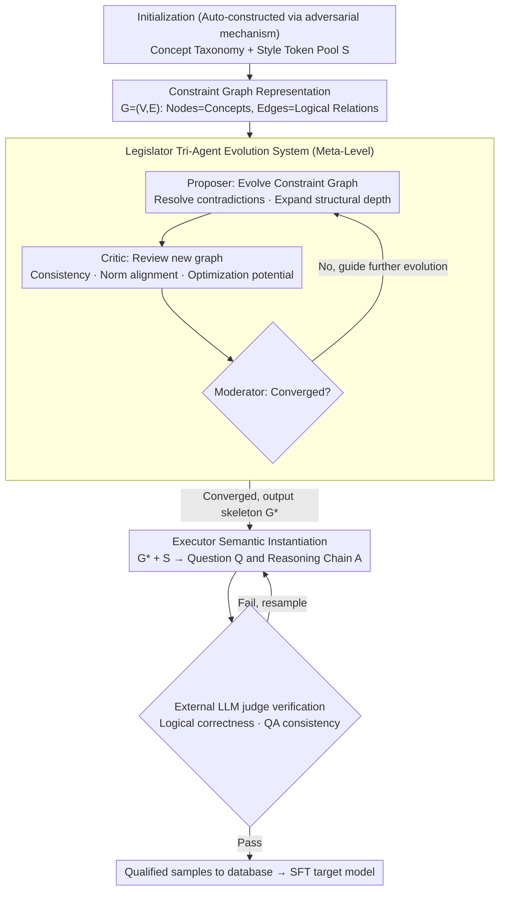

# MathAgent: Adversarial Evolution of Constraint Graphs for Mathematical Reasoning Data Synthesis

**Conference**: ACL 2026 Findings  
**arXiv**: [2604.11188](https://arxiv.org/abs/2604.11188)  
**Code**: None  
**Area**: Data Synthesis / LLM Reasoning  
**Keywords**: Mathematical Reasoning, Data Synthesis, Constraint Graphs, Adversarial Evolution, Legislator-Executor

## TL;DR
This paper proposes MathAgent, a hierarchical data synthesis framework based on the adversarial evolution of constraint graphs. It reformulates data synthesis from a text generation task into an unsupervised optimization problem of constraint graphs. The framework evolves question skeletons through a Legislator tri-agent system, which are then instantiated into natural language by an Executor. With only 1K synthesized samples, MathAgent outperforms LIMO and s1K across eight mathematical benchmarks.

## Background & Motivation

**Background**: High-quality mathematical reasoning data is a critical driver for enhancing the reasoning capabilities of LLMs. As the scale bottleneck of human-annotated data becomes increasingly prominent, synthetic data generation has become a mainstream research direction.

**Limitations of Prior Work**: (1) Seed expansion methods (e.g., Self-Instruct, WizardMath) are limited by the "semantic radius" of the initial seeds, resulting in an upper bound on diversity; (2) Zero-shot methods (e.g., Magpie) directly probe model distributions but lack structural guidance, making them prone to mode collapse and logical hallucinations; (3) Existing methods treat data synthesis as a direct text generation task, where models often stay at the level of surface narrative imitation and fail to master core reasoning capabilities.

**Key Challenge**: Synthesizing data directly in the token space cannot effectively control the logical complexity and structural diversity of problems. High-difficulty, high-quality long-tail samples are crucial for forging complex reasoning abilities, yet standard methods struggle to discover them.

**Goal**: Design a synthesis framework that requires no human seed data and can automatically explore the structural space to generate mathematical reasoning data with both high complexity and high diversity.

**Key Insight**: Decouple data synthesis into two stages: meta-level structural evolution and base-level semantic instantiation—first optimizing the logical skeleton (constraint graph) of the problem, and then transforming the skeleton into natural language questions.

**Core Idea**: Represent the logical structure of mathematical problems using constraint graphs. Employ a tri-agent adversarial evolution mechanism (Proposer-Critic-Moderator) to continuously optimize the complexity and diversity of the graph structures, followed by an Executor to generate natural language questions and reasoning chains.

## Method

### Overall Architecture
MathAgent is divided into two decoupled stages: (1) Meta-Level Structural Evolution: The Legislator tri-agent system adversarially evolves within the constraint graph space to produce optimized question skeletons $\mathcal{G}^*$; (2) Base-Level Semantic Instantiation: The Executor transforms $\mathcal{G}^*$ and style tokens $\mathcal{S}$ into natural language questions Q and reasoning chains A. Finally, qualified samples are filtered via external model verification.

### Key Designs

**1. Constraint Graph Representation: Stripping the logical skeleton from text**

Existing methods treat data synthesis as direct text generation, causing models to remain at the level of surface narrative imitation, which neither controls logical complexity nor discovers high-difficulty long-tail samples. MathAgent breaks this by synthesizing outside the token space, initially representing problems using a constraint graph $\mathcal{G}=(\mathcal{V},\mathcal{E})$ and style tokens $\mathcal{S}$. Nodes $\mathcal{V}$ represent mathematical concepts, edges $\mathcal{E}$ represent logical relationships, and $\mathcal{S}$ controls global attributes such as problem category and difficulty level. The optimization objective for structural evolution is formulated as $\mathcal{G}^*=\arg\max_{\mathcal{G}}\mathcal{H}(\mathcal{G})$, where $\mathcal{H}$ estimates graph complexity, while the constraint $\mathbb{I}_{\text{valid}}(\mathcal{G}\mid\mathcal{S})=1$ ensures the generated problem remains solvable. Consequently, "problem difficulty" is handled by the graph structure, while "problem phrasing" is left to subsequent text generation. These two orthogonal dimensions are completely decoupled, allowing the framework to focus on stacking complex and diverse logical structures without being constrained by surface language patterns.

**2. Legislator Tri-Agent Evolution System: Driving constraint graphs to be harder and more diverse via adversarial dynamics**

Given the graph representation, a mechanism is needed to continuously push it toward complexity and diversity. Legislator enables three roles to iterate collaboratively: the Proposer ($\mathcal{A}_P$) evolves $\mathcal{G}_t$ to $\mathcal{G}_{t+1}$ based on feedback from the previous round, responsible for resolving logical contradictions and expanding structural depth; the Critic ($\mathcal{A}_C$) reviews the new graph across dimensions of internal consistency, norm alignment, and optimization potential to write improvement reports; and the Moderator ($\mathcal{A}_M$) acts as a strategic decision-maker to determine if evolution has converged—terminating if so, or guiding the Proposer to continue. Even the initialization stage’s concept taxonomy and style token pool are automatically constructed by this adversarial mechanism. Adversarial driving allows the system to explore the frontiers of the structural space and discover high-difficulty samples missing from standard datasets, while adaptive truncation by the Moderator prevents over-evolution and the production of unsolvable problems.

**3. Executor Semantic Instantiation: Translating optimized graphs into natural language problems and reasoning chains**

Since complexity and diversity are ensured by the Legislator at the graph level, the Executor's sole task is to "translate the graph into human language." It is a conditional generation model that samples questions and answers $(Q,A)\sim P_{\text{executor}}(\cdot\mid\mathcal{G}^*,\mathcal{S})$ based on linearized graph representations. These are then submitted to an external LLM judge to verify logical correctness and QA consistency. Only samples passing verification are retained. Because it no longer needs to explore the complexity space, the Executor can focus entirely on the diversity and fluency of linguistic expression, improving generation efficiency.

### An Illustrative Example: How a competition problem is "evolved"

Consider generating a competition-level math problem. In the initialization phase, the adversarial mechanism builds a concept taxonomy (e.g., "Number Theory—Congruence", "Combinatorics—Inclusion-Exclusion") and a set of style tokens. The Proposer receives a shallow constraint graph as $\mathcal{G}_0$—for instance, only two or three nodes representing "finding the number of integers satisfying a certain congruence condition." In Round 1, the Proposer adds nodes and edges for "superimposing a combinatorial counting constraint," resulting in a deeper $\mathcal{G}_1$. After review, the Critic points out that "the newly added constraint conflicts with the original congruence condition's solution space, potentially making it unsolvable," and includes this in the improvement report. The Moderator determines it hasn't converged and prompts the Proposer to revise. In Round 2, the Proposer adjusts the logical relationship of edges to eliminate conflicts; complexity $\mathcal{H}$ continues to rise while maintaining $\mathbb{I}_{\text{valid}}=1$. The Critic determines optimization potential is low, the Moderator declares convergence, and outputs $\mathcal{G}^*$. Finally, the Executor instantiates $\mathcal{G}^*$ alongside style tokens for "competition style, medium-hard" into a natural language problem and complete reasoning chain. The sample enters the database after the judge verifies answer self-consistency. No human seed problems are used throughout the process; difficulty is determined entirely by the evolution depth of the graph.

### Loss & Training
Synthetic data is used for fine-tuning the target model using standard SFT. During the verification phase, an external LLM is used as a judge to evaluate the logical correctness and consistency of synthetic QA pairs, retaining only those that pass verification.

## Key Experimental Results

### Main Results

| Model | Dataset | GSM8K | MATH500 | AIME24 | AIME25 | Average |
|------|--------|-------|---------|--------|--------|------|
| Qwen3-14B | LIMO | 91.8 | 86.2 | 33.8 | 27.5 | 59.5 |
| Qwen3-14B | s1K | 87.5 | 86.4 | 37.9 | 25.0 | 60.3 |
| Qwen3-14B | **Ours** | **95.4** | **91.8** | **38.8** | **30.0** | **63.9** |
| Qwen2.5-Math-7B | LIMO | 87.4 | 72.2 | 10.8 | 14.6 | 45.6 |
| Qwen2.5-Math-7B | **Ours** | **91.6** | **82.2** | **18.8** | **18.3** | **53.5** |

### Ablation Study

| Configuration | Key Metric | Description |
|------|---------|------|
| Full MathAgent | 63.9 (Qwen3-14B Avg) | All components |
| w/o Critic | ~60.5 | No adversarial review, structural quality drops |
| w/o Adaptive Truncation | ~61.2 | Fixed evolution rounds, reduced efficiency |
| Direct Text Generation | ~58.0 | No constraint graph, mode collapse |

### Key Findings
- Only 1K synthetic samples are needed to surpass LIMO and s1K of the same scale, demonstrating extreme data efficiency.
- Improvements are particularly significant on high-difficulty competition benchmarks like AIME, validating the framework's advantage in generating long-tail, high-difficulty samples.
- Strong generalization across model series: effective across 10 models from four series (Qwen, Llama, Mistral, Gemma).
- Smaller models benefit more from MathAgent data; for instance, Qwen3-4B improved from a base of 42.8 to 53.5.

## Highlights & Insights
- Shifting data synthesis from the text space to the structural space is a key innovation. Using constraint graphs as intermediate representations effectively separates the orthogonal dimensions of "problem difficulty" and "problem phrasing."
- The adversarial evolution mechanism does not rely on seed data. It can construct high-quality data starting from the model's internal conceptual primitives, truly achieving "creation from nothing."
- The adaptive truncation mechanism, similar to early stopping, prevents unsolvable problems caused by over-evolution, reflecting a fine balance between the quality and complexity of synthetic data.

## Limitations & Future Work
- Currently only validated in the mathematical reasoning domain; whether it can be generalized to scenarios requiring structured data like code generation or logical reasoning remains unexplored.
- The Legislator system requires multiple rounds of LLM interaction for evolution, which may result in higher synthesis costs than simple seed expansion methods.
- External judge verification may have its own blind spots, and its judgment on the correctness of extremely difficult problems may not be entirely reliable.

## Related Work & Insights
- **vs LIMO/s1K**: These methods rely on meticulously filtered seed data, whereas MathAgent generates data fully automatically and surpasses them with a smaller data volume.
- **vs Self-Instruct**: Self-Instruct expands in the token space, and its diversity is limited by the semantic radius of the seeds; MathAgent explores the structural space, reaching more distant distribution regions.
- **vs Magpie**: Magpie is zero-shot but lacks structural guidance, making it prone to mode collapse; MathAgent provides a structural skeleton through constraint graphs.

## Rating
- Novelty: ⭐⭐⭐⭐⭐ The hierarchical synthesis framework of constraint graphs + adversarial evolution is a brand-new paradigm.
- Experimental Thoroughness: ⭐⭐⭐⭐⭐ Validated across 10 models, 8 benchmarks, and multiple series.
- Writing Quality: ⭐⭐⭐⭐ Formalization is clear, though some notation is slightly heavy.
- Value: ⭐⭐⭐⭐⭐ 1K data outperforming mainstream methods shows incredible data efficiency.

<!-- RELATED:START -->

## Related Papers

- [\[ACL 2026\] Efficient PRM Training Data Synthesis via Formal Verification](efficient_prm_training_data_synthesis_via_formal_verification.md)
- [\[ACL 2026\] Self-Reinforcing Controllable Synthesis of Rare Relational Data via Bayesian Calibration](self-reinforcing_controllable_synthesis_of_rare_relational_data_via_bayesian_cal.md)
- [\[ICLR 2026\] DESIGNER: Design-Logic-Guided Multidisciplinary Data Synthesis for LLM Reasoning](../../ICLR2026/llm_reasoning/designer_design-logic-guided_multidisciplinary_data_synthesis_for_llm_reasoning.md)
- [\[ICML 2026\] An Information-Theoretic Criterion for Efficient Data Synthesis](../../ICML2026/llm_reasoning/an_information-theoretic_criterion_for_efficient_data_synthesis.md)
- [\[ICLR 2026\] Generative Adversarial Reasoner: Enhancing LLM Reasoning with Adversarial Reinforcement Learning](../../ICLR2026/llm_reasoning/generative_adversarial_reasoner_enhancing_llm_reasoning_with_adversarial_reinfor.md)

<!-- RELATED:END -->
## Related Papers

- [\[ACL 2026\] Efficient PRM Training Data Synthesis via Formal Verification](efficient_prm_training_data_synthesis_via_formal_verification.md)
- [\[ACL 2026\] Self-Reinforcing Controllable Synthesis of Rare Relational Data via Bayesian Calibration](self-reinforcing_controllable_synthesis_of_rare_relational_data_via_bayesian_cal.md)
- [\[ICML 2026\] An Information-Theoretic Criterion for Efficient Data Synthesis](../../ICML2026/llm_reasoning/an_information-theoretic_criterion_for_efficient_data_synthesis.md)
- [\[ICLR 2026\] DESIGNER: Design-Logic-Guided Multidisciplinary Data Synthesis for LLM Reasoning](../../ICLR2026/llm_reasoning/designer_design-logic-guided_multidisciplinary_data_synthesis_for_llm_reasoning.md)
- [\[ACL 2026\] On the Step Length Confounding in LLM Reasoning Data Selection](on_the_step_length_confounding_in_llm_reasoning_data_selection.md)

<!-- RELATED:END -->
