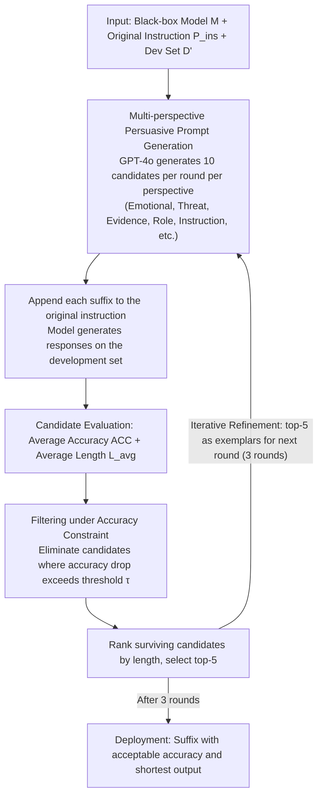

# Merlin's Whisper: Enabling Efficient Reasoning in Large Language Models via Black-box Persuasive Prompting

**Conference**: ACL2026  
**arXiv**: [2510.10528](https://arxiv.org/abs/2510.10528)  
**Code**: https://github.com/hemingkx/Whisper  
**Area**: LLM Reasoning Efficiency / Prompt Optimization  
**Keywords**: Reasoning compression, black-box prompting, persuasive prompting, overthinking, LRM efficiency

## TL;DR
Whisper models the problem of "reducing thinking without sacrificing accuracy" in Large Reasoning Models (LRMs) as black-box persuasive prompting. By automatically generating and iteratively filtering prompt suffixes through multiple perspectives, it significantly reduces output tokens on Qwen3, DeepSeek-R1-Distill, and Claude/Gemini APIs while maintaining reasoning accuracy.

## Background & Motivation
**Background**: Large reasoning models such as DeepSeek-R1, Qwen3, and o1 improve performance in mathematics and complex tasks through long Chain-of-Thought (CoT). However, longer reasoning trajectories result in increased latency, KV cache memory usage, and API costs.

**Limitations of Prior Work**: Training-based compression methods require additional SFT (Supervised Fine-Tuning) or RL (Reinforcement Learning), which are costly and may harm cross-domain generalization. White-box inference interventions require access to internal model states, making them inapplicable to closed-source APIs. Simple prompts like "Be concise." are easy to deploy but offer limited compression or degrade accuracy.

**Key Challenge**: Large reasoning models inherently possess the potential for "concise reasoning," but their default behavior tends toward overthinking. The issue is not that the model cannot provide short answers, but that users lack effective black-box interaction methods to modify this default strategy.

**Goal**: The authors aim to reduce the average output length of LRMs while maintaining accuracy without training the model, accessing internal activations, or modifying the reasoning engine, by automatically generating prompt suffixes.

**Key Insight**: The paper draws inspiration from persuasive prompting. While such techniques are typically used for jailbreaking or altering model behavior, this work repurposes them for a positive objective: persuading the model to adopt more compact reasoning expressions.

**Core Idea**: "High-quality concise reasoning prompts" are treated as searchable black-box suffixes. Candidates are generated using multiple persuasive perspectives, then ranked by accuracy constraints and output length on a development set, followed by iterative optimization.

## Method
The input for Whisper is not the model weights but an initial task instruction, a black-box model, and a development set. it automatically generates multiple prompt suffixes and appends them to the original instruction to let the model answer the same questions. Each candidate suffix is evaluated for accuracy and average token count. Candidates with significant accuracy drops are discarded; the remaining ones are ranked by length, and the top-k shortest candidates proceed to the next round of prompt generation. Finally, the suffix that is acceptable in accuracy and provides the shortest output on the development set is selected for deployment.

### Overall Architecture
Given a model $M$, an original instruction $P_{ins}$, and a development set $D'$, Whisper seeks a suffix $P_{adv}$ such that the average response length $L_{avg}$ is minimized while the average accuracy $ACC_{avg}$ is not lower than a tolerance threshold. The authors use GPT-4o as the prompt generator, generating 10 candidates per round for each persuasive perspective. The top-5 are selected as exemplars for the next round, with a total of 3 iterations.

### Key Designs

**1. Multi-perspective persuasive prompt generation: Using various strategies to trigger the model's "concise switch"**

A simple "Be concise." provides limited compression because it is too weak to influence the model's core priorities. Whisper uses multiple persuasive perspectives to generate batches of candidate suffixes: emotional appeal, threat, evidence-based persuasion, role-playing, and detailed structural instructions. For instance, the evidence perspective might cite research-style arguments like "short explanations are equally effective," while the role-play perspective forces the model to act as an expert who must prioritize brevity. Different models vary in sensitivity to authority, role constraints, or emotional context. Multi-perspective generation covers these differences—experiments show Qwen3 favors evidence-based persuasion, while DeepSeek-R1-Distill-Qwen responds well to role-play, instruction, and evidence.

**2. Accuracy-constrained candidate filtering: Compressing length without compromising accuracy**

Compression can easily lead to "short but wrong" results—the "NoThinking" phenomenon, where output is extremely short but accuracy drops significantly, is considered a failure. Whisper treats this as an efficiency-performance trade-off: each candidate suffix $P_{adv}^j$ is evaluated for both average length $L_{avg}^j$ and average accuracy $ACC_{avg}^j$. Candidates with an accuracy drop exceeding the threshold $\tau$ are eliminated. Surviving candidates are then ranked by length. This ensures that the search prioritizes suffixes that are both "short and accurate."

**3. Iterative refinement: Enabling the generator to learn from successful suffixes**

Handwritten prompts rarely reach optimal performance in one try. Whisper conducts a light prompt evolution in the black-box space: the top-k suffixes from each round are fed back to GPT-4o as exemplars to synthesize new candidates. Experimental results show that compression gains accumulate over three rounds—token reduction for DeepSeek-R1-Distill-Qwen-14B increased from 18% to 22%, and for Qwen3-14B from 32% to 37%—saturating after three rounds. This process allows the persuasive strategy to better fit the target model's preferences at a low cost.

### Key Designs: Example of Suffix Search

For Qwen3-14B, GPT-4o generates 10 candidates for each persuasive perspective per round. These are appended to instructions and tested on a development set (100 problems sampled from the PRM800K math split). In Round 1, candidates that cause accuracy to drop by more than $\tau$ (e.g., excessive threats causing wrong answers) are discarded. The remaining ones are ranked by length, and the top-5 are used as exemplars for Round 2. This "Generate → Accuracy Filter → Length Rank → Top-5" loop repeats. After three rounds, an evidence-based suffix is selected, reducing Qwen3-14B's average tokens on GSM8K from 1568 to 440 while slightly increasing accuracy from 95.9% to 96.1%.

### Loss & Training
Whisper does not train the target LRM. The objective is a bi-objective selection on the development set: minimize average output length within accuracy constraints. Implementation-wise, authors sample 100 samples from the PRM800K math split as the PDSet. Inference uses vLLM with temperature 0.6, top-p 0.95, and a max length of 16,384. GSM8K and MATH-500 are sampled 3 times per problem; AMC 2023 and AIME 2024 are sampled 8 times.

## Key Experimental Results

### Main Results

| Model | Method | Overall Acc. | Overall Ratio | Representative Change |
|------|------|------|------|------|
| DeepSeek-R1-Distill-LLaMA-8B | Original | 78.5 | 100% | Original long reasoning |
| DeepSeek-R1-Distill-LLaMA-8B | Whisper | 79.0 | 80.3% | Accuracy slightly increased, tokens reduced by ~20% |
| DeepSeek-R1-Distill-Qwen-14B | Original | 85.9 | 100% | Original long reasoning |
| DeepSeek-R1-Distill-Qwen-14B | Whisper | 86.3 | 78.0% | Accuracy slightly increased, tokens reduced by ~22% |
| Qwen3-14B | Original | 87.9 | 100% | Original long reasoning |
| Qwen3-14B | Whisper | 89.6 | 63.0% | Tokens reduced by ~37% with higher accuracy |

### Ablation Study

| Qwen3-14B Dataset | Original Acc. / Tok. | Whisper Acc. / Tok. | Ratio |
|------|------|------|------|
| GSM8K | 95.9 / 1568 | 96.1 / 440 | 28.1% |
| MATH-500 | 94.5 / 4398 | 95.2 / 2176 | 49.5% |
| AMC 2023 | 95.0 / 6947 | 96.9 / 4019 | 57.9% |
| AIME 2024 | 66.2 / 11375 | 70.0 / 8659 | 76.1% |

### Key Findings
- Whisper is most effective for simple problems. On GSM8K, Qwen3-14B tokens were reduced from 1568 to 440 (approx. 3.6x compression), while accuracy improved from 95.9% to 96.1%.
- Effectiveness on closed-source APIs: On MATH-500, Claude-3.7-Sonnet-Thinking token usage was reduced by 46%, and Gemini-2.5-Pro-Thinking by 50%, while maintaining reasoning performance.
- Out-of-domain results indicate that prompts optimized for math can transfer to GPQA-Diamond and CommonsenseQA. Qwen3-14B achieved a token ratio of 43.8% on GPQA and 41.2% on CommonsenseQA with stable accuracy.
- Model sensitivity varies: Qwen3 series favors evidence-based persuasion, whereas DeepSeek-R1-Distill-Qwen is responsive to role-play, instruction, and evidence.
- Iterative refinement contributes significantly: DeepSeek-R1-Distill-Qwen-14B's token reduction improved from 18% to 22%, and Qwen3-14B's from 32% to 37% over rounds.

## Highlights & Insights
- The primary insight is repurposing persuasive prompting from a "jailbreak/attack" context to a "efficiency optimization" context. It demonstrates that model behavior can be shaped by linguistic persuasion without modifying weights.
- Whisper is highly applicable to closed-source APIs. Unlike many efficiency methods limited to open-source models, this black-box search works on commercial models.
- Results suggest that "conciseness" is not a simple command but a behavioral pattern the model must be persuaded to accept. Evidence, roles, and contexts are more effective than bare instructions at changing default overthinking habits.
- Such methods highlight that prompt suffixes can strongly alter reasoning style, suggesting that production systems must manage potential conflicts between efficiency prompts and safety/compliance prompts.

## Limitations & Future Work
- Open-source experiments primarily focus on Qwen3 and DeepSeek-R1-Distill series; larger models like Qwen3-235B-A22B are not yet covered.
- The set of persuasive perspectives is limited; more systematic discourse strategy searches might yield better compression but could introduce complex safety concerns.
- The dev set is math-based; while out-of-domain results exist, verification in code, law, or medicine is required.
- The method depends on development set evaluation, requiring actual model calls for each candidate; search costs for expensive APIs need further control.
- Certain threat or emotional prompts may be inappropriate for product contexts; future work should explore more neutral and auditable persuasive patterns.

## Related Work & Insights
- **vs SFT / RL Length Penalties**: Training methods change the model distribution but require compute and data; Whisper is a plug-and-play black-box method that does not modify weights.
- **vs DEER / Activation Steering**: White-box methods use internal states to stop reasoning early but don't work for closed APIs; Whisper only requires input/output access.
- **vs BeConcise / Chain-of-Draft**: Simple instructions often fail to compress significantly or degrade accuracy; Whisper finds stable suffixes via automated search and accuracy constraints.
- **Mechanism**: Reasoning systems could implement a controllable policy: apply Whisper-style suffixes for simple samples to save costs and reserve long CoT or verifiers for difficult samples.

## Rating
- Novelty: ⭐⭐⭐⭐☆ Repurposing persuasive prompting for efficiency is a fresh perspective.
- Experimental Thoroughness: ⭐⭐⭐⭐☆ Covers open/closed source models and cross-domain transfers, though more massive models and tasks could be included.
- Writing Quality: ⭐⭐⭐⭐☆ Clear problem definition and detailed tables; some persuasive examples require product-level ethical judgment.
- Value: ⭐⭐⭐⭐⭐ Highly practical for LRM applications sensitive to API cost and latency, especially when model weights cannot be modified.

<!-- RELATED:START -->

## Related Papers

- [\[ICML 2026\] Inducing Overthink: Hierarchical Genetic Algorithm-based DoS Attack on Black-Box Large Language Reasoning Models](../../ICML2026/llm_reasoning/inducing_overthink_hierarchical_genetic_algorithm-based_dos_attack_on_black-box_.md)
- [\[ACL 2026\] ReProbe: Efficient Test-Time Scaling of Multi-Step Reasoning by Probing Internal States of Large Language Models](reprobe_efficient_test-time_scaling_of_multi-step_reasoning_by_probing_internal_.md)
- [\[ICML 2026\] Diagnosing Multi-step Reasoning Failures in Black-box LLMs via Stepwise Confidence Attribution](../../ICML2026/llm_reasoning/diagnosing_multi-step_reasoning_failures_in_black-box_llms_via_stepwise_confiden.md)
- [\[ACL 2026\] DRP: Distilled Reasoning Pruning with Skill-aware Step Decomposition for Efficient Large Reasoning Models](drp_distilled_reasoning_pruning_with_skill-aware_step_decomposition_for_efficien.md)
- [\[ACL 2026\] SeLaR: Selective Latent Reasoning in Large Language Models](selar_selective_latent_reasoning_in_large_language_models.md)

<!-- RELATED:END -->
