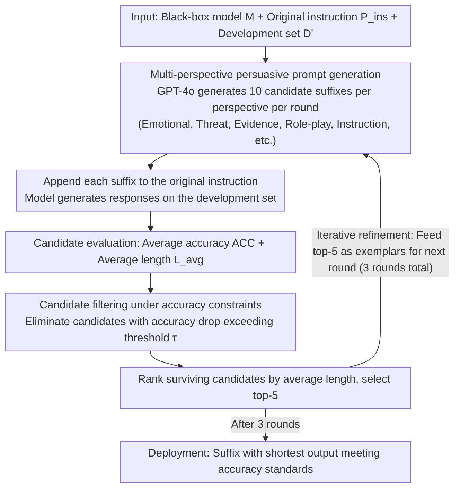

# Merlin's Whisper: Enabling Efficient Reasoning in Large Language Models via Black-box Persuasive Prompting

**Conference**: ACL2026  
**arXiv**: [2510.10528](https://arxiv.org/abs/2510.10528)  
**Code**: https://github.com/hemingkx/Whisper  
**Area**: LLM Reasoning Efficiency / Prompt Optimization  
**Keywords**: Reasoning compression, black-box prompting, persuasive prompting, overthinking, LRM efficiency

## TL;DR
Whisper models the problem of "thinking less without dropping accuracy" in large reasoning models (LRMs) as black-box persuasive prompting. By automatically generating and iteratively filtering prompt suffixes through multiple perspectives, it significantly reduces output tokens on Qwen3, DeepSeek-R1-Distill, and Claude/Gemini APIs while largely maintaining reasoning accuracy.

## Background & Motivation
**Background**: Large reasoning models such as DeepSeek-R1, Qwen3, and o1 improve performance in mathematical and complex tasks through long Chain-of-Thought (CoT). However, longer reasoning trajectories lead to higher latency, increased memory consumption for KV caches, and higher API costs.

**Limitations of Prior Work**: Training-based compression methods require additional SFT or RL, which are costly and may harm cross-domain generalization. White-box inference interventions require access to internal model states, making them inapplicable to closed-source APIs. Simple prompts like "Be concise." are easy to deploy but offer limited compression or cause accuracy degradation.

**Key Challenge**: LRMs themselves may possess the potential for "concise reasoning," but their default behavior tends toward overthinking. The problem is not that the model cannot provide short answers, but rather the lack of effective black-box interaction methods to alter this default strategy.

**Goal**: The authors aim to reduce the average output length of LRMs while maintaining accuracy through automatically generated prompt suffixes, without training the model, accessing internal activations, or modifying the reasoning engine.

**Key Insight**: The paper draws inspiration from persuasive prompting. While such techniques are traditionally used to study jailbreaking or altering model behavior, this paper adapts them for a positive objective: persuading the model to adopt more compact reasoning expressions.

**Core Idea**: "High-quality concise reasoning prompts" are treated as searchable black-box suffixes. Candidates are generated using multiple persuasive perspectives, sorted by accuracy constraints and output length on a development set, and then optimized iteratively.

## Method
The input for Whisper is not the model weights, but an initial task instruction, a black-box model, and a development set. It automatically generates multiple prompt suffixes, appends them to the original instruction, and evaluates the model's responses to the same problems. Each candidate suffix is assessed based on accuracy and average token count; candidates with excessive accuracy drops are discarded, and the remaining ones are ranked by length. The shortest top-$k$ enter the next round of prompt generation. Finally, the suffix that satisfies accuracy requirements and yields the shortest output on the development set is selected for deployment.

### Overall Architecture
Given a model $M$, an original instruction $P_{ins}$, and a development set $D'$, Whisper seeks to find a suffix $P_{adv}$ that minimizes the average response length $L_{avg}$ while ensuring the average accuracy $ACC_{avg}$ does not fall below a tolerance threshold. The authors use GPT-4o as the prompt generator. For each persuasive perspective, 10 candidates are generated per round, and the top-5 are selected as exemplars for the next round, with a total of 3 iterations.

### Key Designs

**1. Multi-perspective persuasive prompt generation: Using diverse persuasion strategies to toggle the model's "concise switch"**

A simple "Be concise." has limited compression because it is too weak to influence the model's core priorities. Whisper uses multiple persuasive perspectives to generate candidate suffixes in batches: emotional appeal, threat, evidence-based persuasion, role-playing, and detailed structural instructions. For instance, the evidence perspective might cite research-style arguments that "short explanations are equally effective," while the role-play perspective asks the model to act as an expert who must communicate with extreme brevity. Since different models have varying sensitivities to authoritative evidence, role constraints, emotional contexts, or structural requirements, multi-perspective generation covers these differences—experiments show the Qwen3 series responds better to evidence-based persuasion, while the DeepSeek-R1-Distill-Qwen series sees success with role-play, instruction, and evidence perspectives.

**2. Candidate filtering under accuracy constraints: Compressing length without compromising accuracy**

Compression can easily lead to "short but wrong" results; NoThinking is a counter-example where extremely short outputs lead to significant accuracy drops. Whisper treats this as an efficiency-performance trade-off: for each candidate suffix $P_{adv}^j$, average length $L_{avg}^j$ and average accuracy $ACC_{avg}^j$ are calculated on the development set. Candidates whose accuracy drop exceeds a tolerance threshold $\tau$ are disqualified. Only those that maintain performance are ranked by average length. This ensures the search prioritizes suffixes that are "both short and accurate" rather than just "increasingly shorter."

**3. Iterative refinement: Allowing the generator to learn from successful suffixes of the previous round**

Handwritten prompts rarely achieve perfection in one go. Whisper performs lightweight prompt evolution in the black-box space: the top-$k$ suffixes selected in each round are fed back to GPT-4o as exemplars, guiding it to synthesize new candidates based on these successful examples. Experimental results show that compression gains accumulate over three rounds—token reduction for DeepSeek-R1-Distill-Qwen-14B increased from 18% to 22%, and for Qwen3-14B from 32% to 37%—saturating after the third round. This process effectively tailors persuasion strategies to the specific preferences of the target model at a low cost.

### Key Experimental Results

### Main Results
| Model | Method | Overall Acc. | Overall Ratio | Representative Change |
|------|------|------|------|------|
| DeepSeek-R1-Distill-LLaMA-8B | Original | 78.5 | 100% | Original long reasoning |
| DeepSeek-R1-Distill-LLaMA-8B | Whisper | 79.0 | 80.3% | Slight accuracy gain, ~20% token reduction |
| DeepSeek-R1-Distill-Qwen-14B | Original | 85.9 | 100% | Original long reasoning |
| DeepSeek-R1-Distill-Qwen-14B | Whisper | 86.3 | 78.0% | Slight accuracy gain, ~22% token reduction |
| Qwen3-14B | Original | 87.9 | 100% | Original long reasoning |
| Qwen3-14B | Whisper | 89.6 | 63.0% | ~37% token reduction with higher accuracy |

### Ablation Study
| Qwen3-14B Dataset | Original Acc. / Tok. | Whisper Acc. / Tok. | Ratio |
|------|------|------|------|
| GSM8K | 95.9 / 1568 | 96.1 / 440 | 28.1% |
| MATH-500 | 94.5 / 4398 | 95.2 / 2176 | 49.5% |
| AMC 2023 | 95.0 / 6947 | 96.9 / 4019 | 57.9% |
| AIME 2024 | 66.2 / 11375 | 70.0 / 8659 | 76.1% |

### Key Findings
- Whisper is most effective for simpler problems. On GSM8K, the average token count for Qwen3-14B dropped from 1568 to 440 (roughly 3.6x compression), while accuracy improved from 95.9 to 96.1.
- Effective for closed-source APIs: On MATH-500, token usage for Claude-3.7-Sonnet-Thinking was reduced by 46% and for Gemini-2.5-Pro-Thinking by 50%, maintaining original reasoning performance.
- Out-of-domain results show that prompts optimized for the math domain migrate well to GPQA-Diamond and CommonsenseQA. For Qwen3-14B, the token ratio was 43.8% on GPQA and 41.2% on CommonsenseQA with minimal accuracy loss.
- Different models exhibit sensitivity to different perspectives: the Qwen3 series favors evidence-based persuasion, while role-play, instruction, and evidence perspectives perform well for the DeepSeek-R1-Distill-Qwen series.
- Iterative refinement contributes significantly: Token reduction for DeepSeek-R1-Distill-Qwen-14B improved from 18% to 22%, and for Qwen3-14B from 32% to 37%.

## Highlights & Insights
- The most interesting aspect is the shift of persuasive prompting from a "jailbreak/attack" context to efficiency optimization. It demonstrates that model behavior can be significantly shaped by linguistic persuasion strategies without weight modification.
- Whisper shows strong applicability to closed-source APIs. While many efficiency methods only work with open-source models, this black-box suffix search is directly applicable to commercial model calls.
- Results indicate that "conciseness" is not just a simple command but a behavioral pattern that the model must believe, accept, and execute stably. Evidence, roles, and contexts are more effective at altering the default long-reasoning habits than bare instructions.
- This approach suggests that prompt suffixes can powerfully alter reasoning length and style, implying that production systems must manage potential conflicts between efficiency prompts and safety/compliance prompts.

## Limitations & Future Work
- Open-source experiments primarily focus on Qwen3 and DeepSeek-R1-Distill series; larger reasoning models like Qwen3-235B-A22B were not covered.
- The set of persuasive perspectives is limited; only a few were tested. A more systematic search of discursive strategies might yield stronger compression or introduce more complex safety concerns.
- The primary development set is based on mathematical reasoning. While out-of-domain results exist, individual validation for code, legal, or medical tasks is still needed.
- The method relies on development set evaluation, requiring actual model calls for each candidate. Search costs for expensive closed-source APIs still need to be managed.
- Certain threat or emotional prompts may not be appropriate in a product context; future work should explore more neutral and auditable persuasive patterns.

## Related Work & Insights
- **vs. SFT / RL Length Penalties**: Training-based methods can change the model distribution but require computing power and data. Whisper is a plug-and-play black-box method that does not modify weights.
- **vs. DEER / Activation Steering**: White-box methods utilize internal states to stop early or compress CoT but do not apply to closed-source APIs. Whisper only requires input/output access.
- **vs. BeConcise / Chain-of-Draft**: Simple conciseness instructions often offer limited compression or damage accuracy. Whisper finds more stable suffixes through automated search and accuracy constraints.
- **Insight**: Reasoning systems can treat the necessity of long-form thinking as a controllable strategy. Using Whisper-like suffixes to compress simple samples while retaining long CoT or verifiers for difficult samples may be more economical than a universal CoT strategy.

## Rating
- Novelty: ⭐⭐⭐⭐☆ Using persuasive prompting for reasoning efficiency is a fresh perspective; the method itself is a lightweight prompt search.
- Experimental Thoroughness: ⭐⭐⭐⭐☆ Covers open-source and closed-source models, multiple benchmarks, and transfer analysis, though larger models and more domains could be included.
- Writing Quality: ⭐⭐⭐⭐☆ Problem definition is clear and tables are informative; some persuasive examples may require user discretion regarding product acceptability.
- Value: ⭐⭐⭐⭐⭐ Extremely practical for LRM applications sensitive to API cost and latency, especially where model weights cannot be modified.

<!-- RELATED:START -->

## Related Papers

- [\[ICML 2026\] Inducing Overthink: Hierarchical Genetic Algorithm-based DoS Attack on Black-Box Large Language Reasoning Models](../../ICML2026/llm_reasoning/inducing_overthink_hierarchical_genetic_algorithm-based_dos_attack_on_black-box_.md)
- [\[ACL 2026\] ReProbe: Efficient Test-Time Scaling of Multi-Step Reasoning by Probing Internal States of Large Language Models](reprobe_efficient_test-time_scaling_of_multi-step_reasoning_by_probing_internal_.md)
- [\[ICML 2026\] Diagnosing Multi-step Reasoning Failures in Black-box LLMs via Stepwise Confidence Attribution](../../ICML2026/llm_reasoning/diagnosing_multi-step_reasoning_failures_in_black-box_llms_via_stepwise_confiden.md)
- [\[ACL 2026\] SeLaR: Selective Latent Reasoning in Large Language Models](selar_selective_latent_reasoning_in_large_language_models.md)
- [\[ACL 2026\] Foresight Optimization for Strategic Reasoning in Large Language Models](foresight_optimization_for_strategic_reasoning_in_large_language_models.md)

<!-- RELATED:END -->
