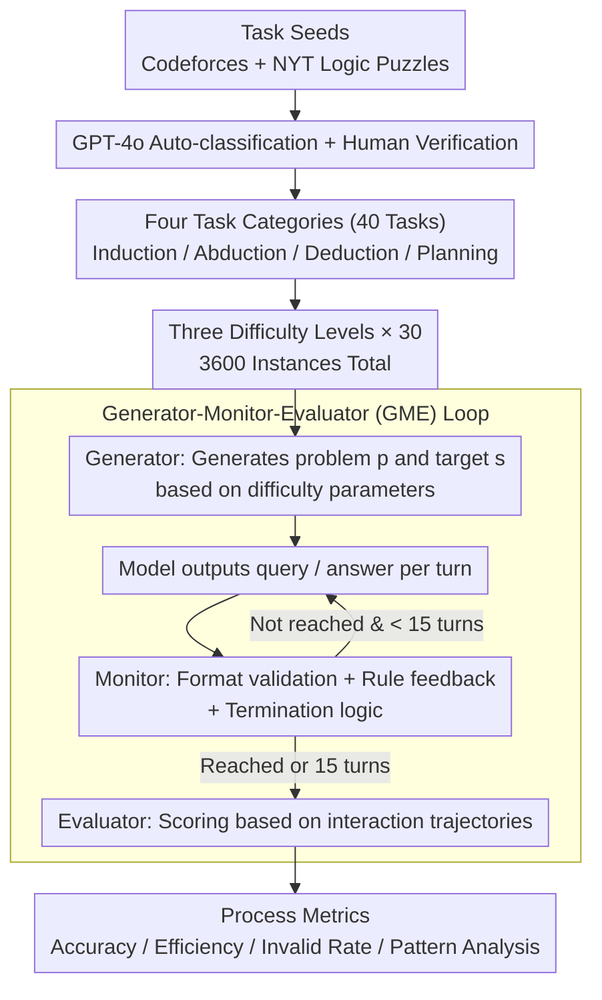

# MTR-Bench: A Comprehensive Benchmark for Multi-Turn Reasoning Evaluation

**Conference**: ACL 2026  
**arXiv**: [2505.17123](https://arxiv.org/abs/2505.17123)  
**Code**: https://github.com/LittleCirc1e/mtr_bench  
**Area**: LLM Reasoning / Multi-turn Interactive Evaluation  
**Keywords**: Multi-turn reasoning, Automated evaluation, Interactive environments, Difficulty stratification, Reasoning pattern analysis  

## TL;DR
MTR-Bench constructs an automated multi-turn reasoning evaluation framework comprising 4 categories, 40 tasks, and 3600 instances, revealing that current frontier reasoning models remain far from reliable in interactive, dynamic feedback environments.

## Background & Motivation
**Background**: Reasoning-enhanced LLMs such as o1, DeepSeek-R1, and QwQ excel in mathematics, coding, and logic puzzles. However, mainstream benchmarks are predominantly single-turn, where models read the problem and output the answer in one shot. Such evaluations struggle to reflect interaction, feedback utilization, and long-term state maintenance in real-world problem-solving.

**Limitations of Prior Work**: Existing multi-turn benchmarks like MT-Bench focus more on conversational coherence and context understanding rather than specialized reasoning. While GameArena addresses reasoning, it offers limited scenarios and relies on human interaction, making large-scale, controlled evaluation difficult. Human involvement also complicates difficulty control and automated experimental replication.

**Key Challenge**: A true reasoning system needs to actively probe the environment, parse feedback, revise plans, and gradually approach the goal across multiple turns. However, if the evaluation environment is not automated, it becomes difficult to scale continuously or increase difficulty as models progress.

**Goal**: To build a multi-turn reasoning benchmark capable of automated problem generation, simulated environmental feedback, and automated scoring. It aims to cover induction, abduction, deduction, and planning while controlling problem complexity via difficulty parameters.

**Key Insight**: The authors decouple the evaluation task into three components: Generator, Monitor, and Evaluator. The Generator produces problems of varying difficulty; the Monitor acts as a rule-based environment to handle model queries, return feedback, and determine termination; the Evaluator calculates accuracy, efficiency, invalid operation rates, and reasoning patterns based on the full interaction history.

**Core Idea**: Use closed, deterministic, rule-defined interactive environments to isolate "pure reasoning ability," avoiding interference from tool use, open-world noise, or manual annotation costs.

## Method

The core of MTR-Bench lies not in the model, but in "how to automate multi-turn reasoning evaluation." Instead of providing a static prompt, the model is placed in an environment controlled by a rule-based Monitor for iterative action. In each turn, the model must output a valid query or answer. The Monitor returns feedback and determines termination according to task rules. The model either reaches the target state or hits the maximum turn limit. Consequently, evaluation focuses not only on the final answer but also on whether the model effectively utilizes feedback, plans, or produces invalid operations.

### Overall Architecture

The pipeline begins with task seed collection. Tasks with high reasoning intensity are collected from public websites, categorized into four classes—Information Probing, Dynamic Adaptation, State Operation, and Strategic Gaming—via GPT-4o with human verification. Each of the 40 tasks (10 per category) is set with three difficulty levels (easy/medium/hard), with 30 problems per level, totaling $4 \times 10 \times 3 \times 30 = 3600$ evaluation instances.

During evaluation, three components work in sequence: the Generator outputs specific problems $p$ and goals $s$ based on difficulty parameters; the model generates a query each turn; the Monitor serves as a deterministic environment to check format validity, return feedback, and judge termination; once interaction ends (target reached or 15-turn limit exceeded), the Evaluator computes metrics from the complete dialogue history.

### Key Designs

**1. Four Task Categories to Dissect Reasoning Mechanisms**
Relying on a single game or problem type allows models to overfit specific patterns. MTR-Bench targets different reasoning weaknesses through four categories: Information Probing tests gradual induction from hidden information; Dynamic Adaptation tests abduction in environments where "answers change with incorrect attempts"; State Operation tests deduction by inferring hidden mechanisms from feedback; Strategic Gaming tests multi-step planning against opponents or dynamic systems. By isolating these abilities, it becomes clear where a model fails.

**2. Generator-Monitor-Evaluator (GME) Loop for Human-free Evaluation**
The most expensive components of multi-turn evaluation—real-time interaction and turn-by-turn scoring—previously relied on humans, hindering scalability and reproducibility. This framework replaces humans with three deterministic components: the Generator uses templates and parameters for batch generation; the Monitor is a hard-coded environment for validation and feedback; and the Evaluator calculates scores from final states and trajectories. This allows the benchmark to be repeatable, scalable, and adaptable to stronger models by adjusting difficulty parameters.

**3. Process Metrics Beyond Final Correctness**
Reporting only final accuracy discards diagnostic information—a model might reach the answer through inefficient paths or fail due to invalid formatting rather than faulty reasoning. MTR-Bench records four metrics: Accuracy (completion), Efficiency (turns taken for correct answers), Invalid Rate (format/operation legality), and Pattern Analysis (frequency of Associate, Verify, Plan, and Feedback behaviors). This differentiates between "correct but inefficient," "feedback-responsive," and "failed to understand feedback."

### Difficulty Calibration Strategy
As an evaluation benchmark, this work does not train models. The only "tuning" involves difficulty calibration via iterative trials. For example, parameters $n=6,7,8$ are initially used to generate 10 problems per level. If no reasonable performance gradient appears between levels, parameters are adjusted (e.g., $n=6,9,12$) and retested until a valid gradient is confirmed across the full evaluation set.

## Key Experimental Results

### Main Results
The experiments cover reasoning-enhanced models and non-reasoning instruction models. The table lists the average accuracy across three difficulty levels.

| Model | Type | Easy AVG | Medium AVG | Hard AVG |
|------|------|----------|------------|----------|
| o3-mini | Reasoning | 56.07 | 41.80 | 31.19 |
| DeepSeek-R1 | Reasoning | 48.62 | 37.33 | 29.19 |
| QwQ-32B | Reasoning | 49.64 | 33.72 | 25.58 |
| Qwen3-235B-A22B-Thinking | Reasoning | 47.45 | 36.20 | 29.08 |
| GPT-4o | Non-reasoning | 28.50 | 16.94 | 12.06 |
| Qwen-Max | Non-reasoning | 32.66 | 19.13 | 12.18 |
| Qwen2.5-72B-IT | Non-reasoning | 29.43 | 19.06 | 12.94 |

### Ablation Study

| Analysis Item | Data / Phenomenon | Description |
|--------|-------------|------|
| Data Scale | 4 categories, 40 tasks, 3600 instances | 3 difficulty levels per task, 30 instances per level |
| Max Turns | 15 turns | Controls evaluation budget for all models |
| Seed Source | 32 Codeforces tasks, 8 NYT logic puzzles | Appendix shows average Codeforces rating is 2453.13 |
| Difficulty Trend | Accuracy drops from easy to hard for all models | Demonstrates effective difficulty stratification |
| Efficiency Analysis | o3-mini has highest performance but lowest efficiency; R1 is more efficient | High accuracy does not equate to fewer interaction turns |
| Small Model Performance | Models < 7B show almost no meaningful scores | The benchmark is highly challenging for small models |

### Key Findings
- Reasoning models significantly outperform non-reasoning models; QwQ-32B even surpasses the more powerful non-reasoning Qwen-Max.
- The advantages of the R1-Distill series in math and code do not migrate well to these OOD multi-turn tasks, suggesting that SFT distillation is insufficient for generalized interactive reasoning.
- o3-mini shows a prominent edge in Information Probing (IP) and Strategic Gaming (SG), but is closer to QwQ-32B and R1 in Dynamic Adaptation (DA) and State Operation (SO), indicating that parsing complex environmental feedback remains a bottleneck.
- Pattern Analysis reveals that QwQ-32B and R1 are significantly stronger than R1-Distill-Qwen-32B in Associate, Verify, and Feedback patterns, suggesting feedback utilization and self-checking are critical for multi-turn reasoning.

## Highlights & Insights
- The primary strength of this paper is transforming "multi-turn reasoning" into an automatically executable environment rather than a manual dialogue evaluation. This makes the benchmark reproducible, scalable, and difficulty-adjustable.
- The Monitor design offers high diagnostic value. Models fail not only due to reasoning errors but also because of invalid query formats, out-of-bounds operations, or failure to correctly interpret feedback.
- The paper notes that o3-mini's strength stems from superior long-term planning and historical feedback utilization, rather than just faster reasoning. This provides insights for agent training: multi-turn capability is not just an extension of single-step CoT.
- While closed-rule environments sacrifice natural language realism, they provide a cleaner measure of abstract reasoning, making them suitable as capability diagnostic benchmarks.

## Limitations & Future Work
- Strategic Gaming currently uses random system strategies; the authors acknowledge the need for stronger adversarial strategies in the future.
- The current interaction format is structured rather than natural language chat, thus it cannot evaluate reasoning and clarification capabilities within natural dialogues.
- Although tasks are derived and modified from public sources, they remain puzzle/competition-oriented and are still distant from open-ended real-world agent tasks.
- These interactive environments are naturally suited for reinforcement learning (RL). Future work could expand MTR-Bench from a pure evaluation tool into a platform for training and curriculum learning.

## Related Work & Insights
- **vs MT-Bench**: MT-Bench focuses on multi-turn dialogue quality and context understanding, whereas MTR-Bench specifically tests multi-turn reasoning and environment feedback utilization.
- **vs GameArena**: GameArena is closer to game evaluation but has fewer scenarios and relies on humans; MTR-Bench includes 40 tasks with fully automated scoring.
- **vs AgentBench / AgentBoard**: These benchmarks involve tools, web browsers, and OS environments; MTR-Bench deliberately uses closed-rule environments to isolate core logical reasoning.
- **Insight**: When training reasoning agents, feedback parsing, state tracking, legal action generation, and long-term planning should be optimized independently, rather than only focusing on single-turn final answer accuracy.

## Rating
- Novelty: ⭐⭐⭐⭐☆ Complete design of automated multi-turn reasoning environments with clear task taxonomy.
- Experimental Thoroughness: ⭐⭐⭐⭐☆ Extensive model coverage and metrics; the process analysis is more valuable than simple accuracy reporting.
- Writing Quality: ⭐⭐⭐⭐☆ Clear structure, though tables are large; some appendix information is crucial for understanding task origins.
- Value: ⭐⭐⭐⭐☆ Directly relevant for both evaluating reasoning models and training interactive agents.

<!-- RELATED:START -->

## Related Papers

- [\[ACL 2026\] HISR: Hindsight Information Modulated Segmental Process Rewards for Multi-turn Agentic Reinforcement Learning](hisr_hindsight_information_modulated_segmental_process_rewards_for_multi-turn_ag.md)
- [\[ICML 2026\] ToolMATH: A Math Tool Benchmark for Realistic Long-Horizon Multi-Tool Reasoning](../../ICML2026/llm_reasoning/toolmath_a_math_tool_benchmark_for_realistic_long-horizon_multi-tool_reasoning.md)
- [\[CVPR 2026\] E-comIQ-ZH: A Human-Aligned Dataset and Benchmark for Fine-Grained Evaluation of E-commerce Posters with Chain-of-Thought](../../CVPR2026/llm_reasoning/e-comiq-zh_a_human-aligned_dataset_and_benchmark_for_fine-grained_evaluation_of_.md)
- [\[ACL 2026\] Scaling Evaluation-Time Compute with Reasoning Models as Evaluators](scaling_evaluation-time_compute_with_reasoning_models_as_evaluators.md)
- [\[ACL 2025\] Beyond the Answer: Advancing Multi-Hop QA with Fine-Grained Graph Reasoning and Evaluation](../../ACL2025/llm_reasoning/beyond_the_answer_advancing_multi-hop_qa_with_fine-grained_graph_reasoning_and_e.md)

<!-- RELATED:END -->
