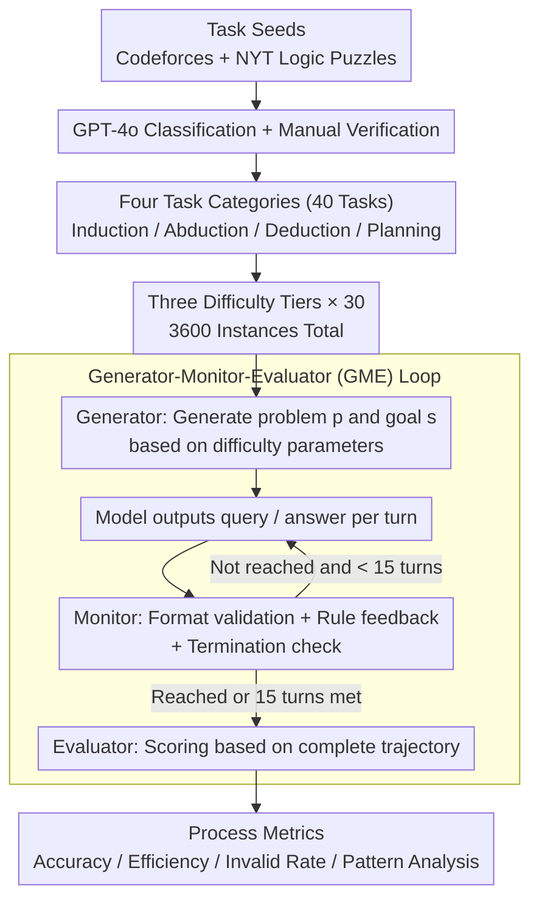

# MTR-Bench: A Comprehensive Benchmark for Multi-Turn Reasoning Evaluation

**Conference**: ACL 2026  
**arXiv**: [2505.17123](https://arxiv.org/abs/2505.17123)  
**Code**: https://github.com/LittleCirc1e/mtr_bench  
**Area**: LLM Reasoning / Multi-turn Interactive Evaluation  
**Keywords**: Multi-turn reasoning, automatic evaluation, interactive environment, difficulty stratification, reasoning pattern analysis  

## TL;DR
MTR-Bench constructs an automated multi-turn reasoning evaluation framework comprising 4 categories, 40 tasks, and 3,600 instances, demonstrating that current frontier reasoning models remain unreliable in interactive and dynamic feedback environments.

## Background & Motivation
**Background**: Reasoning-enhanced LLMs such as o1, DeepSeek-R1, and QwQ have shown outstanding performance in math, code, and logic. However, mainstream evaluations are primarily single-turn: the model reads the problem and outputs the answer once. Such evaluations fail to reflect interaction, feedback utilization, and long-term state maintenance required for real-world problem-solving.

**Limitations of Prior Work**: Existing multi-turn benchmarks like MT-Bench focus more on dialogue coherence and context understanding rather than specialized reasoning. GameArena focuses on reasoning but features few scenarios and depends on human interaction, making large-scale, controlled evaluation difficult. Human involvement also hinders difficulty control and automated experimental replication.

**Key Challenge**: A genuine reasoning system must actively probe the environment, parse feedback, revise plans, and gradually approach goals across multiple turns. However, if the evaluation environment is not automatable, it is difficult to scale and increase difficulty as models evolve.

**Goal**: Construct a benchmark that supports automatic problem generation, environmental feedback simulation, and scoring. It aims to cover induction, abduction, deduction, and planning while controlling complexity through difficulty parameters.

**Key Insight**: The authors decompose evaluation tasks into three components: Generator, Monitor, and Evaluator. The Generator creates problems of varying difficulty; the Monitor handles model queries and provides rule-based feedback; the Evaluator calculates accuracy, efficiency, invalid operation rates, and reasoning patterns based on the full interaction history.

**Core Idea**: Isolating "pure reasoning capability" via closed, deterministic, rule-defined interactive environments to eliminate interference from tool use, open-world noise, or manual annotation costs.

## Method

The core of MTR-Bench lies in "how to automate multi-turn reasoning evaluation" rather than the model itself. Instead of providing a static prompt, the model is placed in an environment controlled by a rule-based monitor for iterative action. Each turn, the model must output a valid query or answer; the monitor returns feedback and determines termination based on task rules. Interaction ends when the model reaches the target state or hits the maximum turn limit, allowing the evaluation to capture feedback utilization and planning rather than just final answers.

### Overall Architecture

The pipeline starts with task seed collection from public high-reasoning sources, classified by GPT-4o and verified manually into four categories: Information Probing, Dynamic Adaptation, State Operation, and Strategic Gaming. Forty tasks (10 per category) are selected, each with easy, medium, and hard levels. Thirty problems are generated for each level, totaling $4 \times 10 \times 3 \times 30 = 3600$ instances.

Evaluation follows a three-component loop: the Generator produces problem $p$ and goal $s$; the model generates a query; the Monitor performs format validation, provides rule-based feedback, and checks for termination; upon completion (goal reached or 15-turn limit), the Evaluator processes the full interaction trajectory.

### Key Designs

**1. Four Task Categories to Dissect Reasoning Mechanisms**
To prevent overfitting to specific game logic, MTR-Bench evaluates distinct reasoning bottlenecks: Information Probing (induction from hidden info), Dynamic Adaptation (abduction in environments where answers shift with errors), State Operation (deduction after inferring mechanisms), and Strategic Gaming (multi-step planning against systems or opponents).

**2. Generator-Monitor-Evaluator Automated Closed Loop**
The framework eliminates human involvement in real-time interaction and scoring. The Generator uses templates to generate problems, the Monitor serves as a hard-coded rule environment, and the Evaluator computes metrics from log files. This ensures the benchmark is scalable and allows difficulty to be adjusted as models improve.

**3. Process Metrics Beyond Final Correctness**
MTR-Bench captures diagnostic data beyond final accuracy: Accuracy (task completion), Efficiency (turns required for correct solutions), Invalid Rate (adherence to format/rules), and Pattern Analysis (frequency of Associate, Verify, Plan, and Feedback behaviors). This distinguishes "efficient solvers" from those that "fail to understand feedback."

### Difficulty Calibration Strategy
As an evaluation benchmark, difficulty is calibrated through iterative trials. For instance, using parameters $n=6,7,8$ to generate 10 problems per tier; if model performance does not scale with these parameters, the gaps are widened (e.g., $n=6,9,12$) before finalizing the full instance set.

## Key Experimental Results

### Main Results
The experiment evaluates reasoning-enhanced models vs. non-reasoning instruction models. The table shows average accuracy across three difficulty levels.

| Model | Type | Easy AVG | Medium AVG | Hard AVG |
|------|------|----------|------------|----------|
| o3-mini | Reasoning | 56.07 | 41.80 | 31.19 |
| DeepSeek-R1 | Reasoning | 48.62 | 37.33 | 29.19 |
| QwQ-32B | Reasoning | 49.64 | 33.72 | 25.58 |
| Qwen3-235B-A22B-Thinking | Reasoning | 47.45 | 36.20 | 29.08 |
| GPT-4o | Non-reasoning | 28.50 | 16.94 | 12.06 |
| Qwen-Max | Non-reasoning | 32.66 | 19.13 | 12.18 |
| Qwen2.5-72B-IT | Non-reasoning | 29.43 | 19.06 | 12.94 |

### Ablation Study

| Analysis Item | Figure / Phenomenon | Description |
|--------|-------------|------|
| Data Scale | 4 categories, 40 tasks, 3600 instances | 3 levels per task, 30 instances per level |
| Max Interaction Turns | 15 turns | Controls evaluation budget for all models |
| Seed Sources | 32 Codeforces tasks, 8 NYT puzzles | Codeforces average difficulty rating is 2453.13 |
| Difficulty Trend | All models show accuracy drop from easy to hard | Validates the effectiveness of difficulty stratification |
| Efficiency Analysis | o3-mini has highest performance but lowest efficiency; R1 is more efficient | High accuracy does not equate to fewer interaction turns |
| Small Model Performance | Models < 7B show almost no meaningful scores | The benchmark is highly challenging for small models |

### Key Findings
- Reasoning models significantly outperform non-reasoning counterparts; QwQ-32B even surpasses the larger Qwen-Max.
- The advantages of the R1-Distill series in math and code do not translate well to these OOD multi-turn tasks, indicating that SFT distillation is insufficient for generalizing interactive reasoning.
- o3-mini leads in IP and SG but is neck-and-neck with QwQ-32B and R1 in DA and SO, suggesting that parsing complex environmental feedback remains a bottleneck.
- Pattern Analysis reveals that QwQ-32B and R1 are notably stronger in Associate, Verify, and Feedback patterns than R1-Distill versions, suggesting feedback utilization is a core multi-turn skill.

## Highlights & Insights
- The strength of this work is converting "multi-turn reasoning" into an automatically executable environment rather than manual chat evaluation, ensuring reproducibility and scalability.
- The Monitor design provides diagnostic value, showing whether failures occur due to reasoning, invalid query formats, or misunderstanding feedback.
- o3-mini’s superiority is attributed to long-term planning and historical feedback utilization, implying multi-turn capability is not just a longer single-step CoT.
- Closed rule-based environments sacrifice natural language realism for clean assessment of abstract reasoning, suitable for capability diagnostics.

## Limitations & Future Work
- Strategic Gaming currently utilizes random system strategies; the authors acknowledge the need for stronger adversarial strategies.
- The structured interaction format is not natural language chat, thus failing to assess reasoning-based clarification in conversational contexts.
- Tasks are competition-style puzzles, which are still distant from the complexity of open-world agent tasks.
- These environments are inherently suitable for Reinforcement Learning; MTR-Bench could be expanded into a platform for training and curriculum learning.

## Related Work & Insights
- **vs MT-Bench**: MT-Bench evaluates dialogue quality and context; MTR-Bench focuses on multi-turn reasoning and feedback utilization.
- **vs GameArena**: GameArena is limited in scenarios and relies on humans; MTR-Bench is automated with 40 diverse tasks.
- **vs AgentBench / AgentBoard**: These benchmarks include tools and open environments; MTR-Bench isolates core logical reasoning in closed rule-based environments.
- **Insight**: When training reasoning agents, feedback parsing, state tracking, and long-term planning should be optimized as distinct modules rather than focusing only on final answer accuracy.

## Rating
- Novelty: ⭐⭐⭐⭐☆ Comprehensive design for automated multi-turn environments and clear task taxonomy.
- Experimental Thoroughness: ⭐⭐⭐⭐☆ Wide range of models and metrics providing diagnostic value beyond accuracy.
- Writing Quality: ⭐⭐⭐⭐☆ Clear structure, though some task details are relegated to large appendices.
- Value: ⭐⭐⭐⭐☆ Directly applicable to evaluating reasoning models and training interactive agents.

<!-- RELATED:START -->

## Related Papers

- [\[ACL 2026\] HISR: Hindsight Information Modulated Segmental Process Rewards for Multi-turn Agentic Reinforcement Learning](hisr_hindsight_information_modulated_segmental_process_rewards_for_multi-turn_ag.md)
- [\[ICLR 2026\] SimpleTIR: End-to-End Reinforcement Learning for Multi-Turn Tool-Integrated Reasoning](../../ICLR2026/llm_reasoning/simpletir_end-to-end_reinforcement_learning_for_multi-turn_tool-integrated_reaso.md)
- [\[ICML 2026\] When the Chain of Thought Knows Better: Failure Modes in Multi-Turn Reasoning Models](../../ICML2026/llm_reasoning/when_the_chain_of_thought_knows_better_failure_modes_in_multi-turn_reasoning_mod.md)
- [\[ICML 2026\] ToolMATH: A Math Tool Benchmark for Realistic Long-Horizon Multi-Tool Reasoning](../../ICML2026/llm_reasoning/toolmath_a_math_tool_benchmark_for_realistic_long-horizon_multi-tool_reasoning.md)
- [\[CVPR 2026\] E-comIQ-ZH: A Human-Aligned Dataset and Benchmark for Fine-Grained Evaluation of E-commerce Posters with Chain-of-Thought](../../CVPR2026/llm_reasoning/e-comiq-zh_a_human-aligned_dataset_and_benchmark_for_fine-grained_evaluation_of_.md)

<!-- RELATED:END -->
