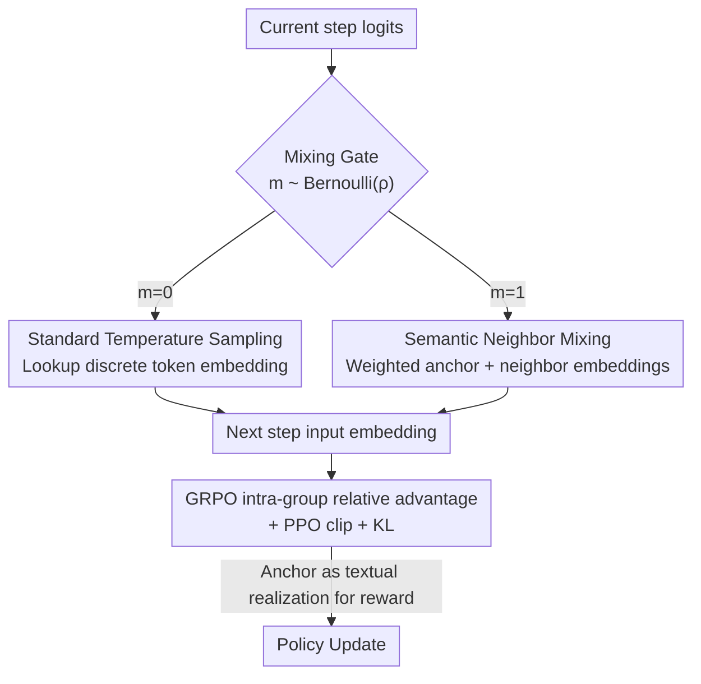

# N-GRPO: Embedding-Level Neighbor Mixing for Enhanced Policy Optimization

**Conference**: ACL 2026  
**arXiv**: [2606.10768](https://arxiv.org/abs/2606.10768)  
**Code**: To be confirmed  
**Area**: LLM Reasoning / Reinforcement Learning Policy Optimization  
**Keywords**: GRPO, mathematical reasoning, embedding-level exploration, semantic neighbor mixing, rollout diversity

## TL;DR
N-GRPO replaces "sampling a token then looking up its embedding" with a "weighted mixture of the anchor token and its semantic neighbors' embeddings" during the GRPO rollout phase. It injects exploration diversity via controlled embedding-level perturbations without deviating from the semantic manifold, consistently outperforming GRPO and Gaussian noise baselines on Pass@16/Pass@32 across multiple backbones such as DeepSeek-R1-Distill-Qwen.

## Background & Motivation
**Background**: Enhancing mathematical reasoning in LLMs via RL (especially GRPO) has become a mainstream paradigm. GRPO samples a group of $G$ trajectories for each problem and updates the policy based on intra-group relative advantages. The ability to sample "diverse and effective" reasoning paths during the rollout phase directly determines training performance.

**Limitations of Prior Work**: Existing exploration methods are trapped in a fundamental trade-off. **Token-level sampling** (min-p, temperature sampling, COPO, etc.) only fluctuates across discrete tokens, often producing trajectories that are merely "paraphrases" or "1+2 vs 2+1" reorderings—the underlying reasoning logic remains unchanged, resulting in redundant trajectories. **Embedding-level methods** attempt a different path: either by incorporating continuous representations like HRPO/Soft Thinking, where randomness still originates from discrete token sampling (essentially remaining discrete and redundant), or by directly applying Gaussian noise to embeddings/logits like STHT (Soft Tokens, Hard Truths).

**Key Challenge**: Directly adding Gaussian noise **destroys semantic consistency**. The authors conducted a pilot experiment: adding isotropic Gaussian noise to the embeddings of 10 random tokens (math symbols + common functional words) and decoding them back to their nearest neighbors. PCA visualization (Figure 1) shows that perturbations often **push representations off the semantic manifold**, turning original tokens into irrelevant words and causing rollout trajectories to derail. The root cause is the **strong anisotropy** of the Transformer embedding space—noises of the same magnitude result in vastly different semantic consequences across different directions. Therefore, perturbations must adapt to local semantic contexts rather than applying noise indiscriminately.

**Goal**: To design an **embedding-level yet semantically constrained** perturbation that provides sufficient randomness to expand exploration while remaining within valid semantic regions.

**Core Idea**: Instead of applying random noise, the **embedding of the sampled token is mixed with its nearest neighbor token embeddings** in the embedding space. Neighbors are retrieved based on embedding similarity, naturally aligning with the anchor's semantic direction. Thus, the resulting mixed embedding remains within the valid semantic neighborhood while providing a continuous exploration space unreachable by discrete sampling.

## Method

### Overall Architecture
N-GRPO leaves the advantage estimation and optimization objectives of GRPO unchanged, modifying only the mechanism for "how the next step input is generated" during rollout. Standard autoregressive generation calculates logits $\rightarrow$ samples a discrete token $\rightarrow$ looks up its embedding for the next step. N-GRPO uses a Bernoulli gating mask $m_{i,t}\sim\text{Bernoulli}(\rho)$ at each step: if the mask hits (probability $\rho$), **semantic neighbor mixing** is triggered—the current optimal token is taken as an anchor, $k$ semantic neighbors are retrieved, weights are re-normalized over this small set using the current logits, and a weighted continuous mixed embedding is fed to the next step. If the mask is not hit, it falls back to standard temperature sampling and discrete token embedding lookup. For advantage and reward calculations, the anchor token is used as its "textual realization," allowing the reuse of standard discrete text rewards.

### Key Designs

**1. Semantic Neighbor Mixing: Continuous perturbation in the anchor's semantic neighborhood**

This is the core mechanism of the paper, addressing the issues of "token sampling redundancy" and "Gaussian noise derailment." Given temperature-scaled logits $\tilde{z}_t$, it first takes the **argmax** as the semantic anchor $v_t^*=\arg\max_v \tilde{z}_t(v)$—using argmax instead of random sampling ensures the exploration center is firmly aligned with the model's current optimal reasoning path, avoiding instability from using low-probability tokens. Cosine similarity $s(u,v)=\frac{E[u]\cdot E[v]}{\|E[u]\|_2\|E[v]\|_2}$ is used to retrieve the $k-1$ most similar tokens, which together with the anchor form the neighbor set $\mathcal{C}_t$. Then, logits are re-normalized via softmax **only within this set** to obtain mixing weights $\alpha_t(c)=\frac{\exp(\tilde{z}_t(c))}{\sum_{u\in\mathcal{C}_t}\exp(\tilde{z}_t(u))}$. Finally, the mixed embedding is constructed:

$$\tilde{e}_{t+1}=\sum_{c\in\mathcal{C}_t}\alpha_t(c)\,E[c]$$

Since neighbors are selected by embedding similarity, they cluster in the same semantic direction as the anchor, ensuring the mixture is not pushed off the manifold. The direction and intensity of perturbation are adaptively modulated by the current logits, expanding exploration while fitting the model's semantic preferences. This bypasses the flaw of Gaussian noise being "isotropic and regardless of local anisotropy."

**2. Bernoulli Gating Mixing Rate ρ: Providing intermittent exploration to prevent cumulative derailment**

If embedding mixing were performed at every step, continuous perturbations would accumulate and derail the overall rollout. The authors use a Bernoulli mask with a fixed mixing rate $\rho$ as a "filter": only a small portion of steps (default $\rho=0.1$) trigger mixing, while most still use discrete tokens to maintain semantic stability while injecting necessary "intermittency" into exploration, preventing training instability from excessive reliance on continuous perturbations. The next step input is determined by the mask value:

$$e_{i,t+1}=\begin{cases}\sum_{c\in\mathcal{C}_{i,t}}\alpha_{i,t}(c)E[c], & m_{i,t}=1\\ E[o_{i,t}], & m_{i,t}=0\end{cases}$$

Ablation studies confirm this gate is critical: removing it to mix **all tokens** (N-GRPO w/o rate) caused the average Pass@32 to drop from 79.17 to 77.32, indicating that full-process mixing introduces excessive noise.

**3. Nesting into GRPO: Retaining objectives while reconstructing reproducible trajectories**

The mixing mechanism must be integrated into GRPO without destroying its advantage estimation and PPO-style clipping objectives. Two engineering keys: first, to ensure reproducible trajectories during training, the neighbor sets and weights $\{(\mathcal{C}_{i,t},\alpha_{i,t})\}$ are recorded in a buffer during rollout. During training, input representations $e_{i,t}$ are reconstructed via lookup tables to ensure probability and loss calculations match the rollout. Second, as reward and answer verification require discrete text, mixed steps uniformly use the anchor $v_t^*$ as their textual realization, resulting in a discrete sequence $\tilde{o}_i$. Advantages are calculated based on these rewards: $\hat{A}_i=\frac{r(\tilde{o}_i)-\text{mean}(r)}{\text{std}(r)}$. Optimization utilizes the standard GRPO objective (PPO clip + KL regularization), with importance ratios $r_{i,t}(\theta)$ calculated over the reconstructed history $h_{i,t}$. This allows continuous embedding space exploration while reusing mature discrete reward pipelines.

### Loss & Training
The optimization objective is standard GRPO: $J_{\text{GRPO}}(\theta)$ takes the PPO-clipped $\min(r_{i,t}\hat{A}_i, \text{clip}(r_{i,t},1-\epsilon,1+\epsilon)\hat{A}_i)$ for each of the $G$ trajectories in a group, minus the KL penalty $\beta D_{\text{KL}}(\pi_\theta\|\pi_{\text{ref}})$. Training utilized the verl framework and the DeepScaleR dataset, filtering samples with prompts exceeding 4096 tokens, with a maximum generation length of 8192. The learning rate was 1e-6, global batch size 64, trained for 1 epoch on 8×H20-3e GPUs. Default values were $\rho=0.1$ and $k=3$, with the best checkpoint selected based on the AIME24 validation set.

## Key Experimental Results

### Main Results
Four backbones (DeepSeek-R1-Distill-Qwen-1.5B/7B, Llama-3.2-1B, Qwen3-1.7B-Base) were evaluated across three math benchmarks (AIME25, AMC23, MATH500), focusing on Pass@16/Pass@32. The table below summarizes average Pass@32:

| Model | Base | GRPO | GRPO+SoftThink | STHT | N-GRPO |
|------|------|------|----------------|------|--------|
| DS-Qwen-1.5B (avg Pass@32) | 74.62 | 77.41 | 77.53 | 78.05 | **79.17** |
| DS-Qwen-7B (avg Pass@32) | 81.23 | 81.94 | 82.21 | 82.53 | **84.20** |
| DS-Qwen-1.5B AIME25 Pass@32 | 41.19 | 47.31 | 45.94 | 46.73 | **50.28** |
| Llama-3.2-1B (avg Pass@32) | 41.61 | 44.77 | — | 44.17 | **46.34** |
| Qwen3-1.7B-Base AIME25 Pass@32 | 23.18 | 23.47 | — | 25.78 | **28.47** |

The highlight is AIME25 (the most difficult): Pass@32 rose from 47.31 (GRPO) to 50.28 on the 1.5B model, and was 5.00 points higher than GRPO on Qwen3-1.7B. Compared to STHT (Gaussian noise), N-GRPO improved average Pass@32 from 78.05 to 79.17 on the 1.5B model and from 82.53 to 84.20 on the 7B model, confirming that "semantically constrained perturbations are superior to unstructured noise." On AMC23/MATH500 where baselines are already high, GRPO remains stronger at times, suggesting neighbor mixing yields the greatest gains on difficult problems where exploration space still exists.

### Ablation Study
Conducted on DeepSeek-R1-Distill-Qwen-1.5B across mathematical benchmark averages:

| Configuration | Mean@32 | Pass@16 | Pass@32 | Description |
|------|---------|---------|---------|------|
| Baseline | 53.28 | 73.05 | 74.62 | Untrained |
| +Gumbel Soft-Thinking | 53.87 | 74.58 | 76.89 | Gumbel noise added to top-k logits |
| +N-GRPO w/o rate | 53.56 | 75.16 | 77.32 | Mix all tokens, remove mixing rate |
| +N-GRPO (Full) | **54.11** | **76.82** | **79.17** | Anchor neighbor mixing + ρ gating |
| Distance Metric L2 | 53.77 | 75.26 | 77.68 | Cosine replaced by L2 |
| Distance Metric L1 | 53.07 | 72.98 | 75.16 | Cosine replaced by L1 |

### Key Findings
- **The mixing rate ρ is a critical filter**: Mixing all tokens (w/o rate) introduces excessive noise and leads to performance drops (Pass@32 79.17 $\rightarrow$ 77.32). While results are generally insensitive to the rate, Pass@32 on AIME25 for the 1.5B model dropped significantly when $\rho$ increased to 0.2, confirming the "exploration-stability" trade-off.
- **Cosine distance is clearly optimal**: Cosine > L2 > L1. This is because high-dimensional embedding semantics are primarily encoded in the vector **direction** rather than magnitude; Cosine captures directional alignment, while L2 is sensitive to magnitude and introduces irrelevant variance.
- **Improvement rather than OOD degradation**: On GPQA-Diamond scientific reasoning, the 1.5B Pass@32 rose from 90.79 to 92.87, and the 7B model also achieved peak metrics, indicating no overfitting to the training distribution.
- **Cross-algorithm transferability**: Applying semantic neighbor mixing to GSPO (denoted N-GSPO) improved the 1.5B average Pass@32 from 77.34 to 79.04 (+7.66 on AIME25), showing the mechanism is not restricted to GRPO's advantage normalization.
- **Mixing intended for training rollout only**: Using semantic neighbor mixing during inference actually decreased performance (1.5B Pass@32 79.17 $\rightarrow$ 77.05); it is an exploration tool for training rather than an inference-time decoding strategy.

## Highlights & Insights
- **PCA visualization (Figure 1) explains the motivation clearly**: By empirically demonstrating how "Gaussian noise pushes tokens off the semantic manifold" and subsequently proposing "mixing along semantic neighbor directions," the problem diagnosis and solution are perfectly aligned, making the narrative highly persuasive.
- **Argmax anchor + intra-set re-normalization is clever**: Using argmax for the anchor stabilizes the optimal path, while softmax across the small neighbor set allows for controlled jittering strictly "adjacent to the main path," naturally balancing exploration and stability.
- **Buffer recording of neighbor sets and weights ensures reproducibility**: This engineering key allows continuous exploration to be integrated into discrete RL pipelines while maintaining correct loss calculations, which can be applied to any RL training involving continuous perturbations during rollout.
- **The Bernoulli gate approach is transferable**: Using a Bernoulli mask to provide intervals for "aggressive exploration operators" to prevent cumulative bias is a universal stabilization trick.

## Limitations & Future Work
- **k and ρ are still hyperparameters**: Default values are $k=3$ and $\rho=0.1$. The paper does not provide a full scan of $k$, leaving it unknown if optimal values change with model scale or task.
- **Additional overhead**: Each mixing step requires neighbor retrieval and buffer recording, incurring additional computational and storage costs compared to pure token sampling. The paper provides no explicit training throughput comparison.
- **Limited gains in certain scenarios**: On tasks where baselines are already high (like AMC23/MATH500), GRPO is sometimes stronger; the method primarily excels on difficult problems with large exploration spaces.
- **Neighbors based on static embedding matrices**: Neighbor sets are retrieved via a fixed embedding matrix $E$. Whether this will gradually mismatch as the policy evolves while the neighbor geometry remains static is worth exploring.

## Related Work & Insights
- **vs GRPO**: Purely replaces discrete lookup with embedding mixing during rollout while reusing all other GRPO components; consistently outperforms GRPO on mathematical reasoning Pass@k.
- **vs STHT (Soft Tokens, Hard Truths)**: Both use embedding-level perturbations, but STHT's unconstrained Gaussian noise leads to derailment. N-GRPO stays within the manifold by mixing along semantic neighbors, achieving higher average Pass@32.
- **vs HRPO / Soft Thinking**: Their randomness ultimately stems from discrete token sampling, making them discrete exploration at heart. N-GRPO performs true continuous exploration in the continuous embedding neighborhood.
- **vs Gumbel Soft-Thinking (SofT-GRPO)**: It adds Gumbel noise to logits for top-k weighting, belonging to the "native noise" category. N-GRPO provides more effective exploration guidance via semantic neighbors, performing better in ablations.

## Rating
- Novelty: ⭐⭐⭐⭐ "Semantic neighbor mixing" constrains embedding-level exploration within the manifold, offering a fresh perspective with solid diagnosis.
- Experimental Thoroughness: ⭐⭐⭐⭐ Four backbones × three math benchmarks + OOD + GSPO transfer + distance/rate/mechanism ablations; very comprehensive.
- Writing Quality: ⭐⭐⭐⭐ Logic is clear from PCA diagnosis to method to ablation, with complete formulas.
- Value: ⭐⭐⭐⭐ Provides a plug-and-play, transferable controlled embedding-level exploration module for GRPO-like RL.

<!-- RELATED:START -->

## Related Papers

- [\[ACL 2026\] Calibration-Aware Policy Optimization for Reasoning LLMs](calibration-aware_policy_optimization_for_reasoning_llms.md)
- [\[ICLR 2026\] Scaf-GRPO: Scaffolded Group Relative Policy Optimization for Enhancing LLM Reasoning](../../ICLR2026/llm_reasoning/scaf-grpo_scaffolded_group_relative_policy_optimization_for_enhancing_llm_reason.md)
- [\[ACL 2026\] Think Outside the Policy: In-Context Steered Policy Optimization](think_outside_the_policy_in-context_steered_policy_optimization.md)
- [\[ACL 2026\] Adapt to Thrive! Adaptive Power-Mean Policy Optimization for Improved LLM Reasoning](adapt_to_thrive_adaptive_power-mean_policy_optimization_for_improved_llm_reasoni.md)
- [\[ACL 2026\] Step-GRPO: Internalizing Dynamic Early Exit for Efficient Reasoning](step-grpo_internalizing_dynamic_early_exit_for_efficient_reasoning.md)

<!-- RELATED:END -->
