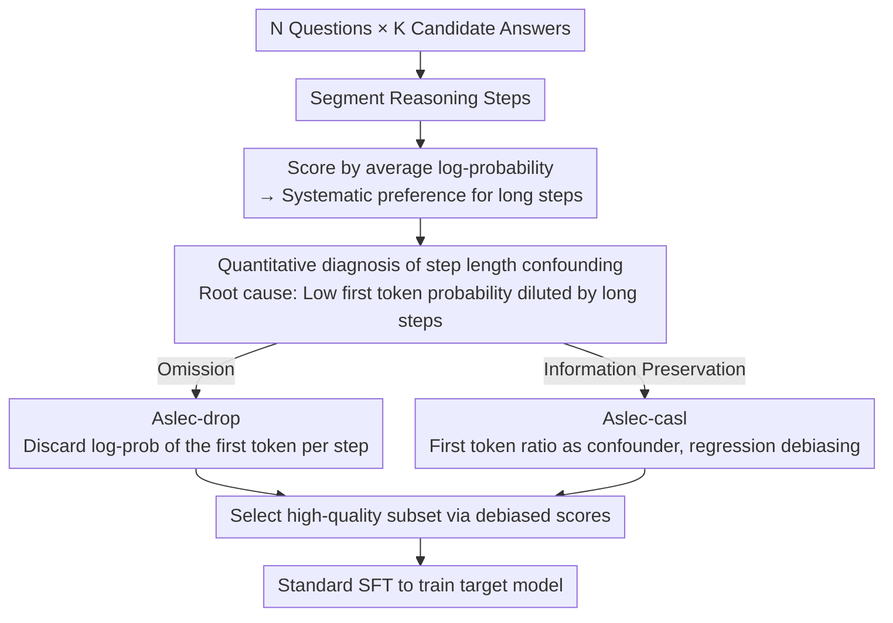

# On the Step Length Confounding in LLM Reasoning Data Selection

**Conference**: ACL 2026 Findings  
**arXiv**: [2604.06834](https://arxiv.org/abs/2604.06834)  
**Code**: [GitHub](https://github.com/wangbing1416/ASLEC)  
**Area**: Social Computing  
**Keywords**: Reasoning data selection, Step length confounding, Naturalness, First token, Causal debiasing

## TL;DR

This paper identifies a "step length confounding" issue in naturalness-based LLM reasoning data selection methods—a systematic preference for samples with longer steps rather than higher quality, rooted in the dilution of low-probability first tokens in long steps. Two correction methods, Aslec-drop (discarding first token probabilities) and Aslec-casl (causal regression debiasing), are proposed, improving average accuracy by 6-9%.

## Background & Motivation

**Background**: Constructing high-quality SFT data is central to training large reasoning models (e.g., DeepSeek-R1). Existing data selection methods are divided into heuristic rules (answer correctness, diversity, difficulty) and naturalness-based methods (scoring by LLM log-probability/perplexity to select samples with the highest model fitness).

**Limitations of Prior Work**: Naturalness-based methods (e.g., GRACE, Local LP) exhibit severe bias on long CoT datasets—they systematically favor samples containing more tokens per step instead of truly high-quality ones. The step length distribution of selected data significantly differs from unselected data.

**Key Challenge**: The first token of a reasoning step often branches into different reasoning paths, thus possessing higher entropy and lower log-probability. In longer steps, the proportion of the first token is smaller, and its low probability is diluted by more non-first tokens, leading to higher average log-probabilities for long steps, making them easier to be selected.

**Goal**: Quantify and eliminate this step length confounding effect to make data selection independent of step length bias.

**Key Insight**: Start with first token probabilities—since the root cause is the varying impact of low first-token probabilities across different step lengths, directly intervene in the contribution of the first token.

**Core Idea**: Two methods—Aslec-drop directly discards first token probabilities from score calculations; Aslec-casl treats the first token ratio as a confounding factor and uses causal debiasing regression to remove its influence.

## Method

### Overall Architecture

The task setting involves selecting a high-quality subset for SFT from $N$ questions, each with $K$ candidate answers. The standard approach for naturalness methods is scoring by average log-probability and selecting the highest; however, this is the source of step length confounding. This paper does not change the selection rules but intervenes at the "scoring" step to isolate or correct the contribution of the first token, then uses the debiased scores to select data.

### Key Designs

**1. Quantitative diagnosis of step length confounding: Identifying the root cause**

Before intervention, the authors establish the causal chain in three steps. First, they observe that data selected by naturalness methods has a significantly longer step length distribution than unselected data. Second, per-step statistics show average log-probability increases monotonically with step length—longer steps are more likely to be chosen. Third, the root cause is located: the first token of a reasoning step often bifurcates into various reasoning branches, resulting in high entropy and low log-probability; as step length increases, the first token's proportion relative to all tokens in that step decreases, diluting its low probability and inflating the average log-probability of long steps. Thus, the intervention point naturally falls on the "first token."

**2. Aslec-drop: Simply discarding first token probabilities**

Since the first token is the source of confounding, the most direct method is to exclude it from scoring. Aslec-drop segments answer $\mathbf{o}_i$ into $L$ reasoning steps. When calculating average log-probability, it skips the first token of each step, and the denominator is adjusted to the total token count excluding first tokens:

$$s_i^{drop} = \frac{1}{|\mathbf{o}_i| - |\mathcal{S}_i|} \sum_{\mathbf{s}_i^l} \sum_{t=2}^{|\mathbf{s}_i^l|} \log P_\theta(s_{i,t}^l \mid \text{context})$$

This puts steps of different lengths on equal footing, cutting off the confounding. The trade-off is that the useful signal carried by the first token itself (it indeed reflects model fitness at branching points) is also discarded.

**3. Aslec-casl: Treating step length as a confounder for causal regression debiasing**

To remove confounding while preserving first token information, Aslec-casl adopts a causal debiasing approach. It decomposes the original log-probability using a linear regression:

$$s_i^{logp} = \beta_1 s_i^{first} + \beta_2 s_i^{drop} + \gamma \mathcal{Z}_i + \epsilon$$

Where $\mathcal{Z}_i = |\mathcal{S}_i| / |\mathbf{o}_i|$ is the first token ratio, act as the confounding factor. After estimating its coefficient $\gamma$ using OLS, its contribution is subtracted from the original score to obtain the debiased score $s_i^{casl} = s_i^{logp} - \gamma \mathcal{Z}_i$. Compared to direct discarding, this only eliminates the "step length ratio" confounding path, retaining the true signal of the first token. Consequently, Aslec-casl consistently outperforms Aslec-drop in experiments, and the regression has a closed-form solution with negligible overhead.

### Loss & Training

Aslec is a data selection method and does not involve training itself. After data selection, the target model is trained using standard SFT (cross-entropy loss).

## Key Experimental Results

### Main Results (LIMO-v2, Qwen3-4B-Base)

| Method | AIME24 | AIME25 | MATH500 | Average |
|------|--------|--------|---------|------|
| GRACE | 16.66 | 15.83 | 59.40 | 31.42 |
| Local LP | 19.16 | 20.83 | 71.60 | 36.50 |
| **Ours-drop** | **30.00** (+10.84) | **28.33** (+7.50) | **77.80** (+6.20) | **44.64** |
| **Ours-casl** | **31.66** (+12.50) | **30.83** (+10.00) | **80.00** (+8.40) | **47.54** |

### Ablation Study

| Analysis | Finding |
|------|------|
| Step Length vs. Total Length | Step length confounding effect is much stronger than total length effect |
| Aslec-drop vs. Aslec-casl | Aslec-casl is consistently superior as it preserves first token information |
| Consistency across models | Consistently effective across Qwen3-4B, 8B, 32B, and Llama-3.1-8B |

### Key Findings
- Aslec-casl improves by approximately 9.08% on average compared to the SOTA method Local LP, while Aslec-drop improves by 6.28%.
- Confounding effects consistently exist in all four naturalness-based methods (GRACE, Local LP, Min Entropy, Min Perplex).
- The low probability of the first token is the root cause of confounding, aligning with prior research on the branching behavior of reasoning step first tokens.
- The causal regression in Aslec-casl has a closed-form solution, making computational overhead negligible.
- Effectiveness is consistent across different model sizes (4B-32B) and datasets (LIMO-v2, AceReason).

## Highlights & Insights
- **Discovery of the "Step Length Confounding" phenomenon** is a major contribution: it reveals a common but significant systematic bias in LLM reasoning data selection that was previously overlooked, with clear and reproducible explanations.
- **Application of the causal debiasing framework** is ingenious: treating the first token ratio as a confounder and using classic linear regression causal debiasing to eliminate its impact is methodologically elegant and effective.
- **Insight into "first token branching behavior"** connects reasoning data selection with the understanding of reasoning processes.

## Limitations & Future Work
- The linear regression assumes step length confounding is linear, potentially missing non-linear effects.
- Step segmentation relies on "\n\n" or sentence boundaries; the segmentation method may influence results.
- Only validated on mathematical reasoning tasks; effectiveness on other tasks like code or natural language reasoning remains unknown.
- The "branching behavior" hypothesis for the first token might not apply to all reasoning patterns.
- Future work could explore integrating step length information as a regularization target during training.

## Related Work & Insights
- **vs GRACE / Local LP**: These naturalness-based methods suffer from step length confounding; Aslec directly corrects this by intervening in first token probabilities.
- **vs Heuristic Data Selection**: Heuristic methods (answer correctness, difficulty, etc.) do not directly consider model fitness; Aslec removes bias while retaining the advantages of naturalness-based methods.
- **vs IFD / Deita**: These methods utilize perplexity differences between models or reward model scores, and are orthogonal to naturalness methods.

## Rating
- Novelty: ⭐⭐⭐⭐⭐ The discovery of step length confounding is the key contribution; causal debiasing is concise and effective.
- Experimental Thoroughness: ⭐⭐⭐⭐ Validated across multiple models, datasets, and benchmarks with thorough analysis.
- Writing Quality: ⭐⭐⭐⭐⭐ Extremely clear logic from diagnosis to causal analysis and solution.
- Value: ⭐⭐⭐⭐⭐ Direct and significant impact on LLM reasoning data selection practices.

<!-- RELATED:START -->

## Related Papers

- [\[ACL 2026\] Stabilizing Efficient Reasoning with Step-Level Advantage Selection](stabilizing_efficient_reasoning_with_step-level_advantage_selection.md)
- [\[ACL 2026\] Budget-Aware Anytime Reasoning with LLM-Synthesized Preference Data](budget-aware_anytime_reasoning_with_llm-synthesized_preference_data.md)
- [\[ACL 2026\] LLM Reasoning as Trajectories: Step-Specific Representation Geometry and Correctness Signals](llm_reasoning_as_trajectories_step-specific_representation_geometry_and_correctn.md)
- [\[ACL 2026\] MathAgent: Adversarial Evolution of Constraint Graphs for Mathematical Reasoning Data Synthesis](mathagent_adversarial_evolution_of_constraint_graphs_for_mathematical_reasoning_.md)
- [\[ACL 2026\] Efficient PRM Training Data Synthesis via Formal Verification](efficient_prm_training_data_synthesis_via_formal_verification.md)

<!-- RELATED:END -->
