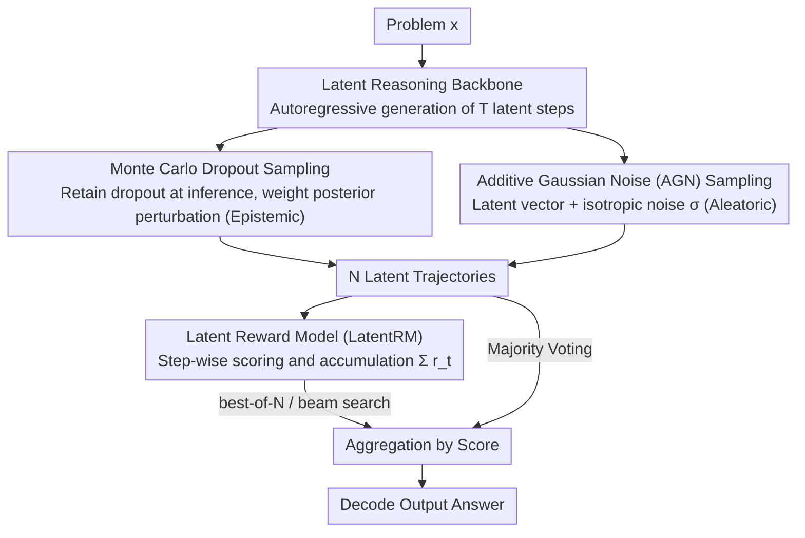

# Parallel Test-Time Scaling for Latent Reasoning Models

**Conference**: ACL 2026 Main Conference  
**arXiv**: [2510.07745](https://arxiv.org/abs/2510.07745)  
**Code**: None  
**Area**: LLM Reasoning  
**Keywords**: Test-time Scaling, Latent Reasoning, Stochastic Sampling, Reward Models, Parallel Inference

## TL;DR

This paper introduces parallel test-time scaling (TTS) to latent reasoning models for the first time. It proposes two stochastic sampling strategies based on uncertainty theory (MC-Dropout and Additive Gaussian Noise) and a Latent Reward Model (LatentRM) trained with step-level contrastive learning. This enables models operating in continuous vector spaces to achieve stable performance gains through parallel sampling and aggregation.

## Background & Motivation

**Background**: Test-time scaling (TTS) is a critical method for enhancing the reasoning capabilities of LLMs. Parallel TTS converts additional inference computation into stronger performance by generating multiple reasoning paths and aggregating results (e.g., majority voting, best-of-N, beam search). Currently, these methods rely entirely on token-level sampling mechanisms (e.g., top-k, nucleus sampling).

**Limitations of Prior Work**: Emerging latent reasoning paradigms (such as COCONUT, CODI, and CoLaR) shift the reasoning process from token space to a continuous vector space, which is more compact and efficient. However, they **cannot directly utilize parallel TTS** for two reasons: (1) continuous vector spaces lack an explicit probability distribution, making them devoid of a sampling mechanism; (2) there are no token-level probability signals available to evaluate and aggregate reasoning trajectories.

**Key Challenge**: While latent reasoning offers inherent advantages in efficiency, the lack of parallel scaling capabilities limits its reasoning quality. Introducing controllable randomness into continuous space and designing effective trajectory evaluation mechanisms are the two primary obstacles to unlocking parallel TTS for latent reasoning models.

**Goal**: To design the two core components—sampling and aggregation—for latent reasoning models, enabling them to benefit from parallel TTS in the same way as token-based models.

**Key Insight**: Drawing from uncertainty estimation theory, the authors decompose the sampling problem into two sources of uncertainty—epistemic and aleatoric—and design corresponding sampling strategies. For the aggregation problem, a specialized scoring model is trained to replace token-level probability signals.

**Core Idea**: Use MC-Dropout (epistemic uncertainty) and Additive Gaussian Noise (aleatoric uncertainty) to generate diverse reasoning trajectories in the latent space, and employ a step-level contrastively trained LatentRM to evaluate and guide trajectory aggregation.

## Method

### Overall Architecture

After receiving a problem $\bm{x}$, the latent reasoning model autoregressively generates $T$ steps of latent vectors $\bm{h}_{1:T}$ in a continuous vector space, eventually switching back to explicit token generation via an end-of-thinking token to output an answer. Parallel TTS aims to generate multiple distinct reasoning trajectories and aggregate them. Since the latent space lacks explicit probability distributions for sampling and probability signals for scoring, this paper adds two components: "injecting randomness into the latent space" for sampling and a "specially trained Latent Reward Model" for scoring and aggregation. Specifically, $N$ trajectories $\{\bm{h}^{(n)}\}_{n=1}^N$ are sampled, and LatentRM is used for scoring or majority voting to synthesize the final answer.

### Key Designs

**1. Monte Carlo Dropout Sampling: Generating Epistemic Uncertainty via Weight Posterior Randomness**

Since continuous spaces lack ready-made sampling ports like top-k/nucleus sampling, the first solution is to keep dropout active during inference. Each forward pass uses a different dropout mask $m^{(n)} \sim \text{Bernoulli}(p)$ (applied after the feed-forward layer of each Transformer block), which is equivalent to sampling a set of weights $\bm{\theta}^{(n)}$ from a variational approximation of the model weight posterior. Consequently, each execution produces a different trajectory. It captures epistemic uncertainty—the part the model is "unsure" about due to limited training data. The advantage is that the noise intensity adapts, exploring more in regions where the model is inherently uncertain.

**2. Additive Gaussian Noise (AGN) Sampling: Direct Perturbation for Aleatoric Uncertainty**

The second solution is more direct: at each reasoning step $t$, an isotropic Gaussian noise $\bm{\epsilon}_t^{(n)} \sim \mathcal{N}(0, \sigma^2 \mathbf{I})$ is sampled and added to the latent vector, $\bm{h}_t^{(n)*} = \bm{h}_t^{(n)} + \bm{\epsilon}_t^{(n)}$, and the model continues to reason based on the perturbed trajectory. The noise intensity is controlled solely by $\sigma$ and is independent of model parameters. This corresponds to aleatoric uncertainty—intrinsic noise and ambiguity in the input. Geometrically, it produces an isotropic "firework-like" radial dispersion, which is more robust and has slower coverage decay than MC-Dropout in settings requiring high diversity.

**3. Latent Reward Model (LatentRM): Scoring Continuous Trajectories in Place of Token Signals**

With multiple trajectories, a method to compare their quality is required; however, traditional PRMs rely on token-based reasoning steps and are ineffective for continuous vectors. LatentRM adds a scoring head to the latent reasoning backbone, mapping hidden states to scalars $r_t = g_{\bm{\phi}}(\bm{x}, \bm{h}_{1:t})$. At inference, the cumulative sum $\sum_t r_t$ serves as a proxy for the quality of the entire trajectory. Training labels are obtained via random rollouts: $M$ random completions are performed for each intermediate thought, and the success rate is used as the quality measure. The key is the training objective—instead of independent binary classification for each candidate, a step-level contrastive loss is used to compare the scores of all $N$ candidates via softmax at each step $t$. This "relative ranking" signal is significantly stronger than BCE, as removing it leads to a clear drop in performance.

### A Complete Example: GSM Problem with Parallel TTS

Consider COCONUT on GSM-Test with $N=32$. The model first runs the same problem 32 times using MC-Dropout (or AGN), with each pass following a different latent trajectory due to varying masks/noise. Next, LatentRM progressively scores each trajectory and accumulates them into $\sum_t r_t$. Best-of-N chooses the trajectory with the highest cumulative score for decoding. Beam search retains top-scoring beams mid-way and prunes poor trajectories, while majority voting votes on the decoded answers from all 32 paths. In this setup, best-of-N + LatentRM increases accuracy from 33.6% (majority voting) to 35.4%, and on the more difficult GSM-Hard, from 6.1% to 7.8%, proving that "scoring" aggregates more accurately than "counting votes."

### Loss & Training

LatentRM training utilizes a step-level contrastive loss: $\mathcal{L} = -\sum_t \sum_{n=1}^N y_t^{(n)} p_t^{(n)}$, where $p_t^{(n)} = \frac{\exp(r_t^{(n)})}{\sum_{n'} \exp(r_t^{(n')})}$. The supervision labels are derived from empirical accuracy estimated by random rollouts: $\tilde{y} = \frac{1}{M} \sum_m \mathbb{I}\{a_m = a^*\}$.

## Key Experimental Results

### Main Results

| Model | Dataset | Deterministic Baseline | Coverage@8 | Coverage@16 |
|------|--------|-----------|------------|-------------|
| Latent-SFT (1B) | GSM8K | 44.5% | 58.5% | 64.9% |
| Latent-SFT (1B) | MultiArith | 93.4% | 96.2% | 96.7% |
| RoT-4B | GSM8K | 37.5% | 39.4% | 39.7% |
| RoT-4B | MATH500 | 20.3% | 21.8% | 22.0% |

Comparison of Aggregation Strategies (COCONUT, GSM-Test, N=32):

| Aggregation Strategy | GSM-Test | GSM-Hard |
|---------|----------|----------|
| Majority Voting | 33.6% | 6.1% |
| Best-of-N + LatentRM | **35.4%** | **7.8%** |
| Beam Search + LatentRM | ~35% | ~7% |

### Ablation Study

| Configuration | GSM-Test | GSM-Hard | Description |
|------|----------|----------|------|
| Full LatentRM (Best-of-8) | 35.4% | 7.8% | Full model |
| w/o contrastive (using BCE) | 33.5% | 7.4% | Significant drop without contrastive loss |
| w/o stochastic rollouts | 30.7% | 6.0% | Random rollout labeling is crucial |
| Random scalar head | 28.9% | 5.8% | Lower than majority voting |

### Key Findings
- MC-Dropout achieves higher coverage in most settings, particularly on difficult problems (its directional drift makes it easier to reach correct regions far from the deterministic solution).
- AGN is more robust in high-diversity settings with slower coverage decay, making it suitable for scenarios requiring high exploration.
- t-SNE visualization reveals that MC-Dropout produces a dense, directional expansion ("directional drift"), while AGN produces an isotropic radial dispersion ("firework" pattern).
- The step-level contrastive loss of LatentRM contributes most significantly; performance drops markedly without it.
- As the number of samples increases, the performance gap between different models narrows.

## Highlights & Insights
- **Uncertainty-driven sampling design**: The decomposition of sampling into epistemic and aleatoric uncertainty, solved via MC-Dropout and AGN respectively, is elegant. Their complementary geometric exploration patterns provide a framework applicable to other continuous search problems.
- **LatentRM design**: Utilizing random rollouts for thought-level labels combined with step-level contrastive training solves the core challenge of "scoring non-token representations," which can be generalized to other intermediate representations.
- **Coverage vs. Diversity "Sweet Spot"**: The analysis that neither too much nor too little diversity is ideal is insightful for balancing exploration and exploitation.

## Limitations & Future Work
- Experiments were primarily conducted using small models (GPT-2 124M, Llama-3.2-1B); the absolute performance of latent reasoning on hard math (AIME) and PhD-level benchmarks (GPQA) remains limited.
- Both MC-Dropout and AGN require hyperparameter tuning (dropout rate and noise standard deviation), although heuristic ranges are provided.
- LatentRM requires additional training, increasing deployment complexity.
- Integrating sampling and aggregation into a reinforcement learning framework for iterative latent trajectory optimization was not explored.
- The latent reasoning paradigm itself is still evolving and currently lags behind token-based CoT on highly complex tasks.

## Related Work & Insights
- **vs. Self-Consistency (Majority Voting)**: While Self-Consistency uses diverse sampling plus voting in token space, this work extends the concept to continuous latent space and achieves stronger aggregation via LatentRM.
- **vs. COCONUT/CODI/CoLaR**: These are foundational latent reasoning models; this paper adds parallel TTS capability as an orthogonal enhancement.
- **vs. Stochastic Soft Thinking**: Soft Thinking operates in the token probability space (soft tokens as mixtures of embeddings), whereas this work operates in a pure latent vector space independent of vocabulary structure.

## Rating
- Novelty: ⭐⭐⭐⭐ Introducing parallel TTS to latent reasoning is a clear and valuable contribution, though the sampling methods themselves (dropout/noise) are established techniques.
- Experimental Thoroughness: ⭐⭐⭐⭐ Covers multiple models, benchmarks, and sampling strategies with rich visualization and ablation.
- Writing Quality: ⭐⭐⭐⭐⭐ Clear motivation, logical structure, and thorough theoretical and experimental analysis.
- Value: ⭐⭐⭐⭐ Provides essential scaling capabilities for the latent reasoning paradigm, offering significant practical guidance.

<!-- RELATED:START -->

## Related Papers

- [\[ACL 2026\] Efficient Test-Time Scaling via Temporal Reasoning Aggregation](efficient_test-time_scaling_via_temporal_reasoning_aggregation.md)
- [\[ICLR 2026\] ATTS: Asynchronous Test-Time Scaling via Conformal Prediction](../../ICLR2026/llm_reasoning/atts_asynchronous_test-time_scaling_via_conformal_prediction.md)
- [\[ACL 2026\] Scaling Test-Time Compute to Achieve IOI Gold Medal with Open-Weight Models](scaling_test-time_compute_to_achieve_ioi_gold_medal_with_open-weight_models.md)
- [\[ICLR 2026\] Understanding the Role of Training Data in Test-Time Scaling](../../ICLR2026/llm_reasoning/understanding_the_role_of_training_data_in_test-time_scaling.md)
- [\[ICLR 2026\] Plan and Budget: Effective and Efficient Test-Time Scaling on Reasoning LLMs](../../ICLR2026/llm_reasoning/plan_and_budget_effective_and_efficient_test-time_scaling_on_reasoning_large_lan.md)

<!-- RELATED:END -->
