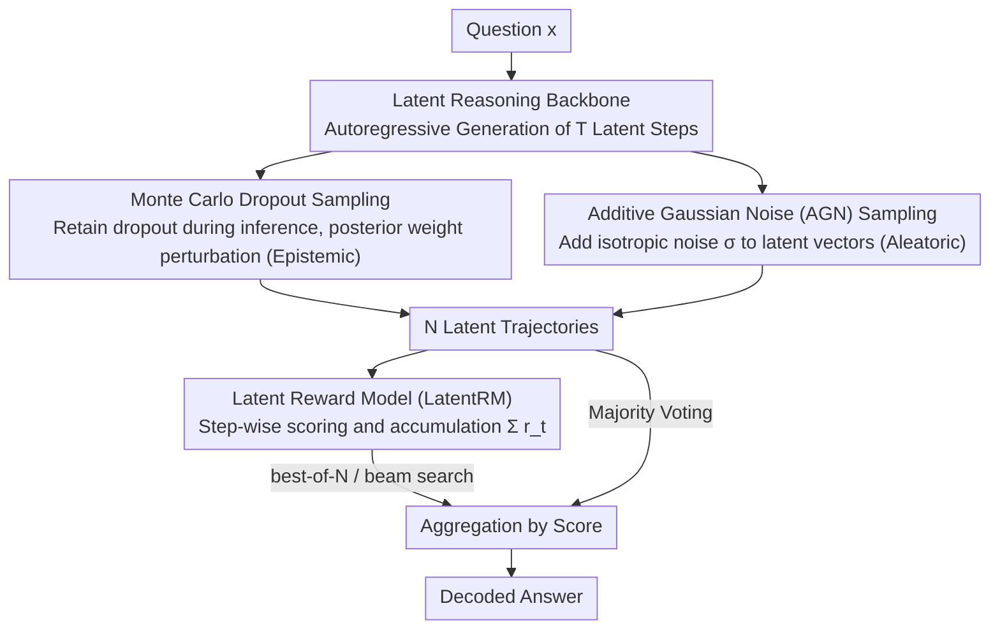

# Parallel Test-Time Scaling for Latent Reasoning Models

**Conference**: ACL 2026 Main Conference  
**arXiv**: [2510.07745](https://arxiv.org/abs/2510.07745)  
**Code**: None  
**Area**: LLM Reasoning  
**Keywords**: Test-time scaling, latent reasoning, stochastic sampling, reward models, parallel inference

## TL;DR

This paper introduces parallel test-time scaling (parallel TTS) to latent reasoning models for the first time. It proposes two stochastic sampling strategies based on uncertainty theory (MC-Dropout and Additive Gaussian Noise) and a Latent Reward Model (LatentRM) trained with step-level contrastive learning. This enables models reasoning in continuous vector spaces to achieve stable performance gains through parallel sampling and aggregation.

## Background & Motivation

**Background**: Test-time scaling (TTS) is a critical method for enhancing LLM reasoning capabilities. Parallel TTS transforms additional inference computation directly into stronger intelligence by generating multiple reasoning paths and aggregating results (e.g., majority voting, best-of-N, beam search). Currently, these methods rely entirely on token-level sampling mechanisms (e.g., top-k, nucleus sampling).

**Limitations of Prior Work**: Recent latent reasoning paradigms (e.g., COCONUT, CODI, CoLaR) shift the reasoning process from token space to continuous vector space, which is more compact and efficient. However, they **cannot directly utilize parallel TTS** for two reasons: (1) Continuous vector spaces lack explicit probability distributions for sampling; (2) There are no token-level probability signals to evaluate and aggregate reasoning trajectories.

**Key Challenge**: While latent reasoning offers natural advantages in efficiency, the lack of parallel scaling limited its reasoning quality. Introducing controllable randomness in continuous space and designing effective trajectory evaluation mechanisms are the two primary obstacles to unlocking parallel TTS for latent reasoning models.

**Goal**: To design sampling and aggregation components for latent reasoning models, allowing them to benefit from parallel TTS similarly to token-based models.

**Key Insight**: Drawing from uncertainty estimation theory, the authors decompose the sampling problem into two sources of uncertainty—epistemic and aleatoric—and design corresponding sampling strategies. For aggregation, a dedicated scoring model is trained to replace missing token probability signals.

**Core Idea**: Generate diverse reasoning trajectories in the latent space using MC-Dropout (epistemic uncertainty) and Additive Gaussian Noise (aleatoric uncertainty), and evaluate/guide trajectory aggregation using a step-level contrastively trained LatentRM to achieve parallel test-time scaling for latent reasoning.

## Method

### Overall Architecture

Given a question $\bm{x}$, the latent reasoning model autoregressively generates $T$ steps of latent vectors $\bm{h}_{1:T}$ in a continuous space, eventually switching back to explicit token generation via an end-of-thinking token to output an answer. Parallel TTS aims to generate multiple different trajectories and aggregate them. Since the latent space lacks explicit probability distributions for sampling and token probability signals for scoring, this work fills these gaps with two components: "injecting randomness into the latent space" for sampling and a "specially trained Latent Reward Model" for scoring and aggregation. Specifically, $N$ trajectories $\{\bm{h}^{(n)}\}_{n=1}^N$ are sampled and then aggregated via LatentRM scoring or majority voting.

### Key Designs

**1. Monte Carlo Dropout Sampling: Generating Epistemic Uncertainty via Posterior Randomness**

Since continuous spaces lack ready-made sampling interfaces like top-k, the first approach keeps dropout active during inference. Each forward pass uses a different dropout mask $m^{(n)} \sim \text{Bernoulli}(p)$ (applied after each Transformer block's feed-forward layer). This is equivalent to sampling a set of different weights $\bm{\theta}^{(n)}$ from a variational approximation of the model's weight posterior, resulting in distinct trajectories. This captures epistemic uncertainty—the model's "uncertainty" due to limited training data; its noise intensity adapts, exploring more in regions where the model is fundamentally less certain.

**2. Additive Gaussian Noise (AGN) Sampling: Generating Aleatoric Uncertainty via Direct Latent Perturbation**

The second approach is more direct: at each reasoning step $t$, an isotropic Gaussian noise $\bm{\epsilon}_t^{(n)} \sim \mathcal{N}(0, \sigma^2 \mathbf{I})$ is added to the latent vector: $\bm{h}_t^{(n)*} = \bm{h}_t^{(n)} + \bm{\epsilon}_t^{(n)}$. The model continues processing based on the perturbed trajectory. The noise intensity is controlled solely by $\sigma$, independent of model parameters. This corresponds to aleatoric uncertainty—intrinsic noise and ambiguity in the input. Geometrically, it produces an isotropic "firework" radial dispersion, appearing more robust than MC-Dropout in high-diversity settings with slower coverage decay.

**3. Latent Reward Model (LatentRM): Scoring Continuous Trajectories to Replace Missing Token Signals**

To compare trajectories without token-level step signals, LatentRM adds a scoring head to the latent reasoning backbone. It maps hidden states to scalars $r_t = g_{\bm{\phi}}(\bm{x}, \bm{h}_{1:t})$, using the cumulative sum $\sum_t r_t$ as a proxy for trajectory quality. Training labels are obtained via random rollouts: for each intermediate thought, $M$ random completions are performed, and the accuracy rate is used as the quality score. The key is the training objective—instead of independent binary classification for each candidate, a step-level contrastive loss compares the softmaxed scores of all $N$ candidates at each step $t$. This "relative ranking" signal is significantly stronger than BCE.

### Loss & Training

LatentRM is trained using a step-level contrastive loss $\mathcal{L} = -\sum_t \sum_{n=1}^N y_t^{(n)} \log p_t^{(n)}$, where $p_t^{(n)} = \frac{\exp(r_t^{(n)})}{\sum_{n'} \exp(r_t^{(n')})}$. Supervision labels $y$ are based on the empirical accuracy estimated from random rollouts: $\tilde{y} = \frac{1}{M} \sum_m \mathbb{I}\{a_m = a^*\}$.

## Key Experimental Results

### Main Results

| Model | Dataset | Deterministic Baseline | Coverage@8 | Coverage@16 |
|------|--------|-----------|------------|-------------|
| Latent-SFT (1B) | GSM8K | 44.5% | 58.5% | 64.9% |
| Latent-SFT (1B) | MultiArith | 93.4% | 96.2% | 96.7% |
| RoT-4B | GSM8K | 37.5% | 39.4% | 39.7% |
| RoT-4B | MATH500 | 20.3% | 21.8% | 22.0% |

Aggregation Strategy Comparison (COCONUT, GSM-Test, N=32):

| Aggregation Strategy | GSM-Test | GSM-Hard |
|---------|----------|----------|
| Majority Voting | 33.6% | 6.1% |
| Best-of-N + LatentRM | **35.4%** | **7.8%** |
| Beam Search + LatentRM | ~35% | ~7% |

### Ablation Study

| Configuration | GSM-Test | GSM-Hard | Description |
|------|----------|----------|------|
| Full LatentRM (Best-of-8) | 35.4% | 7.8% | Complete model |
| w/o contrastive (using BCE) | 33.5% | 7.4% | Significant drop without contrastive loss |
| w/o stochastic rollouts | 30.7% | 6.0% | Stochastic rollout labeling is critical |
| Random scalar head | 28.9% | 5.8% | Performs worse than majority voting |

### Key Findings
- MC-Dropout achieves higher coverage in most settings, especially on difficult problems (its directional drift helps reach correct regions far from deterministic solutions).
- AGN is more robust in high-diversity settings with slower coverage decay, making it suitable for scenarios requiring high exploration.
- t-SNE visualization reveals: MC-Dropout produces directional dense expansion ("directional drift"), while AGN produces isotropic radial dispersion ("firework" pattern).
- The step-level contrastive loss of LatentRM is the largest contributor; removing it leads to significant performance degradation.
- As the number of samples increases, the performance gap between different models narrows.

## Highlights & Insights
- **Uncertainty-driven sampling design**: The decomposition of sampling into epistemic and aleatoric uncertainty is elegant. Both MC-Dropout and AGN exhibit complementary geometric exploration patterns. This framework is transferable to other search problems in continuous spaces.
- **LatentRM Logic**: Using stochastic rollouts for thought-level labels combined with step-level contrastive training solves the core difficulty of scoring continuous vectors, applicable to other non-token intermediate representations.
- **"Sweet Spot" Analysis of Diversity**: The analysis of coverage vs. diversity shows that neither too much nor too little diversity is ideal; an optimal point exists.

## Limitations & Future Work
- Experiments were performed primarily on smaller models (GPT-2 124M, Llama-3.2-1B); the absolute performance of latent reasoning on hard math (AIME) and PhD-level benchmarks (GPQA) remains limited.
- Both MC-Dropout and AGN require hyperparameter tuning (dropout rate and noise standard deviation), though heuristic ranges are provided.
- LatentRM requires additional training, increasing deployment complexity.
- Sampling and aggregation have not yet been integrated into a reinforcement learning framework for iterative optimization.
- The latent reasoning paradigm itself is still developing and trails behind token-based CoT on complex tasks.

## Related Work & Insights
- **vs. Self-Consistency**: While Self-Consistency uses diverse sampling and voting in token space, this work extends the concept to continuous latent spaces and achieves stronger aggregation than voting via LatentRM.
- **vs. COCONUT/CODI/CoLaR**: These are base latent reasoning models; this work adds parallel TTS capabilities on top of them, representing an orthogonal enhancement.
- **vs. Stochastic Soft Thinking**: Soft Thinking operates on token probability spaces (soft tokens as mixtures of embeddings), whereas this work operates in pure latent vector space, independent of vocabulary structure.

## Rating
- Novelty: ⭐⭐⭐⭐ Introducing parallel TTS to latent reasoning is a clear and valuable contribution, though the sampling methods themselves (dropout/noise) are established techniques.
- Experimental Thoroughness: ⭐⭐⭐⭐ Covers multiple models, benchmarks, and sampling strategies with rich visualization and ablation.
- Writing Quality: ⭐⭐⭐⭐⭐ Clear motivation, logical structure, and robust analysis.
- Value: ⭐⭐⭐⭐ Provides important scaling capabilities for the latent reasoning paradigm with practical significance.

<!-- RELATED:START -->

## Related Papers

- [\[ACL 2026\] Efficient Test-Time Scaling via Temporal Reasoning Aggregation](efficient_test-time_scaling_via_temporal_reasoning_aggregation.md)
- [\[ICLR 2026\] Efficient Test-Time Scaling for Small Vision-Language Models](../../ICLR2026/llm_reasoning/efficient_test-time_scaling_for_small_vision-language_models.md)
- [\[ICLR 2026\] Generalized Parallel Scaling with Interdependent Generations](../../ICLR2026/llm_reasoning/generalized_parallel_scaling_with_interdependent_generations.md)
- [\[ICML 2026\] Stabilizing Recurrent Dynamics for Test-Time Scalable Latent Reasoning in Looped Language Models](../../ICML2026/llm_reasoning/stabilizing_recurrent_dynamics_for_test-time_scalable_latent_reasoning_in_looped.md)
- [\[ACL 2026\] ReProbe: Efficient Test-Time Scaling of Multi-Step Reasoning by Probing Internal States of Large Language Models](reprobe_efficient_test-time_scaling_of_multi-step_reasoning_by_probing_internal_.md)

<!-- RELATED:END -->
