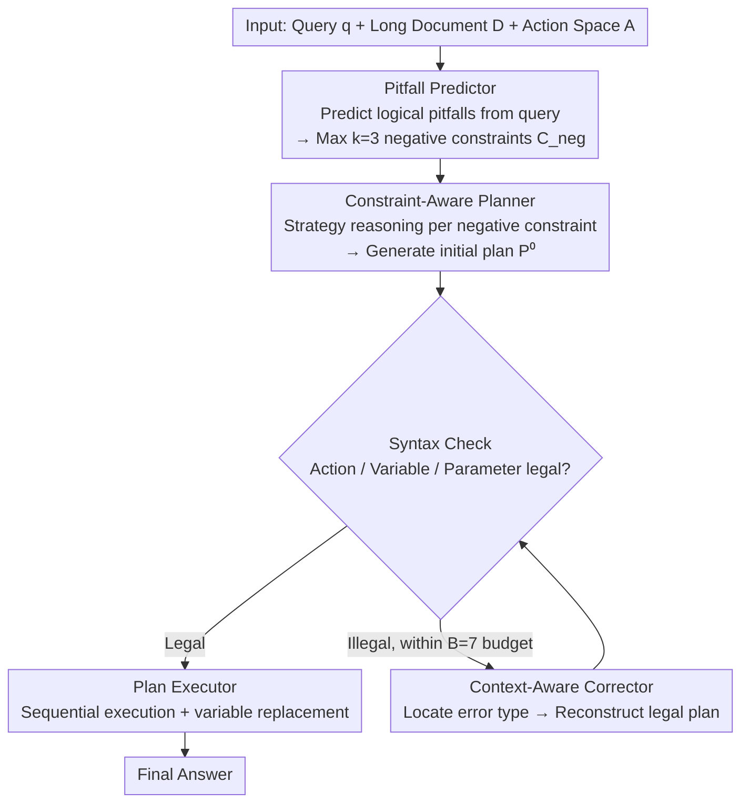

# PPA-Plan: Proactive Pitfall Avoidance for Reliable Planning in Long-Context LLM Reasoning

**Conference**: ACL2026  
**arXiv**: [2601.11908](https://arxiv.org/abs/2601.11908)  
**Code**: Public repository address not provided in the paper cache  
**Area**: LLM Efficiency  
**Keywords**: Long-Context Reasoning, Plan Generation, Negative Constraints, Proactive Pitfall Avoidance, Plan-and-Execute

## TL;DR
PPA-Plan predicts potential logical pitfalls before generating planning for long-context reasoning and converts these pitfalls into negative constraints to restrict the planner. This prevents LLMs from following superficial keyword matching and incorrect assumption paths, improving accuracy and NLI scores while significantly reducing plan execution failure rates across multiple long-context QA datasets.

## Background & Motivation
**Background**: LLM context windows are becoming longer, but long-context reasoning is more than just "fitting more text." In tasks like QuALITY, ConditionalQA, LongReason, and Qasper, key evidence is often scattered across distant locations mixed with irrelevant information. Models need to integrate across paragraphs and avoid positional bias and superficial matching.

**Limitations of Prior Work**: Plan-and-Execute methods improve performance on complex tasks by generating a plan first and then executing it step-by-step. However, the plans themselves are often unreliable: LLM planners easily form incorrect assumptions based on keywords or local cues. Once a plan is written, the executor follows that wrong track. While reactive refinement like PEARL corrects plans after the fact, models tend to anchor to their prior outputs and are reluctant to overturn incorrect premises entirely.

**Key Challenge**: Long-context reasoning requires explicit plans to organize steps, but the earlier a plan is formed, the easier incorrect assumptions become solidified. Instead of post-hoc correction, it is better to remind the model before plan generation about "which seemingly natural reasoning paths are actually dangerous."

**Goal**: The authors aim to design a proactive pitfall avoidance planning strategy that allows the planner to identify potential logical pitfalls, incorrect premises, and scope confusion before writing the plan, explicitly avoiding these risks while ensuring the plan format remains executable.

**Key Insight**: PPA-Plan formulates error prevention as negative constraints. It does not tell the model what it *should* do to answer; instead, it tells the model which reasoning patterns *cannot* be used—for example, do not assume a character performed an action just because their name appears, do not force a specific date search when no date tags exist, and do not extend the scope of the question to unasked objects.

**Core Idea**: Predicting "what mistakes not to make" via a Pitfall Predictor before allowing the Planner to perform strategy reasoning and action selection around these negative constraints is more reliable than repairing plans after generation.

## Method

### Overall Architecture
PPA-Plan addresses the chronic issue of plan-and-execute in long-context QA: once a plan is wrong, it leads the executor astray. It chains three planning modules with one execution module—Pitfall Predictor, Constraint-Aware Planner, Context-Aware Corrector, and Plan Executor. The Mechanism is to "mark the paths that cannot be taken before writing the plan."

Specifically, the input is a query `q`, a long document `D`, and a PEARL-style action space `A`. The Pitfall Predictor first looks almost exclusively at the query (without reading the full text) to predict potential pitfalls, outputting at most $k=3$ negative constraints $C_{neg}=\{c_1,\dots,c_k\}$. The Planner then performs strategy reasoning under the conditions of `q`, `A`, and `C_{neg}` before generating the initial plan $P^{(0)}$, using syntax checks to confirm if actions, variables, and parameters are executable. If the plan is invalid, the Corrector uses the current invalid plan and error messages to re-reason and fix it within a budget of $B=7$, outputting $P^{(t)}$. Finally, the Executor parses plan steps sequentially, merging actions, parameters, and the long document into execution prompts, storing intermediate variables, and replacing dependencies to obtain the final answer.

### Key Designs

**1. Pitfall Predictor and Negative Constraint Generation: Marking pitfalls that induce incorrect reasoning before writing the plan.**

In long-context scenarios, errors often occur not because the model cannot understand the text, but because it approaches it with an incorrect goal—such as assuming a character performed an action simply because their name appears. The Predictor targets this "preconception": it acts as both an exam designer and a logic analyst, using few-shot prompts to critically examine implicit premises in the question. it specifically identifies patterns like shallow semantic matching, scope confusion, counting traps, and multi-hop evidence integration risks, then outputs up to $k$ negative constraints in structured JSON. This step explicitly writes out "paths not to take," serving as a prior brake before the planner starts, rather than waiting for incorrect assumptions to solidify in the plan.

**2. Constraint-Aware Planner's Strategy Reasoning: Translating "what not to do" into executable action sequences.**

Simply telling a model "do not do X" often leaves it confused or leads it to ignore the prohibition. The key for the Planner is not to output the plan directly but to perform Strategy Reasoning first: analyzing step-by-step what each negative constraint implies, which evidence collection, reasoning, and verification actions should be used to bypass risks. It then selects actions like FIND_ELEMENT, FIND_DETAILS, INFER, SUMMARIZE_X, and EVALUATE from the predefined action space to assemble a functional plan (allowing auxiliary actions if necessary). Thus, negative constraints transform from passive prohibitions into proactive task decomposition and evidence strategies, providing the model with a clear alternative path.

**3. Context-Aware Corrector and Lightweight Execution: Separating syntax repair from logical planning to preserve complex, high-quality plans.**

Smater planners are more likely to write complex plans that are logically sound but syntactically non-compliant. If the same prompt manages both logic and syntax, the model often sacrifices reasoning structure for the sake of format. The Corrector looks only at the current invalid plan and error messages without long history (reducing noise from stale information). It also performs Strategy Reasoning, mapping error types like unknown actions, undefined variables, or incorrect parameter counts to corresponding repair operations to reconstruct a legal plan. The execution stage is deliberately lightweight: since all evidence for long-context QA is already in the input document without needing multi-round searches, the executor only needs to extract, reason, and summarize according to the plan.

### A Complete Example: Avoiding a "Character-Action" Trap
Consider a typical long-context QA example: the question asks "Did character X perform action Y?" while the name X appears many times in the text. The Pitfall Predictor first outputs 3 negative constraints—do not assume X performed Y just because X's name appears, do not force a search for specific dates when no date tags exist, and do not extend the scope to unasked objects. Upon receiving these, the Planner performs Strategy Reasoning: since conclusions cannot be drawn from the name alone, it must first FIND_ELEMENT to locate all passages mentioning X, then FIND_DETAILS to extract X's actual behaviors in those passages, then INFER whether these constitute Y, and finally EVALUATE to verify if the evidence truly supports the conclusion. If the generated initial plan has an undefined variable (e.g., referencing an unassigned intermediate result), the Corrector identifies this error within its $B=7$ budget and reorders the steps to fix dependencies, outputting a legal plan. The Executor runs the steps sequentially, final answer supported by evidence—without falling into the trap of "concluding upon seeing the name."

### Loss & Training
PPA-Plan is a training-free method with no parameter updates. Experiments use GPT-4o-mini, Llama-3.1-8B-Instruct, and Qwen-2.5-14B-Instruct; Llama/Qwen use 8-bit quantization to save memory. All generation uses greedy decoding with temperature 0. The number of negative constraints is $k=3$, and the plan correction budget is $B=7$. For evaluation, free-text answers for multiple-choice questions are mapped back to options using a GPT-4o judge; free QA uses token-level recall and DeBERTa-V3-Large-based NLI entailment scores.

## Key Experimental Results

### Main Results
PPA-Plan overall outperforms baselines such as GQA, CoT, Plan-and-Solve, ReAct, and PEARL across three base models. The NLI score improvement is particularly significant, indicating that generated answers do not just contain more tokens but are logically stronger.

| Base model | Method | Overall Acc↑ | Overall Rec↑ | Overall NLI↑ | Main Conclusion |
|------------|------|--------------|--------------|--------------|----------|
| GPT-4o-mini | CoT | 74.5 | 61.3 | 42.0 | Accuracy is fair, but logical consistency is lacking |
| GPT-4o-mini | PEARL | 70.8 | 60.6 | 53.6 | Reactive planning improves NLI |
| GPT-4o-mini | PPA-Plan | 74.1 | 62.6 | 55.8 | Better NLI and recall compared to PEARL |
| Llama-3.1-8B | CoT | 68.7 | 54.1 | 30.6 | Weak logic in smaller model CoT |
| Llama-3.1-8B | PEARL | 68.1 | 58.1 | 68.9 | PEARL helps NLI significantly |
| Llama-3.1-8B | PPA-Plan | 72.6 | 61.2 | 70.0 | Acc +4.5, Rec +3.1 |
| Qwen-2.5-14B | PEARL | 71.4 | 57.7 | 51.6 | Planning baseline is stable but limited |
| Qwen-2.5-14B | PPA-Plan | 77.1 | 61.1 | 54.9 | Highest overall accuracy in the group |

The paper emphasizes that compared to CoT, PPA-Plan improves overall NLI for GPT-4o-mini by 13.8 points and for Qwen-2.5-14B by 20.2 points; on Llama, it more than doubles from 30.6 to 70.0. This suggests that negative constraints directly improve reasoning validity.

| Dataset/Model | PPA-Plan Key Performance | Observed Comparison |
|-------------|------------------|----------|
| QuALITY, GPT-4o-mini | Acc 73.4, Rec 54.0, NLI 41.0 | Higher than PEARL's Acc 70.3, NLI 38.1 |
| ConditionalQA, Llama | Acc 79.1, NLI 75.9 | NLI on par with PEARL, but higher overall |
| LongReason, Qwen | Acc 72.3, Rec 66.3, NLI 68.9 | Significantly outperforms PEARL Acc 60.1 in long reasoning |
| Qasper, GPT-4o-mini | Rec 67.1, NLI 61.8 | 10.7 points higher than PEARL NLI 51.1 |

### Ablation Study
Ablations on LongReason directly verify the contribution of the three modules. The full model is best for both GPT-4o-mini and Qwen; removing the Corrector causes syntax errors in complex plans to significantly impact results; without the Pitfall Predictor, the planner struggles to discover logical traps independently.

| Model | Configuration | Acc↑ | Rec↑ | NLI↑ | Description |
|------|------|------|------|------|------|
| GPT-4o-mini | Full PPA-Plan | 60.9 | 61.9 | 65.6 | Complete 3 modules is optimal |
| GPT-4o-mini | w/o Corrector | 47.5 | 48.8 | 51.4 | Complex plans but many format errors |
| GPT-4o-mini | Predictor + Vanilla Planner | 53.1 | 54.8 | 60.9 | Neg. constraints help, but lack strategic planning |
| GPT-4o-mini | Vanilla Planner only | 37.7 | 42.7 | 48.9 | Lowest performance without proactive avoidance |
| Qwen-2.5-14B | Full PPA-Plan | 59.8 | 57.0 | 60.4 | Full configuration is optimal |
| Qwen-2.5-14B | w/o Corrector | 50.6 | 47.2 | 50.5 | Corrector is critical for stable execution |
| Qwen-2.5-14B | Predictor + Vanilla Planner | 48.5 | 43.7 | 53.0 | Constraints alone insufficient for good plans |
| Qwen-2.5-14B | Vanilla Planner only | 40.9 | 42.2 | 47.5 | Prone to superficial paths without constraints |

Execution failure rate analysis even more intuitively illustrates the value of the Corrector and constrained planning. PPA-Plan is lower than PEARL across all models and datasets, with GPT-4o-mini on Qasper dropping from 45.9% to 1.0%.

| Model | Dataset | PEARL Failure Rate↓ | PPA-Plan Failure Rate↓ | Reduction |
|------|--------|---------------|------------------|------|
| GPT-4o-mini | QuALITY | 27.4% | 3.1% | -24.3 |
| GPT-4o-mini | Qasper | 45.9% | 1.0% | -44.9 |
| Llama-3.1-8B | Cond.QA | 60.0% | 22.8% | -37.2 |
| Llama-3.1-8B | Qasper | 65.6% | 23.2% | -42.4 |
| Qwen-2.5-14B | LongReason | 30.7% | 14.0% | -16.7 |
| Qwen-2.5-14B | Qasper | 38.2% | 11.2% | -27.0 |

### Key Findings
- Negative constraints shift the planner from simple extraction to deeper reasoning actions. Average plan steps in LongReason increased from 4.47 to 5.73, and in Qasper from 2.98 to 4.43.
- High-level actions such as INFER, SUMMARIZE_X, EVALUATE, and EXPLAIN_PROCESS appear more frequently, indicating the model is proactively verifying and integrating information.
- Negative constraints are not perfect: of 300 Qwen negative constraints, 31.89% were judged ungrounded and 21.93% harmful; however, accuracy remained at 64.58% under invalid constraints compared to 71.22% under valid ones (69.10% overall), showing the framework's robustness to noise.
- The gains of PPA-Plan are not due to more tokens. On LongReason 16k, PPA-Plan averaged 7275.11 tokens while PEARL used 8206.84 tokens; PPA-Plan is actually more token-efficient overall.

## Highlights & Insights
- "Thinking about what mistakes not to make first" is a very practical planning perspective. Many long-context failures stem from incorrect premises; once written into a plan, they are hard to fix later. PPA-Plan shifts error prevention to before plan generation.
- Negative constraints are more specific than general critiques. Instead of vaguely telling the model to be careful, it converts risks into action planning constraints, forcing the planner to find alternative evidence paths.
- The value of the Corrector is clear: high-quality plans are often more complex and prone to syntax non-compliance. Separating "logical planning" and "format repair" into two modules is more stable than having one prompt handle both simultaneously.
- The paper is honest about negative constraint noise. Structural hallucinations and over-thinking are prevalent, but the system maintains performance, suggesting negative constraints act more as structural cues than absolute ground-truth supervision.

## Limitations & Future Work
- The Corrector assumes the model can at least generate a basically coherent plan; if a small model struggle to output stable function formats and variable dependencies, the correction module will also struggle.
- The Pitfall Predictor predicts traps based solely on the query, making it liable to generate conservative constraints not supported by the context. In the paper's statistics, structural hallucination reached 63.3% and over-thinking 48.0%, making this the area most in need of improvement.
- PPA-Plan inherits PEARL's efficiency issues: long context and multi-step plans repeatedly enter the prompt, so reasoning speed remains slow. Although total tokens are fewer than PEARL, multiple calls bring latency.
- Negative constraints lack an independent validator. Future work could include a constraint verifier to judge whether constraints are truly relevant to the document or question before passing them to the planner.
- The method is primarily validated on long-context QA; whether it transfers to dynamic environments like real tool use, web retrieval, or multi-document research requires further experimentation.

## Related Work & Insights
- **vs PEARL**: PEARL relies on post-hoc plan refinement; PPA-Plan predicts pitfalls and constrains generation beforehand, reducing the solidification of incorrect assumptions.
- **vs CoT / Plan-and-Solve**: CoT and Plan-and-Solve emphasize decomposition and explanation but do not explicitly model "forbidden paths"; PPA-Plan treats avoiding erroneous paths as a first-stage goal.
- **vs ReAct**: ReAct is suitable for interactive action but may fail in long-context QA due to action selection and context noise; PPA-Plan's action sequences are more pre-planned, reducing the cost of multi-round exploration.
- **Insights for Agent Planning**: For search agents, code agents, or data analysis agents, task-specific negative constraints can be generated before formal actions—e.g., do not overwrite user files, do not use unverified data, and do not equate correlation with causation.

## Rating
- Novelty: ⭐⭐⭐⭐☆ Proactively predicting logical pitfalls and converting them into negative constraints is a concise idea that addresses a core pain point in plan-and-execute.
- Experimental Thoroughness: ⭐⭐⭐⭐⭐ Well-covered with main experiments, component ablations, failure rates, constraint quality, token efficiency, and alternative evaluation protocols.
- Writing Quality: ⭐⭐⭐⭐☆ Method modules are clear and tables are comprehensive; some descriptions of the action space and formulas rely slightly on PEARL's background.
- Value: ⭐⭐⭐⭐☆ Highly practical for long-context reasoning planning, especially for tasks requiring reliable plans that are easily misled by superficial cues.

<!-- RELATED:START -->

## Related Papers

- [\[ACL 2026\] Long-Context Reasoning Through Proxy-Based Chain-of-Thought Tuning](long-context_reasoning_through_proxy-based_chain-of-thought_tuning.md)
- [\[ACL 2026\] DELTA: Dynamic Layer-Aware Token Attention for Efficient Long-Context Reasoning](delta_dynamic_layer-aware_token_attention_for_efficient_long-context_reasoning.md)
- [\[ICLR 2026\] InftyThink: Breaking the Length Limits of Long-Context Reasoning in Large Language Models](../../ICLR2026/llm_reasoning/inftythink_breaking_the_length_limits_of_long-context_reasoning_in_large_languag.md)
- [\[ICLR 2026\] From Assumptions to Actions: Turning LLM Reasoning into Uncertainty-Aware Planning](../../ICLR2026/llm_reasoning/from_assumptions_to_actions_turning_llm_reasoning_into_uncertainty-aware_plannin.md)
- [\[ACL 2026\] Evo-Attacker: Memory-Augmented Reinforcement Learning for Long-Horizon Tool Attacks on LLM-MAS](evo-attacker_memory-augmented_reinforcement_learning_for_long-horizon_tool_attac.md)

<!-- RELATED:END -->
