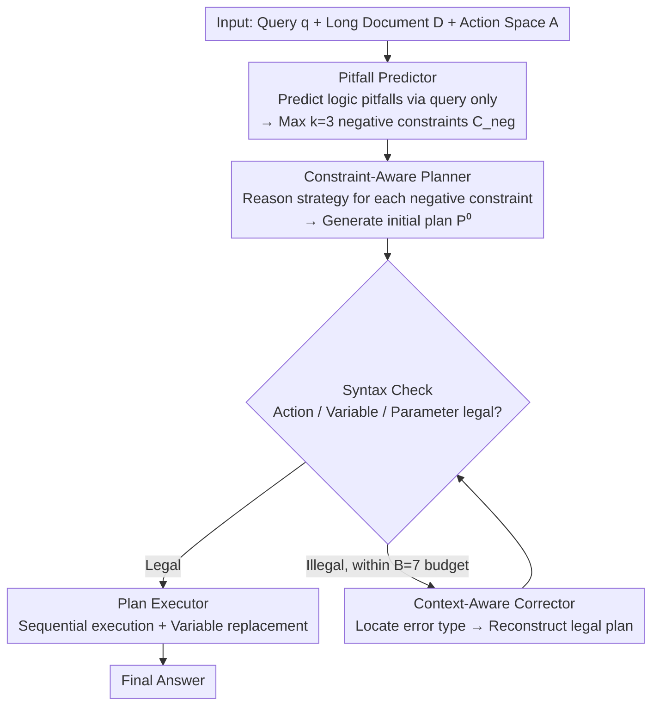

# PPA-Plan: Proactive Pitfall Avoidance for Reliable Planning in Long-Context LLM Reasoning

**Conference**: ACL2026  
**arXiv**: [2601.11908](https://arxiv.org/abs/2601.11908)  
**Code**: Public repository address not provided in the paper cache  
**Area**: LLM Efficiency  
**Keywords**: Long-context reasoning, plan generation, negative constraints, proactive pitfall avoidance, Plan-and-Execute

## TL;DR
PPA-Plan predicts potential logical pitfalls before generating reasoning plans for long contexts and converts these pitfalls into negative constraints to guide the planner. This allows LLMs to avoid superficial keyword matching and incorrect assumption paths, improving accuracy and NLI scores while significantly reducing plan execution failure rates across multiple long-context QA datasets.

## Background & Motivation
**Background**: While LLM context windows are expanding, long-context reasoning involves more than just "fitting more text." In tasks like QuALITY, ConditionalQA, LongReason, and Qasper, key evidence is often scattered across distant locations mixed with irrelevant information. Models must integrate information across paragraphs while avoiding position bias and surface-level matching.

**Limitations of Prior Work**: Plan-and-Execute methods enhance performance on complex tasks by generating a plan before execution. However, the plans themselves are often unreliable: LLM planners easily form incorrect assumptions based on keywords or local cues. Once a plan is generated, the executor follows the erroneous trajectory. Reactive refinement methods like PEARL attempt to correct plans post-hoc, but models tend to anchor to their previous outputs and are reluctant to overturn incorrect premises.

**Key Challenge**: Long-context reasoning requires explicit plans to organize steps, but the earlier a plan is formed, the easier it is for incorrect assumptions to become solidified. Rather than correcting errors post-hoc, it is more effective to remind the model "which seemingly natural reasoning paths are actually dangerous" before plan generation.

**Goal**: The authors aim to design a proactive pitfall avoidance planning strategy that identifies potential logical traps, false premises, and scope confusion before the planner writes the plan. This ensures the model explicitly avoids these risks while maintaining executable plan formats.

**Key Insight**: PPA-Plan formulates error prevention as negative constraints. Instead of telling the model how to answer, it informs the model which reasoning patterns to avoid—for example, not assuming a character performed an action simply because their name appears, or not forcing a specific date when no date markers are present.

**Core Idea**: Reliable reasoning is achieved by having a Pitfall Predictor predict "what mistakes not to make" before the Planner performs strategic reasoning and action selection around these negative constraints. This is more effective than patching a plan after generation.

## Method

### Overall Architecture
PPA-Plan addresses the chronic issue in plan-and-execute for long-context QA: once a plan is incorrect, it leads the executor astray. It links three planning modules with an execution module—Pitfall Predictor, Constraint-Aware Planner, Context-Aware Corrector, and Plan Executor. The **Mechanism** is to "mark the paths that cannot be taken before writing the plan."

Specifically, inputs consist of a query $q$, a long document $D$, and a PEARL-style action space $A$. First, the Pitfall Predictor predicts potential traps by looking almost exclusively at the query, outputting at most $k=3$ negative constraints $C_{neg}=\{c_1,\dots,c_k\}$. The Planner then performs strategic reasoning under the conditions of $q$, $A$, and $C_{neg}$ to generate an initial plan $P^{(0)}$, followed by a syntax check to verify if actions, variables, and parameters are executable. If the plan is invalid, the Corrector uses the invalid plan and error messages to re-reason and repair within a budget of $B=7$ attempts to output $P^{(t)}$. Finally, the Executor parses the plan steps sequentially, integrates actions and parameters into execution prompts, stores intermediate variables, and replaces dependencies to obtain the final answer.

### Key Designs

**1. Pitfall Predictor and Negative Constraint Generation: Marking pitfalls before writing the plan.**

Errors in long-context tasks often stem from models approaching the text with an incorrect goal rather than failing to understand it. The Predictor targets this "preconception" by acting as both an exam designer and a logic analyst. Using few-shot prompts, it critically examines implicit premises in the question, identifying patterns like shallow semantic matching, scope confusion, counting traps, and multi-hop integration risks. It outputs up to $k$ negative constraints in structured JSON. This step explicitly defines "roads not to take," serving as a prior brake before the planner begins, rather than relying on post-hoc remedies.

**2. Strategic Reasoning of the Constraint-Aware Planner: Translating "what not to do" into "what to do."**

Models often feel lost or ignore instructions when only told "do not do X." The key for the Planner is to perform Strategy Reasoning instead of directly outputting a plan. It analyzes each negative constraint to determine what it implies, which evidence collection actions to use, and how to verify actions to bypass risks. It then selects actions like FIND_ELEMENT, FIND_DETAILS, INFER, SUMMARIZE_X, and EVALUATE from the predefined space to assemble a functional plan. This transforms negative constraints into positive task decomposition strategies.

**3. Context-Aware Corrector and Lightweight Execution: Decoupling syntax repair from logical planning.**

Smarter planners are more likely to write complex plans with beautiful logic but non-compliant formats. If the same prompt handles both logic and syntax, the model often sacrifices reasoning for formatting. The Corrector focuses only on the current invalid plan and error message without looking at long history to reduce noise. It maps error types (e.g., unknown actions, undefined variables) to repair operations to reconstruct a legal plan. The execution phase is kept lightweight, as evidence for long-context QA is already in the input document; the executor simply extracts, reasons, and aggregates per the plan.

### A Complete Example: Avoiding a "Character-Action" Trap
Consider a typical long-context QA: "Did Character X perform Action Y?" where X's name appears multiple times. The Pitfall Predictor first outputs 3 negative constraints: do not assume X performed Y just because X is mentioned; do not force a specific date without date markers; do not expand the scope to unasked subjects. The Planner receives these and performs Strategy Reasoning: since conclusions cannot be drawn from the name alone, it must first FIND_ELEMENT to locate all segments mentioning X, then FIND_DETAILS to extract X's actual behaviors, then INFER if they constitute Y, and finally EVALUATE if the evidence truly supports the conclusion. If the initial plan has an undefined variable, the Corrector locates the error within $B=7$ attempts and reorders steps. Finally, the Executor provides an evidence-based answer without falling into the "concluding upon seeing the name" trap.

### Loss & Training
PPA-Plan is a training-free method with no parameter updates. Experiments utilize GPT-4o-mini, Llama-3.1-8B-Instruct, and Qwen-2.5-14B-Instruct, with Llama and Qwen using 8-bit quantization. All generation uses greedy decoding (temperature 0). The number of negative constraints is $k=3$, and the correction budget is $B=7$. For evaluation, multiple-choice questions are mapped to options via a GPT-4o judge; free-form QA uses token-level recall and DeBERTa-V3-Large based NLI entailment scores.

## Key Experimental Results

### Main Results
PPA-Plan overall outperforms baselines such as GQA, CoT, Plan-and-Solve, ReAct, and PEARL across the three base models. Significant improvements in NLI scores indicate that the generated answers are not just longer but more logically entailed.

| Base model | Method | Overall Acc↑ | Overall Rec↑ | Overall NLI↑ | Key Observations |
|------------|------|--------------|--------------|--------------|----------|
| GPT-4o-mini | CoT | 74.5 | 61.3 | 42.0 | Decent accuracy, but lacks consistency |
| GPT-4o-mini | PEARL | 70.8 | 60.6 | 53.6 | Reactive planning improves NLI |
| GPT-4o-mini | PPA-Plan | 74.1 | 62.6 | 55.8 | Better NLI and recall than PEARL |
| Llama-3.1-8B | CoT | 68.7 | 54.1 | 30.6 | Weak logic in small model CoT |
| Llama-3.1-8B | PEARL | 68.1 | 58.1 | 68.9 | PEARL significantly helps NLI |
| Llama-3.1-8B | PPA-Plan | 72.6 | 61.2 | 70.0 | Gain: Acc +4.5, Rec +3.1 |
| Qwen-2.5-14B | PEARL | 71.4 | 57.7 | 51.6 | Planning baseline is stable but limited |
| Qwen-2.5-14B | PPA-Plan | 77.1 | 61.1 | 54.9 | Highest overall accuracy in group |

The paper emphasizes that compared to CoT, PPA-Plan improves overall NLI for GPT-4o-mini by 13.8 points and for Qwen-2.5-14B by 20.2 points. On Llama, NLI increases from 30.6 to 70.0, more than doubling. This suggests negative constraints directly improve reasoning validity.

| Dataset / Model | PPA-Plan Key Performance | Comparative Observation |
|-------------|------------------|----------|
| QuALITY, GPT-4o-mini | Acc 73.4, Rec 54.0, NLI 41.0 | Higher than PEARL (Acc 70.3, NLI 38.1) |
| ConditionalQA, Llama | Acc 79.1, NLI 75.9 | Comparable NLI to PEARL, but higher overall |
| LongReason, Qwen | Acc 72.3, Rec 66.3, NLI 68.9 | Significantly better than PEARL (Acc 60.1) |
| Qasper, GPT-4o-mini | Rec 67.1, NLI 61.8 | NLI is 10.7 higher than PEARL (51.1) |

### Ablation Study
Ablations on LongReason verify the contributions of the three modules. The full model performs best on both GPT-4o-mini and Qwen. Removing the Corrector causes complex plans to fail due to syntax errors. Removing the Pitfall Predictor makes it difficult for the planner to independently identify logical traps.

| Model | Configuration | Acc↑ | Rec↑ | NLI↑ | Description |
|------|------|------|------|------|------|
| GPT-4o-mini | Full PPA-Plan | 60.9 | 61.9 | 65.6 | Complete 3-module setup is best |
| GPT-4o-mini | w/o Corrector | 47.5 | 48.8 | 51.4 | Complex plans but many format errors |
| GPT-4o-mini | Predictor + Vanilla Planner | 53.1 | 54.8 | 60.9 | Constraints help, lacks strategic planner |
| GPT-4o-mini | Vanilla Planner only | 37.7 | 42.7 | 48.9 | Lowest performance without avoidance |
| Qwen-2.5-14B | Full PPA-Plan | 59.8 | 57.0 | 60.4 | Full configuration is best |
| Qwen-2.5-14B | w/o Corrector | 50.6 | 47.2 | 50.5 | Corrector is key for stable execution |
| Qwen-2.5-14B | Predictor + Vanilla Planner | 48.5 | 43.7 | 53.0 | Constraints alone insufficient for plans |
| Qwen-2.5-14B | Vanilla Planner only | 40.9 | 42.2 | 47.5 | Easily takes superficial paths |

Execution failure analysis highlights the value of the Corrector and constrained planning. PPA-Plan failure rates are consistently lower than PEARL across all models and datasets; for GPT-4o-mini on Qasper, it dropped from 45.9% to 1.0%.

| Model | Dataset | PEARL Failure Rate↓ | PPA-Plan Failure Rate↓ | Gain |
|------|--------|---------------|------------------|------|
| GPT-4o-mini | QuALITY | 27.4% | 3.1% | -24.3 |
| GPT-4o-mini | Qasper | 45.9% | 1.0% | -44.9 |
| Llama-3.1-8B | Cond.QA | 60.0% | 22.8% | -37.2 |
| Llama-3.1-8B | Qasper | 65.6% | 23.2% | -42.4 |
| Qwen-2.5-14B | LongReason | 30.7% | 14.0% | -16.7 |
| Qwen-2.5-14B | Qasper | 38.2% | 11.2% | -27.0 |

### Key Findings
- Negative constraints shift the planner from simple extraction to deeper reasoning actions. In LongReason, average plan steps increased from 4.47 to 5.73, and in Qasper, from 2.98 to 4.43.
- High-level actions like INFER, SUMMARIZE_X, EVALUATE, and EXPLAIN_PROCESS appear more frequently, indicating proactive verification.
- Negative constraints are not perfect: among 300 Qwen constraints, 31.89% were ungrounded and 21.93% were harmful; however, accuracy remained at 64.58% under invalid constraints compared to 71.22% for valid ones, showing the framework's robustness to noise.
- The benefits are not due to more tokens. In LongReason 16k, PPA-Plan averaged 7275.11 tokens, while PEARL used 8206.84 tokens, making PPA-Plan more token-efficient overall.

## Highlights & Insights
- "Thinking about what mistakes not to make" is a practical planning perspective. Many failures in long-context tasks come from incorrect premises that are hard to fix post-hoc; PPA-Plan moves error prevention to the pre-planning stage.
- Negative constraints are more specific than general critiques. They transform risks into action planning constraints, forcing the planner to find alternative evidence paths.
- The value of the Corrector is clear: high-quality plans are often more complex and prone to formatting errors. Decoupling logic planning and syntax repair into two modules is more stable than asking a single prompt to do both.
- The analysis of negative constraint noise is honest. Despite a high ratio of structural hallucinations and over-thinking, the system maintains performance, suggesting these constraints serve more as structural cues than absolute labels.

## Limitations & Future Work
- The Corrector assumes the model can generate a basically coherent plan; if a small model fails to output function formats and variable dependencies stably, the correction module will struggle.
- The Pitfall Predictor predicts traps based solely on the query, leading to conservative constraints not supported by context. Structural hallucinations reached 63.3% and over-thinking 48.0% in the stats, representing areas for improvement.
- PPA-Plan inherits efficiency issues from PEARL: repeated entry of long context and multi-step plans into prompts still results in slow inference. While total tokens are fewer than PEARL, multiple calls lead to latency.
- There is a lack of independent verification for negative constraints. Future work could include a constraint verifier to judge relevance before passing them to the planner.
- The method is validated primarily on long-context QA. Whether it can transfer to dynamic environments like tool use, web retrieval, or multi-document research requires further experimentation.

## Related Work & Insights
- **vs PEARL**: PEARL relies on post-hoc refinement, whereas PPA-Plan predicts pitfalls before planning to reduce the solidification of incorrect assumptions.
- **vs CoT / Plan-and-Solve**: These emphasize decomposition and explanation but do not explicitly model "forbidden paths." PPA-Plan sets avoiding prohibited paths as a first-stage goal.
- **vs ReAct**: ReAct is suitable for interactive actions but may fail in long-context QA due to action selection and context noise; PPA-Plan's action sequences are more pre-planned, reducing multi-round exploration costs.
- **Insights for Agent Planning**: For search, code, or data analysis agents, task-specific negative constraints can be generated before action—e.g., do not overwrite user files, do not use unverified data, do not mistake correlation for causation.

## Rating
- Novelty: ⭐⭐⭐⭐☆ Proactively predicting logic pitfalls and converting them into negative constraints is a simple idea that addresses a core pain point of plan-and-execute.
- Experimental Thoroughness: ⭐⭐⭐⭐⭐ Well-covered main experiments, component ablations, failure rates, constraint quality, token efficiency, and alternative evaluation protocols.
- Writing Quality: ⭐⭐⭐⭐☆ Clear methodology and sufficient tables; some descriptions of formulas and action spaces depend slightly on PEARL background.
- Value: ⭐⭐⭐⭐☆ Highly practical for long-context reasoning planning, especially for tasks requiring reliable plans that are easily misled by surface cues.

<!-- RELATED:START -->

## Related Papers

- [\[ACL 2026\] Long-Context Reasoning Through Proxy-Based Chain-of-Thought Tuning](long-context_reasoning_through_proxy-based_chain-of-thought_tuning.md)
- [\[ICLR 2026\] PERK: Long-Context Reasoning as Parameter-Efficient Test-Time Learning](../../ICLR2026/llm_reasoning/perk_long-context_reasoning_as_parameter-efficient_test-time_learning.md)
- [\[ACL 2026\] DELTA: Dynamic Layer-Aware Token Attention for Efficient Long-Context Reasoning](delta_dynamic_layer-aware_token_attention_for_efficient_long-context_reasoning.md)
- [\[ICLR 2026\] InftyThink: Breaking the Length Limits of Long-Context Reasoning in Large Language Models](../../ICLR2026/llm_reasoning/inftythink_breaking_the_length_limits_of_long-context_reasoning_in_large_languag.md)
- [\[ICLR 2026\] Plan-Answer-Refine-on-Graph: Structured Planning and Self-Refinement for Large Language Model Reasoning on Knowledge Graphs](../../ICLR2026/llm_reasoning/plan-answer-refine-on-graph_structured_planning_and_self-refinement_for_large_la.md)

<!-- RELATED:END -->
