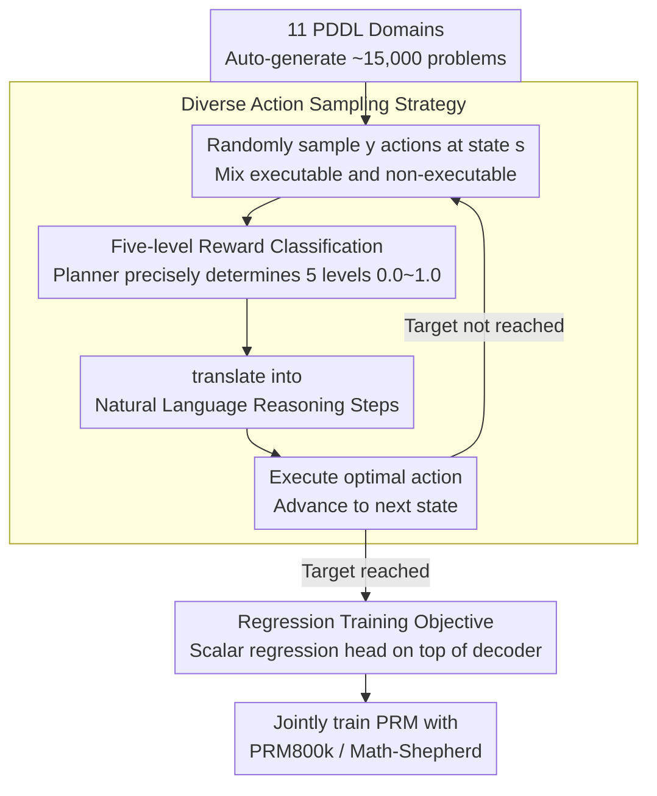

# Process Reward Models Meet Planning: Generating Precise and Scalable Datasets for Step-Level Rewards

**Conference**: ACL 2026  
**arXiv**: [2604.17957](https://arxiv.org/abs/2604.17957)  
**Code**: [https://github.com/Babelscape/prm-meets-planning/](https://github.com/Babelscape/prm-meets-planning/)  
**Area**: LLM Reasoning  
**Keywords**: Process Reward Models, PDDL, Planning Tasks, Step-level Rewards, Reasoning Evaluation

## TL;DR
This paper proposes utilizing Planning Domain Definition Language (PDDL) to automatically generate large-scale, high-precision step-level reward datasets for training Process Reward Models (PRM), achieving significant improvements across both mathematical and non-mathematical reasoning benchmarks.

## Background & Motivation

**Background**: Process Reward Models (PRM) have become essential tools for evaluating the reasoning quality of Large Language Models. By providing reward feedback for each step in a Chain-of-Thought (CoT), PRMs can detect errors in intermediate reasoning steps—even if the final answer is correct, the logical path may still be flawed.

**Limitations of Prior Work**: Existing PRM training datasets suffer from three core issues. First, PRM800k relies on human annotation, which is expensive and difficult to scale, with inter-annotator agreement required at only 75%, implying potential errors in up to 25% of labels. Second, while Math-Shepherd employs automatic annotation (estimating step quality via multiple LLM completions), it incurs extremely high computational costs and only provides coarse-grained binary labels. Third, nearly all existing datasets are confined to the mathematical domain, lacking coverage of broader logical reasoning.

**Key Challenge**: High-quality step-level reward data requires precise labels and broad domain coverage, yet human annotation is costly and unreliable, while automatic methods (like LLM sampling) lack precision and diversity.

**Goal**: Design a scalable, high-precision, cross-domain automatic generation framework for PRM datasets.

**Key Insight**: The authors observe that planning problems inherently possess logical reasoning structures—each planning action corresponds to a reasoning step, and the correctness of an action can be precisely determined by rules (executability, optimality, or leading to a dead-end). This structural property makes PDDL an ideal source for generating precise step-level rewards.

**Core Idea**: Convert PDDL planning problems into natural language reasoning chains and utilize planners to automatically and accurately assign five-level rewards (0.0–1.0) to each step, thereby constructing large-scale, high-quality PRM training data.

## Method

### Overall Architecture
The workflow is divided into three stages: (1) PDDL Problem Generation: Automatically generate approximately 15,000 planning problems across 11 different PDDL domains; (2) Dataset Construction: Perform random action sampling and optimal action calculation for each step of every problem, assigning precise five-level rewards to each action; (3) PRM Training: Combine the PDDL-generated data with existing datasets (PRM800k or Math-Shepherd) to train the PRM.

### Key Designs

**1. Five-level Reward Classification System: Using planners to precisely categorize each reasoning step into five grades rather than simple binary labels**

Existing datasets are either binary (Correct/Incorrect) or use 3-level systems, providing supervision signals that are too coarse to distinguish between "completely wrong," "not entirely wrong but suboptimal," and "optimal." This paper precisely categorizes each action into five grades with corresponding continuous reward values: Non-executable (0.0) → Dead-end (0.25) → Backtracking (0.5) → Suboptimal (0.75) → Optimal (1.0). Judgments are not made by humans or LLMs but are precisely determined by external planners (Fast Downward + A* + LM-Cut) based on rules. The "Backtracking" and "Suboptimal" intermediate categories are particularly valuable as they characterize the "grey areas" common in real reasoning that are otherwise difficult to label.

**2. Diverse Action Sampling Strategy (Algorithm 1): Generating both good and bad actions at the same state to allow the PRM to learn via comparison**

To enable the PRM to distinguish quality, the data must contain both positive and negative samples, preferably as contrasts within the same context. The algorithm proceeds as follows: at each state $s$, it first randomly samples $y$ actions (intentionally mixing executable and non-executable ones), evaluates each action via `eval_action` to one of the five grades, and uses `translate` to convert them into natural language reasoning steps. Then, it executes the optimal action to transition to the next state, repeating the cycle until the goal is reached. This process ensures that every step in the reasoning chain is accompanied by a set of "same-context, different-quality" contrastive samples, allowing the PRM to see direct comparisons rather than isolated instances.

**3. Regression Training Objective: Continuous five-level rewards are naturally suited for regression rather than classification**

Since the PDDL data provides continuous reward values from 0.0 to 1.0, forcing them into "Correct/Incorrect" classification labels would lose this precision. This paper adds a scalar regression head directly on top of the decoder to predict continuous reward values step-by-step. Experiments confirm that the regression objective outperforms classification on most benchmarks, with particularly significant gaps on difficult benchmarks like OlympiadBench and Omni-MATH.

### Loss & Training
A head-based architecture is employed, adding a regression head to the top of the decoder to predict scalar rewards. During training, PDDL2PRM data is mixed with PRM800k or Math-Shepherd—PDDL data provides precise reasoning signals, while existing datasets provide more natural reasoning expression patterns.

## Key Experimental Results

### Main Results (ProcessBench Benchmark)

| Model | GSM8K F1 | MATH F1 | OlympiadBench F1 | Omni-MATH F1 | Avg F1 |
|------|----------|---------|-------------------|--------------|---------|
| Qwen2.5-Math-7B-PRM800k | 68.2 | 62.6 | 50.7 | 44.3 | 56.5 |
| +PDDL (Regression) | **77.3** | **70.1** | **52.4** | **51.6** | **62.9** |
| Llama-3.1-8B-PRM800k | 61.1 | 51.3 | 36.5 | 38.6 | 46.9 |
| +PDDL (Regression) | **71.4** | **54.6** | 34.2 | 36.8 | **49.3** |

### Ablation Study

| Configuration | Avg F1 | Description |
|------|---------|------|
| Qwen2.5-Math-PRM800k+PDDL (Regression) | 62.9 | Full Model |
| Qwen2.5-Math-PRM800k (Regression) | 60.6 | Drop of 2.3 without PDDL data |
| Qwen2.5-Math-PRM800k (Classification) | 57.2 | Classification objective 3.4 lower than regression |
| Qwen2.5-Math-MathShepherd+PDDL (Regression) | 34.2 | Gain also observed on Math-Shepherd baseline |

### Key Findings
- Adding PDDL data consistently improves PRM performance across all benchmarks, with average F1 increases of 2.4–6.4 percentage points.
- The regression training objective outperforms classification in most cases, especially on difficult benchmarks (OlympiadBench, Omni-MATH).
- Improvements from PDDL data are even more significant in non-mathematical reasoning tasks (the Rooms domain, used as a held-out test set, verified cross-domain generalization).
- The dataset comprises approximately 1 million reasoning steps across 11 PDDL domains; the generation process is entirely CPU-based and requires no GPUs.

## Highlights & Insights
- **Planning tasks as a source of reasoning supervision**: The idea is ingenious—the formal nature of PDDL allows step-level rewards to be determined precisely by rules, completely avoiding the uncertainty of human annotation and LLM sampling. This approach could be extended to other formal tasks with verifiable intermediate steps.
- **Five-level Reward Classification System**: This is much more aligned with the actual quality distribution of reasoning steps than simple binary labels. The "Backtracking" and "Suboptimal" categories are particularly valuable as they represent "not quite wrong but not good enough" reasoning.
- The generation of PDDL data requires no GPUs and is highly parallelizable, making it far superior to LLM sampling methods in terms of cost efficiency.

## Limitations & Future Work
- The natural language reasoning chains generated from PDDL are template-based, lacking the fluency and diversity of real CoT, and thus serve as augmentation data rather than independent training sets.
- Only 11 planning domains have been verified; more complex PDDL domains might generate excessively long reasoning chains exceeding the PRM's processing capacity.
- The paper does not explore the effects of combining PDDL data with larger scale PRMs (e.g., 70B models).
- Future work could consider finer-grained reward hierarchies or using planning heuristic functions to provide continuous reward values rather than discrete five-level grades.

## Related Work & Insights
- **vs. PRM800k**: PRM800k depends on human annotation ($\$25/hr$), while this method generates data automatically at zero cost with higher label precision (rule-based vs. 75% human consistency).
- **vs. Math-Shepherd**: Math-Shepherd estimates step quality through multiple LLM samplings, which is computationally expensive and yields only binary labels; this method provides five-level precise rewards directly via a planner.
- **vs. VersaPRM**: VersaPRM also attempts to extend to non-math domains but still relies on LLMs as judges, introducing potential annotation noise.

## Rating
- Novelty: ⭐⭐⭐⭐⭐ Using PDDL planning problems for PRM data generation is a highly novel and elegant idea.
- Experimental Thoroughness: ⭐⭐⭐⭐ Experiments across multiple models and benchmarks are relatively complete, but large-scale model verification is missing.
- Writing Quality: ⭐⭐⭐⭐ Clear structure and formal rigor, though the methodology section contains many symbols.
- Value: ⭐⭐⭐⭐ Provides a low-cost, high-precision paradigm for PRM data generation with significant practical utility.

<!-- RELATED:START -->

## Related Papers

- [\[ACL 2026\] C2: Scalable Rubric-Augmented Reward Modeling from Binary Preferences](c2_scalable_rubric-augmented_reward_modeling_from_binary_preferences.md)
- [\[ICLR 2026\] Let's Explore Step by Step: Generating Provable Formal Statements with Deductive Exploration](../../ICLR2026/llm_reasoning/lets_explore_step_by_step_generating_provable_formal_statements_with_deductive_e.md)
- [\[ACL 2026\] Stabilizing Efficient Reasoning with Step-Level Advantage Selection](stabilizing_efficient_reasoning_with_step-level_advantage_selection.md)
- [\[ACL 2026\] HISR: Hindsight Information Modulated Segmental Process Rewards for Multi-turn Agentic Reinforcement Learning](hisr_hindsight_information_modulated_segmental_process_rewards_for_multi-turn_ag.md)
- [\[ICLR 2026\] Agentic Reinforcement Learning with Implicit Step Rewards](../../ICLR2026/llm_reasoning/agentic_reinforcement_learning_with_implicit_step_rewards.md)

<!-- RELATED:END -->
