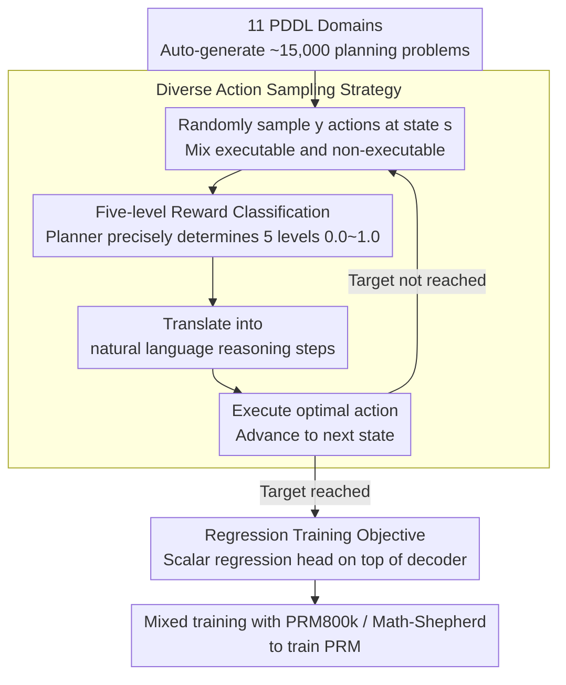

# Process Reward Models Meet Planning: Generating Precise and Scalable Datasets for Step-Level Rewards

**Conference**: ACL 2026  
**arXiv**: [2604.17957](https://arxiv.org/abs/2604.17957)  
**Code**: [https://github.com/Babelscape/prm-meets-planning/](https://github.com/Babelscape/prm-meets-planning/)  
**Area**: LLM Reasoning  
**Keywords**: Process Reward Models, PDDL, Planning problems, step-level rewards, reasoning evaluation

## TL;DR
This paper proposes utilizing Planning Domain Definition Language (PDDL) to automatically generate large-scale, high-precision step-level reward datasets for training Process Reward Models (PRMs), achieving significant improvements on both mathematical and non-mathematical reasoning benchmarks.

## Background & Motivation

**Background**: Process Reward Models (PRMs) have become essential tools for evaluating the quality of Large Language Model (LLM) reasoning. By providing reward feedback for each step in a Chain-of-Thought (CoT), PRMs can detect errors in intermediate reasoning steps—even if the final answer is correct, logical flaws may still exist in the intermediate process.

**Limitations of Prior Work**: Existing PRM training datasets face three core issues. First, PRM800k relies on human annotation, which is costly, difficult to scale, and has an inter-annotator agreement rate of only 75%, meaning up to 25% of labels may be incorrect. Second, while Math-Shepherd employs automatic labeling (estimating step quality via multiple LLM completions), the computational cost is extremely high, and it only provides coarse-grained binary labels. Third, almost all existing datasets are limited to the mathematical domain, lacking coverage for broader logical reasoning.

**Key Challenge**: High-quality step-level reward data requires precise labeling and broad domain coverage, but human annotation is expensive and unreliable, while automated methods like LLM sampling lack precision and diversity.

**Goal**: Design a scalable, high-precision, cross-domain framework for the automatic generation of PRM datasets.

**Key Insight**: The authors observe that planning problems inherently possess a structured logical reasoning format—each planning action corresponds to a reasoning step, and the correctness of an action can be precisely determined via rules (e.g., executability, optimality, or leading to a dead-end). This structured property makes PDDL an ideal source for generating precise step-level rewards.

**Core Idea**: Convert PDDL planning problems into natural language reasoning chains and utilize a planner to automatically and accurately assign five-level rewards (0.0–1.0) to each step, thereby constructing large-scale, high-quality PRM training data.

## Method

### Overall Architecture
The workflow is divided into three stages: (1) PDDL Problem Generation: Automatically generate approximately 15,000 planning problems across 11 different PDDL domains; (2) Dataset Construction: Perform random action sampling and optimal action calculation at each step for every problem, assigning precise five-level rewards; (3) PRM Training: Combine the PDDL-generated data with existing datasets (PRM800k or Math-Shepherd) to train the PRM.

### Key Designs

**1. Five-level Reward Classification System: Using a planner to precisely categorize each reasoning step into five levels, rather than crude binary labels.**

Existing datasets are often binary (correct/wrong) or three-level, which provides signals that are too coarse to distinguish between "completely wrong," "correct but suboptimal," and "optimal." This paper categorizes each action into five levels with corresponding rewards: Non-executable (0.0) → Dead-end (0.25) → Backtracking (0.5) → Suboptimal (0.75) → Optimal (1.0). Judgments do not rely on humans or LLM intuition but are precisely determined by an external planner (Fast Downward + A* + LM-Cut) based on rules. The "backtracking" and "suboptimal" intermediate levels are particularly valuable as they characterize the common "grey areas" in real reasoning that are hardest to label.

**2. Diverse Action Sampling Strategy (Algorithm 1): Generating both good and bad actions at the same state to teach the PRM comparative quality.**

To enable the PRM to distinguish quality, the data must contain both positive and negative samples, preferably within the same context. The strategy is as follows: at each state $s$, $y$ actions are randomly sampled (intentionally mixing executable and non-executable ones). Each action is categorized into one of the five levels via eval_action and translated into natural language reasoning steps. The optimal action is then executed to move to the next state, repeating until the goal is reached. This ensures every step in the reasoning chain is accompanied by a set of "same-state, different-quality" contrastive samples.

**3. Regression Training Objective: Continuous rewards are naturally suited for regression rather than classification.**

Since the PDDL data provides continuous reward values (0.0–1.0), forcing them into binary classification categories loses precision. This paper directly adds a scalar regression head on top of the decoder to predict continuous reward values. Experiments confirm that the regression objective outperforms classification on most benchmarks, with the gap being particularly significant on difficult benchmarks like OlympiadBench and Omni-MATH.

### Loss & Training
A head-based architecture is used, with a regression head added to the top of the decoder to predict scalar rewards. During training, PDDL2PRM data is mixed with PRM800k or Math-Shepherd—PDDL data provides precise reasoning signals, while existing datasets provide more natural reasoning expression patterns.

## Key Experimental Results

### Main Results (ProcessBench Benchmark)

| Model | GSM8K F1 | MATH F1 | OlympiadBench F1 | Omni-MATH F1 | Average F1 |
|------|----------|---------|-------------------|--------------|---------|
| Qwen2.5-Math-7B-PRM800k | 68.2 | 62.6 | 50.7 | 44.3 | 56.5 |
| +PDDL (Regression) | **77.3** | **70.1** | **52.4** | **51.6** | **62.9** |
| Llama-3.1-8B-PRM800k | 61.1 | 51.3 | 36.5 | 38.6 | 46.9 |
| +PDDL (Regression) | **71.4** | **54.6** | 34.2 | 36.8 | **49.3** |

### Ablation Study

| Configuration | Average F1 | Description |
|------|---------|------|
| Qwen2.5-Math-PRM800k+PDDL (Regression) | 62.9 | Full Model |
| Qwen2.5-Math-PRM800k (Regression) | 60.6 | Drop of 2.3 after removing PDDL |
| Qwen2.5-Math-PRM800k (Classification) | 57.2 | Classification objective is 3.4 lower than regression |
| Qwen2.5-Math-MathShepherd+PDDL (Regression) | 34.2 | Gain also observed on Math-Shepherd baseline |

### Key Findings
- Adding PDDL data consistently improves PRM performance across all benchmarks, with average F1 increasing by 2.4–6.4 percentage points.
- The regression training objective outperforms classification in most scenarios, especially on difficult benchmarks (OlympiadBench, Omni-MATH).
- Improvements from PDDL data are more significant in non-mathematical reasoning tasks (the Rooms domain as a held-out test domain verified cross-domain generalization).
- The dataset contains approximately 1 million reasoning steps across 11 PDDL domains, with the generation process being entirely CPU-based, requiring no GPUs.

## Highlights & Insights
- The **Key Insight** of using planning problems as a source of reasoning supervision is ingenious—the formal nature of PDDL allows step-level rewards to be precisely determined via rules, avoiding the uncertainty of human or LLM labels. This approach can be generalized to other formal tasks with verifiable intermediate steps.
- The **Five-level Reward Classification System** better reflects the actual quality distribution of reasoning steps than simple binary labels. The "backtracking" and "suboptimal" categories are particularly valuable as they represent the "partially correct but not optimal" reasoning common in real-world scenarios.
- PDDL data generation requires zero GPU resources and is highly parallelizable, offering superior cost-efficiency compared to LLM sampling methods.

## Limitations & Future Work
- Natural language reasoning chains generated from PDDL are template-based and lack the fluency and diversity of real-world CoTs; thus, they serve as augmentation rather than a complete replacement.
- Only 11 planning domains have been verified so far; more complex PDDL domains might generate excessively long reasoning chains that exceed current PRM capacities.
- The effect of combining PDDL data with larger models (e.g., 70B) has not yet been explored.
- Future work could design finer-grained reward hierarchies or utilize planning heuristic functions to provide continuous reward values.

## Related Work & Insights
- **vs PRM800k**: PRM800k relies on human annotation ($25/hr), whereas the proposed method automatically generates data at zero cost with higher precision (rule-based vs 75% human agreement).
- **vs Math-Shepherd**: Math-Shepherd estimates step quality through multiple LLM samples, which is computationally expensive and provides only binary labels; this work provides five-level precise rewards directly via a planner.
- **vs VersaPRM**: VersaPRM also attempts to expand to non-mathematical domains but still relies on LLMs as judges, which introduces annotation noise.

## Rating
- Novelty: ⭐⭐⭐⭐⭐ Using PDDL planning for PRM data generation is a highly novel and elegant idea.
- Experimental Thoroughness: ⭐⭐⭐⭐ Experiments across multiple models and benchmarks are comprehensive, though missing validation on the largest models.
- Writing Quality: ⭐⭐⭐⭐ The structure is clear and formalization is rigorous, although the methodology section contains many symbols.
- Value: ⭐⭐⭐⭐ Provides a low-cost, high-precision PRM data generation paradigm with significant practical utility.

<!-- RELATED:START -->

## Related Papers

- [\[ACL 2026\] Efficient Process Reward Modeling via Contrastive Mutual Information](efficient_process_reward_modeling_via_contrastive_mutual_information.md)
- [\[ACL 2026\] C2: Scalable Rubric-Augmented Reward Modeling from Binary Preferences](c2_scalable_rubric-augmented_reward_modeling_from_binary_preferences.md)
- [\[CVPR 2026\] Improving Vision-language Models with Perception-centric Process Reward Models](../../CVPR2026/llm_reasoning/improving_vision-language_models_with_perception-centric_process_reward_models.md)
- [\[ACL 2026\] Stabilizing Efficient Reasoning with Step-Level Advantage Selection](stabilizing_efficient_reasoning_with_step-level_advantage_selection.md)
- [\[ACL 2026\] HISR: Hindsight Information Modulated Segmental Process Rewards for Multi-turn Agentic Reinforcement Learning](hisr_hindsight_information_modulated_segmental_process_rewards_for_multi-turn_ag.md)

<!-- RELATED:END -->
