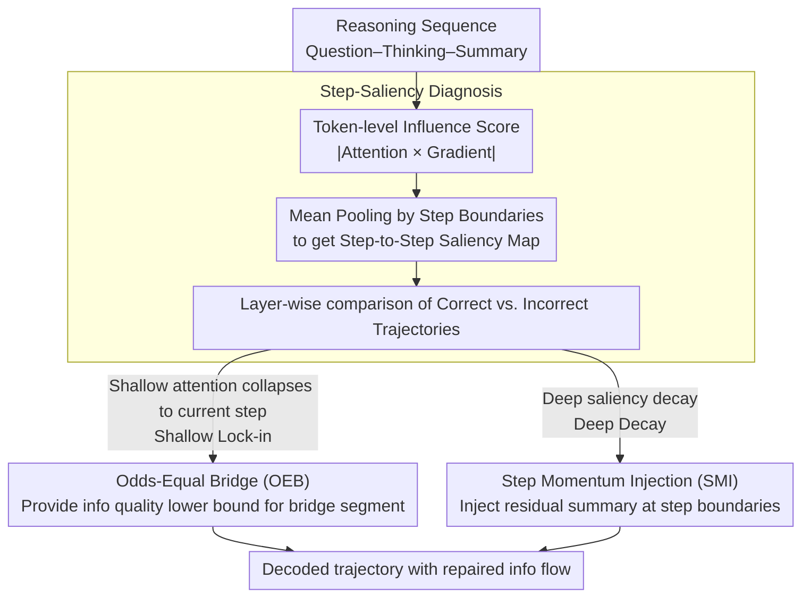

# Reasoning Fails Where Step Flow Breaks

**Conference**: ACL 2026  
**arXiv**: [2604.06695](https://arxiv.org/abs/2604.06695)  
**Code**: [GitHub](https://github.com/XiaoyuXu-Vincent/step-saliency)  
**Area**: Interpretability  
**Keywords**: Reasoning Model Interpretability, Information Flow Analysis, Test-time Intervention, Attention Mechanism, Chain-of-Thought

## TL;DR
This work proposes Step-Saliency, a diagnostic tool discovered two depth-related information flow failure modes (Shallow Lock-in and Deep Decay) in Large Reasoning Models (LRMs), and designs StepFlow, a test-time intervention method that repairs information propagation and improves reasoning accuracy without retraining.

## Background & Motivation

**Background** Large Reasoning Models (LRMs) have achieved excellent performance on mathematics, science, and coding tasks by generating long Chain-of-Thought (CoT) sequences, but their behavior remains unstable and difficult to explain. Existing analysis tools mostly operate at the token level, which results in dense and noisy signals when facing long reasoning trajectories, making it difficult to summarize dependencies between steps.

**Limitations of Prior Work** Current interpretability methods fall into two categories: attention analysis and gradient saliency analysis. Attention weights do not necessarily faithfully reflect prediction drivers; while gradient saliency is closer to the actual computation of the model, it is noisy over long sequences and difficult to aggregate across positions. The core problem is not a lack of signals, but a lack of readable units aligned with reasoning steps.

**Key Challenge** When a model fails, it is impossible to attribute the final error to a specific step in the internal reasoning trajectory—token-level saliency maps are too dense to visually reveal breaks in the information flow between steps.

**Goal** To design a step-level diagnostic tool capable of tracking the influence relationships between steps across different network depths and to design test-time interventions to repair information flow based on diagnostic results.

**Key Insight** Aggregate token-level attention-gradient influence scores into step-level units via mean pooling to form a compact step-to-step saliency map, then analyze the differences between correct and incorrect reasoning trajectories layer by layer.

**Core Idea** The root cause of incorrect reasoning lies in information flow disruption—shallow layers focus excessively on the current step (Shallow Lock-in), while deep layers gradually lose attention to thought segments (Deep Decay). These information flow defects can be repaired by applying targeted interventions in the shallow and deep layers respectively.

## Method

### Overall Architecture
Step-Saliency is a diagnostic tool, and StepFlow is an intervention method based on the diagnosis. The overall pipeline is: (1) segment the reasoning sequence into three parts: question, thinking, and summary; (2) calculate token-level attention-gradient influence scores and pool them into a step-to-step map; (3) analyze saliency patterns layer by layer to identify Shallow Lock-in and Deep Decay; (4) repair the information flow during decoding using two components: OEB and SMI.

### Key Designs

**1. Step-Saliency Diagnosis: Pooling token-level saliency into step-level influence maps, providing readable analysis units for long reasoning chains.**

The biggest obstacle to attribution in long reasoning trajectories is not the lack of signal, but that token-level saliency maps are too dense and noisy to identify inter-step dependencies. Step-Saliency calculates "attention × gradient" influence scores—taking the absolute value of the product of attention weights and their gradients per head per layer and averaging them:

$$I^{(\ell)}_{t\leftarrow k} = \frac{1}{H}\sum_h \left| A^{(\ell,h)}_{t,k} \cdot \frac{\partial \mathcal{L}_t}{\partial A^{(\ell,h)}_{t,k}}\right|$$

Then, mean pooling is applied to this dense map based on reasoning step boundaries to obtain a compact step-to-step influence matrix. Pooling suppresses token-level noise and explicitly displays cross-step dependency patterns, allowing layer-wise comparison between correct and incorrect trajectories—a prerequisite for discovering Shallow Lock-in and Deep Decay.

**2. Odds-Equal Bridge (OEB) — Shallow intervention: Preventing shallow layers' attention from collapsing entirely onto the current step.**

Diagnosis reveals that incorrect trajectories in shallow layers concentrate almost all attention on the current step and its neighbors, ignoring the question and early reasoning steps—this is Shallow Lock-in. OEB addresses this by splitting keys into three blocks: the current segment $\mathcal{S}$, the bridge segment $\mathcal{B}$ (early context), and others $\mathcal{O}$. It sets a lower bound for attention quality on the bridge segment $\tau_\mathcal{B} = \min\!\big(\sqrt{|\mathcal{B}|/(|\mathcal{B}|+|\mathcal{S}|)},\,\tau_{\max}\big)$. If the actual attention quality of the bridge segment falls below this bound, logits are adjusted via KL projection to restore the share. This ensures early context is not ignored by shallow layers without crudely overstepping the original attention distribution.

**3. Step Momentum Injection (SMI) — Deep intervention: Injecting a residual summary of the previous step at step boundaries to catch decaying information flow.**

The failure mode in deep layers is Deep Decay—the saliency of the thinking segment decays rapidly, and the summary increasingly focuses only on itself, causing the link from early reasoning to the conclusion to break. SMI calculates a step-level momentum vector $\mathbf{m}_{\text{prev}} = \frac{1}{|\Gamma_i|}\sum_{k\in\Gamma_i}\mathbf{v}_k$ at the boundary between adjacent steps $\Gamma_i$ and $\Gamma_{i+1}$, then injects it into the hidden state of the first token of the next step: $\mathbf{h}'_t = \mathbf{h}_t + \alpha\,\mathbf{m}_{\text{prev}}$. This leaves a small amount of "inertia" from the previous step at each transition, carrying early reasoning information forward to the summary and preventing deep layers from losing it.

### Loss & Training
StepFlow is a pure test-time intervention and **requires no training or backpropagation**. It modifies forward propagation during a single decoding pass: OEB acts on attention logits in shallow layers, and SMI acts on the residual stream in deep layers. Only $\tau_{\max}$ and $\alpha$ need to be tuned on a small validation set for each model.

## Key Experimental Results

### Main Results

| Model + Method | AIME24 | AIME25 | MATH-500 | GPQA-D | LiveCodeBench |
|------------|--------|--------|----------|--------|---------------|
| R1-Distill-7B baseline | 54.0 | 39.2 | 92.8 | 49.1 | 37.6 |
| R1-Distill-7B + Ours | 62.5 | 43.8 | 93.8 | 57.6 | 47.1 |
| R1-Distill-32B baseline | 72.6 | 54.9 | 94.3 | 62.1 | 57.2 |
| R1-Distill-32B + Ours | 74.5 | **66.7** | 95.6 | 64.5 | 63.0 |
| GPT-OSS-20B medium baseline | 63.4 | 62.0 | 89.2 | 65.2 | 70.0 |
| GPT-OSS-20B medium + Ours | 66.0 | 69.2 | 90.5 | 70.3 | **79.5** |

### Ablation Study

| Configuration | AIME25 | GPQA-D | LiveCodeBench | Description |
|------|--------|--------|---------------|------|
| Baseline | 62.0 | 65.2 | 70.0 | GPT-OSS-20B medium |
| + OEB only | 64.5 | 66.7 | 74.5 | Fixes shallow lock-in |
| + SMI only | 64.0 | 67.2 | 75.0 | Fixes deep decay |
| + OEB + SMI (StepFlow) | **69.2** | **70.3** | **79.5** | Best complementary effect |

### Key Findings
- StepFlow shows the greatest improvement on competition-level math problems (R1-32B +11.8 on AIME25) because these problems require information propagation across multiple steps.
- Breakdown by difficulty on LiveCodeBench: Easy +3.4, Medium +13.8, Hard +14.2; effectiveness increases with difficulty.
- Among corrected error types, arithmetic carry propagation (34%) and forgotten premises (38%) account for 72%, while conceptual errors are rarely fixed.
- Under matched computation (~1.35x), StepFlow's gain is 5.7x that of extending generation length; achieving StepFlow's accuracy requires 8-way self-consistency (8x computation).

## Highlights & Insights
- Elevating token-level analysis to the step level is a key innovation, making the analysis of long reasoning trajectories feasible and intuitive.
- The diagnostic-intervention paradigm is elegant: use Step-Saliency to identify problems (Shallow Lock-in / Deep Decay), then use OEB / SMI for precise repairs.
- No retraining required; pure inference-time intervention applicable to any open-source LRM with high practicality.
- Computational overhead is only about 1.35x, far superior to multi-path sampling and voting.

## Limitations & Future Work
- The boundary between shallow and deep layers needs to be adjusted on a small validation set, lacking a fully automatic method for layer range selection.
- The intervention design space is not fully explored (e.g., head-level steering or value-space projections).
- The causal relationship between Shallow Lock-in / Deep Decay and final errors remains heuristic and not strictly proven.
- Effective only for open-source LRMs; cannot be applied to black-box API models.

## Related Work & Insights
- Complementary to attention-level interventions (e.g., Yan et al.), which preserve CoT context at the attention level.
- Can be combined orthogonally with self-consistency; StepFlow + SC(k=2) outperforms SC(k=4) with approximately 2.7x vs. 4x computation.
- The Step-Saliency framework can be extended to information flow analysis for other long-sequence generation tasks (e.g., long-form writing, multi-turn dialogue).

## Rating
- Novelty: ⭐⭐⭐⭐⭐ Step-level saliency + diagnostic-driven intervention is a brand-new paradigm.
- Experimental Thoroughness: ⭐⭐⭐⭐⭐ 6 benchmarks, 5 backbones, detailed ablation, and computation-normalized comparisons.
- Writing Quality: ⭐⭐⭐⭐⭐ Clear logical chain from diagnosis to intervention, well-designed charts.
- Value: ⭐⭐⭐⭐⭐ Direct practical value for understanding and improving reasoning models, ready to use.

<!-- RELATED:START -->

## Related Papers

- [\[ACL 2026\] LLM Reasoning as Trajectories: Step-Specific Representation Geometry and Correctness Signals](llm_reasoning_as_trajectories_step-specific_representation_geometry_and_correctn.md)
- [\[ACL 2026\] How Chain-of-Thought Works? Tracing Information Flow from Decoding, Projection, and Activation](how_chain-of-thought_works_tracing_information_flow_from_decoding_projection_and.md)
- [\[ICLR 2026\] Reasoning Scaffolding: Distilling the Flow of Thought from LLMs](../../ICLR2026/llm_reasoning/reasoning_scaffolding_distilling_the_flow_of_thought_from_llms.md)
- [\[ICML 2026\] The Deterministic Horizon: When Extended Reasoning Fails and Tool Delegation Becomes Necessary](../../ICML2026/llm_reasoning/the_deterministic_horizon_when_extended_reasoning_fails_and_tool_delegation_beco.md)
- [\[ICLR 2026\] Where Did This Sentence Come From? Tracing Provenance in LLM Reasoning Distillation](../../ICLR2026/llm_reasoning/where_did_this_sentence_come_from_tracing_provenance_in_llm_reasoning_distillati.md)

<!-- RELATED:END -->
