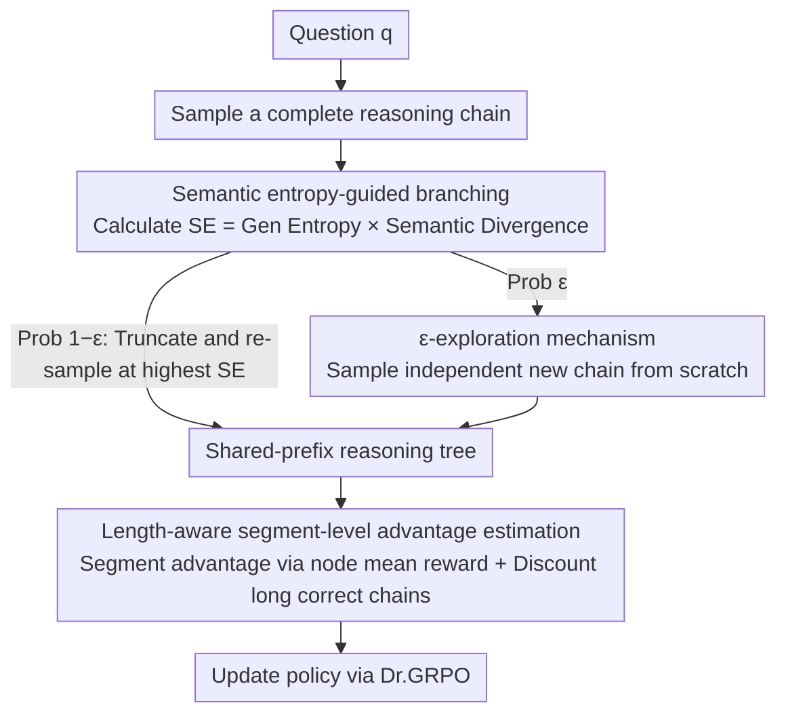

# Reinforced Efficient Reasoning via Semantically Diverse Exploration

**Conference**: ACL 2026  
**arXiv**: [2601.05053](https://arxiv.org/abs/2601.05053)  
**Code**: [https://github.com/ZiqiZhao1/ROSE-rl](https://github.com/ZiqiZhao1/ROSE-rl)  
**Area**: Model Compression / Efficient Inference  
**Keywords**: MCTS, Semantic Entropy, GRPO, Efficient Inference, Branching Strategy

## TL;DR

ROSE proposes a semantic entropy-guided MCTS branching strategy and length-aware segment-level advantage estimation. This addresses insufficient exploration diversity and low inference efficiency in existing MCTS-based RLVR methods, achieving state-of-the-art pass@8 performance across multiple mathematical reasoning benchmarks.

## Background & Motivation

**Background**: RLVR (Reinforcement Learning with Verifiable Rewards) has become a mainstream method for enhancing LLM reasoning capabilities. GRPO and its variants optimize policies by sampling multiple independent reasoning chains and using binary rewards. MCTS-based methods further introduce tree-structured reasoning, allowing different chains to share prefixes for more granular segment-level credit assignment.

**Limitations of Prior Work**: (1) Insufficient exploration diversity—existing methods use generation entropy to determine branch points, but high generation entropy does not necessarily correspond to semantic divergence. Figure 1 shows that "can" and "need" differ significantly in generation entropy but are semantically equivalent, leading to identical reasoning paths after branching; (2) Low inference efficiency—existing MCTS methods fail to handle "overthinking," as correct but verbose reasoning chains receive the same reward as concise ones.

**Key Challenge**: Generation entropy measures token-level lexical uncertainty, but many high-entropy choices in language generation are semantically equivalent (synonyms, functional word variants). This causes branching strategies to produce reasoning paths that are superficially different but essentially identical.

**Goal**: (1) Design a branching strategy capable of generating truly semantically diverse reasoning paths; (2) Encourage more efficient reasoning while maintaining or improving performance.

**Key Insight**: Measure semantic differences between candidate tokens using cosine similarity of token embeddings. Multiply this with generation entropy to obtain "semantic entropy," ensuring branch points possess both high uncertainty and high semantic divergence.

**Core Idea**: Replace generation entropy with semantic entropy (= generation entropy × semantic divergence) for branch point selection. Combine this with $\varepsilon$-exploration to prevent localized searching and use length-aware calibration to penalize verbose correct chains, achieving "more diverse + more efficient" reasoning exploration.

## Method

### Overall Architecture

ROSE addresses two persistent issues in MCTS-based RLVR: branching that is "numerous but not truly diverse" and the lack of penalties for verbose correct reasoning. An exploration round proceeds as follows: given a question $q$, a complete reasoning chain is sampled. The semantic entropy is calculated per position. The chain is truncated at the position with the highest semantic entropy to re-sample downwards, growing a shared-prefix reasoning tree. To prevent the tree from clustering, a new chain is sampled independently from scratch with a certain probability during each expansion. Once the tree is built, node values and segment-level advantage estimations are computed. Verbose correct chains are discounted based on length, and the data is fed into Dr.GRPO to update the policy.

### Key Designs

**1. Semantic Entropy-Guided Branching: Forcing branches toward truly different semantics instead of synonym replacement**

Existing methods (e.g., FR3E) use generation entropy to select branch points. However, high generation entropy only indicates uncertainty in token selection, not divergence in meaning. ROSE adds a semantic dimension: for position $k$, the top-20 high-probability tokens $\mathcal{V}_k$ are taken, and the semantic divergence among candidates is calculated using LLM embeddings:

$$SD_k = -\sum_{v_i, v_j} p(v_i)\, p(v_j) \cdot \cos\langle \mathbf{e}_{v_i}, \mathbf{e}_{v_j} \rangle,$$

This is multiplied by generation entropy $\mathcal{H}_k$ to get semantic entropy $SE_k = SD_k \cdot \mathcal{H}_k$. This multiplicative approach ensures that $SE_k$ is high only when the step is both uncertain and semantically divergent, naturally placing branch points at critical junctions that change reasoning trajectories. Computational overhead is minimal, requiring only embedding lookups and cosine similarity.

**2. $\varepsilon$-Exploration Mechanism: Preventing the tree from sticking to existing paths**

Relying solely on branching presents a risk: all new chains are truncated and re-sampled from existing reasoning, potentially anchoring the search in the neighborhood of the first chain. Borrowing from $\varepsilon$-greedy in classic RL, ROSE samples a completely independent reasoning chain with probability $\varepsilon$ (default 0.5) when expanding, and uses semantic entropy branching otherwise. This provides independent starting points and balances exploration depth (refining good prefixes) with breadth (new starting points).

**3. Length-aware Segment-level Advantage Estimation: Penalizing verbose chains via fine-grained credit assignment**

The tree structure enables segment-level credit assignment: the node value $\hat{V}(b_j)$ is the average reward of all chains passing through that node. The difference between adjacent nodes defines the segment advantage $\hat{A}_{i,t} = \hat{V}(b_j) - \hat{V}(b_{j-1})$. To distinguish length, ROSE utilizes the tree to compare correct chains branching from the same node. For correct reasoning paths longer than the shortest correct path, advantages are discounted based on the length ratio:

$$\hat{A}_{i,t} \leftarrow \hat{A}_{i,t} - |\hat{A}_{i,t}| \cdot \Big(1 - \tfrac{|o_s| - b_c}{|o_c| - b_c}\Big)^{\alpha},$$

where $|o_s|$ and $|o_c|$ are the lengths of the current and shortest correct chains, and $b_c$ is the branching position. This maintains granular credit assignment while actively penalizing "verbose correctness," guiding the model toward concise reasoning.

### Loss & Training

The Dr.GRPO objective function is used (excluding variance and length normalization). Batch size 512, 8 reasoning chains per question (G=8), learning rate $1 \times 10^{-6}$, clip ratio 0.2, KL coefficient 0.001, maximum 8 epochs. Training data consists of 7,500 MATH problems. $\varepsilon=0.5$, $\alpha$ searched in {0.5, 1, 2, 3}. 8×A800 GPUs.

## Key Experimental Results

### Main Results (pass@8)

| Model | Method | AIME24 | AIME25 | MATH500 | AMC23 | Avg. |
|------|------|--------|--------|---------|-------|------|
| Qwen3-4B | GRPO | 16.67 | 20.00 | 79.80 | 77.50 | 48.49 |
| Qwen3-4B | FR3E | 16.67 | 13.33 | 80.00 | 75.00 | 47.92 |
| Qwen3-4B | **ROSE** | **23.33** | **23.33** | 80.80 | **77.50** | **51.24** |
| Qwen3-8B | GRPO | 23.33 | 23.33 | 79.40 | 72.50 | 49.64 |
| Qwen3-8B | **ROSE** | **33.33** | **30.00** | 83.00 | **80.00** | **55.75** |
| Llama-3.2-3B | GRPO | 16.67 | 3.33 | 53.40 | 40.00 | 28.35 |
| Llama-3.2-3B | **ROSE** | **20.00** | **6.67** | **55.00** | **45.00** | **31.67** |

### Ablation Study

| Branching Strategy | AIME24 | AIME25 | Avg. |
|---------|--------|--------|------|
| Gen Entropy (FR3E) | 16.67 | 6.67 | 30.26 |
| Semantic Divergence | 20.00 | 6.67 | - |
| **Semantic Entropy (ROSE)** | **20.00** | **6.67** | **31.67** |

### Key Findings

- ROSE shows the largest gain on difficult tasks (AIME24/25) (+6.67), indicating that semantically diverse exploration is more valuable for complex problems.
- On Qwen3-8B, ROSE improves the average by +4.65 (vs. GRPO), the highest among all methods.
- TreePO improves significantly on in-domain data (MATH500) but generalizes poorly out-of-domain, suggesting fixed-length branching lacks adaptability.
- Length-aware calibration reduces reasoning chain length without degrading performance.
- Effectiveness on Llama models (+2.86) rules out interference from Qwen data leakage.

## Highlights & Insights

- The design of Semantic Entropy = Generation Entropy × Semantic Divergence is simple and elegant. Using cosine similarity of token embeddings to measure semantic difference incurs minimal overhead but effectively distinguishes "lexical uncertainty" from "semantic uncertainty."
- $\varepsilon$-exploration introduces classic RL exploration into MCTS branching, which is simple but critical for preventing the search from becoming anchored to existing paths.
- Length-aware calibration cleverly exploits the tree structure: reasoning chains branching from the same point can be compared fairly regarding length.

## Limitations & Future Work

- Evaluated only on mathematical reasoning; code generation and logical reasoning scenarios remain to be verified.
- The pass@8 metric focuses on "solvability" rather than "average accuracy"; gains might be smaller from a mean@1 perspective.
- Semantic divergence uses static token embeddings, failing to account for the impact of context on token semantics.
- $\varepsilon=0.5$ is a fixed value; adaptive adjustment might yield further improvements.

## Related Work & Insights

- **vs FR3E**: FR3E uses generation entropy branching, wasting branches on semantically equivalent tokens. ROSE uses semantic entropy to ensure each branch produces a truly different reasoning path.
- **vs Dr.GRPO**: Dr.GRPO improves the loss function but not the exploration. ROSE improves exploration and is compatible with Dr.GRPO.

## Rating

- Novelty: ⭐⭐⭐⭐ The semantic entropy concept is novel; the distinction between generation entropy and semantic entropy is convincing.
- Experimental Thoroughness: ⭐⭐⭐⭐ Three models, four benchmarks, and a full ablation, though it lacks non-math tasks.
- Writing Quality: ⭐⭐⭐⭐ Intuitive case analysis and clear method description.
- Value: ⭐⭐⭐⭐ Provides a superior, plug-and-play branching strategy for MCTS-based RLVR.

<!-- RELATED:START -->

## Related Papers

- [\[ACL 2026\] Step-GRPO: Internalizing Dynamic Early Exit for Efficient Reasoning](step-grpo_internalizing_dynamic_early_exit_for_efficient_reasoning.md)
- [\[AAAI 2026\] Efficient Thought Space Exploration Through Strategic Intervention](../../AAAI2026/llm_reasoning/efficient_thought_space_exploration_through_strategic_intervention.md)
- [\[ACL 2026\] ETR: Entropy Trend Reward for Efficient Chain-of-Thought Reasoning](etr_entropy_trend_reward_for_efficient_chain-of-thought_reasoning.md)
- [\[ICLR 2026\] Continuous Chain of Thought Enables Parallel Exploration and Reasoning](../../ICLR2026/llm_reasoning/continuous_chain_of_thought_enables_parallel_exploration_and_reasoning.md)
- [\[ACL 2026\] Stabilizing Efficient Reasoning with Step-Level Advantage Selection](stabilizing_efficient_reasoning_with_step-level_advantage_selection.md)

<!-- RELATED:END -->
