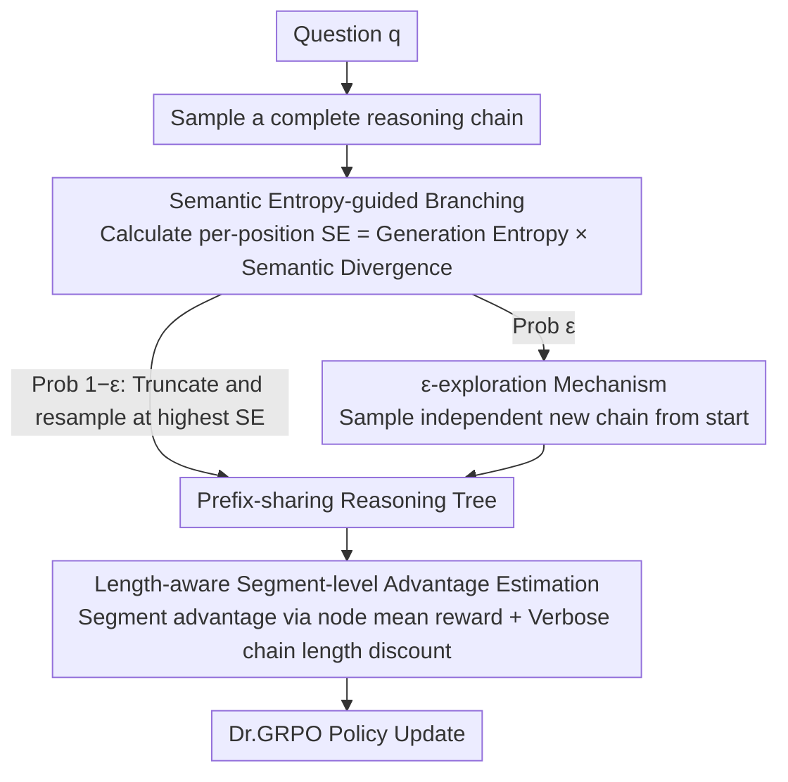

# Reinforced Efficient Reasoning via Semantically Diverse Exploration

**Conference**: ACL 2026  
**arXiv**: [2601.05053](https://arxiv.org/abs/2601.05053)  
**Code**: [https://github.com/ZiqiZhao1/ROSE-rl](https://github.com/ZiqiZhao1/ROSE-rl)  
**Area**: Model Compression / Efficient Inference  
**Keywords**: MCTS, Semantic Entropy, GRPO, Efficient Inference, Branching Strategy

## TL;DR

ROSE proposes an MCTS branching strategy guided by semantic entropy and length-aware segment-level advantage estimation. It addresses the issues of insufficient exploration diversity and low inference efficiency in existing MCTS-based RLVR methods, achieving optimal pass@8 performance across multiple mathematical reasoning benchmarks.

## Background & Motivation

**Background**: Reinforcement Learning with Verifiable Rewards (RLVR) has become a mainstream approach for enhancing LLM reasoning capabilities. GRPO and its variants optimize policies by sampling multiple independent reasoning chains and using binary rewards. MCTS-based methods further introduce tree-structured reasoning, allowing different chains to share prefixes for more granular segment-level credit assignment.

**Limitations of Prior Work**: (1) Insufficient exploration diversity—existing methods use generation entropy to determine branch points, but positions with high generation entropy do not necessarily correspond to semantic divergence. The case in Figure 1 shows that "can" and "need" differ significantly in terms of generation entropy but are semantically equivalent, resulting in identical subsequent reasoning paths; (2) Low inference efficiency—existing MCTS methods do not address "overthinking," where correct but verbose reasoning chains receive the same rewards as concise ones.

**Key Challenge**: Generation entropy measures token-level lexical uncertainty, but many high-entropy choices in language generation are semantically equivalent (synonyms, functional word variants). This leads branching strategies to produce reasoning paths that are superficially different but essentially identical.

**Goal**: (1) Design a branching strategy that generates truly semantically diverse reasoning paths; (2) Encourage more efficient reasoning while maintaining or improving performance.

**Key Insight**: Measure semantic differences between candidate tokens using the cosine similarity of token embeddings. Multiply this by generation entropy to obtain "semantic entropy," ensuring branch points possess both high uncertainty and high semantic divergence.

**Core Idea**: Replace generation entropy with semantic entropy (= generation entropy × semantic divergence) for selecting branch points. Combine this with $\varepsilon$-exploration to prevent localized searching, and use length-aware calibration to penalize verbose correct reasoning chains, achieving "more diverse + more efficient" reasoning exploration.

## Method

### Overall Architecture

ROSE addresses two persistent issues in MCTS-based RLVR: "numerous but not truly diverse" branching and the lack of penalties for verbose correct reasoning. An exploration round proceeds as follows: given a problem $q$, an initial complete reasoning chain is sampled. Semantic entropy is calculated for each position. The position with the highest semantic entropy is selected as the truncation point for resampling, thereby growing a reasoning tree with shared prefixes. To prevent tree clustering, new chains are independently sampled from the start with a certain probability. After tree construction, nodes are assigned values for segment-level advantage estimation. Correct but verbose chains are discounted based on length, and the data is fed into Dr.GRPO to update the policy.

### Key Designs

**1. Semantic entropy-guided branching: Directing branches toward truly different semantics rather than synonym substitutions**

Existing methods (e.g., FR3E) use generation entropy to select branch points. However, high generation entropy only indicates uncertainty in token selection and does not guarantee that different choices lead to different meanings. In Figure 1, "can" and "need" both have high generation entropy, but substituting them leads to nearly identical reasoning paths, rendering the branch ineffective. ROSE adds a semantic dimension: for position $k$, the top-20 highest probability tokens $\mathcal{V}_k$ are selected, and the semantic divergence among candidates is calculated using LLM embeddings:

$$SD_k = -\sum_{v_i, v_j} p(v_i)\, p(v_j) \cdot \cos\langle \mathbf{e}_{v_i}, \mathbf{e}_{v_j} \rangle,$$

This is multiplied by generation entropy $\mathcal{H}_k$ to obtain semantic entropy $SE_k = SD_k \cdot \mathcal{H}_k$. This product ensures that $SE_k$ is high only when a step is both uncertain and semantically divergent, effectively placing branch points at critical junctions that change the reasoning trajectory. The computational overhead is minimal as it only requires cosine similarity calculations on embedding tables.

**2. $\varepsilon$-exploration mechanism: Preventing the tree from being anchored to existing paths**

Relying solely on branching poses a risk: all new chains are truncated and resampled from existing ones, potentially anchoring the search within the neighborhood of the first chain. ROSE adopts the $\varepsilon$-greedy concept from classical RL. Each time a new chain is generated, a probability $\varepsilon$ (default 0.5) is used to sample a completely independent reasoning chain from the start. This provides independent starting points, balancing depth (refining good prefixes) and breadth (discovering new starting points).

**3. Length-aware segment-level advantage estimation: Penalizing "correct but verbose" chains within fine-grained credit assignment**

The tree structure enables segment-level credit assignment: the node value $\hat{V}(b_j)$ is the average reward of all chains passing through that node. The advantage of a segment is the difference between adjacent node values $\hat{A}_{i,t} = \hat{V}(b_j) - \hat{V}(b_{j-1})$. However, this does not distinguish length—a long correct chain and a short correct chain receive the same reward. ROSE utilizes the tree structure to compare the lengths of correct chains branching from the same divergence node. For correct reasoning chains longer than the shortest correct chain, the advantage is discounted after the divergence point:

$$\hat{A}_{i,t} \leftarrow \hat{A}_{i,t} - |\hat{A}_{i,t}| \cdot \Big(1 - \tfrac{|o_s| - b_c}{|o_c| - b_c}\Big)^{\alpha},$$

where $|o_s|$ and $|o_c|$ are the lengths of the current and shortest correct chains, and $b_c$ is the divergence position. This preserves fine-grained credit assignment while actively weakening the advantage of "verbose correct" paths, guiding the model toward concise reasoning.

### Loss & Training

The Dr.GRPO objective function is used (without variance and length normalization). Batch size is 512, with 8 reasoning chains per question (G=8). The learning rate is $1 \times 10^{-6}$, clip ratio is 0.2, KL coefficient is 0.001, and a maximum of 8 epochs is used. Training data consists of 7500 problems from MATH. $\varepsilon=0.5$, and $\alpha$ is searched within {0.5, 1, 2, 3}. Training is performed on 8×A800 GPUs.

## Key Experimental Results

### Main Results (pass@8)

| Model | Method | AIME24 | AIME25 | MATH500 | AMC23 | Average |
|------|------|--------|--------|---------|-------|------|
| Qwen3-4B | GRPO | 16.67 | 20.00 | 79.80 | 77.50 | 48.49 |
| Qwen3-4B | FR3E | 16.67 | 13.33 | 80.00 | 75.00 | 47.92 |
| Qwen3-4B | **Ours** | **23.33** | **23.33** | 80.80 | **77.50** | **51.24** |
| Qwen3-8B | GRPO | 23.33 | 23.33 | 79.40 | 72.50 | 49.64 |
| Qwen3-8B | **Ours** | **33.33** | **30.00** | 83.00 | **80.00** | **55.75** |
| Llama-3.2-3B | GRPO | 16.67 | 3.33 | 53.40 | 40.00 | 28.35 |
| Llama-3.2-3B | **Ours** | **20.00** | **6.67** | **55.00** | **45.00** | **31.67** |

### Ablation Study

| Branching Strategy | AIME24 | AIME25 | Average |
|---------|--------|--------|------|
| Generation Entropy Branching (FR3E) | 16.67 | 6.67 | 30.26 |
| Semantic Divergence Branching | 20.00 | 6.67 | - |
| **Semantic Entropy Branching (Ours)** | **20.00** | **6.67** | **31.67** |

### Key Findings

- Ours achieves the largest gains on difficult tasks (AIME24/25) (+6.67), suggesting that semantically diverse exploration is more valuable for high-difficulty problems.
- On Qwen3-8B, Ours achieves an average improvement of +4.65 (vs GRPO), the highest among all methods.
- TreePO shows significant improvement on in-domain datasets (MATH500) but poor out-of-domain generalization, indicating that fixed-length branching strategies lack adaptability.
- Length-aware calibration reduces reasoning chain length without degrading performance.
- Results are consistent on Llama models (+2.86), ruling out bias from potential Qwen data leakage.

## Highlights & Insights

- The design of Semantic Entropy = Generation Entropy × Semantic Divergence is concise and elegant. Measuring semantic difference via cosine similarity of token embeddings has minimal overhead (lookups in embedding tables) yet effectively distinguishes "lexical uncertainty" from "semantic uncertainty."
- $\varepsilon$-exploration introduces classical RL exploration into MCTS branching. It is simple yet critical in preventing the search from being anchored to existing paths.
- Length-aware calibration cleverly exploits the tree structure, enabling a fair comparison of lengths for reasoning chains branching from the same point.

## Limitations & Future Work

- Evaluated only on mathematical reasoning; cross-validation for code generation and logical reasoning is needed.
- The pass@8 metric focuses on solvability rather than average accuracy; advantages from a mean@8 perspective might be smaller.
- Semantic divergence relies on static token embeddings, which do not account for context.
- $\varepsilon=0.5$ is a fixed value; adaptive adjustment might yield further improvements.

## Related Work & Insights

- **vs FR3E**: FR3E uses generation entropy for branching, wasting branches on semantically equivalent tokens. ROSE uses semantic entropy to ensure each branch produces truly different reasoning paths.
- **vs Dr.GRPO**: Dr.GRPO improves the loss function but not the exploration. ROSE improves the exploration process and is compatible with Dr.GRPO.

## Rating

- Novelty: ⭐⭐⭐⭐ The concept of semantic entropy is novel, and the distinction between generation entropy and semantic entropy is convincing.
- Experimental Thoroughness: ⭐⭐⭐⭐ Includes three models, four benchmarks, and full ablations, though non-mathematical tasks are missing.
- Writing Quality: ⭐⭐⭐⭐ Intuitive case studies and clear method descriptions.
- Value: ⭐⭐⭐⭐ Provides a superior, plug-and-play branching strategy for MCTS-based RLVR.

<!-- RELATED:START -->

## Related Papers

- [\[AAAI 2026\] Efficient Thought Space Exploration Through Strategic Intervention](../../AAAI2026/llm_reasoning/efficient_thought_space_exploration_through_strategic_intervention.md)
- [\[ICLR 2026\] Attention as a Compass: Efficient Exploration for Process-Supervised RL in Reasoning Models](../../ICLR2026/llm_reasoning/attention_as_a_compass_efficient_exploration_for_process-supervised_rl_in_reason.md)
- [\[ACL 2026\] ETR: Entropy Trend Reward for Efficient Chain-of-Thought Reasoning](etr_entropy_trend_reward_for_efficient_chain-of-thought_reasoning.md)
- [\[ACL 2026\] Step-GRPO: Internalizing Dynamic Early Exit for Efficient Reasoning](step-grpo_internalizing_dynamic_early_exit_for_efficient_reasoning.md)
- [\[ICLR 2026\] Continuous Chain of Thought Enables Parallel Exploration and Reasoning](../../ICLR2026/llm_reasoning/continuous_chain_of_thought_enables_parallel_exploration_and_reasoning.md)

<!-- RELATED:END -->
